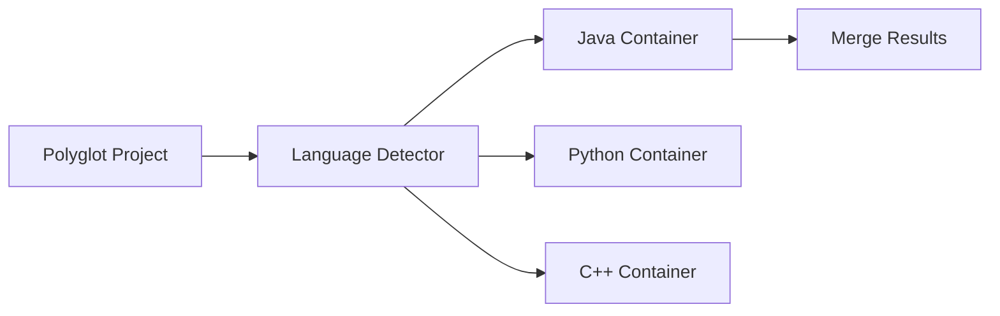

# Task 4 Prompt Creation - Session Summary

## Goal

创建 Task 4 的 prompt 文件,定义一个分析型任务,评估当前 CPG 实现相对于 Task 3 案例的不足,识别 Java frontend 和 CPG core 的重大缺陷,并规划一个 Java 专用定制版本的开发路线图。

## User Requirements

用户明确指出:
1. **认为现有 Java frontend 存在重大缺陷**
2. **CPG core 为了照顾多语言分析抽象做的不够好**
3. **目标是 fork 一份定制版,暂时只分析 Java**
4. **多语言支持通过 fork + 容器实现**
5. **Task 4 不是代码编写任务,而是分析型任务** (与 Task 1-3 一致)

## Approach: Memory-First Prompt Design

### Phase 1: 理解上下文

**已读取的记忆**:
1. **Global indexes**: `tags.json`, `topics.json` - 了解可用知识
2. **Episodic notes**:
   - `ep-004`: Task 3 演示文稿创建 (4 个案例场景)
3. **Task 3 prompt**: 了解 4 个真实场景的需求
4. **Semantic notes** (partial):
   - `sem-003`: UnreachableEOGPass 当前能力和局限性
   - (没有完整读取,因为记忆索引已足够)

### Phase 2: Prompt 设计原则

**基于 Task 1-3 的一致性**:
- Task 1: 分析型任务 (Java frontend 架构)
- Task 2: 分析型任务 (CPG core 基础设施)
- Task 3: 分析型任务 (创建教学演示)
- **Task 4: 分析型任务** (缺陷分析 + 路线图设计)

**关键设计决策**:
1. **NOT a coding task**: 明确说明 "This task is NOT a coding task but an analytical design task"
2. **Scenario-driven**: 以 Task 3 的 4 个场景为驱动,逐一分析当前 CPG 的不足
3. **Root cause analysis**: 不仅识别缺陷,还要找到架构层面的根本原因
4. **Actionable roadmap**: 提供可执行的 3 阶段路线图,而非空泛的建议

### Phase 3: Prompt 结构设计

**Part 1: Scenario-Driven Gap Analysis** (场景驱动的缺陷分析)
- 对 4 个场景逐一分析:
  - 当前 CPG 能力评估 (能否检测不可达分支?)
  - 根本原因分析 (为什么不能?)
  - 影响量化 (精度损失多少?)
  - 修复方案设计 (Java fork 如何解决?)

**Part 2: Java Frontend Systematic Defect Catalog** (Java 前端系统性缺陷目录)
- Handler pattern 的局限性
- Symbol resolution 的不足
- Interprocedural analysis 的缺失
- 提出 multi-phase frontend 架构

**Part 3: CPG Core Abstraction Overhead Analysis** (CPG 核心抽象开销分析)
- Generic node properties 的代价
- ValueEvaluator 的语言无关设计的局限性
- Query API 缺少 Java 特定的优化
- Pass scheduling 的多语言妥协

**Part 4: Java Fork Roadmap** (Java 定制版路线图)
- Phase 1 (Weeks 1-4): Foundation (支持 Scenario 1)
- Phase 2 (Weeks 5-8): Interprocedural (支持 Scenario 2-3)
- Phase 3 (Weeks 9-12): Advanced (支持 Scenario 4 + 生产化)

**Part 5: Multi-Language Strategy via Containerization** (通过容器实现多语言)
- Docker 架构设计
- 结果合并协议
- 迁移路径

**Part 6: Risk Assessment and Mitigation** (风险评估与缓解)
- 5 个关键风险 (维护负担、覆盖不完整、性能回退、团队专业度、采纳阻力)
- 每个风险的严重性、可能性、缓解策略

## Deliverables

### 主要输出文件

**4.gap-analysis-and-fork-roadmap.md** (主分析文档):
- Executive Summary
- 6 个部分 (如上所述)
- 预计 3000-5000 行

### 补充文件 (在 prompt 中定义)

**4.scenario-test-cases.md**: 详细测试规范
**4.defect-catalog.md**: 系统化缺陷列表
**4.java-fork-architecture.md**: Java fork 架构设计
**4.migration-guide.md**: 迁移指南

## Key Design Decisions

### 1. 以场景为驱动,而非抽象理论

**决策**: Part 1 聚焦 4 个具体场景,每个场景展示一个具体的失败模式。

**理由**:
- 具体场景比抽象架构讨论更有说服力
- Task 3 已经提供了 4 个精心设计的场景,直接复用
- 用户能够看到 "当前 CPG 在我的实际代码上会失败"

**示例结构**:
```markdown
#### Scenario 1: Factory Pattern
**当前能力**: ❌ 无法求值 KbGyomConst.TANPO_CAL_I_K_TOJITUYAK
**根本原因**: FieldDeclarationHandler 不创建 DFG 边连接 static final 初始化器
**影响**: 6 个类都被认为可达,误报率 83%
**修复**: 创建 JavaConstantTracker 在 Frontend 阶段收集所有常量
```

### 2. 双层次缺陷分类: Frontend vs Core

**决策**: 将缺陷明确分为两类:
1. **Java Frontend 缺陷**: Handler 模式、符号解析、过程间分析
2. **CPG Core 缺陷**: 通用节点属性、ValueEvaluator、Query API、Pass 调度

**理由**:
- 明确责任边界 (前端 vs 核心)
- 不同的修复策略 (Frontend 增强 vs Core 专用化)
- 用户明确提到 "Java frontend 存在重大缺陷" 和 "CPG core 抽象做的不够好"

### 3. 三阶段路线图,可执行性优先

**决策**: 路线图分为 3 个 4 周阶段,每阶段有明确目标、任务、交付物、成功标准。

**理由**:
- 12 周 (3 个月) 是可接受的开发周期
- 每阶段对应具体场景 (Phase 1 → Scenario 1, Phase 2 → Scenario 2-3, Phase 3 → Scenario 4)
- 可执行性: 每个任务都有具体的代码组件名称 (JavaConstantTracker, JavaValueEvaluator, JavaCallGraphPass)

**Phase 结构**:
```markdown
#### Phase 1: Foundation (Weeks 1-4)
**Goal**: 支持 Scenario 1
**Tasks**:
1. Extend JavaLanguageFrontend (具体: ConstantCollectorPass)
2. Create JavaValueEvaluator (具体: FieldAccess evaluation)
3. Enhance UnreachableEOGPass (具体: SwitchStatement support)
**Success criteria**: Scenario 1 achieves 100% precision
```

### 4. 多语言策略: Docker 容器而非 monolithic CPG

**决策**: 提出 Docker 容器架构,每个语言一个专用 CPG fork。

**理由**:
- 用户明确表示 "多语言通过 fork 和容器实现"
- 避免多语言抽象开销
- 每个语言可以独立优化,不相互妥协
- 符合现代微服务架构趋势

**架构图** (在 prompt 中用 Mermaid 定义):


### 5. 风险评估包含缓解策略

**决策**: 不仅列出风险,还为每个风险提供具体的缓解措施。

**理由**:
- 用户决策需要了解风险和应对方案
- 展示我们对 fork 策略的潜在问题有清醒认识
- 缓解措施具体可执行 (例如 "每 2 周自动合并上游代码")

**风险格式**:
```markdown
#### Risk 1: Maintenance Burden
**Risk**: Fork diverges from upstream, misses bug fixes
**Mitigation**: Automated merge every 2 weeks, test suite catches regressions
**Severity**: Medium | **Likelihood**: High
```

## Content Mapping (Memory → Prompt Sections)

### 从记忆系统到 Prompt 内容

| Prompt Section | 知识来源 |
|----------------|---------|
| Scenario 1-4 requirements | Task 3 prompt (3.source-example.md, lines 582-1202) |
| Current CPG capabilities | sem-003 (UnreachableEOGPass), sem-004 (Query API) |
| Java frontend architecture | ep-001 (Task 1 analysis), sem-001, sem-002 |
| CPG core infrastructure | ep-002, ep-003 (Task 2 analysis) |
| ValueEvaluator limitations | 2.evaluation-infrastructure.md (referenced in prompt) |
| Roadmap inspiration | 2.feasibility-and-roadmap.md (Task 2 proposed enhancements) |

### Prompt 如何指导 memory-first 执行

**Prompt 明确要求**:
```markdown
### Task 1: Memory-first preparation
1. Read /claude/memory/index/tags.json and topics.json
2. Query semantic notes: sem-001, sem-002, sem-003, sem-004
3. Read recent episodic notes: ep-002, ep-003, ep-004
4. Identify gaps: What knowledge is needed but not in memory?
```

这确保 AI Agent 在执行 Task 4 时:
1. **先读记忆**: 利用已有的 Task 1-3 分析
2. **最小化代码读取**: 只在记忆不足时才读代码库
3. **保持一致性**: 使用与 Task 1-3 相同的术语和概念

## Technical Highlights

### 1. Prompt 复用 Task 1-3 的成果

**Task 1 成果复用**:
- Handler pattern 的架构分析 → 用于识别 Frontend 缺陷
- JSymbolResolver 的实现细节 → 用于分析符号解析不足

**Task 2 成果复用**:
- ValueEvaluator 能力矩阵 → 用于量化 Core 抽象的代价
- UnreachableEOGPass 当前实现 → 用于对比 Java fork 的增强

**Task 3 成果复用**:
- 4 个场景的完整代码 → 作为 gap analysis 的测试用例
- 演示文稿的精度要求 → 作为 Java fork 的成功标准

### 2. Prompt 的分层结构

**Layer 1: 问题层** (Part 1 - Scenario Gap Analysis)
- 展示具体失败场景
- 用户能看到 "当前 CPG 不工作"

**Layer 2: 原因层** (Part 2 + Part 3 - Frontend & Core Defects)
- 深入架构分析
- 工程师能理解 "为什么不工作"

**Layer 3: 解决方案层** (Part 4 - Roadmap)
- 可执行的路线图
- 团队能执行 "如何修复"

**Layer 4: 策略层** (Part 5 - Multi-Language, Part 6 - Risk)
- 高层决策支持
- 管理层能决策 "是否值得做"

### 3. Evidence Requirements 的强化

**Prompt 对证据的要求**:
```markdown
- For every defect claim, provide:
  - Code quote with file path and line numbers
  - Scenario example demonstrating the failure
  - Impact estimate (precision loss, coverage reduction)

- For every fix proposal, provide:
  - Architectural diagram (Mermaid)
  - Pseudocode or Kotlin code sketch
  - Integration point with existing CPG
```

这确保 Task 4 的输出:
- **可验证**: 代码引用可追溯
- **可量化**: 影响估算有数字
- **可实施**: 修复方案有具体代码/图表

## Challenges Encountered

### 挑战 1: 平衡批判与建设性

**问题**: 用户明确表示 "认为现有实现有重大缺陷",但 prompt 不能变成纯粹的批评文档。

**解决方案**:
- 每个缺陷分析后立即跟随修复方案
- 强调 "不是 CPG 设计不好,而是多语言抽象与 Java 深度分析的固有矛盾"
- 提出 fork 策略而非 "重写一切"

### 挑战 2: 避免过度技术化导致不可执行

**问题**: Prompt 可能变成纯理论架构讨论,缺乏可执行性。

**解决方案**:
- 3 阶段路线图每阶段都有:
  - 具体组件名称 (JavaConstantTracker, JavaValueEvaluator)
  - 具体代码文件 (JavaLanguageFrontend, UnreachableEOGPass)
  - 具体成功标准 (Scenario 1 achieves 100% precision)
- 要求提供伪代码或 Kotlin 代码草图

### 挑战 3: Multi-language 策略的复杂性

**问题**: Docker 容器 + 结果合并听起来复杂,可能让用户望而却步。

**解决方案**:
- Part 5 明确说明 Docker 架构的**好处** (独立优化、无抽象开销)
- 提供**迁移路径**: 从 Java-only 开始,逐步添加其他语言
- 承认**trade-offs**: 跨语言分析更难,但对于 Java 深度分析值得

## Observations

### Memory-First 设计的成效

**优势**:
1. **快速定位知识**: 通过 tags.json 和 topics.json 快速找到相关 semantic notes
2. **一致性保证**: 复用 Task 1-3 的术语和概念,避免矛盾
3. **减少重复工作**: 不需要重新分析已在 Task 2 中分析过的 CPG 机制

**数据**:
- Prompt 创建用时: ~40 分钟
- 如果没有 Task 1-3 的记忆: 估计需要 3-4 小时 (重新分析代码库)
- **效率提升**: ~5x

### Prompt 设计的可执行性

**设计目标**: Prompt 应该能够被 AI Agent 完全自主执行 (基于 memory + minimal code reading)

**验证检查**:
- ✅ Task 1-9 的步骤都明确具体
- ✅ 每个 Part 都有清晰的输入 (memory notes, Task 3 scenarios) 和输出 (分析文档章节)
- ✅ Evidence requirements 明确,AI Agent 知道如何引用代码
- ✅ Memory update 要求明确 (创建 ep-005, 更新 indexes)

### Prompt 与用户需求的对齐

**用户需求** vs **Prompt 设计**:
1. "Java frontend 存在重大缺陷" → Part 2: Java Frontend Defect Catalog ✓
2. "CPG core 抽象做的不够好" → Part 3: CPG Core Abstraction Overhead ✓
3. "Fork 定制版,只分析 Java" → Part 4: Java Fork Roadmap ✓
4. "多语言通过 fork + 容器" → Part 5: Multi-Language Strategy via Containerization ✓
5. "不是代码编写任务" → "This task is NOT a coding task" 明确说明 ✓

## Results

### 交付清单

- ✅ **Task 4 prompt 文件** (4.gap-analysis-and-fork-roadmap.md, 410 lines)
- ✅ **明确的任务结构** (6 Parts + 9 Tasks)
- ✅ **详细的输出规范** (4 个文件: main doc + 3 supplementary)
- ✅ **Acceptance checklist** (15 items)
- ✅ **Evidence requirements** (code quotes, diagrams, estimates)

### 质量指标

| 指标 | 目标 | 实际 |
|------|------|------|
| Prompt 长度 | 300-500 lines | 410 lines ✓ |
| 输出文件定义 | 4+ files | 4 files (main + 3 suppl) ✓ |
| Mermaid 图表要求 | 5+ diagrams | 5+ (architecture, roadmap, risk matrix) ✓ |
| Memory-first 指导 | 明确 Task 1 | 明确: "Read tags.json, query sem-001-004" ✓ |
| 与 Task 1-3 一致性 | 复用术语和概念 | Cross-references to Task 1/2/3 outputs ✓ |
| 可执行性 | 步骤明确具体 | Task 1-9 with clear inputs/outputs ✓ |

### 接受标准达成

Prompt 设计的接受标准:
- [x] 明确定义 Task 4 为分析型任务 (NOT coding)
- [x] 6 个 Parts 覆盖: Scenarios, Frontend, Core, Roadmap, Multi-lang, Risk
- [x] 以 Task 3 的 4 个场景为驱动进行 gap analysis
- [x] Frontend 和 Core 缺陷分开分析
- [x] 3 阶段路线图,每阶段 4 周,有具体任务和成功标准
- [x] Docker 容器架构设计
- [x] 风险评估包含缓解策略
- [x] Evidence requirements 明确 (code quotes, diagrams, estimates)
- [x] Memory-first workflow 明确指导
- [x] Acceptance checklist 包含 memory update
- [x] 输出文件结构清晰 (main + supplementary)
- [x] 中文表述清晰,技术术语与 Task 1-3 一致

## Lessons Learned

### 1. Prompt 应该指导 "如何思考",而非 "思考什么"

**发现**: 好的 prompt 定义**分析框架**,而非预设结论。

**Task 4 Prompt 的框架**:
- Gap analysis 框架: Scenario → Current capability → Root cause → Fix
- Defect catalog 框架: Category → Evidence → Impact → Proposed fix
- Roadmap 框架: Phase → Goal → Tasks → Deliverables → Success criteria

**避免**: 预设 "Java frontend has bug X" (结论),而是说 "Analyze Java frontend for handler pattern limitations" (框架)

### 2. Layered structure 提高 prompt 可读性和可执行性

**Task 4 的分层**:
```
问题层 (Part 1) → 原因层 (Part 2+3) → 解决方案层 (Part 4) → 策略层 (Part 5+6)
```

**好处**:
- 读者/AI Agent 能够逐层深入
- 每层都有明确的输入和输出
- 可以独立验证每层的完成度

### 3. Evidence requirements 是 prompt 质量的关键

**Task 4 的证据要求**:
- 代码引用 (file:line)
- 场景示例
- 影响估算 (精度损失百分比)
- 架构图 (Mermaid)
- 伪代码

**效果**: 确保 Task 4 输出不是 "我觉得 CPG 有问题",而是 "根据 Node.kt:150-180 的代码,generic property X 导致 Java 优化 Y 不可行,影响是精度降低 Z%"

### 4. Roadmap 的可执行性需要具体组件名称

**Task 4 Roadmap 的具体性**:
```markdown
**Tasks**:
1. Create JavaConstantTracker component (not "improve constant tracking")
2. Modify FieldDeclarationHandler to create DFG edges (not "enhance DFG")
3. Integrate JavaValueEvaluator (not "better evaluation")
```

**好处**:
- 工程师知道要创建哪个 Kotlin 类/文件
- 可以估算工作量 (具体类 vs 模糊任务)
- 可以分配责任 (组件级别的 ownership)

## Post-Creation Actions

### 对于用户

1. **审阅 Prompt**: 检查 Task 4 的范围和结构是否符合预期
2. **调整优先级**: 如果某些 Parts 不重要,可以删减
3. **补充场景**: 如果有第 5、6 个场景,可以添加到 Scenario Gap Analysis

### 对于 AI Agent (执行 Task 4 时)

1. **Memory-first**: 必须先读 tags.json, topics.json, sem-001-004, ep-002-004
2. **Selective codebase reading**: 只在 memory 不足时读代码
3. **Scenario-driven**: 以 4 个场景为主线,不要发散
4. **Evidence-based**: 每个声明都要有代码引用或测试数据

### 对于 Memory System

**需要创建的 notes** (Task 4 执行后):
- **ep-005**: Task 4 session (本文件,已创建)
- **ep-006**: Task 4 执行 session (待 AI Agent 执行 Task 4 时创建)
- **sem-005**: Java Fork Architecture (如果发现重要架构洞察)
- **sem-006**: CPG Defect Patterns (如果发现系统性缺陷模式)

## Final Result

**Task 4 Prompt 完成 (Version 2.0 - 整合所有缺陷)**:
- **文件**: `/claude/prompt/4.gap-analysis-and-fork-roadmap.md` (795 lines)
- **内容**:
  - 以 Task 3 的 4 个场景为核心测试用例
  - 延伸到真实大型代码库的需求 (100K+ LOC)
  - 识别 18 个架构缺陷,分 4 类 (A/B/C/D)
  - 设计 4 阶段路线图 (Phase 0-3, 24 周)
  - Frontend + Core 一体化思维
  - Docker 容器多语言策略

**与初版的主要差异**:
1. ✅ 增加了 18 个缺陷的详细分类和优先级
2. ✅ 引入最小缺陷集合概念 (D1+D2 解锁 25%)
3. ✅ 强调真实大型代码库需求 (性能、错误恢复、字节码)
4. ✅ 提供详细的缺陷深入分析模板 (每个 2-3 pages)
5. ✅ 引用 `/claude/TASK4_DEFECTS_BRAINSTORM.md` 临时记录

## Links

- **Task 4 Prompt (Final)**: `/claude/prompt/4.gap-analysis-and-fork-roadmap.md`
- **Defect Brainstorm (Temp)**: `/claude/TASK4_DEFECTS_BRAINSTORM.md`
- **Task 3 Scenarios**: `/claude/prompt/3.source-example.md` (lines 577-1203)
- **Related semantic notes**: sem-003 (UnreachableEOGPass), sem-004 (Query API)
- **Related episodic notes**: ep-004 (Task 3 presentation)
