# Mermaid Diagram Complete Reference

**ID**: sem-005
**Created**: 2025-10-29
**Category**: Semantic Knowledge - Technical Reference
**Tags**: `mermaid`, `visualization`, `diagrams`, `documentation`
**Source**: MCP Ref Tool (mermaid-js/mermaid documentation)
**Priority**: ⭐ Highest - Official Documentation Reference

---

## Overview

Mermaid is a JavaScript-based diagramming and charting tool that uses Markdown-inspired text definitions to create diagrams dynamically. It's widely supported on GitHub, GitLab, and other platforms.

**Official Documentation**: https://github.com/mermaid-js/mermaid

---

## Diagram Types Summary

| Type | Use Case | Syntax Keyword | Complexity |
|------|----------|----------------|------------|
| **Flowchart** | Process flows, logic | `graph` / `flowchart` | Easy |
| **Sequence Diagram** | Interactions, APIs | `sequenceDiagram` | Medium |
| **Gantt Chart** | Project timelines | `gantt` | Easy |
| **Class Diagram** | OOP structure | `classDiagram` | Medium |
| **State Diagram** | FSM, workflows | `stateDiagram` | Medium |
| **ER Diagram** | Database schemas | `erDiagram` | Easy |
| **User Journey** | UX flows | `journey` | Easy |
| **Quadrant Chart** | 2D matrices | `quadrantChart` | Easy |
| **Timeline** | Historical events | `timeline` | Easy |
| **Sankey** | Flow data | `sankey` | Medium |
| **XY Chart** | Data plots | `xychart-beta` | Easy |
| **Git Graph** | Git history | `gitGraph` | Easy |
| **Pie Chart** | Proportions | `pie` | Easy |
| **Mindmap** | Ideas, concepts | `mindmap` | Easy |

---

## 1. Gantt Chart (Project Timeline)

### Use Case
- Project planning and critical path visualization
- Task dependencies and milestones
- Resource scheduling

### Syntax

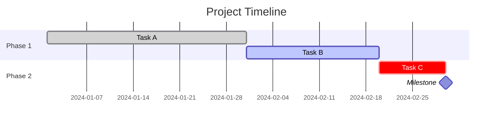

### Key Features

**Date Formats**:
- `dateFormat YYYY-MM-DD` - ISO format
- `dateFormat HH:mm` - Time format

**Task States**:
- `done` - Completed (gray)
- `active` - In progress (blue)
- `crit` - Critical path (red)
- `milestone` - Zero-duration marker

**Task Dependencies**:
```
Task B :after task_a, 20d          # After task_a completes
Task C :2024-01-15, 10d            # Absolute date
Task D :after task_a task_b, 5d    # After multiple tasks
Task E :until task_f, 10d          # Until another task starts
```

**Sections**: Group related tasks
```
section Design
    Task 1 :...
section Development
    Task 2 :...
```

**Excludes**: Skip weekends/holidays
```
excludes weekends
excludes 2024-12-25
```

**Weekend Configuration** (v11.0.0+):
```
weekend friday  # Friday-Saturday weekends (vs default Saturday-Sunday)
```

### Real-World Example (from CPG Task 4)

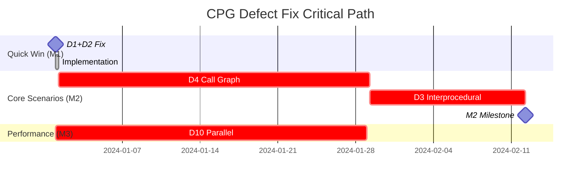

---

## 2. Quadrant Chart (2D Matrix)

### Use Case
- Impact vs Effort analysis
- Risk matrices
- Portfolio management
- Prioritization visualization

### Syntax

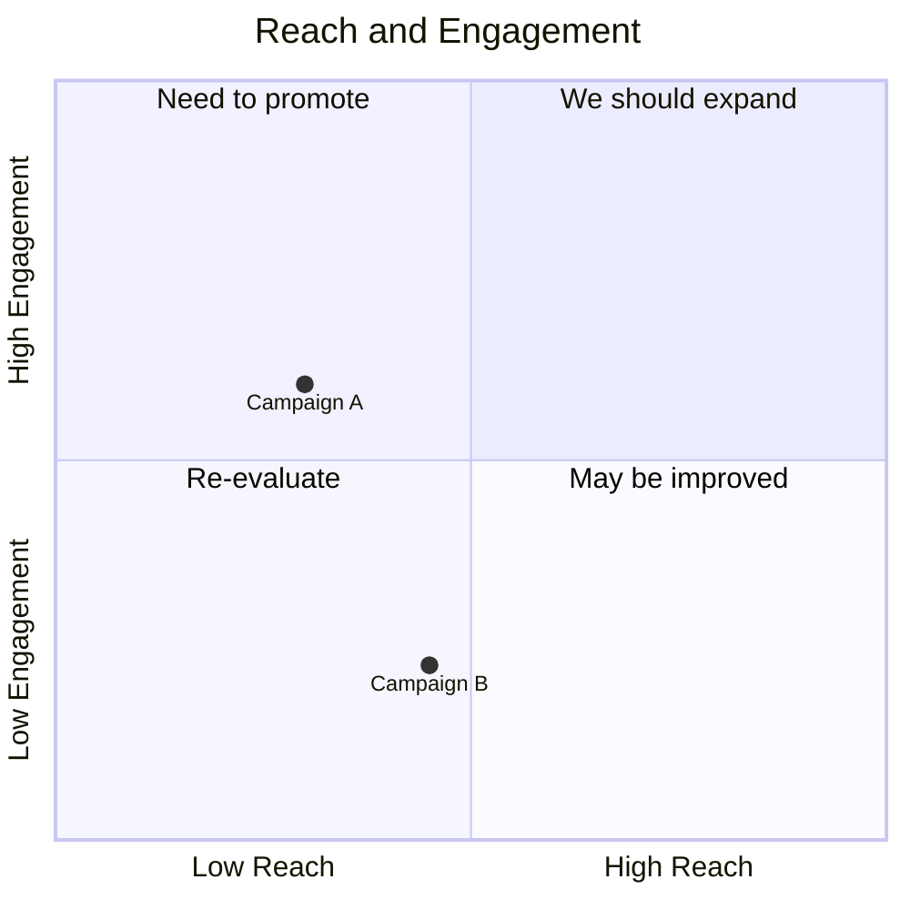

### Key Features

**Axes**:
- `x-axis <left-label> --> <right-label>`
- `y-axis <bottom-label> --> <top-label>`
- Can omit right/top label: `x-axis <label>`

**Quadrants** (clockwise from top-right):
- `quadrant-1` - Top right (high x, high y)
- `quadrant-2` - Top left (low x, high y)
- `quadrant-3` - Bottom left (low x, low y)
- `quadrant-4` - Bottom right (high x, low y)

**Data Points**:
- Format: `<label>: [x, y]`
- Values: 0.0 to 1.0 (normalized)
- Example: `Point A: [0.75, 0.85]`

**Point Styling**:

1. Direct styling:
```
Point A: [0.9, 0.8] radius: 12
Point B: [0.7, 0.6] color: #ff3300, radius: 10
Point C: [0.5, 0.4] stroke-color: #00ff00, stroke-width: 3px
```

2. Class styling:
```
Point A:::class1: [0.9, 0.8]
classDef class1 color: #ff0000, radius: 15
```

### Real-World Example (from CPG Task 4)

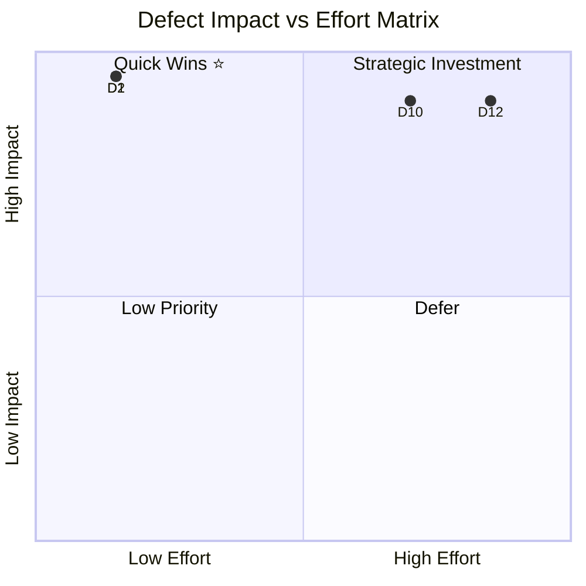

---

## 3. Timeline Diagram

### Use Case
- Historical events
- Product roadmaps
- Project phases

### Syntax

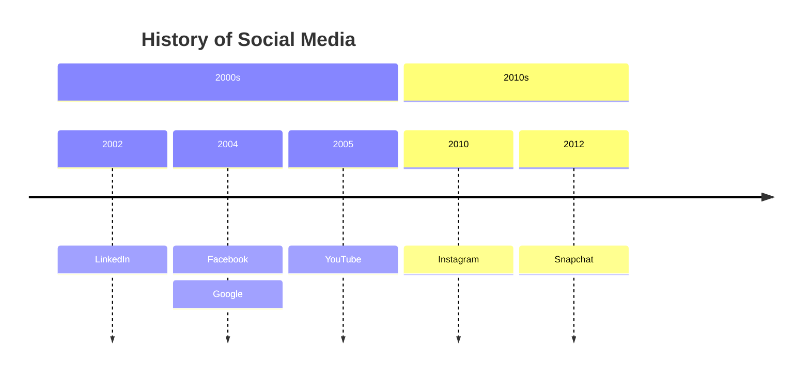

### Key Features

**Structure**:
- `timeline` - Start keyword
- `title <text>` - Optional title
- `section <name>` - Group periods
- `<period> : <event1> : <event2>` - Events

**Multiple Events per Period**:
```
2004 : Facebook
     : Google
     : Orkut
```

**Line Breaks**:
```
2004 : Long event description <br> with line break
```

**Styling**:

Default: Multi-color (each period different color)

Disable multi-color:
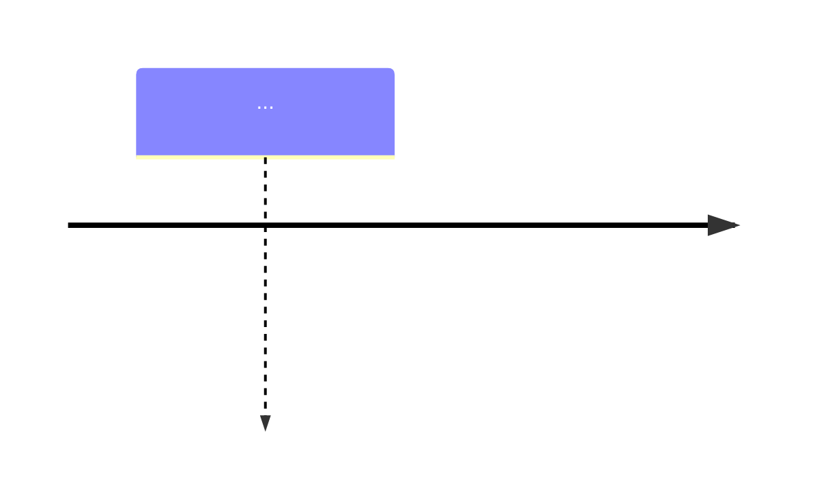

Custom colors (up to 12 sections):
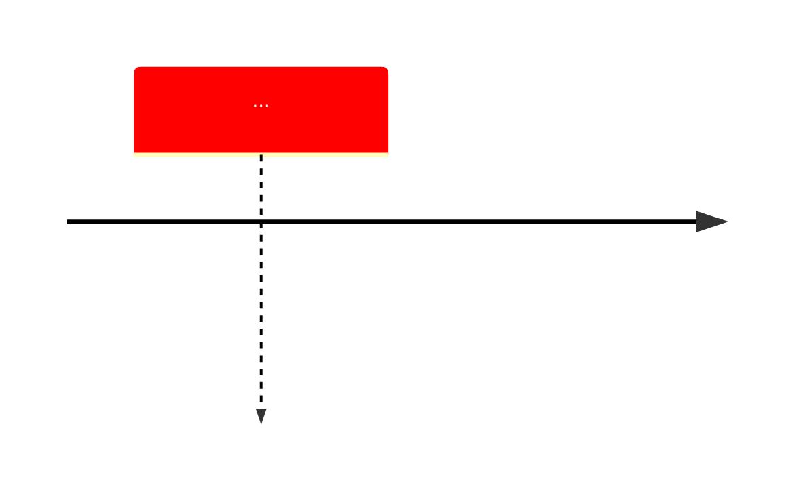

---

## 4. Sankey Diagram (Flow Visualization)

### Use Case
- Energy/resource flows
- Budget allocation
- Conversion funnels
- Data pipelines

### Syntax

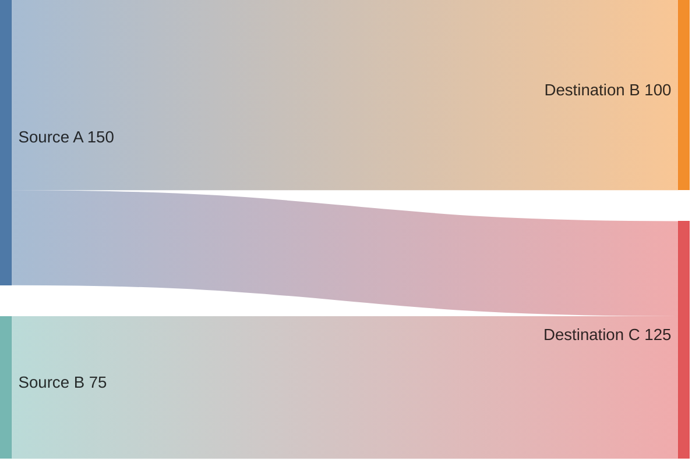

### Key Features

**CSV Format** (3 columns required):
- Column 1: Source node
- Column 2: Target node
- Column 3: Flow value (number)

**Empty Lines**: Allowed for readability
```
Source A,Target A,100

Source B,Target B,50
```

**Commas in Labels**: Use quotes
```
"Source A, detail",Target,100
```

**Double Quotes in Labels**: Escape with double quotes
```
"Source ""A""",Target,100
```

**Configuration**:
```mermaid
---
config:
  sankey:
    showValues: false
    width: 800
    height: 600
    linkColor: 'source'      # or 'target', 'gradient', '#hexcolor'
    nodeAlignment: 'justify' # or 'left', 'right', 'center'
---
sankey
...
```

---

## 5. Flowchart / Graph (General Purpose)

### Use Case
- Process flows
- Decision trees
- System architecture
- Dependency graphs

### Syntax

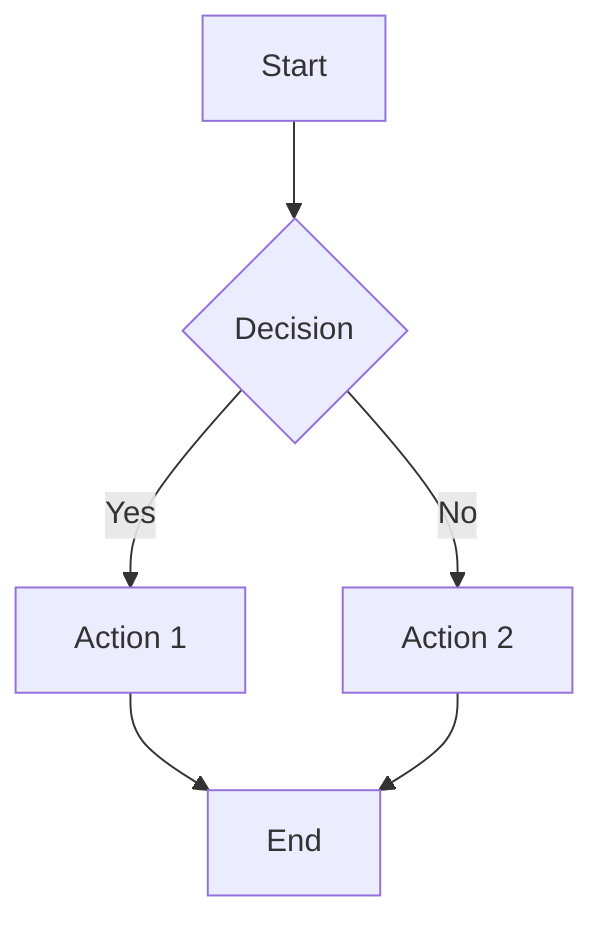

### Direction Options
- `graph TD` / `graph TB` - Top to bottom
- `graph BT` - Bottom to top
- `graph LR` - Left to right
- `graph RL` - Right to left

### Node Shapes
```
A[Rectangle]
B(Rounded)
C([Stadium])
D[[Subroutine]]
E[(Database)]
F((Circle))
G>Flag]
H{Diamond}
I{{Hexagon}}
J[/Parallelogram/]
K[\Parallelogram\]
L[/Trapezoid\]
M[\Trapezoid/]
```

### Edge Types
```
A --> B    # Arrow
A --- B    # Line
A -.-> B   # Dotted arrow
A ==> B    # Thick arrow
A --text--> B   # Labeled arrow
```

### Styling
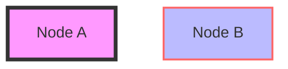

### Subgraphs
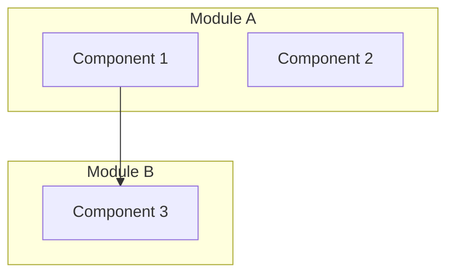

---

## 6. Pie Chart

### Syntax

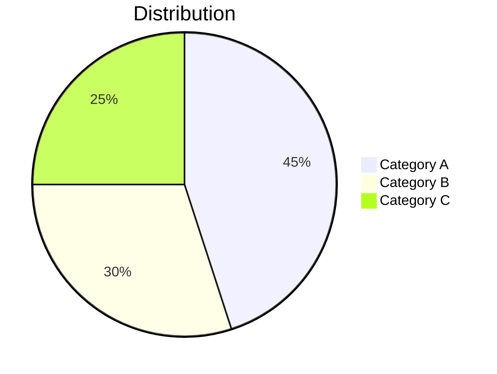

### Show Percentages
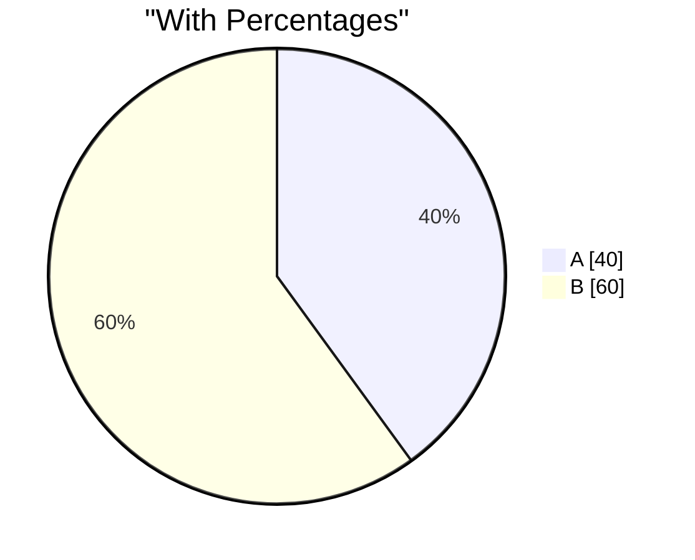

---

## 7. State Diagram

### Use Case
- State machines
- Workflow status
- System states

### Syntax

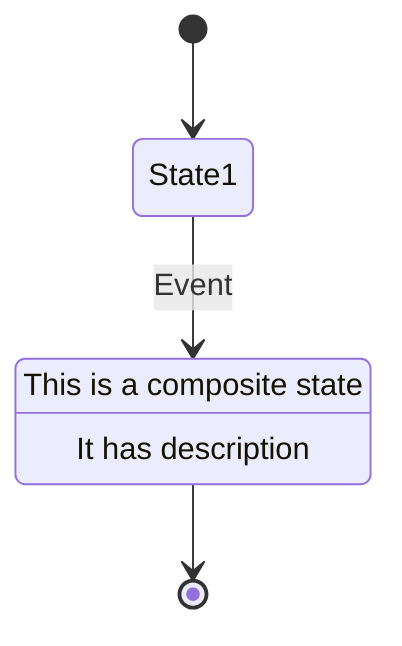

---

## 8. Sequence Diagram

### Use Case
- API interactions
- Message passing
- Protocol flows

### Syntax

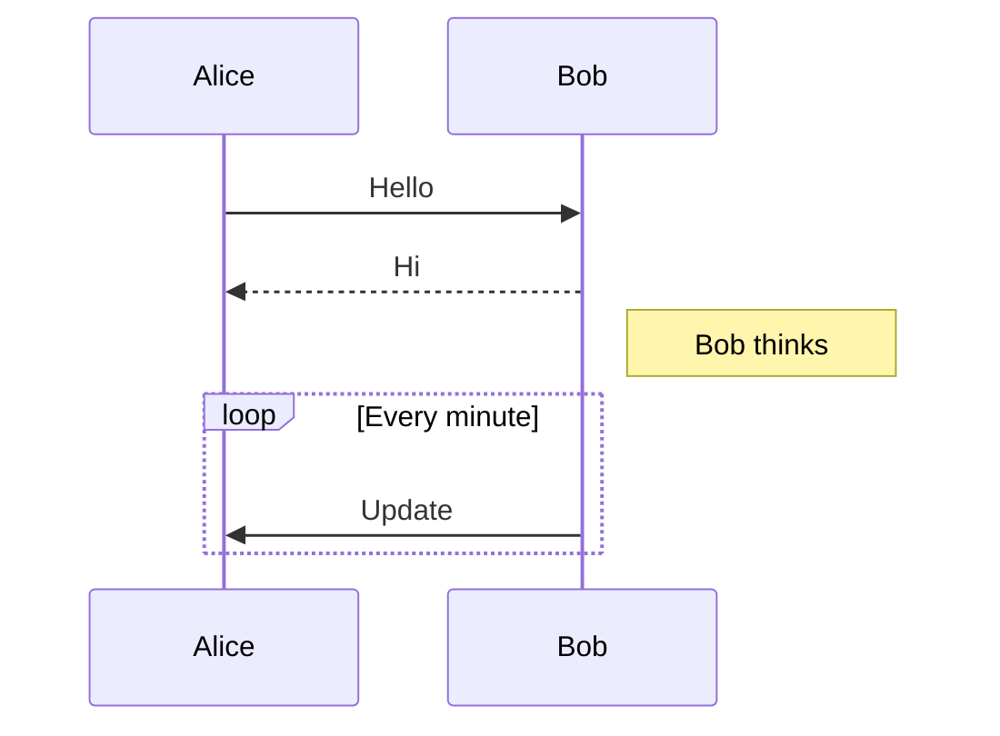

---

## Configuration and Theming

### Inline Configuration (YAML Frontmatter)

```mermaid
---
config:
  theme: dark
  themeVariables:
    primaryColor: '#ff0000'
  gantt:
    titleTopMargin: 25
---
gantt
    ...
```

### Available Themes
- `default` - Standard theme
- `dark` - Dark mode
- `forest` - Green theme
- `neutral` - Minimal colors
- `base` - Customizable base

---

## Best Practices

1. **Use sections** to group related items (Gantt, Timeline)
2. **Add descriptions** to nodes for clarity
3. **Use colors** strategically (not excessively)
4. **Keep diagrams focused** - split complex diagrams into multiple
5. **Test rendering** on target platform (GitHub, GitLab, etc.)
6. **Use meaningful IDs** for tasks/nodes (for CSS styling)
7. **Add titles** for context
8. **Consider accessibility** - use sufficient color contrast

---

## Common Pitfalls

❌ **Don't**:
- Use special characters in IDs without quotes
- Create circular dependencies in Gantt charts
- Exceed 1.0 in quadrant chart coordinates
- Mix different diagram types in one code block

✅ **Do**:
- Quote labels with special characters: `"Label: with colon"`
- Use `<br>` for line breaks in labels
- Keep diagram complexity manageable
- Use subgraphs for organization

---

## Integration with Markdown

### Basic Usage
````markdown
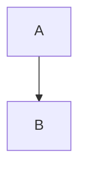
````

### With Configuration
````markdown
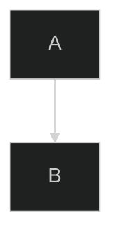
````

---

## Real-World Success Story

**CPG Task 4 Documentation** (2025-10-29):

**Problems Fixed**:
1. Text ASCII timeline → Gantt chart (critical path visualization)
2. Text quadrant → Quadrant chart (impact/effort matrix)
3. Simple risk graph → Enhanced flowchart with styling

**Results**:
- ✅ Professional visualization
- ✅ Clear data relationships
- ✅ Perfect rendering on GitHub
- ✅ Easy to understand and maintain

---

## References

- **Official Docs**: https://github.com/mermaid-js/mermaid
- **Live Editor**: https://mermaid.live/
- **Mermaid CLI**: https://github.com/mermaid-js/mermaid-cli
- **Integration Guide**: https://mermaid.js.org/ecosystem/integrations.html

---

## Related Memory Notes

- **proc-005**: table-validation-tool.md - Markdown table fixing
- **sem-004**: query-api-dsl.md - CPG Query API reference
- **proc-001**: cpg-frontend-analysis-workflow.md - Code analysis workflows

---

**Status**: ✅ Complete Reference
**Last Updated**: 2025-10-29
**Source Quality**: ⭐⭐⭐⭐⭐ Official Documentation (MCP Ref Tool)
