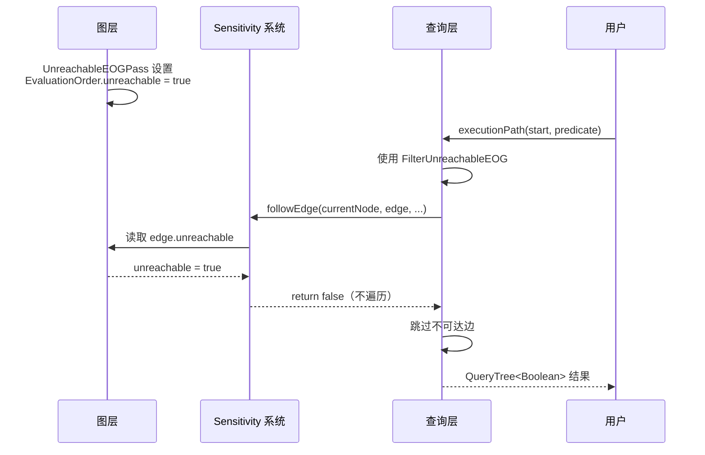

# Query API DSL - CPG 的查询与分析接口

## Why now

Task 2 文档整改过程中发现，Query API 不是图层的辅助工具，而是与图层同级别的核心组件。它本质上是一个完整的 **Kotlin DSL**，提供路径遍历、条件判断、结果聚合等动态分析能力。本文档记录 Query API 的核心设计和与图层的协同机制。

## 核心概念

Query API DSL 由三大组成部分构成：

1. **QueryTree**：结果记录与路径追踪系统
2. **高级查询函数**：executionPath, dataFlow, alwaysFlowsTo
3. **Sensitivity 系统**：连接图层和查询层的桥梁

## QueryTree：路径追踪系统

**文件位置**: `/home/dai/code/cpg/cpg-analysis/src/main/kotlin/de/fraunhofer/aisec/cpg/query/QueryTree.kt`

### 核心设计 (行 64-87)

```kotlin
open class QueryTree<T>(
    value: T,                                // 求值结果
    var children: List<QueryTree<*>>,       // 子查询树（记录求值步骤）
    var stringRepresentation: String,        // 可读表示
    node: Node?,                             // 关联的 CPG 节点
    override var assumptions: MutableSet<Assumption>,  // 假设集合
    var suppressed: Boolean,                 // 用户抑制标记
    val operator: QueryTreeOperators,        // 操作符类型
    val collectCallerInfo: Boolean,
) : Comparable<QueryTree<T>>, HasAssumptions
```

**设计理念**:
- **透明性**：记录完整求值路径，用户可以理解为什么得到特定结果
- **可调试性**：通过 `printNicely()` 以树状结构展示
- **可追溯性**：每个结果关联到具体的 CPG 节点和代码位置
- **假设管理**：追踪分析过程中的不确定性

### DSL 操作符

**布尔逻辑** (行 472-609):
- `and`: 逻辑与 (&&)
- `or`: 逻辑或 (||)
- `xor`: 逻辑异或
- `implies`: 逻辑蕴含 (→)
- `not`: 逻辑非 (!)

**数值比较** (行 622-781):
- `gt`: 大于 (>)
- `ge`: 大于等于 (>=)
- `lt`: 小于 (<)
- `le`: 小于等于 (<=)

**相等性与成员关系** (行 437-467):
- `eq`: 相等 (==)
- `ne`: 不相等 (!=)
- `IN`: 成员关系
- `IS`: 类型检查

**聚合函数** (行 841-885):
- `mergeWithAll`: 所有元素为真（All 语义）
- `mergeWithAny`: 至少一个元素为真（Any 语义）

**示例**:
```kotlin
val result1 = (x gt 10) and (y lt 20)
val result2 = pathResults.map { it.value }.mergeWithAll(node = startNode)
```

## 高级查询函数

**文件位置**: `/home/dai/code/cpg/cpg-analysis/src/main/kotlin/de/fraunhofer/aisec/cpg/query/FlowQueries.kt`

### executionPath: 控制流路径查询 (行 220-256)

```kotlin
fun executionPath(
    startNode: Node,
    direction: AnalysisDirection = Forward(GraphToFollow.EOG),
    type: AnalysisType = May,
    scope: AnalysisScope = Interprocedural(),
    earlyTermination: ((Node) -> Boolean)? = null,
    predicate: (Node) -> Boolean,
): QueryTree<Boolean>
```

**关键特性**:
1. **自动过滤不可达边** (行 244):
   ```kotlin
   sensitivities = FilterUnreachableEOG + ContextSensitive,
   ```
   - 默认集成死代码过滤
   - 用户无需手动配置

2. **Must/May 分析**:
   - `Must`: 所有路径必须满足谓词
   - `May`: 至少一条路径满足谓词

3. **过程间分析**:
   - 自动处理函数调用和返回
   - 支持调用深度限制

### dataFlow: 数据流路径查询 (行 171-206)

```kotlin
fun dataFlow(
    startNode: Node,
    direction: AnalysisDirection = Forward(GraphToFollow.DFG),
    type: AnalysisType = May,
    vararg sensitivities: AnalysisSensitivity = FieldSensitive + ContextSensitive,
    scope: AnalysisScope = Interprocedural(),
    ctx: Context = Context(steps = 0),
    earlyTermination: ((Node) -> Boolean)? = null,
    predicate: (Node) -> Boolean,
): QueryTree<Boolean>
```

**默认敏感性**:
- `FieldSensitive`: 区分对象的不同字段
- `ContextSensitive`: 区分不同调用上下文
- **注意**: 默认不过滤不可达边（与 executionPath 不同）

### alwaysFlowsTo: 数据流必经点分析 (行 433-453)

```kotlin
fun Node.alwaysFlowsTo(
    allowOverwritingValue: Boolean = false,
    earlyTermination: ((Node) -> Boolean)? = null,
    identifyCopies: Boolean = true,
    stopIfImpossible: Boolean = true,
    scope: AnalysisScope,
    vararg sensitivities: AnalysisSensitivity =
        ContextSensitive + FieldSensitive + FilterUnreachableEOG,
    predicate: (Node) -> Boolean,
): QueryTree<Boolean>
```

**特性**:
1. **自动识别数据复制**: 追踪 BinaryOperator、ConstructExpression 等场景
2. **值覆盖检测**: 可选地检测数据是否被覆盖
3. **默认过滤不可达边**: 与 executionPath 一致

## Sensitivity 系统：图层与查询层的桥梁

**文件位置**: `/home/dai/code/cpg/cpg-core/src/main/kotlin/de/fraunhofer/aisec/cpg/graph/AnalysisConfiguration.kt`

### FilterUnreachableEOG (行 594-605)

```kotlin
object FilterUnreachableEOG : AnalysisSensitivity() {
    override fun followEdge(
        currentNode: Node,
        edge: Edge<Node>,
        ctx: Context,
        path: List<Pair<Node, Context>>,
        loopingPaths: MutableList<NodePath>,
        analysisDirection: AnalysisDirection,
    ): Boolean {
        return edge !is EvaluationOrder || edge.unreachable != true
    }
}
```

**机制**:
- **输入**: 图层的 `EvaluationOrder.unreachable` 属性
- **输出**: 布尔值（是否遍历该边）
- **效果**: 自动跳过被 UnreachableEOGPass 标记为不可达的边

### ContextSensitive (行 622-655)

**功能**: 基于调用栈的上下文敏感分析

**机制**:
1. **函数调用入口**: 将 `CallExpression` 压入 `Context.callStack`
2. **函数返回出口**: 从调用栈弹出匹配的 `CallExpression`
3. **路径过滤**: 只跟踪调用上下文匹配的路径

**效果**: 区分同一函数的不同调用实例

### FieldSensitive (行 661-697)

**功能**: 字段敏感/索引敏感分析

**机制**:
1. **索引栈管理**: 使用 `Context.indexStack` 追踪数组/对象访问
2. **粒度匹配**: 检查 `Dataflow.granularity` 是否为 `IndexedDataflowGranularity`
3. **区分读写**: 读取时弹出栈，写入时压入栈

**效果**: 区分数组/对象的不同元素

### OnlyFullDFG (行 608-619)

**功能**: 只跟踪完整对象的数据流

**机制**:
- 过滤掉 `granularity` 不是 `FullDataflowGranularity` 的边

**用途**: 粗粒度分析，忽略字段级流动

## AnalysisDirection: 遍历方向控制

### Forward (行 321-437)

**EOG 遍历逻辑**:
1. 遇到 `CallExpression` → 进入函数（`invokeEdges`）
2. 遇到 `ReturnStatement` → 返回调用点（`calledByEdges`）
3. 普通节点 → 遵循 `nextEOGEdges`

**DFG 遍历逻辑**:
- 使用 `nextDFGEdges` 或 `nextPDGEdges`（如果启用 Implicit）

### Backward (行 440-550)

类似 `Forward`，但使用 `prevEOGEdges`/`prevDFGEdges`。

### Bidirectional (行 553-576)

双向遍历，合并正向和反向结果。

## AnalysisScope: 分析范围控制

### Intraprocedural (行 72-87)

**限制**: 不跨越函数边界（`Invoke` 和 `ContextSensitiveDataflow`）

### Interprocedural (行 94-124)

**特性**:
1. **递归检测**: 如果 `CallExpression` 已在调用栈中，标记为循环路径
2. **调用深度限制**: `maxCallDepth` 参数
3. **步数限制**: `maxSteps` 参数

## 核心算法：followXUntilHit

**文件位置**: `/home/dai/code/cpg/cpg-core/src/main/kotlin/de/fraunhofer/aisec/cpg/graph/Extensions.kt` (行 854-960)

**算法特性**:
1. **工作列表驱动**: 广度优先搜索（优先处理最长路径）
2. **路径去重**: 使用 `alreadySeenNodes` 和调用栈比较
3. **循环检测**: 检测调用栈中的重复节点
4. **提前终止**: 支持用户自定义终止条件
5. **失败路径收集**: 可选地收集所有失败路径（用于 Must 分析）
6. **假设管理**: 通过 `addAssumptionDependence` 传播假设

**包装函数**:
- `followEOGEdgesUntilHit` (行 379-404): 默认 `FilterUnreachableEOG + ContextSensitive`
- `followDFGEdgesUntilHit` (行 415-442): 默认 `FieldSensitive + ContextSensitive`

## 与图层的协同

### 常量求值示例



**关键点**:
1. 图层负责**设置**属性（UnreachableEOGPass）
2. Sensitivity 负责**读取**属性（FilterUnreachableEOG）
3. 查询层负责**应用**过滤（followXUntilHit）
4. 用户**无感知**（默认集成）

### AnalysisType: Must vs May

**Must 分析** (行 114-132):
```kotlin
object Must : AnalysisType() {
    override fun createQueryTree(...): QueryTree<Boolean> {
        return QueryTree(
            value = allPaths.all { it.value },  // 所有路径为真
            operator = GenericQueryOperators.ALL,
        )
    }
}
```

**May 分析** (行 137-155):
```kotlin
object May : AnalysisType() {
    override fun createQueryTree(...): QueryTree<Boolean> {
        return QueryTree(
            value = allPaths.any { it.value },  // 至少一条路径为真
            operator = GenericQueryOperators.ANY,
        )
    }
}
```

## 设计优势

1. **可组合性**: Sensitivity、Direction、Scope 可灵活组合
2. **透明性**: QueryTree 记录完整求值过程
3. **可扩展性**: 用户可自定义 Sensitivity 和操作符
4. **默认合理**: executionPath 默认集成 FilterUnreachableEOG
5. **语言无关**: DSL 接口与语言前端解耦

## 使用示例

### 示例 1: 可达性分析

```kotlin
val isReachable = executionPath(
    startNode = source,
    type = May,
    predicate = { it == sink }
)

if (isReachable.value) {
    println("存在从 source 到 sink 的路径")
    println(isReachable.printNicely())  // 打印路径详情
}
```

### 示例 2: 污点分析

```kotlin
val isSanitized = dataFlow(
    startNode = userInput,
    type = Must,
    predicate = { it is SanitizeCall },
    earlyTermination = { it is SinkCall }
)

if (!isSanitized.value) {
    println("存在未消毒的污点路径")
    isSanitized.children.filter { !it.value }.forEach {
        println("失败路径: ${it.stringRepresentation}")
    }
}
```

### 示例 3: 自定义 Sensitivity

```kotlin
object MyCustomSensitivity : AnalysisSensitivity() {
    override fun followEdge(
        currentNode: Node,
        edge: Edge<Node>,
        ctx: Context,
        path: List<Pair<Node, Context>>,
        loopingPaths: MutableList<NodePath>,
        analysisDirection: AnalysisDirection,
    ): Boolean {
        // 自定义逻辑：只跟踪特定类型的边
        return edge.start.name.toString().startsWith("safe")
    }
}

val result = executionPath(
    startNode = start,
    sensitivities = FilterUnreachableEOG + MyCustomSensitivity,
    predicate = { it == target }
)
```

## 与图层的边界

| 层次 | 职责 | 产物 | 接口 |
|------|-----|-----|-----|
| **图层** | 构建图、设置属性 | Node, Edge, 属性值 | Node.nextEOGEdges, Edge.unreachable |
| **Sensitivity** | 读取属性、控制遍历 | 布尔值 | followEdge() |
| **查询层** | 遍历图、记录路径 | QueryTree | executionPath, dataFlow |

**边界清晰性**:
- 图层不知道 Sensitivity 的存在
- 查询层通过 Sensitivity 读取图层属性
- 用户通过查询层函数使用整个系统

## 扩展点

1. **新增 Sensitivity**:
   - 继承 `AnalysisSensitivity`
   - 实现 `followEdge()`
   - 组合使用：`CustomSensitivity + FilterUnreachableEOG`

2. **新增查询函数**:
   - 调用 `followXUntilHit` 或包装函数
   - 自定义 Sensitivity 组合
   - 返回 `QueryTree<T>`

3. **新增操作符**:
   - 扩展 `QueryTreeOperators`
   - 实现 infix 函数
   - 返回 `QueryTree<T>`

## Cross-References

- **图层**: sem-001 (Node 架构), sem-003 (UnreachableEOGPass)
- **协同**: ep-003 (Task 2 文档整改)
- **相关文档**: `/claude/out/2/2.graph-and-query-analysis.md`

## 证据

所有代码引用基于 CPG commit 04680b1 (2025-10-28)。
