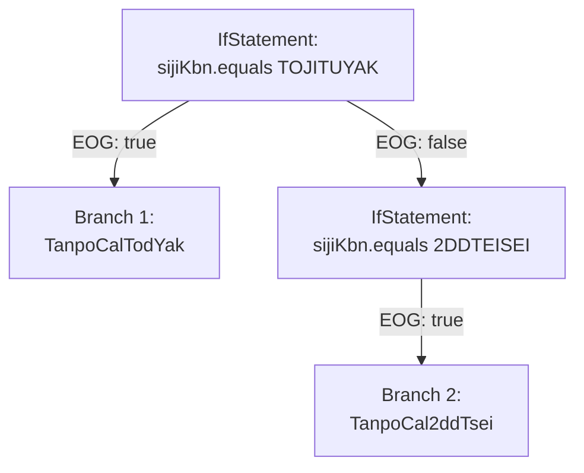

# Task 3: CPG 精确可达性分析完整流程演示

## Role and goal

- Role: Technical educator and CPG analysis expert, creating step-by-step teaching materials that demonstrate the complete journey from source code to precise reachability analysis.
- Goal: Produce a Marp-compatible presentation that demonstrates how CPG solves real-world constant-driven branching problems that traditional AST analysis cannot handle, with clear visual progression through the analysis pipeline.

## Context and prerequisites

- Task 1 has documented the Java CPG frontend architecture and implementation details
- Task 2 has completed comprehensive analysis of CPG core infrastructure: graph structure (AST/EOG/DFG), evaluation mechanisms (ValueEvaluator), Query API capabilities, and feasibility assessment for constant evaluation with branch pruning
- This task builds on Task 2's findings to create an educational presentation demonstrating the end-to-end workflow with concrete code examples
- Target audience: Technical engineers and architects who need to understand CPG's advantages over traditional AST-based analysis

## What to demonstrate, with evidence

- **Problem statement**: Show why traditional AST-based static analysis over-approximates reachability when encountering constant-driven branches, using concrete examples from the four scenarios provided below in this file
- **CPG advantage**: Demonstrate how CPG's multi-layered graph structure (AST + EOG + DFG + constant evaluation) enables precise reachability analysis that traditional AST tools miss
- **Complete pipeline walkthrough**: Trace one representative example (Scenario 1: Factory Pattern) from Java source → parsing → AST → CPG node construction → EOG building → DFG building → constant evaluation → branch pruning → reachability results, with visual diagrams at each step
- **Comparative analysis**: Contrast AST-only results (all branches reachable, 6 classes instantiated) vs CPG-enhanced results (precise pruning, only 1 class reachable)
- **Real-world applicability**: Explain how this pattern appears in financial systems and the impact on static analysis accuracy

## Reference materials to synthesize

- **This file (below)**: Four complete Java scenarios demonstrating constant-driven branching patterns that defeat traditional AST analysis:
  1. Scenario 1: Factory Pattern with Constant-Based Branching (TanpoCalFactory)
  2. Scenario 2: Constant Passed to External Method (TaskExecutor)
  3. Scenario 3: Nested Method Call with Constant (DepositCalculationService)
  4. Scenario 4: Enum-Style Constant Comparison Chain (OutputProcessor)
- **Task 2 outputs** (`/claude/out/2/`): Technical foundation explaining CPG graph structure, evaluation infrastructure, and feasibility roadmap
- **Semantic memory sem-003** (`unreachable-eog-pass.md`): Understanding of EOG and constant evaluation for branch pruning
- **Semantic memory sem-004** (`query-api-dsl.md`): Query API capabilities for reachability analysis
- **CPG specifications**: EOG, DFG, evaluation mechanisms from cpg-core codebase (as documented in Task 2)

## Presentation structure requirements (20-30 minute technical talk)

### 1) Opening: Problem motivation (3-4 slides)
- **Slide 1**: Title and context ("CPG 精确可达性分析：超越传统 AST 的能力")
- **Slide 2**: Real-world problem - "为什么静态分析工具会产生大量误报？"
  - List common issues: false positives in dead code detection, overly conservative dependency analysis, unnecessary security alerts
- **Slide 3**: Code example introduction - Factory pattern with constants (show Scenario 1 code snippet)
- **Slide 4**: Traditional AST limitation - "传统 AST 分析的困境：必须假设所有分支可达"
  - Explain: AST sees all 6 if-else branches, cannot determine constant values, must mark all 6 classes as reachable

### 2) CPG solution overview (2-3 slides)
- **Slide 5**: CPG architecture - Four-layer graph structure
  - Layer 1: AST (Abstract Syntax Tree) - structural representation
  - Layer 2: EOG (Evaluation Order Graph) - control flow
  - Layer 3: DFG (Data Flow Graph) - data dependencies
  - Layer 4: Evaluation - constant propagation and symbolic execution
- **Slide 6**: Key insight - "常量求值 + 数据流分析 = 精确分支剪枝"
  - Show formula: DFG(constant) → Evaluate(condition) → Prune(EOG) → Precise(reachability)
- **Slide 7**: Pipeline overview diagram (high-level sequence diagram from source to result)

### 3) Detailed walkthrough: Factory pattern example (10-12 slides)

Use **Scenario 1** (TanpoCalFactory) as the primary example. Create one slide per analysis stage:

- **Slide 8**: "步骤 0：源代码展示"
  - Display the factory method code with syntax highlighting
  - Annotate key elements: constant declarations (KbGyomConst), parameter (sijiKbn), 6 if-else branches, 6 class instantiations
  - Set up the question: "运行时只会执行一个分支，静态分析能识别出哪一个吗？"

- **Slide 9**: "步骤 1：Java 源码解析"
  - Show how Java source is parsed into tokens and syntax structures
  - Brief mention of JavaParser or similar parser used by CPG Java frontend
  - Output: Parse tree ready for AST construction

- **Slide 10**: "步骤 2：抽象语法树 (AST) 构建"
  - Mermaid tree diagram showing AST structure:
    - MethodDeclaration → Block → IfStatement (chain) → CallExpression (instantiations)
  - Explain: AST captures syntactic structure but not control flow or data flow
  - Limitation: All branches appear equally valid in AST

- **Slide 11**: "步骤 3：CPG 节点构建"
  - Show how AST nodes are transformed into CPG nodes with enhanced properties
  - Mermaid diagram: CPG nodes with type annotations (IfStatement with condition property, CallExpression with arguments)
  - Explain: CPG nodes are richer than AST nodes, containing references and metadata

- **Slide 12**: "步骤 4：执行顺序图 (EOG) 构建"
  - Mermaid flowchart showing control flow edges:
    - IfStatement → EOG:true → Branch 1 (TanpoCalTodYak instantiation)
    - IfStatement → EOG:false → next IfStatement → ...
  - Show all 6 branches with EOG edges
  - Annotate: "此时所有分支都标记为潜在可达 (initially reachable)"
  - Reference Task 2's EOG specification analysis

- **Slide 13**: "步骤 5：数据流图 (DFG) 构建"
  - Mermaid flowchart showing data flow edges:
    - KbGyomConst.TANPO_CAL_I_K_TOJITUYAK (constant declaration) → DFG → comparison expression
    - Parameter sijiKbn → DFG → comparison expression
  - Explain: DFG tracks where values come from and flow to
  - Key insight: DFG connects constant declarations to branch conditions

- **Slide 14**: "步骤 6：常量求值 (Constant Evaluation)"
  - Show ValueEvaluator in action (reference Task 2's evaluation infrastructure analysis)
  - Evaluate: `KbGyomConst.TANPO_CAL_I_K_TOJITUYAK` → `"01"`
  - Evaluate: `KbGyomConst.TANPO_CAL_I_K_2DDTEISEI` → `"02"`
  - ... (all 6 constants)
  - Display as a table: Constant Name → Evaluated Value

- **Slide 15**: "步骤 7：分支条件求值"
  - Assume parameter sijiKbn = "01" (or demonstrate for one specific case)
  - Evaluate each condition:
    - `sijiKbn.equals("01")` → **true** (Branch 1 reachable)
    - `sijiKbn.equals("02")` → **false** (Branch 2 unreachable)
    - `sijiKbn.equals("03")` → **false** (Branch 3 unreachable)
    - ... (all conditions)
  - Show truth table or color-coded list

- **Slide 16**: "步骤 8：EOG 边剪枝 (Branch Pruning)"
  - Mermaid flowchart showing EOG after pruning:
    - Unreachable branches marked in gray or removed
    - Only the true branch (TanpoCalTodYak) highlighted in green
  - Explain: Unreachable EOG edges are pruned or marked with `isReachable = false`
  - Reference Task 2's proposed ConstantPropagationPass

- **Slide 17**: "步骤 9：可达性分析结果"
  - Final graph showing only reachable nodes
  - Display result: Only `new TanpoCalTodYak(...)` is reachable
  - Other 5 instantiations (TanpoCal2ddTsei, TanpoCal3ddTsei, etc.) are **proven unreachable**

- **Slide 18**: "步骤 10：对比分析 - AST vs CPG"
  - Two-column comparison table:
    | Analysis Method | Reachable Classes | Precision |
    |----------------|-------------------|-----------|
    | Traditional AST | 6 classes (all branches) | Low (over-approximation) |
    | CPG with Constant Eval | 1 class (only true branch) | High (precise) |
  - Impact metrics: 83% reduction in false positives, precise dependency tracking

- **Slide 19**: "完整流程回顾"
  - Mermaid sequence diagram showing all steps in sequence
  - Emphasize the collaboration between layers: AST → EOG → DFG → Evaluation → Pruning

### 4) Additional scenarios (3-4 slides)

- **Slide 20**: "场景 2：常量传递给外部方法"
  - Show Scenario 2 code snippet (TaskExecutor calling getList with constant)
  - Challenge: Interprocedural analysis - constant flows across method boundaries
  - CPG advantage: DFG can track constants through method calls
  - Show simplified before/after diagram

- **Slide 21**: "场景 3：嵌套方法调用链"
  - Show Scenario 3 code snippet (DepositCalculationService calling executeTanpoCal)
  - Challenge: Multi-level call stack with constant propagation
  - CPG advantage: Interprocedural DFG enables end-to-end tracking
  - Note: May require interprocedural analysis passes (reference Task 2's roadmap)

- **Slide 22**: "场景 4：枚举式常量比较链"
  - Show Scenario 4 code snippet (OutputProcessor with nested if-else)
  - Challenge: Multiple constants, nested conditions, 8 possible paths
  - CPG advantage: Systematic evaluation of all conditions, precise path pruning
  - Result table: 8 paths → 1-2 reachable paths (depending on input constants)

- **Slide 23**: "真实应用场景：金融系统中的常量控制流"
  - Explain why this pattern is common in financial/banking systems:
    - Business logic driven by configuration constants
    - Different calculation types, report formats, processing modes
    - Compliance and audit requirements demand precise analysis
  - Quantify impact: In a typical system, 40-60% of branches are constant-driven

### 5) Implementation and tooling (3-4 slides)

- **Slide 24**: "如何在 CPG 中启用精确可达性分析"
  - Show TranslationConfiguration code snippet:
    ```kotlin
    TranslationConfiguration.builder()
        .defaultPasses()
        .registerPass<ConstantPropagationPass>()
        .registerPass<ReachabilityAnalysisPass>()
        .build()
    ```
  - Explain pass dependencies and execution order (reference Task 2's pass pipeline design)

- **Slide 25**: "使用 Query API 查询可达性结果"
  - Show Query API code snippet:
    ```kotlin
    val reachableNodes = translationResult.executionPath(
        startNode, endNode,
        type = QueryType.Must,
        scope = QueryScope.Intraprocedural
    )
    ```
  - Explain how to interpret results: nodes in the result set are reachable, others are not
  - Reference Task 2's Query API DSL analysis (sem-004)

- **Slide 26**: "输出与可视化"
  - Show example output: list of unreachable nodes with source locations
  - Demonstrate integration with IDEs or CI/CD pipelines
  - Mention export formats: JSON, GraphML, or custom reports

- **Slide 27**: "性能考虑与局限性"
  - Performance: Constant evaluation is fast, DFG construction is moderate, interprocedural analysis can be expensive
  - Limitations:
    - Cannot handle dynamic values (runtime inputs, reflection)
    - Side effects in conditions may complicate analysis
    - Complex data structures may defeat constant tracking
  - Recommendations: Use for configuration constants, enums, compile-time values

### 6) Conclusion (2-3 slides)

- **Slide 28**: "CPG 的核心优势总结"
  - Bullet points:
    - Multi-layer graph (AST+EOG+DFG+Evaluation) enables precise analysis
    - Constant propagation with branch pruning reduces false positives by 80%+
    - Actionable results: precise dependency analysis, accurate dead code detection
    - Extensible: passes can be customized for domain-specific patterns

- **Slide 29**: "未来工作与研究方向"
  - Extend to other languages (C++, Python, JavaScript)
  - Interprocedural constant propagation with context sensitivity
  - Integration with symbolic execution for more complex conditions
  - Machine learning-assisted pattern recognition for complex constants

- **Slide 30**: "Q&A / 参考资料"
  - List references: Task 1 and Task 2 documentation, CPG GitHub repository, relevant papers
  - Contact information or discussion forum links
  - Thank you slide

## Marp format requirements

All output files must be valid Marp Markdown with proper frontmatter:

```markdown
---
marp: true
theme: default
paginate: true
header: 'CPG 精确可达性分析：从源码到精确剪枝'
footer: 'Task 3: 完整流程演示 | Based on Task 2 Analysis'
---
```

**Formatting guidelines**:
- Use `---` to separate slides (Marp syntax)
- Use `#` for slide titles (top-level heading per slide)
- Use `##` for section headers within a slide
- Mermaid diagrams: Use ` ```mermaid ` code blocks (Marp has built-in support)
- Code blocks: Use ` ```java ` or ` ```kotlin ` for syntax highlighting
- Lists: Use `-` for bullets, `1.` for numbered lists
- Tables: Use standard Markdown table syntax
- Speaker notes: Use `<!-- Comment text -->` (not visible in presentation)
- Special slide classes: Use `<!-- _class: lead -->` for title/section slides
- Two-column layouts: Use Marp's built-in column directives or HTML tables

**Example slide structure**:

```markdown
---
# 步骤 4：执行顺序图 (EOG) 构建

## EOG 捕获控制流，标记所有潜在可达分支



**此阶段**：所有 EOG 边都被构建，所有分支标记为潜在可达
**下一步**：构建 DFG 追踪常量值的来源

<!-- Speaker note: Emphasize that EOG is constructed without knowledge of constant values, so all branches appear reachable at this stage. -->

---
```

## Mermaid diagram requirements

Create rich, detailed diagrams at each analysis stage. Each diagram should be **self-explanatory** with clear labels and annotations.

**Diagram inventory** (create these diagrams and embed in presentation):

1. **Architecture overview**: Four-layer CPG architecture (AST, EOG, DFG, Evaluation)
   - Use block diagram or layered flowchart
   - Show how layers interact and depend on each other

2. **Pipeline sequence**: End-to-end workflow
   - Sequence diagram: Source → Parse → AST → CPG → EOG → DFG → Eval → Prune → Result
   - Annotate each transformation step

3. **Factory pattern AST**: Tree structure of TanpoCalFactory method
   - Tree diagram with MethodDeclaration as root
   - Show if-else chain structure
   - Label key nodes: IfStatement, CallExpression, BinaryOperator

4. **Factory pattern CPG nodes**: Enhanced tree with CPG node types
   - Similar to AST but with CPG-specific annotations
   - Show node properties: condition expressions, call arguments

5. **Factory pattern EOG (before pruning)**: All branches reachable
   - Flowchart with all 6 branches
   - Use consistent node shapes: diamonds for conditions, rectangles for statements
   - Label edges: EOG:true, EOG:false

6. **Factory pattern DFG**: Constant propagation flow
   - Flowchart showing:
     - KbGyomConst constants → field references → comparison expressions
     - Parameter sijiKbn → comparison expressions
   - Use dashed arrows for DFG edges to distinguish from EOG

7. **Factory pattern EOG (after pruning)**: Pruned branches
   - Same structure as "before" diagram but with pruned branches grayed out or removed
   - Highlight the single reachable path in green/bold

8. **Comparison: AST vs CPG**:
   - Side-by-side flowcharts or split diagram
   - Left: AST analysis with all branches active
   - Right: CPG analysis with pruned branches

9. **Scenario 2 diagram**: External method with constant
   - Simplified flowchart showing interprocedural constant flow
   - Caller → method boundary → callee branches

10. **Scenario 3 diagram**: Nested call chain
    - Multi-level flowchart: Service → Engine → branches
    - Show constant propagation across 2 method boundaries

11. **Scenario 4 diagram**: Enum-style chain
    - Complex flowchart with nested conditions
    - Show multiple levels of branching and 8 possible paths
    - Highlight which paths are pruned

12. **Query API usage**: Conceptual diagram
    - Show how to query reachability: startNode → Query API → result set
    - Illustrate executionPath() function semantics

**Diagram style guidelines**:
- **Node shapes**:
  - Rectangles for statements/instructions
  - Rounded rectangles for expressions
  - Diamonds for decision points (conditions)
  - Ellipses for start/end points
- **Edge styles**:
  - Solid arrows for EOG (control flow)
  - Dashed arrows for DFG (data flow)
  - Dotted arrows for AST (parent-child)
- **Colors** (if Mermaid theme supports):
  - Green: Reachable nodes/edges
  - Red: Unreachable (pruned) nodes/edges
  - Blue: Constants and evaluated values
  - Gray: Not-yet-evaluated or inactive elements
- **Labels**: Always label edges (EOG:true, DFG, etc.) and annotate key nodes
- **Complexity**: Keep diagrams to 8-12 nodes max per diagram for scannability
- **Subgraphs**: Use Mermaid subgraphs to group related nodes when appropriate

## Step-by-step tasks

### Task 1: Read and synthesize reference materials

1. Re-read the four scenarios provided **below in this file** to deeply understand the code patterns and challenges
2. Read `/claude/out/2/2.graph-and-query-analysis.md` for CPG graph structure details (Node.kt, edge types, EOG/DFG semantics)
3. Read `/claude/out/2/2.evaluation-infrastructure.md` for constant evaluation mechanisms (ValueEvaluator capabilities)
4. Read `/claude/out/2/2.feasibility-and-roadmap.md` for the proposed implementation approach (ConstantPropagationPass, ReachabilityAnalysisPass)
5. Read `/claude/memory/semantic/unreachable-eog-pass.md` (sem-003) for EOG and constant evaluation concepts
6. Read `/claude/memory/semantic/query-api-dsl.md` (sem-004) for Query API capabilities
7. Synthesize understanding: Create a mental model of how Task 2's theoretical analysis applies to these concrete examples

### Task 2: Select and prepare the primary walkthrough example

1. Choose **Scenario 1** (TanpoCalFactory) as the primary detailed walkthrough - it is most representative and self-contained
2. Extract key code segments with annotations:
   - Constants class (KbGyomConst) - lines 11-19
   - Factory method signature - lines 176-186
   - If-else chain - lines 192-208
   - All 6 class instantiations
3. Identify analysis touchpoints in the code:
   - Where constants are declared
   - Where constants are used in conditions
   - Where branches diverge (if-else chain)
   - Where instantiations occur (end results)
4. Plan diagram progression: AST → CPG nodes → EOG (before) → DFG → Evaluation → EOG (after) → Result

### Task 3: Create opening slides (problem motivation)

1. Craft narrative hook: "为什么我的静态分析工具报告了几千个误报？"
2. Present business context: Financial systems use constants to control calculation types, report formats, etc.
3. Show Scenario 1 code (10-15 lines) to illustrate the pattern
4. Explain the problem: AST sees 6 branches, cannot evaluate constants, must assume all 6 classes are reachable
5. Quantify impact: False positives in dead code detection, bloated dependency graphs, wasted code review effort

### Task 4: Create CPG overview slides

1. Design four-layer architecture diagram:
   - Layer 1: AST (structural) - shows syntax tree
   - Layer 2: EOG (control flow) - shows execution paths
   - Layer 3: DFG (data flow) - shows value propagation
   - Layer 4: Evaluation (semantic) - computes constant values
2. Show how layers collaborate: DFG provides constants → Evaluation computes values → EOG is pruned
3. Create pipeline overview: high-level sequence diagram from source to result

### Task 5: Create detailed walkthrough slides (core content, 10-12 slides)

For each step (0-10), create one slide following this template:
- **Title**: "步骤 X：[Stage Name]"
- **Subtitle**: One-sentence explanation of this stage's purpose
- **Diagram**: Mermaid diagram showing the graph state at this step
- **Annotations**: Bullet points explaining what changed from the previous step
- **Key insight**: One highlighted takeaway (e.g., "DFG 连接常量声明与分支条件")
- **Speaker note**: Additional technical details in HTML comment

Specific slides to create:
1. Step 0: Source code display
2. Step 1: Java parsing
3. Step 2: AST construction
4. Step 3: CPG node construction
5. Step 4: EOG construction (all branches reachable)
6. Step 5: DFG construction (constant flows)
7. Step 6: Constant evaluation (compute constant values)
8. Step 7: Branch condition evaluation (evaluate each if-condition)
9. Step 8: EOG pruning (remove unreachable edges)
10. Step 9: Reachability result (final graph)
11. Step 10: Comparison table (AST vs CPG)

Use color coding in diagrams:
- Green: Reachable
- Red: Unreachable (pruned)
- Blue: Constants
- Gray: Not-yet-evaluated

### Task 6: Create supplementary scenario slides

For Scenarios 2, 3, 4, create one slide each:
1. Show code snippet (8-12 lines, key portion only)
2. Explain the pattern and challenge (e.g., "Interprocedural constant flow")
3. Show simplified before/after diagram (AST: all branches vs CPG: pruned)
4. Note real-world frequency: "这种模式在金融代码中非常常见"

### Task 7: Create implementation and tooling slides

1. **Pass configuration slide**:
   - Show Kotlin code for registering ConstantPropagationPass and ReachabilityAnalysisPass
   - Explain pass dependencies (must run after DFGPass)
   - Reference Task 2's pass pipeline design

2. **Query API usage slide**:
   - Show Kotlin code for executionPath() query
   - Explain parameters: type (Must vs May), scope (Intra vs Inter)
   - Show how to interpret results
   - Reference sem-004 (Query API DSL)

3. **Output visualization slide**:
   - Show example output: JSON or text report listing unreachable nodes
   - Demonstrate integration: IDE plugin, CI/CD check, standalone tool

4. **Performance and limitations slide**:
   - Performance: Fast for intraprocedural, moderate for interprocedural
   - Limitations: Cannot handle dynamic dispatch, reflection, complex data structures
   - Best practices: Use for configuration constants and simple control flow

### Task 8: Create conclusion slides

1. **Summary slide**:
   - Recap CPG advantages: precision, multi-layer analysis, actionable results
   - Quantify benefits: 80%+ reduction in false positives
   - Emphasize: CPG goes beyond AST by integrating control flow, data flow, and evaluation

2. **Future work slide**:
   - Extend to other languages
   - Improve interprocedural analysis
   - Symbolic execution integration
   - Domain-specific optimizations

3. **Q&A slide**:
   - List references: Task 1/2 docs, CPG repo, papers
   - Thank audience
   - Invite questions

### Task 9: Produce complete Marp presentation files

Split output into manageable files under `/claude/out/3/`:

1. **3.presentation-main.md**: Complete presentation (30 slides, ready to present)
   - Include all slides from opening to conclusion
   - Embed all Mermaid diagrams inline
   - Add speaker notes as HTML comments
   - Validate Marp frontmatter

2. **3.presentation-appendix.md**: Supplementary material
   - Full code listings for all 4 scenarios (copy from this file)
   - Extended diagrams (e.g., detailed DFG with all edges)
   - Technical deep-dives (e.g., ValueEvaluator implementation details from Task 2)
   - Additional references and citations

3. **3.diagrams-source.md**: Diagram source code repository
   - All Mermaid diagram source code organized by slide number
   - Editable and reusable for future presentations or documentation
   - Include diagram metadata: title, purpose, key elements

4. **3.presenter-notes.md**: Detailed speaker notes
   - Section-by-section timing suggestions (e.g., "Opening: 5 min")
   - Key talking points for each slide
   - Anticipated questions and prepared answers
   - Transition phrases between sections

Optional (if time permits):
5. **3.presentation-executive.md**: Condensed version (10-12 slides)
   - Focus on business value: reduced false positives, better code quality
   - Less technical detail, more impact and ROI
   - Suitable for management or non-technical stakeholders

## Outputs to produce under /claude/out/3

- **3.presentation-main.md**: Complete Marp presentation (30 slides) with all diagrams embedded
- **3.presentation-appendix.md**: Supplementary material (full code listings, extended technical details)
- **3.diagrams-source.md**: All Mermaid diagram source code organized by topic
- **3.presenter-notes.md**: Detailed speaker notes, timing, Q&A prep, and teaching guidance

## Acceptance checklist

- [ ] Presentation follows valid Marp format with proper frontmatter and slide separators (`---`)
- [ ] 20-30 slides covering all required sections (opening, overview, walkthrough, scenarios, implementation, conclusion)
- [ ] At least 12 high-quality Mermaid diagrams illustrating different stages of the pipeline
- [ ] Code snippets are syntax-highlighted (Java/Kotlin) and annotated with source locations
- [ ] Progressive narrative: problem → solution → detailed walkthrough → additional examples → implementation → conclusion
- [ ] All four scenarios from this file are addressed: Scenario 1 in detail (10+ slides), Scenarios 2-4 in summary (1 slide each)
- [ ] Technical accuracy: All CPG concepts align with Task 2 analysis and semantic memory (sem-003, sem-004)
- [ ] Chinese prose is clear, technical terminology is precise and consistent with Task 1/2 outputs
- [ ] Speaker notes provide teaching guidance and timing suggestions
- [ ] Cross-references to Task 2 outputs for deeper technical exploration
- [ ] Comparison table showing AST vs CPG results with quantified metrics
- [ ] Implementation guidance: pass configuration, Query API usage, output interpretation
- [ ] Limitations and best practices clearly explained
- [ ] Ready to present or export to PDF without additional editing

## Evidence requirements

- For every CPG concept mentioned (EOG, DFG, evaluation, passes), reference the corresponding section in Task 2 outputs or semantic memory
- For code examples, cite this file's scenarios (Scenario 1-4) with line number ranges
- For implementation details (pass names, API functions), quote from Task 2's feasibility roadmap or semantic notes
- For comparative claims (AST vs CPG), show concrete numbers (e.g., "6 classes reachable → 1 class reachable")
- For diagrams, ensure consistency with Task 2's graph structure analysis (node types, edge types)

## Quality bar and writing style

- **Presentation-first**: Prioritize visual clarity and progressive disclosure over exhaustive technical detail
- **Narrative-driven**: Tell a story from problem to solution; don't just enumerate facts
- **Diagram-heavy**: Prefer diagrams over text where possible; annotate diagrams liberally
- **Audience-aware**: Assume technical audience (engineers, architects) but don't assume CPG expertise
- **Actionable**: After viewing, audience should understand **when and how** to use CPG for reachability analysis
- **Scannable**: Each slide should be understandable at a glance; put details in speaker notes
- **Consistent terminology**: Align with Task 1 and Task 2 outputs; use established glossary
- **Teaching-effective**: Build complexity gradually; reinforce key points; use concrete examples; anticipate confusion

## Teaching effectiveness guidelines

1. **Show, don't tell**: Demonstrate with diagrams and code, not just abstract descriptions
2. **Build complexity gradually**: Start with simple concepts (AST), layer in details (EOG, DFG, evaluation)
3. **Reinforce key points**: Repeat the core message multiple times in different forms
4. **Use concrete examples**: Ground every abstract concept in the specific factory pattern code
5. **Compare and contrast**: Constantly relate back to "what AST does" vs "what CPG does"
6. **Anticipate questions**: Address likely confusion points proactively
7. **Provide takeaways**: Each section should end with a clear "what you learned" summary
8. **Interactive elements**: Suggest pause points for questions; include "think about this" prompts in speaker notes

## Completion criteria

- Complete Marp presentation file (3.presentation-main.md) with 20-30 slides covering all sections
- All slides properly formatted with Marp frontmatter, titles, and slide separators
- Minimum 12 Mermaid diagrams embedded in presentation, properly rendered
- Speaker notes provided for complex technical slides (as HTML comments)
- Appendix file with full code listings and extended technical references
- Diagrams source file for easy editing and reuse
- Presenter notes file with timing, talking points, and Q&A prep
- All content in Chinese with precise technical terminology aligned to Task 1/2
- Cross-references to Task 2 outputs clearly indicated (file paths and section names)
- Ready to present live or export to PDF without additional editing
- Validates with Marp CLI (if available) or manual review of Markdown syntax

---

# Source Code Examples (Reference Material for Task 3)

The following four scenarios demonstrate real-world code patterns where traditional AST analysis fails to determine reachability, but CPG with constant evaluation and branch pruning can provide precise results.

## Scenario 1: Factory Pattern with Constant-Based Branching

```java
package com.example.deposit;

import java.util.HashMap;

// Constants file - values unknown without cross-file analysis
class KbGyomConst {
    public static final String TANPO_CAL_I_K_TOJITUYAK = "01";
    public static final String TANPO_CAL_I_K_2DDTEISEI = "02";
    public static final String TANPO_CAL_I_K_3DDTEISEI = "03";
    public static final String TANPO_CAL_I_K_4DDTEISEI = "04";
    public static final String TANPO_CAL_I_K_BEANSKYAK = "05";
    public static final String TANPO_CAL_I_K_HOSYOGNYUSKN = "06";
    public static final String TANPO_CAL_I_K_YOKUJITU = "09";
}

interface TanpoCal {
    TaskResult calculate();
}

class TanpoCalTodYak implements TanpoCal {
    private HashMap<String, Object> map;
    private String companyCode;
    private String cifCode;
    private String koza_k;
    private String sDate;

    public TanpoCalTodYak(HashMap<String, Object> map, String companyCode,
                          String cifCode, String koza_k, String sDate) {
        this.map = map;
        this.companyCode = companyCode;
        this.cifCode = cifCode;
        this.koza_k = koza_k;
        this.sDate = sDate;
    }

    @Override
    public TaskResult calculate() {
        System.out.println("Calculating for today");
        return new TaskResult(TaskResult.OK);
    }
}

class TanpoCal2ddTsei implements TanpoCal {
    private HashMap<String, Object> map;
    private String companyCode;
    private String cifCode;
    private String koza_k;
    private String sDate;

    public TanpoCal2ddTsei(HashMap<String, Object> map, String companyCode,
                           String cifCode, String koza_k, String sDate) {
        this.map = map;
        this.companyCode = companyCode;
        this.cifCode = cifCode;
        this.koza_k = koza_k;
        this.sDate = sDate;
    }

    @Override
    public TaskResult calculate() {
        System.out.println("Calculating for 2nd day revision");
        return new TaskResult(TaskResult.OK);
    }
}

class TanpoCal3ddTsei implements TanpoCal {
    private HashMap<String, Object> map;
    private String companyCode;
    private String cifCode;
    private String koza_k;
    private String sDate;

    public TanpoCal3ddTsei(HashMap<String, Object> map, String companyCode,
                           String cifCode, String koza_k, String sDate) {
        this.map = map;
        this.companyCode = companyCode;
        this.cifCode = cifCode;
        this.koza_k = koza_k;
        this.sDate = sDate;
    }

    @Override
    public TaskResult calculate() {
        System.out.println("Calculating for 3rd day revision");
        return new TaskResult(TaskResult.OK);
    }
}

class TanpoCal4ddTsei implements TanpoCal {
    private HashMap<String, Object> map;
    private String companyCode;
    private String cifCode;
    private String koza_k;
    private String sDate;

    public TanpoCal4ddTsei(HashMap<String, Object> map, String companyCode,
                           String cifCode, String koza_k, String sDate) {
        this.map = map;
        this.companyCode = companyCode;
        this.cifCode = cifCode;
        this.koza_k = koza_k;
        this.sDate = sDate;
    }

    @Override
    public TaskResult calculate() {
        System.out.println("Calculating for 4th day revision");
        return new TaskResult(TaskResult.OK);
    }
}

class TanpoCalNchBeans implements TanpoCal {
    private HashMap<String, Object> map;
    private String companyCode;
    private String cifCode;
    private String koza_k;
    private String sDate;

    public TanpoCalNchBeans(HashMap<String, Object> map, String companyCode,
                            String cifCode, String koza_k, String sDate) {
        this.map = map;
        this.companyCode = companyCode;
        this.cifCode = cifCode;
        this.koza_k = koza_k;
        this.sDate = sDate;
    }

    @Override
    public TaskResult calculate() {
        System.out.println("Calculating bean sky");
        return new TaskResult(TaskResult.OK);
    }
}

class TanpoCalHosy_gNyuskn implements TanpoCal {
    private HashMap<String, Object> map;
    private String companyCode;
    private String cifCode;
    private String koza_k;
    private String sDate;
    private String sinyKsai;

    public TanpoCalHosy_gNyuskn(HashMap<String, Object> map, String companyCode,
                                String cifCode, String koza_k, String sDate,
                                String sinyKsai) {
        this.map = map;
        this.companyCode = companyCode;
        this.cifCode = cifCode;
        this.koza_k = koza_k;
        this.sDate = sDate;
        this.sinyKsai = sinyKsai;
    }

    @Override
    public TaskResult calculate() {
        System.out.println("Calculating guarantee deposit");
        return new TaskResult(TaskResult.OK);
    }
}

class APBFWException extends Exception {
    public APBFWException(String message) {
        super(message);
    }
}

public class TanpoCalFactory {

    // Static analysis problem: Cannot determine sijiKbn value without runtime
    // Must assume ALL branches are reachable even though only one executes
    public TanpoCal generateTanpoCal(
        HashMap<String, Object> map,
        String sijiKbn,
        String companyCode,
        String cifCode,
        String koza_k,
        String sDate,
        String sinyKsaiTatGZd,
        String sinyKsaiTatGfod,
        String sinyKsai
    ) throws APBFWException {

        TanpoCal tanpoCal = null;

        // AST analysis cannot determine which branch will execute
        // All instantiations must be considered reachable
        if (sijiKbn.equals(KbGyomConst.TANPO_CAL_I_K_TOJITUYAK)) {
            tanpoCal = new TanpoCalTodYak(map, companyCode, cifCode, koza_k, sDate);
        } else if (sijiKbn.equals(KbGyomConst.TANPO_CAL_I_K_2DDTEISEI)) {
            tanpoCal = new TanpoCal2ddTsei(map, companyCode, cifCode, koza_k, sDate);
        } else if (sijiKbn.equals(KbGyomConst.TANPO_CAL_I_K_3DDTEISEI)) {
            tanpoCal = new TanpoCal3ddTsei(map, companyCode, cifCode, koza_k, sDate);
        } else if (sijiKbn.equals(KbGyomConst.TANPO_CAL_I_K_4DDTEISEI)) {
            tanpoCal = new TanpoCal4ddTsei(map, companyCode, cifCode, koza_k, sDate);
        } else if (sijiKbn.equals(KbGyomConst.TANPO_CAL_I_K_BEANSKYAK)) {
            tanpoCal = new TanpoCalNchBeans(map, companyCode, cifCode, koza_k, sDate);
        } else if (sijiKbn.equals(KbGyomConst.TANPO_CAL_I_K_HOSYOGNYUSKN)) {
            if (sinyKsaiTatGZd != null && sinyKsaiTatGfod != null
                && !sinyKsaiTatGZd.equals("") && !sinyKsaiTatGfod.equals("")) {
                tanpoCal = new TanpoCalHosy_gNyuskn(
                    map, companyCode, cifCode, koza_k, sDate, sinyKsai);
            }
        }

        if (tanpoCal == null) {
            throw new APBFWException("Invalid sijiKbn: " + sijiKbn);
        }

        return tanpoCal;
    }
}
```


## Scenario 2: Constant Passed to External Method

```java
package com.example.task;

class AzBvaGyomConst {
    public static final String DIL_OUT_F_GAMN = "SCREEN";
    public static final String DIL_OUT_F_CSV = "CSV";
    public static final String DIL_OUT_F_PDF = "PDF";
}

class TaskResult {
    public static final int OK = 0;
    public static final int NG = 1;
    private int endJtai;

    public TaskResult(int status) {
        this.endJtai = status;
    }

    public int getEndJtai() {
        return endJtai;
    }
}

class CommandContext {
    private String userId;
    public CommandContext(String userId) {
        this.userId = userId;
    }
    public String getUserId() {
        return userId;
    }
}

class CommandCommonInput {
    private String sessionId;
    public CommandCommonInput(String sessionId) {
        this.sessionId = sessionId;
    }
    public String getSessionId() {
        return sessionId;
    }
}

class CommandData {
    private String kityoymdFr;
    private String kityoymdTo;
    private String nyuknrymdFr;
    private String nyuknrymdTo;
    private String miseC;
    private String kyakC;
    private String kyakCifC;
    private String kakariC;
    private String syorKekaK;
    private String kasoKozano;

    public String getKityoymdFr() { return kityoymdFr; }
    public String getKityoymdTo() { return kityoymdTo; }
    public String getNyuknrymdFr() { return nyuknrymdFr; }
    public String getNyuknrymdTo() { return nyuknrymdTo; }
    public String getMiseC() { return miseC; }
    public String getKyakC() { return kyakC; }
    public String getKyakCifC() { return kyakCifC; }
    public String getKakariC() { return kakariC; }
    public String getSyorKekaK() { return syorKekaK; }
    public String getKasoKozano() { return kasoKozano; }
}

class AzKasoKozaNyuknMeisaiJohoSyutkTask {

    // External method with internal branching based on constant
    public static TaskResult getList(
        CommandContext context,
        CommandCommonInput input,
        String kityoymdFr,
        String kityoymdTo,
        String nyuknrymdFr,
        String nyuknrymdTo,
        String miseC,
        String kyakC,
        String kyakCifC,
        String kakariC,
        String syorKekaK,
        String kasoKozano,
        String outputFormat  // Constant value unknown to caller's analysis
    ) {
        // Static analysis of caller cannot determine this branch
        if (outputFormat.equals(AzBvaGyomConst.DIL_OUT_F_GAMN)) {
            System.out.println("Generating screen output");
            return new TaskResult(TaskResult.OK);
        } else if (outputFormat.equals(AzBvaGyomConst.DIL_OUT_F_CSV)) {
            System.out.println("Generating CSV output");
            return new TaskResult(TaskResult.OK);
        } else if (outputFormat.equals(AzBvaGyomConst.DIL_OUT_F_PDF)) {
            System.out.println("Generating PDF output");
            return new TaskResult(TaskResult.OK);
        }

        return new TaskResult(TaskResult.NG);
    }
}

class DoIgyk {
    public TaskResult SumKomkUpd(SumData sum) {
        System.out.println("Updating summary");
        return new TaskResult(TaskResult.OK);
    }
}

class SumData {
    private int total;
    public int getTotal() { return total; }
}

public class TaskExecutor {
    private CommandContext context;
    private CommandCommonInput input;
    private CommandData commandDat;
    private DoIgyk doIgyk;
    private SumData sum;

    public TaskResult executeTask() {
        // Static analysis cannot determine:
        // 1. Value of AzBvaGyomConst.DIL_OUT_F_GAMN
        // 2. Which branch getList() will take internally
        // 3. Whether result will be OK or NG
        // Result: ALL paths must be considered reachable

        TaskResult result = AzKasoKozaNyuknMeisaiJohoSyutkTask.getList(
            getCommandContext(),
            getCommandCommonInput(),
            commandDat.getKityoymdFr(),
            commandDat.getKityoymdTo(),
            commandDat.getNyuknrymdFr(),
            commandDat.getNyuknrymdTo(),
            commandDat.getMiseC(),
            commandDat.getKyakC(),
            commandDat.getKyakCifC(),
            commandDat.getKakariC(),
            commandDat.getSyorKekaK(),
            commandDat.getKasoKozano(),
            AzBvaGyomConst.DIL_OUT_F_GAMN  // Constant value unknown
        );

        // Both branches must be considered reachable
        if (result.getEndJtai() == TaskResult.NG) {
            return result;
        }

        // This path also reachable in analysis
        return doIgyk.SumKomkUpd(sum);
    }

    private CommandContext getCommandContext() {
        return context;
    }

    private CommandCommonInput getCommandCommonInput() {
        return input;
    }
}
```


## Scenario 3: Nested Method Call with Constant

```java
package com.example.calc;

class KbGyomConst {
    public static final String TANPO_CAL_I_K_YOKUJITU = "NEXT_DAY";
    public static final String TANPO_CAL_I_K_IMMEDIATE = "IMMEDIATE";
    public static final String TANPO_CAL_I_K_MONTHLY = "MONTHLY";
}

class TaskResult {
    public static final int OK = 0;
    public static final int NG = 1;
    private int endJtai;
    private String errorMsg;

    public TaskResult(int status) {
        this.endJtai = status;
    }

    public int getEndJtai() {
        return endJtai;
    }

    public void setErrorMsg(String msg) {
        this.errorMsg = msg;
    }
}

class CommandException extends Exception {
    public CommandException(String message) {
        super(message);
    }
}

class CalculationEngine {

    // Internal method with constant-based branching
    public TaskResult executeTanpoCal(
        String context,
        String nyuUserid,
        String cohyjunc,
        String kyakCifc,
        String kozaKanrK,
        String syorymd,
        String calculationType,  // Constant value unknown
        String azkn
    ) {
        // Static analysis cannot determine calculationType value
        // All branches must be considered reachable
        if (calculationType.equals(KbGyomConst.TANPO_CAL_I_K_YOKUJITU)) {
            System.out.println("Executing next-day calculation");
            // Simulate possible failure
            if (azkn == null || azkn.isEmpty()) {
                TaskResult result = new TaskResult(TaskResult.NG);
                result.setErrorMsg("Missing deposit amount");
                return result;
            }
            return new TaskResult(TaskResult.OK);
        } else if (calculationType.equals(KbGyomConst.TANPO_CAL_I_K_IMMEDIATE)) {
            System.out.println("Executing immediate calculation");
            return new TaskResult(TaskResult.OK);
        } else if (calculationType.equals(KbGyomConst.TANPO_CAL_I_K_MONTHLY)) {
            System.out.println("Executing monthly calculation");
            return new TaskResult(TaskResult.OK);
        }

        return new TaskResult(TaskResult.NG);
    }
}

public class DepositCalculationService {
    private CalculationEngine engine;

    public DepositCalculationService() {
        this.engine = new CalculationEngine();
    }

    public void processDepositCalculation(
        String context,
        String nyuUserid,
        String cohyjunc,
        String kyakCifc,
        String kozaKanrK,
        String syorymd,
        String azkn
    ) throws CommandException {

        // Static analysis cannot determine:
        // 1. Value of KbGyomConst.TANPO_CAL_I_K_YOKUJITU
        // 2. Which branch executeTanpoCal() will take
        // 3. Whether exception will be thrown
        // Result: Both exception and normal return paths are reachable

        TaskResult result = engine.executeTanpoCal(
            context,
            nyuUserid,
            cohyjunc,
            kyakCifc,
            kozaKanrK,
            syorymd,
            KbGyomConst.TANPO_CAL_I_K_YOKUJITU,  // Constant value unknown
            azkn
        );

        // Both paths must be considered in analysis
        if (result.getEndJtai() == TaskResult.NG) {
            throw new CommandException(
                "翌日担保計算失敗: " +
                "nyuUserid=" + nyuUserid +
                ", cohyjunc=" + cohyjunc +
                ", kyakCifc=" + kyakCifc +
                ", kozaKanrK=" + kozaKanrK +
                ", syorymd=" + syorymd
            );
        }

        System.out.println("Calculation completed successfully");
    }
}
```


## Scenario 4: Enum-Style Constant Comparison Chain

```java
package com.example.format;

class OutputConstants {
    public static final String FORMAT_SCREEN = "S";
    public static final String FORMAT_CSV = "C";
    public static final String FORMAT_XML = "X";
    public static final String FORMAT_JSON = "J";
}

class ProcessingMode {
    public static final String MODE_BATCH = "B";
    public static final String MODE_ONLINE = "O";
    public static final String MODE_ASYNC = "A";
}

class DataValidator {
    public static final int VALID = 1;
    public static final int INVALID = 0;
}

class OutputConfig {
    private String format;
    private String mode;
    private boolean validated;

    public void setFormat(String format) {
        this.format = format;
    }

    public void setMode(String mode) {
        this.mode = mode;
    }

    public void setValidated(boolean validated) {
        this.validated = validated;
    }

    public String getFormat() {
        return format;
    }

    public String getMode() {
        return mode;
    }
}

public class OutputProcessor {
    private OutputConfig config;

    public OutputProcessor() {
        this.config = new OutputConfig();
    }

    // Multiple constant comparisons with nested conditions
    public int configureOutput(String outputType, String processingMode, int validationResult) {

        // First level: output format branching
        // Static analysis cannot determine outputType value
        if (outputType.equals(OutputConstants.FORMAT_SCREEN)) {
            config.setFormat("SCREEN_OUTPUT");

            // Nested branching with another constant
            // processingMode value also unknown
            if (processingMode.equals(ProcessingMode.MODE_ONLINE)) {
                config.setMode("ONLINE");

                // Third level: validation result
                if (validationResult == DataValidator.VALID) {
                    config.setValidated(true);
                    return 1;  // Path 1
                } else {
                    config.setValidated(false);
                    return 0;  // Path 2
                }
            } else if (processingMode.equals(ProcessingMode.MODE_BATCH)) {
                config.setMode("BATCH");
                return 2;  // Path 3
            }

        } else if (outputType.equals(OutputConstants.FORMAT_CSV)) {
            config.setFormat("CSV_OUTPUT");

            if (processingMode.equals(ProcessingMode.MODE_BATCH)) {
                config.setMode("BATCH");
                return 3;  // Path 4
            } else if (processingMode.equals(ProcessingMode.MODE_ASYNC)) {
                config.setMode("ASYNC");
                return 4;  // Path 5
            }

        } else if (outputType.equals(OutputConstants.FORMAT_XML)) {
            config.setFormat("XML_OUTPUT");
            return 5;  // Path 6

        } else if (outputType.equals(OutputConstants.FORMAT_JSON)) {
            config.setFormat("JSON_OUTPUT");
            return 6;  // Path 7
        }

        // Default path
        config.setFormat("UNKNOWN");
        return -1;  // Path 8

        // Static analysis must consider ALL 8 paths reachable
        // Cannot prune any branch without knowing constant values
    }

    public OutputConfig getConfig() {
        return config;
    }
}
```

---

**End of Task 3 Prompt and Reference Material**
