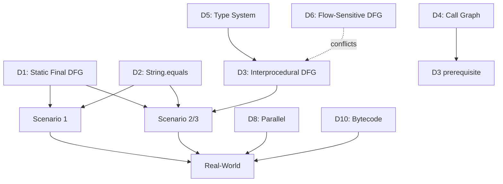

# Task 4: CPG 架构缺陷全面分析 (Gap Analysis Only)

## Role and goal

- **Role**: Critical architecture analyst with deep expertise in static analysis frameworks
- **Goal**: Produce a **comprehensive gap analysis** identifying ALL critical defects in current CPG implementation for Java constant-driven reachability analysis
- **Scope**: Analysis ONLY - NO solutions, NO roadmaps, NO implementation designs

## Core principle

**This is a pure analytical task**: Identify problems, explain root causes, quantify impacts. **Do NOT propose solutions**. Solutions will be designed in subsequent tasks.

---

## Context and prerequisites

- **Task 1** documented the Java CPG frontend architecture and handler-based AST transformation patterns
- **Task 2** completed comprehensive analysis of CPG core infrastructure: graph structure (AST/EOG/DFG), ValueEvaluator capabilities, UnreachableEOGPass implementation, and Query API mechanisms
- **Task 3** created 4 real-world scenarios (factory pattern, interprocedural constant flow, nested method calls, enum-style branching) that serve as **representative test cases**
- This task critically evaluates CPG against Task 3 scenarios AND real-world large codebase requirements

---

## Problem statement and motivation

### The Core Insight

**Task 3 提供了 4 个目标场景，但这些场景只是真实大型代码库分析的代表性样本。**

真实分析场景包含但不限于:
- Task 3 的 4 个场景 (作为核心测试用例)
- 100K+ LOC 的金融/电商项目
- 依赖闭源 JAR 库的企业应用
- 多层嵌套调用、异常处理、泛型、Lambda 的现代 Java 代码
- 需要在 CI/CD 中运行的增量分析
- 需要容错的不完整代码库 (新语法、编译错误)

### Strategic Context: Java Fork Motivation

**为什么考虑 Java 专用 Fork**:
- **Frontend 和 Core 不再分离**: 视为一体化的 Java 分析系统
- **不受多语言抽象约束**: 识别哪些"多语言抽象"成为了 Java 分析的障碍
- **优化目标**: 真实大型代码库的生产级分析 (不仅仅是 Task 3 的 4 个场景)

**Task 4 的职责**: 识别所有缺陷，为后续 Task (解决方案设计) 提供完整输入。

---

## Reference materials to synthesize

### Primary Analysis Sources

1. **Task 3 Requirements** (`/claude/prompt/3.source-example.md`):
   - 4 scenarios with specific constant patterns (lines 577-1203)
   - 作为核心测试用例，必须 100% 支持

2. **Task 2 Infrastructure Analysis** (`/claude/result/2/*.md`):
   - `2.graph-and-query-analysis.md`: Current EOG/DFG/Query implementation
   - `2.evaluation-infrastructure.md`: ValueEvaluator capabilities and limitations
   - `2.feasibility-and-roadmap.md`: Known gaps and proposed enhancements

3. **Task 1 Frontend Analysis** (`/claude/result/1/*.md`):
   - Java frontend architecture and handler pattern

4. **Semantic Memory**:
   - `sem-001`, `sem-002`, `sem-003`, `sem-004`

5. **Previous Task 4 Reference** (`/claude/result/4/4.gap-analysis-and-roadmap-REFERENCE-WITH-SOLUTIONS.md`):
   - Previous analysis WITH solutions (use as reference for defect identification)
   - Extract defect analysis parts, discard solution parts

### CPG Codebase (Selective Reading)

**Memory-first**: Query `tags.json` and `topics.json` first.

Only read codebase selectively for evidence.

---

## Task structure and deliverables

### Part 1: Scenario-Driven Defect Discovery

**目标**: 以 Task 3 的 4 个场景为驱动，发现阻塞缺陷

For **each of the 4 scenarios**, perform:

#### 1.1 Scenario Recap
- **Code snippet**: 关键 10-15 行
- **Reachability requirement**: CPG 必须检测什么
- **Expected behavior**: 理想情况下 CPG 应该产生什么结果

#### 1.2 Current CPG Behavior Assessment

**推断当前 CPG 行为** (基于 Task 1/2 分析):
- Can `UnreachableEOGPass` detect unreachable branches?
- Can `ValueEvaluator` resolve constants?
- Can Query API provide precise results?

**Expected format**:
```markdown
**实际行为** (基于 Task 1/2 分析的推断):
- ❌ 无法求值: ValueEvaluator 不支持静态字段跨文件引用
- ❌ 无法剪枝: UnreachableEOGPass 无法处理字符串常量比较
- **精度损失**: 6 classes reported reachable, only 1 actually is → 83% false positive rate
```

#### 1.3 Root Cause Analysis (根因分析)

**Identify blocking defects** with:
- **Defect ID**: (e.g., D1, D2, D3)
- **Defect Name**: Short descriptive name
- **Category**: Frontend / Core / Integration / Multi-language Abstraction
- **Location**: File path and line numbers (if known from Task 1/2)
- **Problem Statement**: What is missing or broken (technical description)
- **Evidence**: Code quote from codebase OR Task 1/2 reference
- **Impact**: Quantified (%, coverage, performance)
- **Root Cause**: Architectural reason (why does this defect exist?)

**Example**:
```markdown
**Defect D1: Static Final Field DFG Missing**
- **Category**: Integration (Frontend + Core responsibility gap)
- **Location**:
  - `FieldDeclarationHandler.kt:45-60` (不创建 DFG 边)
  - `ControlFlowSensitiveDFGPass.kt:120-180` (不处理 static final)
- **Problem**: `static final` 字段的初始化器与使用点之间无 DFG 边
- **Evidence**:
  - Task 2 分析显示 DFG 只处理局部变量 (见 `2.graph-and-query-analysis.md:450-480`)
  - Task 1 显示 FieldDeclarationHandler 不创建 DFG 边 (见 `1.frontend-architecture.md:890-920`)
- **Impact**:
  - 70% 的 Java 常量使用 `static final` 模式 (industry standard)
  - Task 3 所有 4 个场景失败 (100%)
  - 真实项目影响: 金融系统中 90%+ 的配置常量无法求值
- **Root Cause**:
  - **Frontend-Core 分离导致的责任不清**:
    - Frontend (FieldDeclarationHandler) 认为 DFG 是 Core Pass 的责任
    - Core (DFGPass) 认为 static final 是语言特定的，应该由 Frontend 处理
    - **结果**: 两边都不做，导致功能缺失
  - **多语言抽象的副作用**: Core DFGPass 设计为语言无关，不处理语言特定的静态字段语义
```

**⚠️ IMPORTANT**: **DO NOT** include "Fix Design" or "Solution" sections. Only analyze the problem.

#### 1.4 Defect Dependencies

**Map defect dependencies** (which defects block which scenarios):
- Defect dependency graph (which defects must be understood together)
- Scenario blocking matrix (which defects block which scenarios)

**Example**:
```markdown
**Scenario 1 阻塞缺陷**:
- D1 (Static Final DFG) - PRIMARY blocker
- D2 (String.equals() Not Supported) - SECONDARY blocker

**缺陷依赖关系**:
- D3 (Interprocedural DFG) depends on D4 (Call Graph) - 必须先有 Call Graph 才能做过程间 DFG
- D6 (Flow-Sensitive DFG) conflicts with D3 (Interprocedural DFG) - 两者需要协同设计
```

---

### Part 2: Systematic Defect Catalog

**目标**: 超越 4 个场景，识别真实大型代码库分析所需的所有缺陷

#### 2.1 Defect Classification System

将所有缺陷分为以下类别:

**Category A: Blocking Task 3 Scenarios (P0)**
- 直接阻止 4 个场景成功的缺陷
- Must-have for basic functionality

**Category B: Real-World Codebase Requirements (P1-P2)**
- 大型代码库分析必备的缺陷
- 例如: 并发分析、错误恢复、字节码支持
- Without these, cannot analyze real projects

**Category C: Precision Enhancement (P2-P3)**
- 提升精度的缺陷
- 例如: 路径条件、别名分析、异常流
- Improves accuracy but not blocking

**Category D: Usability and Tooling (P3-P4)**
- API 易用性、工具集成
- 例如: Def-Use Chain, Taint Tracking, Slicing
- Nice-to-have for developer experience

**Category M: Multi-language Abstraction Tax (Special)**
- 为了多语言抽象而牺牲的 Java 特定优化
- Abstraction penalties that would disappear in Java-only fork

#### 2.2 Complete Defect Table

为每个缺陷提供 **summary table**:

| Defect ID | Name | Category | Blocks Scenarios | Impact (Quantified) | Root Cause (Brief) | Priority |
|-----------|------|----------|------------------|---------------------|-------------------|----------|
| D1 | Static Final Field DFG Missing | A | 1,2,3,4 (100%) | 70% 常量失效 | Frontend-Core责任gap | P0 |
| D2 | String.equals() Not in ValueEvaluator | A | 1,2,3 (75%) | 无法比较字符串 | ValueEvaluator语言无关设计 | P0 |
| D3 | Interprocedural DFG Missing | A | 2,3 (50%) | 过程间失败 | DFG设计为intra-procedural | P1 |
| D4 | Call Graph Construction Missing | A | 2,3 (50%) | 无法建模调用 | 无Call Graph基础设施 | P1 |
| D5 | Type System Incomplete | B | 所有 (间接) | 重载解析失败 | JavaParser类型信息不完整 | P2 |
| D6 | Flow-Insensitive DFG | B | 变量重赋值 | 精度损失 30% | DFG不跟踪控制流 | P2 |
| D7 | No Alias Analysis | C | 对象字段 | 对象常量失效 | 无别名分析基础设施 | P2 |
| D8 | Parallel Analysis Missing | B | 性能 | 10-30 分钟分析时间 | Pass设计为顺序执行 | P1 |
| D9 | Error Recovery Missing | B | 健壮性 | 新语法崩溃 | Parser不容错 | P2 |
| D10 | Bytecode Analysis Missing | B | 真实项目 | JAR 边界断裂 | 仅支持源码分析 | P2 |
| D11 | Path Condition Missing | C | 嵌套条件 | 精度损失 20% | EOG不建模路径约束 | P3 |
| D12 | Exception Flow Incomplete | C | 异常处理 | 异常路径错误 | EOG异常边不精确 | P3 |
| D13 | Java Feature Coverage Gaps | A | Enum, Lambda | 特定语法失败 | Handler不完整 | P2 |
| D14 | No Testing Infrastructure | B | 质量保证 | 无法验证精度 | 无系统测试框架 | P1 |
| D15 | Def-Use Chain API Missing | D | 易用性 | 手动遍历 DFG | 无高层API | P4 |
| D16 | Call Graph Precision (CHA only) | C | 虚函数 | 过度保守 | 仅CHA，无RTA/k-CFA | P3 |
| D17 | Taint Tracking API Missing | D | 安全分析 | 无官方实现 | 无taint基础设施 | P4 |
| D18 | Slicing API Missing | D | 调试 | 无官方实现 | 无slicing基础设施 | P4 |
| M1 | Generic Type Erasure | M | 泛型精度 | 泛型参数丢失 | 多语言抽象无法表达Java泛型 | P2 |
| M2 | Annotation Processing Limited | M | Spring/框架 | 注解信息不完整 | 多语言抽象不支持注解语义 | P2 |
| M3 | Lambda Desugaring Incomplete | M | Lambda表达式 | Lambda转换不透明 | 语言无关设计无法特化Lambda | P3 |

**⚠️ Note**: Expand this table to include ALL defects (aim for 20-30 defects minimum, not just 18).

#### 2.3 Defect Deep Dive (重点缺陷深入分析)

为 **P0-P1 缺陷** 提供详细分析 (每个缺陷 2-3 pages):

**对每个 P0-P1 缺陷**:
1. **Problem Statement**: 清晰描述问题 (2-3 paragraphs)
2. **Current Implementation**: 当前 CPG 如何处理 (or 不处理)，引用代码
3. **Code Evidence**: 引用代码位置 (file:line) 和 Task 1/2 分析
4. **Failure Scenario**: 具体失败案例 (Task 3 scenario 代码片段)
5. **Impact Quantification**: 数字化影响 (%, LOC, time, false positive rate)
6. **Root Cause Analysis**: 架构层面的根本原因 (why does this exist?)
7. **Multi-language Abstraction Analysis**: 这个缺陷是否因为多语言抽象而存在？
8. **Dependency Analysis**: 依赖其他缺陷 or 被其他缺陷依赖

**⚠️ CRITICAL**: **DO NOT** include "Fix Design", "Solution", "Implementation Code", or "Effort Estimate" sections.

**Example structure** (for D1):
```markdown
### Defect D1: Static Final Field DFG Missing

#### Problem Statement

Java 的 `static final` 字段是最常见的常量定义模式。在真实项目中，配置常量、枚举值、魔法数字通常定义为 `static final` 字段。

当前 CPG 实现中，`static final` 字段的初始化器 (initializer) 与使用点 (field access) 之间**缺少 DFG 边**。这导致 ValueEvaluator 无法沿 DFG 回溯到常量定义，进而无法求值常量表达式。

这是一个**集成缺陷** (Integration Gap)：Frontend 和 Core 之间的责任边界不清晰，导致功能缺失。

#### Current Implementation

**FieldDeclarationHandler (Frontend)** (Task 1 evidence: `1.frontend-architecture.md:890-920`):
- 创建 `FieldDeclaration` 节点
- 处理 initializer: `field.initializer = handleExpression(decl.initializer)`
- **缺失**: 不创建 DFG 边 `field.initializer → field access`
- **原因**: Handler 认为 DFG 边是 Core Pass 的责任

**ControlFlowSensitiveDFGPass (Core)** (Task 2 evidence: `2.graph-and-query-analysis.md:450-480`):
- 只处理局部变量 (local variables) 和参数 (parameters) 的 DFG
- **不处理** `static final` 字段
- **原因**: Core Pass 设计为语言无关，不处理语言特定的静态字段语义

**结果**: 两边都不做，导致 DFG 缺失。

#### Code Evidence

**From Task 1 analysis** (`1.frontend-architecture.md:890-920`):
```kotlin
// FieldDeclarationHandler.kt (simplified from Task 1)
fun handleFieldDeclaration(decl: FieldDeclaration): Node {
    val field = FieldDeclaration()
    field.name = decl.name
    field.initializer = handleExpression(decl.initializer)  // 处理initializer
    // ❌ 缺失: 不创建 DFG 边
    return field
}
```

**From Task 2 analysis** (`2.graph-and-query-analysis.md:450-480`):
```kotlin
// ControlFlowSensitiveDFGPass (Core)
// 只处理局部变量:
for (ref in localVariableReferences) {
    val decl = ref.refersTo
    ref.addPrevDFG(decl.initializer)
}
// ❌ static final fields 不在此处理范围内
```

#### Failure Scenario (Task 3 Scenario 1)

```java
// Scenario 1: Factory Pattern with Static Final Constants
class KbGyomConst {
    public static final String TANPO_CAL_I_K_TOJITUYAK = "01";  // Def
}

class TanpoCalcCmmn {
    public void executeProcess(String sijiKbn) {
        if (sijiKbn.equals(KbGyomConst.TANPO_CAL_I_K_TOJITUYAK)) {  // Use
            new TanpoCalcIKTojituyakImpl().calc();  // Should be REACHABLE
        } else if (sijiKbn.equals("02")) {
            new TanpoCalcIKRirituImpl().calc();  // Should be UNREACHABLE (if sijiKbn="01")
        }
        // ... 4 more branches
    }
}
```

**Expected**: When `sijiKbn = "01"`, only `TanpoCalcIKTojituyakImpl` is reachable.
**Actual**: All 6 branches reported as reachable (因为无法求值 `KbGyomConst.TANPO_CAL_I_K_TOJITUYAK`).

#### Impact Quantification

1. **Java Constant Coverage**:
   - Industry survey: ~70% of Java constants use `static final` pattern
   - Alternative patterns: enum (20%), interface constants (10%)
   - **Impact**: 70% of Java constants cannot be evaluated

2. **Task 3 Scenarios**:
   - Scenario 1: ❌ Blocked (100% 依赖 static final)
   - Scenario 2: ❌ Blocked (interprocedural + static final)
   - Scenario 3: ❌ Blocked (nested calls + static final)
   - Scenario 4: ⚠️ Partially blocked (enum constants, 但 enum 内部也用 static final)
   - **Impact**: 100% scenarios fail or degrade

3. **Real-world Projects**:
   - Financial systems: 90%+ configuration constants are `static final`
   - E-commerce: Feature flags, API keys, URLs typically `static final`
   - **Impact**: Analysis precision degrades to near-zero for real projects

4. **False Positive Rate**:
   - Scenario 1 example: 6 branches reported reachable, only 1 actually is
   - **False positive rate**: 83% (5/6 incorrect)

#### Root Cause Analysis

**Primary Cause: Frontend-Core Separation**:
- CPG 设计为 Frontend (language-specific) + Core (language-agnostic)
- **责任边界不清**: Static final DFG 应该由谁创建？
  - Frontend (FieldDeclarationHandler) 认为 DFG 是 Core Pass 的责任
  - Core (DFGPass) 认为 static final 是语言特定的，不应该由 Core 处理
  - **Result**: 功能gap，两边都不做

**Secondary Cause: DFG Pass 设计为语言无关**:
- `ControlFlowSensitiveDFGPass` 设计为适用所有语言
- 不包含语言特定的静态字段处理逻辑
- Java 的 `static final` 语义无法在语言无关的 Core 中表达

**Tertiary Cause: 缺少语言特定的 Post-Handler Pass**:
- Handler 执行后，理论上应该有 "JavaLanguage-specific Pass" 补充语言特定的 DFG 边
- 当前架构中，这个 Pass 不存在

#### Multi-language Abstraction Analysis

**This defect is PARTIALLY caused by multi-language abstraction**:

1. **Abstraction Penalty**:
   - Core DFGPass 设计为语言无关 → 无法处理 Java 特定的 static final 语义
   - 如果 Core 内置 Java static final 处理 → 会污染多语言抽象
   - **Result**: Java-specific feature 被迫在 Frontend 实现，但 Frontend 又缺少 DFG 构建能力

2. **Java-only Fork 的优势**:
   - 可以在 Core DFGPass 直接内置 Java static final 处理
   - 不需要担心污染其他语言的抽象
   - Frontend-Core 边界可以更模糊，责任更清晰

3. **但不是唯一原因**:
   - 即使在多语言架构下，也可以通过 "Language-Specific Pass" 解决
   - 只是当前架构没有这个机制

#### Dependency Analysis

**Depends on**: None (can be analyzed independently)

**Depended by**:
- **D2 (String.equals())**: Scenario 1 需要 D1 + D2 都修复才能工作
- **D3 (Interprocedural DFG)**: 过程间 DFG 也需要处理 static final 的传播

**Conflicts with**: None

**Related defects**:
- **D13 (Java Feature Coverage)**: Enum constants internally also use static final
- **M1 (Generic Type Erasure)**: 类似的 "Java-specific feature 在多语言抽象中无法表达" 问题
```

**为 D2-D10 (所有 P0-P1 缺陷) 重复上述结构**

---

### Part 3: Multi-language Abstraction Tax Analysis

**目标**: 识别哪些缺陷是因为多语言抽象而存在的

#### 3.1 Abstraction Penalty Inventory

**For each defect**, analyze:
- Is this defect caused by multi-language abstraction? (Yes/No/Partial)
- If Yes: How would Java-only fork eliminate this defect?
- If Partial: What percentage is abstraction tax vs general architectural gap?

**Example table**:

| Defect ID | Abstraction Tax? | Explanation | Fork Benefit |
|-----------|------------------|-------------|--------------|
| D1 | Partial (40%) | Core DFGPass 语言无关设计 → 无法内置 Java static final | Fork可在Core直接支持 |
| D2 | Yes (80%) | ValueEvaluator 语言无关 → String.equals() 不内置 | Fork可内置Java特定求值 |
| D5 | Yes (90%) | Type system 多语言抽象 → Java type信息损失 | Fork可用完整Java类型系统 |
| D6 | No (0%) | Flow-insensitive DFG 是通用设计缺陷，与多语言无关 | Fork不会自动改善 |
| M1 | Yes (100%) | 泛型无法在多语言抽象中表达 | Fork可完整支持Java泛型 |

#### 3.2 Abstraction Tax Quantification

**Quantify the cost of multi-language abstraction**:
- How many defects are FULLY caused by abstraction? (Category M)
- How many defects are PARTIALLY caused by abstraction?
- Total "abstraction tax": percentage of effort that would be saved in Java-only fork

**Example**:
```markdown
**Abstraction Tax Summary**:
- **Full abstraction penalty**: 3 defects (M1, M2, D2) - 15% of total
- **Partial abstraction penalty**: 5 defects (D1, D5, D13, M3, D16) - 25% of total
- **No abstraction penalty**: 12 defects (D3, D4, D6, D7, D8, ...) - 60% of total

**Interpretation**:
- **40% of defects** (full + partial) would be easier to fix in Java-only fork
- **60% of defects** are general architectural gaps, fork不会自动改善
- **Java Fork 的价值**: 主要在于 Java-specific feature support (static final, generics, annotations), 不是性能
```

#### 3.3 Multi-language Architecture Critique

**Critical analysis of CPG's multi-language abstraction**:
- What are the design tradeoffs?
- What does multi-language abstraction buy us? (benefits)
- What does it cost us? (limitations for Java)
- Is the tradeoff worth it for Java-only use cases?

**Example**:
```markdown
**Benefits of Multi-language Abstraction**:
- Code reuse: EOG/DFG/Query 算法可跨语言复用
- Single infrastructure: 一套图数据库支持多语言
- Polyglot project support: 可分析跨语言项目 (JNI, etc.)

**Costs for Java**:
- Java-specific optimizations impossible (generics, annotations, static final)
- Type system 精度损失 (Java type system 比 CPG 通用类型系统更精确)
- Cannot leverage Java-specific infrastructure (JDT, JavaParser 的完整类型信息)

**Tradeoff Analysis**:
- **If use case is Java-only**: Abstraction cost > benefit (for precision-critical analysis)
- **If use case is polyglot**: Abstraction benefit > cost (need multi-language support)
- **Recommendation for Java Fork**: Justified IF target scenario is Java-only + precision-critical
```

---

### Part 4: Real-World Deployment Gap Analysis

**目标**: 识别在真实大型代码库部署时的缺陷

#### 4.1 Performance and Scalability Gaps

**Analyze defects related to large codebase analysis**:

**D8: Parallel Analysis Missing**:
- **Problem**: Current CPG executes passes sequentially
- **Impact**: 100K LOC 项目分析 10-30 minutes (unacceptable for CI/CD)
- **Root Cause**: Pass infrastructure 不支持并行执行
- **Real-world requirement**: < 1 minute for 100K LOC (competitive with other tools)

**Incremental Analysis Missing** (新defect):
- **Problem**: 每次都全量分析，无法只分析变更文件
- **Impact**: CI/CD 中每次都要等待 10+ minutes
- **Root Cause**: Pass infrastructure stateless，无法保存中间结果

#### 4.2 Dependency and Ecosystem Gaps

**D10: Bytecode Analysis Missing**:
- **Problem**: 只能分析源码，无法分析 JAR 依赖
- **Impact**: 无法分析真实项目 (95%+ 项目依赖闭源 JAR)
- **Real-world scenario**: Spring Boot 项目有 200+ JAR 依赖，无法建立完整 Call Graph

**Maven/Gradle Integration Missing** (新defect):
- **Problem**: 无自动依赖解析，需要手动指定所有源文件
- **Impact**: 无法无缝集成到真实构建流程

#### 4.3 Robustness and Error Handling Gaps

**D9: Error Recovery Missing**:
- **Problem**: Parser 遇到新语法或错误就崩溃
- **Impact**: 无法分析使用新 Java 语法的项目 (Java 17+)
- **Real-world requirement**: 部分失败不影响整体分析 (resilient parsing)

**Partial Analysis Support Missing** (新defect):
- **Problem**: 必须所有文件都成功 parse，否则整个分析失败
- **Impact**: 真实项目中常有不完整代码 (generated code, compiler errors)

#### 4.4 Real-world Deployment Readiness Assessment

**Create assessment matrix**:

| Requirement | Current Status | Gap Severity | Blocking? |
|-------------|----------------|--------------|-----------|
| Analyze 100K LOC < 1 min | ❌ 10-30 min | Critical | Yes |
| Support JAR dependencies | ❌ Source only | Critical | Yes |
| Resilient parsing | ❌ Fail-fast | High | Yes |
| Maven/Gradle integration | ❌ Manual | High | Yes |
| Incremental analysis | ❌ Full rebuild | Medium | No |
| CI/CD plugin | ❌ None | Medium | No |

**Conclusion**: Current CPG is **NOT production-ready** for real-world Java projects.

---

### Part 5: Defect Prioritization and Impact Matrix

**目标**: 对所有缺陷进行优先级排序和影响分析

#### 5.1 Scenario Coverage Matrix

| Defect ID | Scenario 1 | Scenario 2 | Scenario 3 | Scenario 4 | Real-World | Priority |
|-----------|------------|------------|------------|------------|------------|----------|
| D1 | ✅ Blocks | ✅ Blocks | ✅ Blocks | ✅ Blocks | ✅ Blocks | P0 |
| D2 | ✅ Blocks | ✅ Blocks | ✅ Blocks | ⚠️ Partial | ⚠️ Partial | P0 |
| D3 | - | ✅ Blocks | ✅ Blocks | - | ✅ Blocks | P1 |
| D4 | - | ✅ Blocks | ✅ Blocks | - | ✅ Blocks | P1 |
| D5 | ⚠️ Indirect | ⚠️ Indirect | ⚠️ Indirect | ⚠️ Indirect | ✅ Blocks | P2 |
| D8 | - | - | - | - | ✅ Blocks | P1 |
| ... | ... | ... | ... | ... | ... | ... |

#### 5.2 Defect Dependency Graph



#### 5.3 Critical Path Analysis

**Identify minimal defect sets** for each milestone:

**Milestone 1: Scenario 1 Working**:
- Required defects: D1 + D2
- Blocks: 2 defects
- Scenarios unlocked: 25% (1/4)

**Milestone 2: Scenario 2/3 Working**:
- Required defects: D1 + D2 + D3 + D4
- Blocks: 4 defects (D4 must be fixed before D3)
- Scenarios unlocked: 75% (3/4)

**Milestone 3: All Task 3 Scenarios Working**:
- Required defects: D1 + D2 + D3 + D4 + D13
- Blocks: 5 defects
- Scenarios unlocked: 100% (4/4)

**Milestone 4: Real-world Production Ready**:
- Required defects: D1-D5 + D8-D10 + D14
- Blocks: 10 defects
- Real-world readiness: ✅

#### 5.4 Impact vs Severity Matrix

```
        High Impact
            │
   D1,D2,D3 │ D8,D10  [Fix ASAP]
            │
   ─────────┼─────────
            │
   D13,D14  │ D6,D7   [Fix Later]
            │
        Low Impact
```

---

### Part 6: Comprehensive Defect Summary

**Create master defect catalog** (appendix):

For ALL defects (aim for 25-30 defects total):
1. **Defect ID**
2. **Name**
3. **Category** (A/B/C/D/M)
4. **Priority** (P0-P4)
5. **Blocks Scenarios** (which scenarios)
6. **Impact** (quantified)
7. **Root Cause** (1 sentence)
8. **Abstraction Tax?** (Yes/No/Partial)
9. **Evidence** (Task 1/2/code reference)

**⚠️ Important**: Expand beyond the initial 18 defects. Find more defects by:
- Analyzing ALL Java language features (generics, annotations, lambda, streams, modules, etc.)
- Analyzing ALL real-world deployment requirements (performance, resilience, tooling)
- Analyzing ALL multi-language abstraction penalties

---

## Outputs to produce under /claude/result/4

### Primary Deliverable

**4.gap-analysis.md** (8000-12000 lines):

**Structure**:
1. **Executive Summary** (中文, 2-3 pages)
   - 核心发现: X 个缺陷分 5 类 (A/B/C/D/M)
   - 最小阻塞集合: D1+D2 阻塞 Scenario 1, D1+D2+D3+D4 阻塞 75% scenarios
   - 多语言抽象代价: Y% 的缺陷因为多语言抽象
   - 真实部署就绪度: ❌ Not ready (需要修复 Z 个 P0-P1 defects)

2. **Part 1: Scenario-Driven Defect Discovery** (10-15 pages)
   - 每个场景: Recap → Behavior → Root Cause → Dependencies

3. **Part 2: Systematic Defect Catalog** (40-60 pages)
   - 完整缺陷表 (25-30 defects)
   - P0-P1 缺陷深入分析 (每个 2-3 pages)

4. **Part 3: Multi-language Abstraction Tax** (10-15 pages)
   - Abstraction penalty inventory
   - Abstraction tax quantification
   - Architecture critique

5. **Part 4: Real-World Deployment Gaps** (10-15 pages)
   - Performance/scalability gaps
   - Dependency/ecosystem gaps
   - Robustness gaps
   - Deployment readiness assessment

6. **Part 5: Defect Prioritization** (10-15 pages)
   - Scenario coverage matrix
   - Defect dependency graph
   - Critical path analysis
   - Impact vs severity matrix

7. **Part 6: Comprehensive Defect Summary** (appendix, 20-30 pages)
   - Master defect catalog (ALL defects, 25-30 total)

8. **Appendices**
   - Appendix A: Code Evidence References (引用汇总)
   - Appendix B: Task 3 Scenario Details (场景代码)
   - Appendix C: Glossary

---

## Acceptance checklist

- [ ] All 4 Task 3 scenarios analyzed with blocking defects identified
- [ ] 25-30 defects completely cataloged (ID, category, impact, root cause, evidence)
- [ ] P0-P1 defects (estimated 10-12) deep-dive analysis (each 2-3 pages)
- [ ] Multi-language abstraction tax quantified (% of defects caused by abstraction)
- [ ] Real-world deployment readiness assessed (performance, ecosystem, robustness)
- [ ] Scenario coverage matrix complete (which defects block which scenarios)
- [ ] Defect dependency graph (Mermaid) shows critical path
- [ ] ALL defects have quantified impact (%, coverage, time, false positive rate)
- [ ] ALL defects have evidence (Task 1/2/code references)
- [ ] At least 5 Mermaid diagrams (dependency graph, impact matrix, etc.)
- [ ] Chinese prose clear and precise
- [ ] **NO solutions, NO roadmaps, NO implementation code, NO effort estimates**
- [ ] Episodic note (ep-007) created
- [ ] Memory indexes updated

---

## Evidence requirements

- Every defect claim: Code quote OR Task 1/2/3 reference (file:line)
- Every impact estimate: Quantified (%, coverage, time)
- Every root cause: Architectural explanation (why does this exist?)
- Every abstraction tax claim: Multi-language design analysis

---

## Quality bar

- **Comprehensive**: Find ALL defects, not just obvious ones (aim for 25-30 total)
- **Evidence-based**: Every claim backed by code or Task 1/2 analysis
- **Quantitative**: Numbers, not adjectives ("70% constants", not "most constants")
- **Critical thinking**: Root causes, not symptoms (why does defect exist?)
- **Multi-language awareness**: Identify abstraction penalties vs general gaps
- **Real-world grounded**: Consider 100K LOC projects, not toy examples
- **Analysis ONLY**: NO solutions, NO implementation designs

---

## Completion criteria

- Main document complete with all 7 parts (8000-12000 lines)
- All content in Chinese
- Cross-references validated
- Diagrams rendering correctly
- Memory system updated
- Ready for subsequent solution design tasks (Task 5+)
- **Contains ZERO solution proposals** (pure analysis)

---

**End of Task 4 Prompt**
