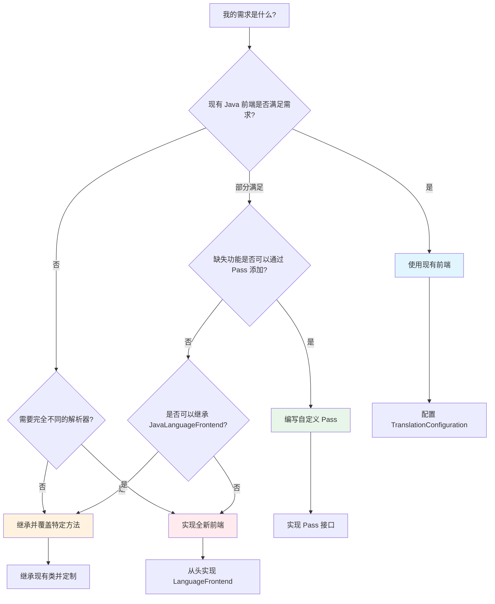

# 实现新 Java 前端的实用指南

本指南提供实用的、可操作的指导，帮助开发者基于 CPG 架构实现新的 Java 前端，或扩展和修复现有的 Java 前端。

## 目录
- [1. 快速决策树](#1-快速决策树)
- [2. 基础架构选择](#2-基础架构选择)
- [3. 最小可行前端实现](#3-最小可行前端实现)
- [4. 完整前端实现检查清单](#4-完整前端实现检查清单)
- [5. 扩展现有前端](#5-扩展现有前端)
- [6. 常见问题和修复模式](#6-常见问题和修复模式)
- [7. 测试策略](#7-测试策略)
- [8. 性能优化建议](#8-性能优化建议)

---

## 1. 快速决策树

### 1.1 我应该创建新前端还是扩展现有前端?



### 1.2 决策建议

| 场景 | 推荐方案 | 复杂度 | 参考 |
|------|---------|-------|------|
| **仅需要基础 Java 支持** | 直接使用现有前端 | ★☆☆☆☆ | README.md:41-56 |
| **需要特定语义增强**（如污点分析） | 编写自定义 Pass | ★★☆☆☆ | JavaExtraPass.kt |
| **需要不同的 Java 方言**（如 Android Java） | 继承 JavaLanguageFrontend | ★★★☆☆ | 本指南 3.3 节 |
| **需要完全不同的 AST**（如字节码） | 实现新的前端模块 | ★★★★☆ | 本指南 3.1 节 |
| **需要支持新的语言** | 实现全新前端 | ★★★★★ | Language 接口文档 |

---

## 2. 基础架构选择

### 2.1 选择解析器

#### 选项 A: JavaParser（推荐用于 Java 源码）

**优势**：
- ✅ 宽容式解析，能处理不完整代码
- ✅ 支持 Java 8-17+ 语法
- ✅ 内置符号解析器
- ✅ 活跃维护，文档完善
- ✅ 现有 CPG Java 前端已集成

**劣势**：
- ❌ 只支持源码，不支持字节码
- ❌ 符号解析需要类路径配置

**使用场景**：
- 分析 Java 源代码项目
- 需要处理不完整或有错误的代码
- 需要快速原型开发

**依赖添加** (build.gradle.kts):
```kotlin
dependencies {
    implementation("com.github.javaparser:javaparser-symbol-solver-core:3.24.2")
}
```

#### 选项 B: Eclipse JDT (Java Development Tools)

**优势**：
- ✅ Eclipse 官方编译器
- ✅ 支持增量编译
- ✅ 强大的类型推断
- ✅ 支持最新 Java 特性

**劣势**：
- ❌ API 较复杂
- ❌ 需要完整的编译环境
- ❌ 对不完整代码的容错性较差

**使用场景**：
- 需要编译级别的精确性
- 项目代码完整且可编译
- 需要增量分析

#### 选项 C: ASM（用于字节码）

**优势**：
- ✅ 直接分析字节码
- ✅ 高性能
- ✅ 不需要源码

**劣势**：
- ❌ 丢失源码级别的语义（变量名、注释等）
- ❌ 需要重构逻辑（如控制流恢复）

**使用场景**：
- 分析编译后的 .jar 文件
- 性能关键场景
- 二进制安全分析

**参考**: CPG 项目中的 `cpg-language-jvm` 模块使用 ASM

### 2.2 选择 CPG 集成模式

#### 模式 1: 独立模块（推荐）

**结构**：
```
cpg-language-myjava/
├── build.gradle.kts
└── src/
    ├── main/kotlin/
    │   └── de/fraunhofer/aisec/cpg/
    │       ├── frontends/myjava/
    │       │   ├── MyJavaLanguageFrontend.kt
    │       │   ├── MyJavaLanguage.kt
    │       │   └── handlers/
    │       └── passes/
    └── test/kotlin/
```

**优势**：
- 清晰的边界
- 独立发布和版本控制
- 可选依赖

**build.gradle.kts**:
```kotlin
plugins {
    id("cpg.frontend-conventions")
}

dependencies {
    implementation(project(":cpg-core"))
    implementation("com.github.javaparser:javaparser-symbol-solver-core:3.24.2")
}
```

**settings.gradle.kts** (添加模块):
```kotlin
include(":cpg-language-myjava")
```

#### 模式 2: 继承现有前端

**适用场景**：
- 只需要小的定制
- 重用大部分现有逻辑

**示例**：
```kotlin
// MyJavaLanguageFrontend.kt
package de.fraunhofer.aisec.cpg.frontends.myjava

import de.fraunhofer.aisec.cpg.frontends.java.*

@RegisterExtraPass(MyCustomPass::class)
open class MyJavaLanguageFrontend(
    ctx: TranslationContext,
    language: Language<MyJavaLanguageFrontend>
) : JavaLanguageFrontend(ctx, language) {

    // 覆盖特定方法
    override fun parse(file: File): TranslationUnitDeclaration {
        // 预处理文件
        val preprocessedFile = preprocessFile(file)
        // 调用父类方法
        return super.parse(preprocessedFile)
    }

    private fun preprocessFile(file: File): File {
        // 自定义预处理逻辑
        return file
    }
}
```

---

## 3. 最小可行前端实现

本节描述实现一个能够工作的最小 Java 前端需要的步骤。

### 3.1 步骤 1: 定义语言类

**文件**: `src/main/kotlin/de/fraunhofer/aisec/cpg/frontends/myjava/MyJavaLanguage.kt`

```kotlin
package de.fraunhofer.aisec.cpg.frontends.myjava

import de.fraunhofer.aisec.cpg.frontends.Language
import de.fraunhofer.aisec.cpg.frontends.LanguageFrontend
import de.fraunhofer.aisec.cpg.frontends.java.JavaLanguageFrontend
import kotlin.reflect.KClass

/**
 * 最小的 Java 语言定义
 */
open class MyJavaLanguage : Language<MyJavaLanguageFrontend>() {
    // 1. 文件扩展名（必需）
    override val fileExtensions = listOf("java")

    // 2. 命名空间分隔符（必需）
    override val namespaceDelimiter = "."

    // 3. 前端类引用（必需）
    override val frontend: KClass<out MyJavaLanguageFrontend> = MyJavaLanguageFrontend::class

    // 4. 内置类型（最小集合）
    override val builtInTypes = mapOf(
        "void" to IncompleteType(),
        "int" to IntegerType("int", 32, this, NumericType.Modifier.SIGNED),
        "boolean" to BooleanType("boolean", language = this),
    )
}
```

**最小需求检查清单**：
- [x] `fileExtensions`: 至少一个文件扩展名
- [x] `namespaceDelimiter`: 包/命名空间分隔符
- [x] `frontend`: 前端类的引用
- [x] `builtInTypes`: 至少包含 void 和基本类型

**可选但推荐的特性接口**：
```kotlin
open class MyJavaLanguage :
    Language<MyJavaLanguageFrontend>(),
    HasClasses,              // 支持类
    HasSuperClasses,         // 支持继承
    HasFunctionOverloading   // 支持重载
{
    // ...
}
```

### 3.2 步骤 2: 实现前端类

**文件**: `src/main/kotlin/de/fraunhofer/aisec/cpg/frontends/myjava/MyJavaLanguageFrontend.kt`

```kotlin
package de.fraunhofer.aisec.cpg.frontends.myjava

import de.fraunhofer.aisec.cpg.TranslationContext
import de.fraunhofer.aisec.cpg.frontends.Language
import de.fraunhofer.aisec.cpg.frontends.LanguageFrontend
import de.fraunhofer.aisec.cpg.graph.declarations.TranslationUnitDeclaration
import java.io.File

/**
 * 最小的 Java 前端实现
 */
open class MyJavaLanguageFrontend(
    ctx: TranslationContext,
    language: Language<MyJavaLanguageFrontend>
) : LanguageFrontend<Any, Any>(ctx, language) {

    /**
     * 解析单个 Java 文件并返回 CPG 的 TranslationUnitDeclaration
     */
    override fun parse(file: File): TranslationUnitDeclaration {
        // 1. 创建翻译单元根节点
        val tud = newTranslationUnitDeclaration(file.absolutePath)

        // 2. TODO: 实际的解析逻辑
        //    - 使用 JavaParser 或其他解析器
        //    - 调用 Handler 转换 AST 到 CPG
        //    - 填充 tud 的 declarations

        // 3. 返回 CPG 根节点
        return tud
    }

    /**
     * 类型解析（最小实现）
     */
    override fun typeOf(type: Any): de.fraunhofer.aisec.cpg.graph.types.Type {
        // 基础类型解析
        return when (type.toString()) {
            "int" -> primitiveType("int")
            "boolean" -> primitiveType("boolean")
            "void" -> incompleteType()
            else -> objectType(type.toString())
        }
    }
}
```

**最小需求检查清单**：
- [x] 继承 `LanguageFrontend<NodeType, TypeType>`
- [x] 实现 `parse(file: File): TranslationUnitDeclaration`
- [x] 实现 `typeOf(type: TypeType): Type`
- [x] 创建 `TranslationUnitDeclaration` 根节点

### 3.3 步骤 3: 注册前端

**方式 A: 自动注册（使用 ServiceLoader）**

**文件**: `src/main/resources/META-INF/services/de.fraunhofer.aisec.cpg.frontends.Language`

```text
de.fraunhofer.aisec.cpg.frontends.myjava.MyJavaLanguage
```

**方式 B: 手动注册**

```kotlin
val config = TranslationConfiguration.builder()
    .registerLanguage<MyJavaLanguage>()
    .sourceLocations(File("path/to/source"))
    .build()

val analyzer = TranslationManager.builder().config(config).build()
val result = analyzer.analyze().get()
```

### 3.4 步骤 4: 测试最小前端

**文件**: `src/test/kotlin/de/fraunhofer/aisec/cpg/frontends/myjava/MyJavaLanguageFrontendTest.kt`

```kotlin
package de.fraunhofer.aisec.cpg.frontends.myjava

import de.fraunhofer.aisec.cpg.testcases.GraphExamples
import org.junit.jupiter.api.Test
import java.io.File
import kotlin.test.assertNotNull

class MyJavaLanguageFrontendTest {

    @Test
    fun testMinimalParsing() {
        // 创建测试文件
        val testFile = File.createTempFile("Test", ".java")
        testFile.writeText("""
            public class Test {
                public static void main(String[] args) {
                    System.out.println("Hello");
                }
            }
        """.trimIndent())

        // 配置
        val config = TranslationConfiguration.builder()
            .registerLanguage<MyJavaLanguage>()
            .sourceLocations(testFile)
            .build()

        // 分析
        val result = GraphExamples.getTranslationResult(config)

        // 验证
        assertNotNull(result)
        assert(result.components.isNotEmpty())

        testFile.delete()
    }
}
```

**运行测试**：
```bash
./gradlew :cpg-language-myjava:test
```

---

## 4. 完整前端实现检查清单

### 4.1 语言定义完整性

**文件**: `MyJavaLanguage.kt`

#### 必需特性
- [ ] 文件扩展名 (`fileExtensions`)
- [ ] 命名空间分隔符 (`namespaceDelimiter`)
- [ ] 前端类引用 (`frontend`)
- [ ] 内置类型 (`builtInTypes`)

#### 推荐特性
- [ ] 基本类型：`int`, `long`, `float`, `double`, `boolean`, `byte`, `short`, `char`
- [ ] 包装类型：`Integer`, `Long`, `Boolean` 等（包含 FQN）
- [ ] 特殊类型：`void`, `String`
- [ ] 运算符定义：算术、逻辑、比较、赋值运算符

#### 语言特性接口
- [ ] `HasClasses` - 如果支持类
- [ ] `HasSuperClasses` - 如果支持继承
- [ ] `HasGenerics` - 如果支持泛型
- [ ] `HasFunctionOverloading` - 如果支持方法重载
- [ ] `HasQualifier` - 如果支持限定符（如 `public`, `private`）
- [ ] `HasImplicitReceiver` - 如果支持隐式 `this`
- [ ] `HasShortCircuitOperators` - 如果支持 `&&`, `||`

**完整示例** (参考 JavaLanguage.kt:44-104):
```kotlin
open class CompleteJavaLanguage :
    Language<CompleteJavaLanguageFrontend>(),
    HasClasses,
    HasSuperClasses,
    HasGenerics,
    HasQualifier,
    HasUnknownType,
    HasShortCircuitOperators,
    HasFunctionOverloading,
    HasImplicitReceiver {

    override val fileExtensions = listOf("java")
    override val namespaceDelimiter = "."
    override val frontend = CompleteJavaLanguageFrontend::class
    override val superClassKeyword = "super"

    override val builtInTypes = mapOf(
        // 基本类型
        "void" to IncompleteType(),
        "boolean" to BooleanType("boolean", language = this),
        "byte" to IntegerType("byte", 8, this, NumericType.Modifier.SIGNED),
        "short" to IntegerType("short", 16, this, NumericType.Modifier.SIGNED),
        "int" to IntegerType("int", 32, this, NumericType.Modifier.SIGNED),
        "long" to IntegerType("long", 64, this, NumericType.Modifier.SIGNED),
        "float" to FloatingPointType("float", 32, this, NumericType.Modifier.SIGNED),
        "double" to FloatingPointType("double", 64, this, NumericType.Modifier.SIGNED),
        "char" to IntegerType("char", 16, this, NumericType.Modifier.UNSIGNED),

        // 包装类型（使用 FQN）
        "java.lang.Boolean" to ObjectType("Boolean", listOf(), false, this),
        "java.lang.Byte" to ObjectType("Byte", listOf(), false, this),
        "java.lang.Short" to ObjectType("Short", listOf(), false, this),
        "java.lang.Integer" to ObjectType("Integer", listOf(), false, this),
        "java.lang.Long" to ObjectType("Long", listOf(), false, this),
        "java.lang.Float" to ObjectType("Float", listOf(), false, this),
        "java.lang.Double" to ObjectType("Double", listOf(), false, this),
        "java.lang.Character" to ObjectType("Character", listOf(), false, this),
        "java.lang.String" to ObjectType("String", listOf(), false, this),
    )

    override val compoundAssignmentOperators = setOf("+=", "-=", "*=", "/=", "%=", "&=", "|=", "^=", "<<=", ">>=", ">>>=")
}
```

### 4.2 前端核心功能

**文件**: `MyJavaLanguageFrontend.kt`

#### 初始化
- [ ] 配置解析器（如 JavaParser）
- [ ] 初始化符号解析器
- [ ] 初始化 Handler（如果使用 Handler 模式）

#### 解析流程
- [ ] 实现 `parse(file: File): TranslationUnitDeclaration`
- [ ] 处理解析错误（宽容式解析）
- [ ] 创建 `TranslationUnitDeclaration` 根节点
- [ ] 处理包声明 -> `NamespaceDeclaration`
- [ ] 处理 import 语句
- [ ] 处理类型声明

#### 类型解析
- [ ] 实现 `typeOf(type: ParserType): CPGType`
- [ ] 支持基本类型
- [ ] 支持类和接口类型
- [ ] 支持数组类型
- [ ] 支持泛型类型（如果适用）
- [ ] 错误恢复（类型解析失败时）

#### 作用域管理
- [ ] 进入/离开命名空间作用域
- [ ] 进入/离开类作用域
- [ ] 进入/离开方法作用域
- [ ] 注册声明到 `ScopeManager`

### 4.3 Handler 实现（如果使用 Handler 模式）

#### DeclarationHandler
- [ ] 类/接口声明
  - [ ] 处理类名和 FQN
  - [ ] 处理父类和接口
  - [ ] 处理泛型类型参数
  - [ ] 处理类成员
- [ ] 方法声明
  - [ ] 处理方法名和签名
  - [ ] 创建方法接收者（this）
  - [ ] 处理参数
  - [ ] 处理返回类型
  - [ ] 处理方法体
- [ ] 构造函数
  - [ ] 处理参数
  - [ ] 处理构造函数体
  - [ ] 生成默认构造函数（如果需要）
- [ ] 字段声明
  - [ ] 处理字段类型
  - [ ] 处理修饰符
  - [ ] 处理初始化表达式
- [ ] 枚举声明
  - [ ] 处理枚举常量
  - [ ] 处理枚举成员

#### StatementHandler
- [ ] 控制流语句
  - [ ] if-else
  - [ ] while/do-while
  - [ ] for/for-each
  - [ ] switch
- [ ] 异常处理
  - [ ] try-catch-finally
  - [ ] throw
- [ ] 跳转语句
  - [ ] return
  - [ ] break
  - [ ] continue
- [ ] 其他
  - [ ] 代码块
  - [ ] 表达式语句
  - [ ] 同步块（synchronized）

#### ExpressionHandler
- [ ] 调用表达式
  - [ ] 方法调用
  - [ ] 构造函数调用（new）
  - [ ] 静态调用
- [ ] 成员访问
  - [ ] 字段访问
  - [ ] 数组访问
- [ ] 运算符
  - [ ] 二元运算符（+, -, *, /, ==, !=, <, >, &&, || 等）
  - [ ] 一元运算符（!, -, ++, -- 等）
  - [ ] 赋值运算符（=, +=, -= 等）
- [ ] 字面量
  - [ ] 整数、浮点数、字符串、布尔值、null
- [ ] 其他
  - [ ] Lambda 表达式
  - [ ] 类字面量（ClassName.class）
  - [ ] instanceof
  - [ ] 类型转换
  - [ ] 条件表达式（?:）

### 4.4 Pass 实现

#### Java 特定 Pass
- [ ] ImportResolver - 解析 import 语句
- [ ] ExternalTypeHierarchyResolver - 解析外部类型层次
- [ ] 其他语言特定的增强

**Pass 实现模板**:
```kotlin
package de.fraunhofer.aisec.cpg.passes

@DependsOn(TypeResolver::class)  // 依赖关系
@ExecuteBefore(SymbolResolver::class)  // 执行顺序
@RequiredFrontend(MyJavaLanguageFrontend::class)  // 前端限制
class MyCustomPass(ctx: TranslationContext) : ComponentPass(ctx) {

    override fun accept(component: Component) {
        // 遍历 CPG 并进行处理
        for (tu in component.translationUnits) {
            processTranslationUnit(tu)
        }
    }

    private fun processTranslationUnit(tu: TranslationUnitDeclaration) {
        // 实现自定义逻辑
    }

    override fun cleanup() {
        // 清理资源（如果需要）
    }
}
```

**注册 Pass** (在前端类上使用注解):
```kotlin
@RegisterExtraPass(MyCustomPass::class)
open class MyJavaLanguageFrontend(
    ctx: TranslationContext,
    language: Language<MyJavaLanguageFrontend>
) : LanguageFrontend<Any, Any>(ctx, language)
```

---

## 5. 扩展现有前端

### 5.1 添加新的语法支持

**场景**: Java 添加了新的语法特性，需要在前端中支持。

**示例**: 支持 Java 14 的 Record 类型

**步骤**：

1. **更新 JavaParser 版本** (如果需要):
```kotlin
// build.gradle.kts
dependencies {
    implementation("com.github.javaparser:javaparser-symbol-solver-core:3.25.0")
}
```

2. **在 DeclarationHandler 中添加处理方法**:
```kotlin
// DeclarationHandler.kt
fun handleRecordDeclaration(recordDecl: RecordDeclaration): RecordDeclaration {
    val fqn = recordDecl.fullyQualifiedName.orElse(recordDecl.nameAsString)

    // 创建 RecordDeclaration（复用现有类型）
    val declaration = newRecordDeclaration(fqn, "record", rawNode = recordDecl)

    frontend.scopeManager.enterScope(declaration)

    // 处理 Record 的组件（类似于字段）
    for (param in recordDecl.parameters) {
        val fieldDecl = newFieldDeclaration(
            param.nameAsString,
            frontend.typeOf(param.type),
            listOf("public", "final"),
            null,
            rawNode = param
        )
        declaration.fields += fieldDecl
        frontend.scopeManager.addDeclaration(fieldDecl)
    }

    // 自动生成构造函数
    val constructor = newConstructorDeclaration(fqn, declaration)
    for (param in recordDecl.parameters) {
        val paramDecl = newParameterDeclaration(
            param.nameAsString,
            frontend.typeOf(param.type),
            false,
            rawNode = param
        )
        constructor.parameters += paramDecl
    }
    declaration.constructors += constructor

    // 处理 Record 的成员方法
    processRecordMembers(recordDecl, declaration)

    frontend.scopeManager.leaveScope(declaration)
    return declaration
}
```

3. **在 Handler 映射中注册**:
```kotlin
// DeclarationHandler.kt (在 handle() 方法中)
when (bodyDecl) {
    is RecordDeclaration -> handleRecordDeclaration(bodyDecl)
    // ... 其他类型
}
```

4. **添加测试**:
```kotlin
@Test
fun testRecordDeclaration() {
    val file = File("Test.java")
    file.writeText("""
        record Point(int x, int y) {
            public double distance() {
                return Math.sqrt(x*x + y*y);
            }
        }
    """.trimIndent())

    val result = analyze(file)
    val record = result.records.firstOrNull { it.name.localName == "Point" }

    assertNotNull(record)
    assertEquals(2, record.fields.size)
    assertEquals(1, record.constructors.size)
    assertEquals(1, record.methods.size)
}
```

### 5.2 添加自定义语义分析

**场景**: 需要分析特定的代码模式，如安全漏洞检测。

**示例**: 检测 SQL 注入风险

**步骤**：

1. **创建自定义 Pass**:
```kotlin
package com.example.cpg.passes

@DependsOn(SymbolResolver::class)
@DependsOn(DFGPass::class)
class SqlInjectionDetectionPass(ctx: TranslationContext) : ComponentPass(ctx) {

    private val vulnerabilities = mutableListOf<CallExpression>()

    override fun accept(component: Component) {
        val walker = SubgraphWalker.ScopedWalker(ctx.scopeManager)

        walker.registerHandler { node ->
            when (node) {
                is CallExpression -> checkSqlInjection(node)
            }
        }

        for (tu in component.translationUnits) {
            walker.iterate(tu)
        }

        // 报告结果
        if (vulnerabilities.isNotEmpty()) {
            log.warn("Found ${vulnerabilities.size} potential SQL injection vulnerabilities")
            vulnerabilities.forEach { call ->
                log.warn("  - ${call.location}: ${call.name}")
            }
        }
    }

    private fun checkSqlInjection(call: CallExpression) {
        // 检查是否是 SQL 执行方法
        if (!isSqlExecutionMethod(call)) return

        // 检查参数是否受污染
        for (arg in call.arguments) {
            if (isTainted(arg)) {
                vulnerabilities.add(call)
                break
            }
        }
    }

    private fun isSqlExecutionMethod(call: CallExpression): Boolean {
        // 简单的模式匹配
        return call.name.localName in setOf(
            "executeQuery", "executeUpdate", "execute",
            "createQuery", "createNativeQuery"
        )
    }

    private fun isTainted(expr: Expression): Boolean {
        // 检查数据流
        // 如果表达式的数据来自用户输入（如参数、HTTP 请求），则认为受污染
        val sources = expr.prevDFG.toList()

        return sources.any { source ->
            source is ParameterDeclaration ||
            (source is CallExpression && source.name.localName in setOf("getParameter", "getHeader"))
        }
    }

    override fun cleanup() {
        vulnerabilities.clear()
    }
}
```

2. **注册 Pass**:

**方式 A**: 在前端类上注册
```kotlin
@RegisterExtraPass(SqlInjectionDetectionPass::class)
class MyJavaLanguageFrontend(...)
```

**方式 B**: 在配置中注册
```kotlin
val config = TranslationConfiguration.builder()
    .registerLanguage<JavaLanguage>()
    .registerPass<SqlInjectionDetectionPass>()
    .sourceLocations(...)
    .build()
```

### 5.3 定制类型推断

**场景**: 增强类型推断能力，如支持 `var` 的类型推断。

**步骤**：

1. **覆盖或扩展 `getTypeAsGoodAsPossible` 方法**:
```kotlin
class EnhancedJavaLanguageFrontend(
    ctx: TranslationContext,
    language: Language<EnhancedJavaLanguageFrontend>
) : JavaLanguageFrontend(ctx, language) {

    override fun getTypeAsGoodAsPossible(
        nodeWithType: NodeWithType<Node, Type>,
        resolved: ResolvedValueDeclaration
    ): de.fraunhofer.aisec.cpg.graph.types.Type {
        val typeString = nodeWithType.typeAsString

        // 处理 var 关键字（Java 10+）
        if (typeString == "var") {
            return inferTypeFromInitializer(nodeWithType)
        }

        // 调用父类方法
        return super.getTypeAsGoodAsPossible(nodeWithType, resolved)
    }

    private fun inferTypeFromInitializer(
        nodeWithType: NodeWithType<Node, Type>
    ): de.fraunhofer.aisec.cpg.graph.types.Type {
        // 查找初始化表达式
        if (nodeWithType is VariableDeclarator) {
            val initializer = nodeWithType.initializer.orElse(null)
            if (initializer != null) {
                try {
                    val resolvedType = initializer.calculateResolvedType()
                    return typeOf(resolvedType)
                } catch (e: Exception) {
                    log.warn("Could not infer type for var declaration", e)
                }
            }
        }

        // 回退到未知类型
        return unknownType()
    }
}
```

---

## 6. 常见问题和修复模式

### 6.1 问题：无法解析类型

**症状**：
- 日志显示 "Could not resolve type X"
- CPG 中出现 `UnknownType` 或 `ProblemExpression`

**常见原因**：
1. 类路径配置不正确
2. 缺少依赖的库
3. 使用了编译器内部类

**修复模式 1**: 配置符号解析器的源根目录
```kotlin
// JavaLanguageFrontend.kt:544-562
init {
    val reflectionTypeSolver = ReflectionTypeSolver()
    nativeTypeResolver.add(reflectionTypeSolver)

    // 确保 root 指向正确的源码根目录
    var root = ctx.currentComponent?.topLevel()

    if (root != null) {
        log.info("Source file root used for type solver: {}", root)
        val javaParserTypeSolver = JavaParserTypeSolver(root)
        nativeTypeResolver.add(javaParserTypeSolver)
    }
}
```

**修复模式 2**: 添加 JAR 类型解析器
```kotlin
// 添加外部依赖的 JAR 文件
val jarTypeSolver = JarTypeSolver("path/to/dependency.jar")
nativeTypeResolver.add(jarTypeSolver)
```

**修复模式 3**: 实现错误恢复
```kotlin
// JavaLanguageFrontend.kt:242-268
fun getTypeAsGoodAsPossible(...): Type {
    return try {
        typeOf(resolved.type)
    } catch (ex: UnsolvedSymbolException) {
        // 尝试从异常信息中恢复类型名
        val typeName = recoverTypeFromUnsolvedException(ex)
        if (typeName != null) {
            objectType(typeName).apply { typeOrigin = Type.Origin.GUESSED }
        } else {
            unknownType()
        }
    }
}
```

### 6.2 问题：符号解析失败

**症状**：
- 变量引用无法连接到声明
- `Reference.refersTo` 为 null

**常见原因**：
1. 作用域管理错误（未进入/离开作用域）
2. 声明未注册到 ScopeManager
3. 引用和声明的名称不匹配

**修复模式 1**: 检查作用域管理
```kotlin
fun handleMethodDeclaration(methodDecl: MethodDeclaration): MethodDeclaration {
    val declaration = newMethodDeclaration(...)

    // ✅ 正确：进入作用域
    scopeManager.enterScope(declaration)

    // 处理方法体...
    for (param in methodDecl.parameters) {
        val paramDecl = newParameterDeclaration(...)
        // ✅ 正确：注册声明
        scopeManager.addDeclaration(paramDecl)
    }

    // ✅ 正确：离开作用域
    scopeManager.leaveScope(declaration)

    return declaration
}
```

**修复模式 2**: 使用 ScopeManager 的调试功能
```kotlin
// 打印当前作用域栈
log.debug("Current scope stack: ${scopeManager.currentScope}")

// 查找声明
val decl = scopeManager.resolveReference(reference)
if (decl == null) {
    log.warn("Could not resolve reference ${reference.name} in scope ${scopeManager.currentScope}")
}
```

### 6.3 问题：方法调用解析失败

**症状**：
- `CallExpression.invokes` 为空
- 无法建立调用图

**常见原因**：
1. 方法签名不匹配（参数类型）
2. 静态/实例方法识别错误
3. 重载方法解析失败

**修复模式 1**: 正确识别静态调用
```kotlin
// ExpressionHandler.kt:453-542
private fun handleMethodCallExpression(expr: Expression): CallExpression {
    var isStatic = false

    // 尝试解析方法
    try {
        val resolved = methodCallExpr.resolve()
        isStatic = resolved.isStatic
    } catch (ignored: Exception) {
        // 解析失败，尝试其他方式
    }

    // 检查静态导入
    if (getQualifiedNameFromImports(qualifiedName) != null) {
        isStatic = true
    }

    // 检查 base 是否是类型引用
    val base = handle(scope)
    if (base is Reference && base.refersTo is RecordDeclaration) {
        isStatic = true
    }

    // 创建正确类型的调用
    val callExpression = newMemberCallExpression(member, isStatic, ...)
    return callExpression
}
```

**修复模式 2**: 记录调用信息用于调试
```kotlin
// 在 CallResolver pass 运行后
val unresolvedCalls = result.calls.filter { it.invokes.isEmpty() }
if (unresolvedCalls.isNotEmpty()) {
    log.warn("Found ${unresolvedCalls.size} unresolved calls:")
    unresolvedCalls.forEach { call ->
        log.warn("  - ${call.location}: ${call.fqn} with ${call.arguments.size} arguments")
        call.arguments.forEachIndexed { i, arg ->
            log.warn("      arg[$i]: ${arg.type}")
        }
    }
}
```

### 6.4 问题：数据流分析不准确

**症状**：
- DFG 边缺失或错误
- 污点分析结果不正确

**常见原因**：
1. EOG 构建不正确
2. 赋值表达式的 LHS/RHS 顺序错误
3. 隐式数据流未建模（如字段访问）

**修复模式**: 确保正确的表达式顺序
```kotlin
// ExpressionHandler.kt:82-120
fun handleAssignmentExpression(expr: Expression): AssignExpression {
    val assignment = newAssignExpression(operator, ..., rawNode = expr)

    // ✅ 正确：按照求值顺序添加
    // 1. 先求值右边（RHS）
    assignment.rhs += handle(assignExpr.value)

    // 2. 再求值左边（LHS）
    assignment.lhs += handle(assignExpr.target)

    return assignment
}
```

### 6.5 问题：内存占用过高

**症状**：
- 分析大型项目时 OOM
- 堆内存不断增长

**常见原因**：
1. 保留了过多的 JavaParser AST 引用
2. Pass 中累积了大量临时数据
3. 符号解析器缓存过大

**修复模式 1**: 及时清理 Pass 数据
```kotlin
class MyPass(ctx: TranslationContext) : ComponentPass(ctx) {
    private val tempData = mutableListOf<Node>()

    override fun accept(component: Component) {
        // 处理...
        tempData.add(...)
    }

    override fun cleanup() {
        // ✅ 正确：清理临时数据
        tempData.clear()
    }
}
```

**修复模式 2**: 不保留原始 AST
```kotlin
override fun parse(file: File): TranslationUnitDeclaration {
    val context = parser.parse(file)

    // 处理并转换为 CPG
    val tud = processCompilationUnit(context)

    // ✅ 正确：不在 CPG 节点中保留完整的 JavaParser AST
    // 只保留位置信息
    // context = null  // 让 GC 回收

    return tud
}
```

**修复模式 3**: 增加 JVM 堆内存
```bash
# gradle.properties
org.gradle.jvmargs=-Xmx8g -Xms2g
```

---

## 7. 测试策略

### 7.1 单元测试结构

**推荐目录结构**:
```
src/test/
├── kotlin/
│   └── de/fraunhofer/aisec/cpg/frontends/myjava/
│       ├── MyJavaLanguageFrontendTest.kt
│       ├── DeclarationHandlerTest.kt
│       ├── StatementHandlerTest.kt
│       ├── ExpressionHandlerTest.kt
│       └── passes/
│           └── MyCustomPassTest.kt
└── resources/
    └── fixtures/
        ├── simple/
        │   ├── HelloWorld.java
        │   └── Calculator.java
        ├── declarations/
        │   ├── ClassDeclaration.java
        │   ├── MethodDeclaration.java
        │   └── FieldDeclaration.java
        └── statements/
            ├── IfStatement.java
            ├── ForLoop.java
            └── TryCatch.java
```

### 7.2 测试模板

**基本测试模板**:
```kotlin
class MyJavaLanguageFrontendTest {

    @Test
    fun testBasicClass() {
        // 1. 准备测试代码
        val code = """
            package com.example;

            public class Example {
                private int field;

                public int getField() {
                    return field;
                }
            }
        """.trimIndent()

        // 2. 配置并分析
        val result = analyze(code)

        // 3. 获取 CPG 节点
        val exampleClass = result.records.firstOrNull { it.name.localName == "Example" }

        // 4. 断言
        assertNotNull(exampleClass)
        assertEquals(1, exampleClass.fields.size)
        assertEquals(1, exampleClass.methods.size)

        val field = exampleClass.fields.first()
        assertEquals("field", field.name.localName)
        assertEquals("int", field.type.name.toString())

        val method = exampleClass.methods.first()
        assertEquals("getField", method.name.localName)
        assertEquals("int", method.returnTypes.first().name.toString())
    }

    // 辅助方法
    private fun analyze(code: String, filename: String = "Test.java"): TranslationResult {
        val file = File.createTempFile(filename.substringBeforeLast("."), ".java")
        file.writeText(code)

        val config = TranslationConfiguration.builder()
            .registerLanguage<MyJavaLanguage>()
            .sourceLocations(file)
            .defaultPasses()
            .build()

        val result = GraphExamples.getTranslationResult(config)
        file.delete()
        return result
    }
}
```

### 7.3 测试检查清单

#### 声明测试
- [ ] 简单类声明
- [ ] 带继承的类声明
- [ ] 接口声明
- [ ] 枚举声明
- [ ] 嵌套类
- [ ] 方法声明（实例、静态、抽象）
- [ ] 构造函数（默认、带参数、重载）
- [ ] 字段声明（实例、静态、final）
- [ ] 泛型类和方法

#### 语句测试
- [ ] if-else
- [ ] for 循环（传统和 for-each）
- [ ] while/do-while
- [ ] switch
- [ ] try-catch-finally
- [ ] throw
- [ ] return
- [ ] break/continue

#### 表达式测试
- [ ] 方法调用（实例、静态、链式）
- [ ] 字段访问
- [ ] 数组访问
- [ ] 对象创建
- [ ] Lambda 表达式
- [ ] 运算符（算术、逻辑、比较、赋值）
- [ ] 字面量

#### 符号解析测试
- [ ] 变量引用解析
- [ ] 方法调用解析
- [ ] 类型引用解析
- [ ] 跨作用域引用

#### 数据流测试
- [ ] 简单赋值
- [ ] 方法调用参数传递
- [ ] 方法返回值
- [ ] 字段访问

### 7.4 集成测试

**测试真实项目**:
```kotlin
@Test
fun testRealWorldProject() {
    val projectPath = Path.of("path/to/java/project")

    val config = TranslationConfiguration.builder()
        .registerLanguage<MyJavaLanguage>()
        .sourceLocations(projectPath.toFile())
        .build()

    val result = TranslationManager.builder()
        .config(config)
        .build()
        .analyze()
        .get()

    // 统计信息
    println("Translation units: ${result.components.flatMap { it.translationUnits }.size}")
    println("Records: ${result.records.size}")
    println("Methods: ${result.methods.size}")
    println("Calls: ${result.calls.size}")

    // 验证关键指标
    assert(result.components.isNotEmpty())
    assert(result.records.isNotEmpty())

    // 检查未解析的调用
    val unresolvedCalls = result.calls.filter { it.invokes.isEmpty() }
    val unresolvedRatio = unresolvedCalls.size.toDouble() / result.calls.size
    assert(unresolvedRatio < 0.1) { "Too many unresolved calls: ${unresolvedRatio * 100}%" }
}
```

---

## 8. 性能优化建议

### 8.1 解析优化

**技巧 1**: 并行解析多个文件
```kotlin
val config = TranslationConfiguration.builder()
    .useParallelFrontends(true)  // 启用并行解析
    .build()
```

**技巧 2**: 跳过不需要的 Pass
```kotlin
val config = TranslationConfiguration.builder()
    .registerPass<TypeResolver>()
    .registerPass<SymbolResolver>()
    // 不注册 DFG, EOG pass（如果不需要数据流分析）
    .build()
```

**技巧 3**: 限制符号解析器的搜索范围
```kotlin
// 只解析项目源码，不解析 JDK 类
val javaParserTypeSolver = JavaParserTypeSolver(root)
nativeTypeResolver.add(javaParserTypeSolver)
// 不添加 ReflectionTypeSolver
```

### 8.2 内存优化

**技巧 1**: 不保留原始 AST
```kotlin
// 在 CPG 节点中不使用 rawNode 参数（用于调试）
val declaration = newMethodDeclaration(name, isStatic, record, rawNode = null)
```

**技巧 2**: 使用流式处理
```kotlin
// 边解析边处理，不累积所有结果
fun processProject(projectPath: Path) {
    Files.walk(projectPath)
        .filter { it.extension == "java" }
        .forEach { file ->
            val tud = parse(file.toFile())
            processTu(tud)
            // tud 可以被 GC 回收
        }
}
```

### 8.3 缓存策略

**技巧 1**: 缓存类型解析结果
```kotlin
private val typeCache = mutableMapOf<String, Type>()

fun resolveType(typeName: String): Type {
    return typeCache.getOrPut(typeName) {
        // 昂贵的类型解析操作
        actuallyResolveType(typeName)
    }
}
```

**技巧 2**: 增量分析（高级）
```kotlin
// 只重新分析修改过的文件
val changedFiles = getChangedFilesSinceLastAnalysis()
val config = TranslationConfiguration.builder()
    .sourceLocations(*changedFiles.toTypedArray())
    .build()
```

---

## 总结

本指南提供了实现和扩展 Java 前端的全面指导，从最小可行实现到完整功能的检查清单，再到常见问题的修复模式。

**关键要点**：
1. **最小实现** 只需要 Language 类和 parse() 方法即可工作
2. **渐进扩展** 可以逐步添加功能，不需要一次实现所有特性
3. **重用现有组件** 尽可能继承和复用现有的 Handler 和 Pass
4. **测试驱动** 为每个新功能编写测试，确保正确性
5. **性能意识** 注意内存使用和解析性能，使用合适的优化策略

**下一步**：
- 阅读 CPG 核心 API 文档
- 研究其他语言前端的实现（如 CXX, Python, Go）
- 参与 CPG 社区讨论
