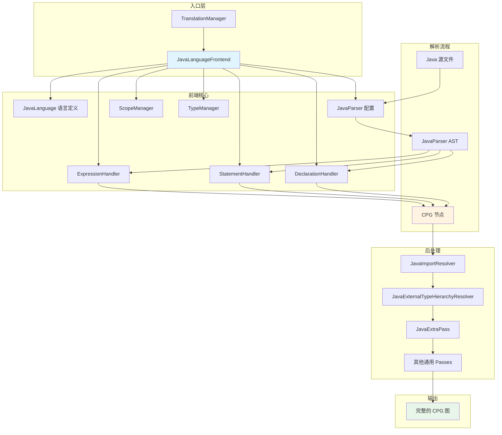
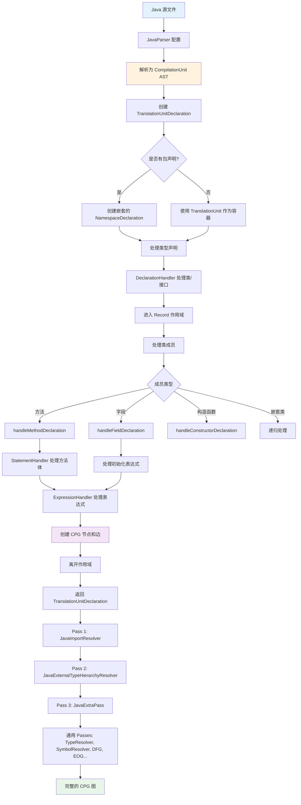
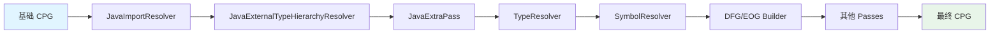

# Java 前端架构概览

## 目录
- [1. 项目背景](#1-项目背景)
- [2. Java 前端模块结构](#2-java-前端模块结构)
- [3. 核心架构组件](#3-核心架构组件)
- [4. CPG 生成流水线](#4-cpg-生成流水线)
- [5. 关键设计决策](#5-关键设计决策)
- [6. 术语表](#6-术语表)

---

## 1. 项目背景

### 1.1 什么是 CPG？

**CPG (Code Property Graph，代码属性图)** 是一种源代码的图形化表示方式，采用有向多重图的形式。在这个图中：
- **节点（Node）** 代表代码元素（如类、方法、变量、语句等）
- **边（Edge）** 代表元素之间的关系（如调用关系、数据流、控制流等）
- **属性（Property）** 是附加在节点和边上的键值对

CPG 使得源代码可以被存储在图数据库中（如 Neo4j），并通过图查询语言（如 Cypher）进行搜索和分析。

### 1.2 Fraunhofer AISEC CPG 项目

本项目是由 **Fraunhofer AISEC** 开发的多语言代码分析库，位于：
- **仓库**: https://github.com/Fraunhofer-AISEC/cpg
- **许可证**: Apache License 2.0
- **构建系统**: Gradle 多模块项目

**项目特点**：
- 支持多种编程语言：Java、C/C++、Python、Go、TypeScript、LLVM IR 等
- 使用宽容式解析器（forgiving parser），能够处理不完整或语法错误的代码
- 模块化设计，每种语言都有独立的前端模块
- 核心图结构由 `cpg-core` 模块提供，语言前端基于此构建

**引用来源**: `/home/user/cpg/README.md`:1-11

```markdown
# Code Property Graph
A simple library to extract a *code property graph* out of source code.
It has support for multiple passes that can extend the analysis after the graph is constructed.
It currently supports C/C++ (C17), Java (Java 13) and has experimental support for
Golang, Python and TypeScript.
```

---

## 2. Java 前端模块结构

### 2.1 模块位置

Java 语言前端位于独立的 Gradle 子模块中：
- **模块目录**: `/home/user/cpg/cpg-language-java/`
- **模块名称**: `cpg-language-java`
- **发布名称**: `de.fraunhofer.aisec:cpg-language-java`

### 2.2 依赖关系

**构建配置** (`cpg-language-java/build.gradle.kts`:35):
```kotlin
dependencies {
    implementation(libs.javaparser)
}
```

**核心依赖**：
1. **cpg-core**: 提供基础的 CPG 节点类型、边类型和通用 passes
2. **JavaParser**: 第三方 Java 解析库 (https://javaparser.org/)，用于将 Java 源代码解析为 AST

**为什么选择 JavaParser？**
- 宽容式解析：能够处理不完整或有语法错误的代码
- 支持 Java 13 及更高版本
- 提供符号解析功能，能够解析类型、方法签名等
- 成熟稳定，社区活跃

### 2.3 文件组织

```
cpg-language-java/
├── build.gradle.kts                   # Gradle 构建脚本
└── src/
    ├── main/kotlin/de/fraunhofer/aisec/cpg/
    │   ├── frontends/java/
    │   │   ├── JavaLanguageFrontend.kt      # 主前端类 (563 行)
    │   │   ├── JavaLanguage.kt              # 语言定义 (150 行)
    │   │   ├── DeclarationHandler.kt        # 声明处理器 (517 行)
    │   │   ├── StatementHandler.kt          # 语句处理器 (619 行)
    │   │   ├── ExpressionHandler.kt         # 表达式处理器 (689 行)
    │   │   └── JavaCallResolverHelper.kt    # 调用解析辅助类
    │   └── passes/
    │       ├── JavaImportResolver.kt                      # Import 解析 pass
    │       ├── JavaExternalTypeHierarchyResolver.kt       # 外部类型层次解析
    │       └── JavaExtraPass.kt                           # 额外的 Java 特定处理
    └── test/kotlin/                          # 测试代码
```

---

## 3. 核心架构组件

### 3.1 架构总览



### 3.2 主要组件详解

#### 3.2.1 JavaLanguageFrontend

**文件**: `cpg-language-java/src/main/kotlin/de/fraunhofer/aisec/cpg/frontends/java/JavaLanguageFrontend.kt`

**职责**：
- 作为 Java 前端的入口点和协调器
- 初始化 JavaParser 和符号解析器
- 管理三个 Handler 的生命周期
- 处理类型解析和错误恢复

**类定义** (JavaLanguageFrontend.kt:84-85):
```kotlin
@RegisterExtraPass(JavaExternalTypeHierarchyResolver::class)
@RegisterExtraPass(JavaImportResolver::class)
@RegisterExtraPass(JavaExtraPass::class)
open class JavaLanguageFrontend(ctx: TranslationContext, language: Language<JavaLanguageFrontend>) :
    LanguageFrontend<Node, Type>(ctx, language)
```

**初始化** (JavaLanguageFrontend.kt:95-103):
```kotlin
init {
    setupHandlers()
}

private fun setupHandlers() {
    expressionHandler = ExpressionHandler(this)
    statementHandler = StatementHandler(this)
    declarationHandler = DeclarationHandler(this)
}
```

#### 3.2.2 JavaLanguage

**文件**: `cpg-language-java/src/main/kotlin/de/fraunhofer/aisec/cpg/frontends/java/JavaLanguage.kt`

**职责**：
- 定义 Java 语言的元数据
- 声明语言特性（如支持类、泛型、重载等）
- 定义内置类型和运算符

**语言特性声明** (JavaLanguage.kt:44-56):
```kotlin
open class JavaLanguage :
    Language<JavaLanguageFrontend>(),
    HasClasses,              // 支持类
    HasSuperClasses,         // 支持继承
    HasGenerics,             // 支持泛型
    HasQualifier,            // 支持限定符
    HasUnknownType,          // 支持未知类型
    HasShortCircuitOperators,// 支持短路运算符
    HasFunctionOverloading,  // 支持函数重载
    HasImplicitReceiver {    // 支持隐式 this
    override val fileExtensions = listOf("java")
    override val namespaceDelimiter = "."
    override val frontend: KClass<out JavaLanguageFrontend> = JavaLanguageFrontend::class
    override val superClassKeyword = "super"
```

#### 3.2.3 Handler 三剑客

##### DeclarationHandler
**职责**: 处理类、接口、方法、字段、构造函数等声明

**主要方法**：
- `handleClassOrInterfaceDeclaration()`: 处理类/接口声明
- `handleMethodDeclaration()`: 处理方法声明
- `handleConstructorDeclaration()`: 处理构造函数
- `handleFieldDeclaration()`: 处理字段声明
- `handleEnumDeclaration()`: 处理枚举声明

##### StatementHandler
**职责**: 处理各种语句（控制流、循环、异常处理等）

**主要方法**：
- `handleIfStatement()`: if 语句
- `handleForStatement()` / `handleForEachStatement()`: 循环语句
- `handleWhileStatement()` / `handleDoStatement()`: while 循环
- `handleTryStatement()`: try-catch-finally
- `handleSwitchStatement()`: switch 语句
- `handleBlockStatement()`: 代码块

##### ExpressionHandler
**职责**: 处理表达式（方法调用、字段访问、运算符等）

**主要方法**：
- `handleMethodCallExpression()`: 方法调用
- `handleObjectCreationExpr()`: 对象创建（new）
- `handleFieldAccessExpression()`: 字段访问
- `handleLambdaExpr()`: Lambda 表达式
- `handleBinaryExpression()` / `handleUnaryExpression()`: 运算符
- `handleArrayCreationExpr()`: 数组创建

#### 3.2.4 ScopeManager 和 TypeManager

**ScopeManager**：
- 管理作用域栈（scope stack）
- 负责声明的注册和查找
- 提供当前作用域上下文（当前类、当前命名空间等）

**常用方法**：
```kotlin
scopeManager.enterScope(declaration)    // 进入新作用域
scopeManager.addDeclaration(decl)       // 注册声明
scopeManager.leaveScope(declaration)    // 离开作用域
scopeManager.currentRecord              // 当前类/接口
scopeManager.currentNamespace           // 当前包
```

**TypeManager**：
- 管理类型解析和类型映射
- 处理泛型类型参数
- 维护已解析类型的缓存

---

## 4. CPG 生成流水线

### 4.1 完整流水线图



### 4.2 分阶段详解

#### 阶段 1: 解析和初始化

**输入**: Java 源文件 (.java)

**步骤** (JavaLanguageFrontend.kt:106-123):
```kotlin
// 1. 配置 JavaParser
val parserConfiguration = ParserConfiguration()
parserConfiguration.setSymbolResolver(javaSymbolResolver)
val parser = JavaParser(parserConfiguration)

// 2. 解析源文件为 AST
context = parse(file, parser)  // context 是 CompilationUnit
context?.setData(Node.SYMBOL_RESOLVER_KEY, javaSymbolResolver)

// 3. 创建 CPG 根节点
val tud = newTranslationUnitDeclaration(file.toString(), rawNode = context)
```

**输出**:
- JavaParser 的 `CompilationUnit` AST
- CPG 的 `TranslationUnitDeclaration` 根节点

#### 阶段 2: 包和命名空间处理

**目的**: 将 Java 的包声明（如 `package com.example.project`）转换为嵌套的 `NamespaceDeclaration` 节点。

**代码** (JavaLanguageFrontend.kt:125-141):
```kotlin
val packDecl = context?.packageDeclaration?.orElse(null)

// 创建嵌套的命名空间
// 例如 "com.example.project" -> NamespaceDeclaration("com")
//                               -> NamespaceDeclaration("com.example")
//                               -> NamespaceDeclaration("com.example.project")
val holder =
    packDecl?.name?.toString()?.split(language.namespaceDelimiter)?.fold(null) {
        previous: NamespaceDeclaration?,
        path ->
        var fqn = previous?.name.fqn(path)

        val nsd = newNamespaceDeclaration(fqn, rawNode = packDecl)
        scopeManager.addDeclaration(nsd)
        val holder = previous ?: tud
        holder.addDeclaration(nsd)

        scopeManager.enterScope(nsd)
        nsd
    } ?: tud
```

**CPG 结构示例**：
```
TranslationUnitDeclaration (Example.java)
└── NamespaceDeclaration (com)
    └── NamespaceDeclaration (com.example)
        └── NamespaceDeclaration (com.example.project)
            └── RecordDeclaration (MyClass)
```

#### 阶段 3: 类型声明处理

**代码** (JavaLanguageFrontend.kt:145-153):
```kotlin
for (type in context?.types ?: listOf()) {
    val declaration = declarationHandler.handle(type)
    if (declaration != null) {
        scopeManager.addDeclaration(declaration)
        holder.addDeclaration(declaration)
    }
}
```

**处理的类型**：
- 普通类 (class)
- 接口 (interface)
- 枚举 (enum)
- 注解 (annotation)

#### 阶段 4: 成员处理

**方法声明示例** (DeclarationHandler.kt:105-158):

```kotlin
fun handleMethodDeclaration(methodDecl: MethodDeclaration): MethodDeclaration {
    // 1. 创建方法节点
    val functionDeclaration = newMethodDeclaration(
        resolvedMethod.name,
        methodDecl.isStatic,
        currentRecordDecl,
        rawNode = methodDecl
    )

    // 2. 进入方法作用域
    scopeManager.enterScope(functionDeclaration)

    // 3. 创建 this 参数（方法接收者）
    createMethodReceiver(currentRecordDecl, functionDeclaration)

    // 4. 处理方法参数
    for (parameter in methodDecl.parameters) {
        val param = newParameterDeclaration(
            parameter.nameAsString,
            resolvedType,
            parameter.isVarArgs,
            rawNode = parameter
        )
        scopeManager.addDeclaration(param)
        functionDeclaration.parameters += param
    }

    // 5. 解析返回类型
    functionDeclaration.returnTypes = listOf(getReturnTypeAsGoodAsPossible(...))

    // 6. 处理方法体
    functionDeclaration.body = statementHandler.handle(body)

    // 7. 离开作用域
    scopeManager.leaveScope(functionDeclaration)

    return functionDeclaration
}
```

#### 阶段 5: 后处理 Passes

**Pass 执行顺序**：



**各 Pass 的作用**：

1. **JavaImportResolver** (JavaImportResolver.kt:57-67)
   - 解析 import 语句，建立导入声明和实际声明之间的映射
   - 处理静态导入（static import）
   - 处理通配符导入（import java.util.*）

2. **JavaExternalTypeHierarchyResolver** (JavaExternalTypeHierarchyResolver.kt:49-97)
   - 解析外部类的继承层次（如 JDK 中的类）
   - 使用 JavaParser 的 `ReflectionTypeSolver` 解析系统类
   - 填充 `superTypes` 列表

3. **JavaExtraPass** (JavaExtraPass.kt:55-88)
   - 处理静态字段访问的转换
   - 将 `ClassName.staticField` 从 `MemberExpression` 转换为 `Reference`

4. **通用 Passes** (由 cpg-core 提供)
   - `TypeResolver`: 解析类型引用
   - `SymbolResolver`: 解析变量和方法引用
   - `DFGPass`: 构建数据流图（Data Flow Graph）
   - `EOGPass`: 构建求值顺序图（Evaluation Order Graph）
   - `CallResolver`: 解析方法调用目标

---

## 5. 关键设计决策

### 5.1 为什么使用 Handler 模式？

**问题**: Java 有数十种语法结构（语句、表达式、声明），如何组织代码？

**解决方案**: 将处理逻辑按语法类别分为三个 Handler：
- **DeclarationHandler**: 处理所有声明（类、方法、字段等）
- **StatementHandler**: 处理所有语句（if, for, while, try 等）
- **ExpressionHandler**: 处理所有表达式（调用、访问、运算等）

**优势**：
1. **职责分离**: 每个 Handler 只关注一类语法结构
2. **易于扩展**: 添加新的语法支持只需在对应 Handler 中添加方法
3. **代码组织清晰**: 每个 Handler 文件 500-700 行，便于维护

**示例** (StatementHandler.kt:552-570):
```kotlin
init {
    // 建立 JavaParser AST 类型到处理方法的映射
    map[IfStmt::class.java] = HandlerInterface { handleIfStatement(it) }
    map[WhileStmt::class.java] = HandlerInterface { handleWhileStatement(it) }
    map[ForStmt::class.java] = HandlerInterface { handleForStatement(it) }
    map[TryStmt::class.java] = HandlerInterface { handleTryStatement(it) }
    // ... 更多映射
}
```

### 5.2 为什么需要 ScopeManager？

**问题**: 如何正确解析嵌套作用域中的变量和方法引用？

**示例代码**：
```java
class Outer {
    int x = 10;  // 字段

    void method() {
        int x = 20;  // 局部变量（遮蔽字段）
        System.out.println(x);  // 应该引用哪个 x？
    }
}
```

**解决方案**: ScopeManager 维护作用域栈，每进入一个新的作用域（类、方法、代码块）就入栈，离开时出栈。查找声明时从栈顶开始向下搜索。

**作用域层次**：
```
GlobalScope
└── NamespaceScope (com.example)
    └── RecordScope (MyClass)
        └── MethodScope (myMethod)
            └── BlockScope (if 语句块)
```

### 5.3 为什么需要多个 Passes？

**问题**: 为什么不在解析时一次性完成所有分析？

**原因**：
1. **依赖关系**: 某些分析依赖于其他分析的结果
   - 符号解析依赖于类型解析
   - 调用解析依赖于符号解析和类型层次

2. **性能优化**: 可以选择性执行 pass
   - 简单分析可能不需要 DFG
   - 不同应用场景需要不同的 pass 组合

3. **模块化**: 每个 pass 可以独立开发和测试

**Pass 依赖关系** (通过注解声明):
```kotlin
@DependsOn(TypeHierarchyResolver::class)
@ExecuteBefore(JavaImportResolver::class)
@RequiredFrontend(JavaLanguageFrontend::class)
class JavaExternalTypeHierarchyResolver(ctx: TranslationContext) : ComponentPass(ctx)
```

### 5.4 宽容式解析的优势

**传统编译器**: 遇到语法错误立即停止，报告错误

**CPG 的宽容式解析**:
- 尽可能解析有效的部分
- 对无法解析的部分创建 `ProblemExpression` 或 `ProblemDeclaration` 节点
- 继续处理文件的其余部分

**应用场景**：
1. IDE 中的代码分析（代码可能不完整）
2. 分析大型代码库时，部分文件可能有错误
3. 增量分析时，只关注特定代码片段

**错误恢复示例** (JavaLanguageFrontend.kt:242-268):
```kotlin
fun getTypeAsGoodAsPossible(
    nodeWithType: NodeWithType<N, T>,
    resolved: ResolvedValueDeclaration,
): Type {
    return try {
        // 尝试解析类型
        typeOf(resolved.type)
    } catch (ex: RuntimeException) {
        // 解析失败，尝试从 import 推断
        getTypeFromImportIfPossible(nodeWithType.type)
    } catch (ex: NoClassDefFoundError) {
        // 类找不到，尝试从 import 推断
        getTypeFromImportIfPossible(nodeWithType.type)
    }
}
```

---

## 6. 术语表

| 英文术语 | 中文释义 | 说明 |
|---------|---------|------|
| **CPG** | 代码属性图 | Code Property Graph，用图结构表示代码 |
| **AST** | 抽象语法树 | Abstract Syntax Tree，编译器前端的中间表示 |
| **Frontend** | 前端 | 将特定语言的源代码转换为 CPG 的组件 |
| **Pass** | 遍历/增强处理 | 对 CPG 进行额外分析和增强的处理阶段 |
| **Node** | 节点 | CPG 图中的顶点，代表代码元素 |
| **Edge** | 边 | CPG 图中的有向边，代表元素间的关系 |
| **DFG** | 数据流图 | Data Flow Graph，表示数据如何在程序中流动 |
| **EOG** | 求值顺序图 | Evaluation Order Graph，表示语句的执行顺序 |
| **TranslationUnit** | 翻译单元 | 表示一个源文件的顶层 CPG 节点 |
| **RecordDeclaration** | 记录声明 | CPG 中表示类、接口、结构体的节点 |
| **MethodDeclaration** | 方法声明 | CPG 中表示方法/函数的节点 |
| **CallExpression** | 调用表达式 | 表示方法/函数调用的节点 |
| **ScopeManager** | 作用域管理器 | 管理嵌套作用域和声明查找的组件 |
| **TypeManager** | 类型管理器 | 管理类型解析和类型参数的组件 |
| **Handler** | 处理器 | 负责将 AST 节点转换为 CPG 节点的类 |
| **Symbol Resolution** | 符号解析 | 将引用（如变量名）关联到其声明的过程 |
| **Type Resolution** | 类型解析 | 确定表达式和声明的类型的过程 |
| **Overlay** | 覆盖层/增强层 | 在基础 CPG 上添加额外信息的层 |
| **FQN** | 全限定名 | Fully Qualified Name，如 `java.lang.String` |
| **Forgiving Parser** | 宽容式解析器 | 能够处理不完整或有错误代码的解析器 |

---

## 总结

Java 前端采用**模块化、分层的架构设计**：

1. **入口层**: `JavaLanguageFrontend` 协调整个解析过程
2. **解析层**: 使用 `JavaParser` 将源代码转为 AST
3. **转换层**: 三个 Handler 将 AST 转换为 CPG 节点
4. **管理层**: `ScopeManager` 和 `TypeManager` 提供上下文信息
5. **增强层**: 多个 Pass 逐步丰富 CPG 的语义信息

这种设计使得 Java 前端既能**准确表示 Java 语言的各种特性**（泛型、继承、重载等），又具有**良好的扩展性和可维护性**。

**下一步阅读**：
- `1.impl-trace.md`: 详细的实现代码跟踪，包含完整的文件路径和行号引用
- `1.new-frontend-guide.md`: 如何基于此架构实现新的语言前端
