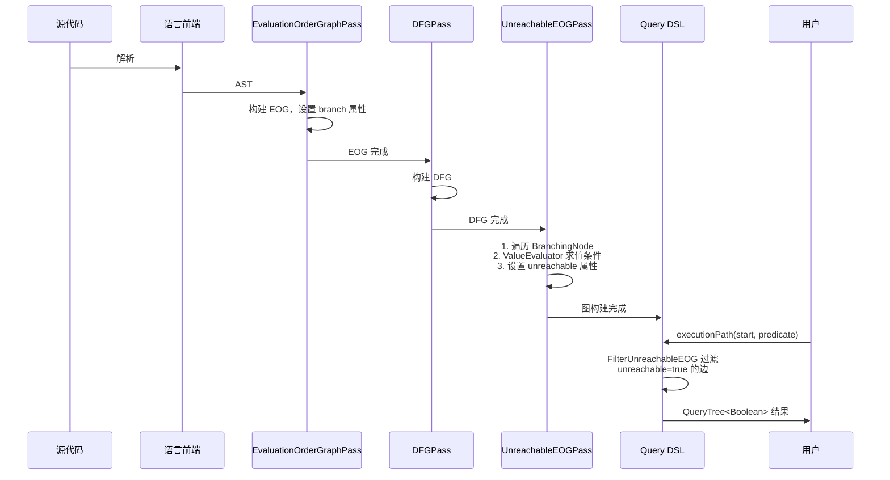
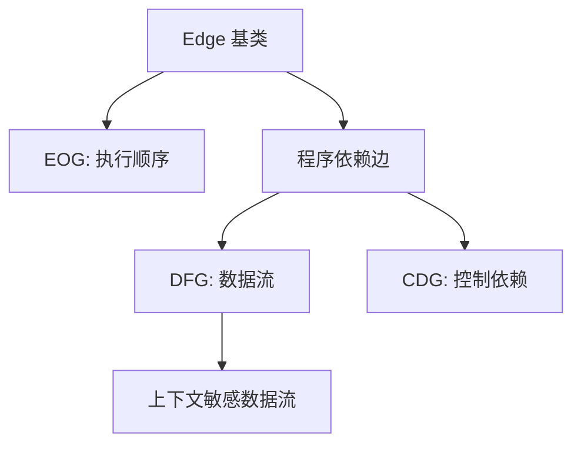
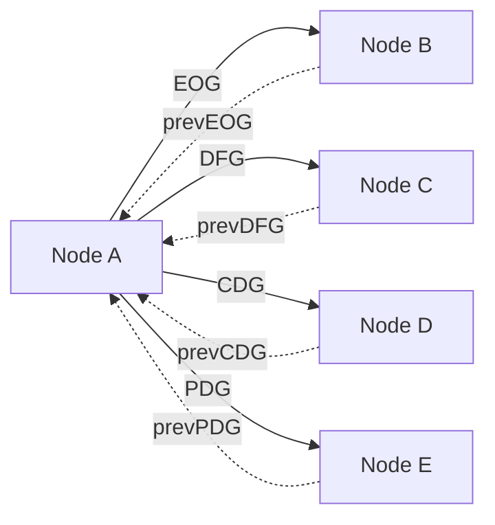

# CPG 核心分析基础设施：图结构与查询 DSL 的协同设计

## 1. 概述

本文档全面分析 CPG（Code Property Graph）核心分析基础设施，将**图结构**与**查询 DSL** 作为同级别且不可或缺的两大组成部分进行深入剖析。CPG 的分析能力来源于这两者的紧密协同：

- **图结构层**：定义节点、边、属性，构建代码的静态表示（AST/EOG/DFG/CDG/PDG）
- **查询 DSL 层**：提供 Kotlin DSL 接口，实现路径遍历、条件判断、结果聚合等动态分析能力

两者通过 **Sensitivity 系统**和 **AnalysisDirection 配置**深度耦合，共同支撑常量求值、分支剪枝、可达性分析等高级功能。

所有结论均基于代码实证，提供文件路径和行号支持。

---

## 2. 核心图结构：代码的多维度表示

### 2.1 基础节点模型 (Node.kt)

**文件位置**: `/home/dai/code/cpg/cpg-core/src/main/kotlin/de/fraunhofer/aisec/cpg/graph/Node.kt`

#### 2.1.1 节点基类定义 (行 66-73)

```kotlin
abstract class Node() :
    IVisitable,
    Persistable,
    LanguageProvider,
    ScopeProvider,
    HasNameAndLocation,
    HasScope,
    HasAssumptions
```

**设计理念**: Node 是所有 CPG 节点的基类，实现多个接口以支持访问者模式、持久化、语言信息、作用域管理、位置追踪、假设管理等功能。

#### 2.1.2 核心边集合属性

**1. 执行顺序边 EOG (Evaluation Order Graph)** (行 110-154)

```kotlin
// 控制流入边：从哪些节点可以到达当前节点
prevEOGEdges: EvaluationOrders<Node>
// 控制流出边：从当前节点可以到达哪些节点
nextEOGEdges: EvaluationOrders<Node>

// 虚拟属性简化访问（返回边的 start/end 节点）
val prevEOG: List<Node>
val nextEOG: List<Node>
```

**用途**: 表示程序执行顺序，支持控制流分析。

**2. 数据流边 DFG (Data Flow Graph)** (行 156-200)

```kotlin
// 数据流入边：数据从哪里流向当前节点
prevDFGEdges: Dataflows<Node>
// 数据流出边：数据从当前节点流向哪里
nextDFGEdges: Dataflows<Node>
```

**用途**: 追踪数据依赖，支持污点分析、值传播分析。

**3. 控制依赖边 CDG (Control Dependence Graph)** (行 124-146)

```kotlin
prevCDGEdges: ControlDependences<Node>
nextCDGEdges: ControlDependences<Node>
```

**用途**: 表示控制依赖关系，支持切片分析。

**4. 程序依赖边 PDG (Program Dependence Graph)** (行 202-218)

```kotlin
prevPDGEdges: ProgramDependences<Node>
nextPDGEdges: ProgramDependences<Node>
```

**用途**: 结合数据流和控制依赖，支持更复杂的依赖分析。

#### 2.1.3 元数据属性 (行 76-108, 228-236)

```kotlin
// 基础信息
name: Name                      // 完整名称
code: String?                   // 原始代码片段
location: PhysicalLocation?     // 源码位置
language: Language<*>           // 所属语言
scope: Scope?                   // 作用域

// 节点状态
isInferred: Boolean             // 是否为推断节点（不直接对应源码）
isImplicit: Boolean             // 是否为隐式节点（如隐式 return）
```

---

### 2.2 EOG 边的详细结构：支持不可达性标记

**文件位置**: `/home/dai/code/cpg/cpg-core/src/main/kotlin/de/fraunhofer/aisec/cpg/graph/edges/flows/EvaluationOrder.kt`

```kotlin
// 行 42-56
@RelationshipEntity
class EvaluationOrder(
    start: Node,
    end: Node,
    /**
     * True, if the edge flows into unreachable code e.g. a branch condition which is always false.
     */
    var unreachable: Boolean = false,

    /**
     * If we have multiple EOG edges the branch property indicates which EOG edge leads to true
     * branch (expression evaluated to true) or the false branch (e.g. with an if/else condition).
     * Otherwise, this property is null.
     */
    var branch: Boolean? = null,
) : Edge<Node>(start, end)
```

**关键属性分析**:

1. **unreachable 属性** (行 48):
   - **类型**: `Boolean`
   - **默认值**: `false`
   - **用途**: 标记流向不可达代码的边（如条件永远为 false 的分支）
   - **重要性**: 这是实现常量求值+分支剪枝的核心属性！

2. **branch 属性** (行 54):
   - **类型**: `Boolean?`
   - **取值**:
     - `true` - 条件为真的分支（then 分支、loop body）
     - `false` - 条件为假的分支（else 分支、loop exit）
     - `null` - 非分支边（顺序执行）
   - **用途**: 区分分支方向，支持路径敏感分析

**设计意义**: CPG 在图结构层面已经预留了不可达性标记机制，为常量求值与分支剪枝提供了基础支持。

---

### 2.3 DFG 边的详细结构：支持粒度与上下文

**文件位置**: `/home/dai/code/cpg/cpg-core/src/main/kotlin/de/fraunhofer/aisec/cpg/graph/edges/flows/Dataflow.kt`

```kotlin
// 行 148-170
@RelationshipEntity
open class Dataflow(
    start: Node,
    end: Node,
    /** The granularity of this dataflow. */
    @Convert(DataflowGranularityConverter::class)
    @JsonIgnore
    var granularity: Granularity = default(),
) : ProgramDependence(start, end, DependenceType.DATA)
```

**粒度类型** (行 48-142):

1. **FullDataflowGranularity** (行 54): 整个对象流动（粗粒度）
2. **FieldDataflowGranularity** (行 80): 字段级别的部分流动
3. **IndexedDataflowGranularity** (行 88): 数组/元组索引级别
4. **StringIndexedDataflowGranularity** (行 98): 字符串索引（如 Map）

**上下文敏感数据流** (行 189-209):

```kotlin
class ContextSensitiveDataflow(
    start: Node,
    end: Node,
    granularity: Granularity = default(),
    val callingContext: CallingContext,
) : Dataflow(start, end, granularity)
```

**调用上下文类型**:
- `CallingContextIn`: 数据流入函数调用
- `CallingContextOut`: 数据流出函数调用

**设计意义**: 支持字段敏感、上下文敏感的精确数据流分析，为 Query DSL 提供细粒度控制能力。

---

### 2.4 分支节点接口与实现

#### 2.4.1 BranchingNode 接口

**文件位置**: `/home/dai/code/cpg/cpg-core/src/main/kotlin/de/fraunhofer/aisec/cpg/graph/BranchingNode.kt`

```kotlin
// 行 28-32
/** A node triggering a conditional execution of other code. */
interface BranchingNode {
    /** The node which affects the next EOG edge. Typically, this is a condition or similar. */
    val branchedBy: AstNode?
}
```

**设计**: 简洁的接口，`branchedBy` 属性指向影响分支的条件节点，供分析工具（如 UnreachableEOGPass）使用。

#### 2.4.2 IfStatement 实现

**文件位置**: `/home/dai/code/cpg/cpg-core/src/main/kotlin/de/fraunhofer/aisec/cpg/graph/statements/IfStatement.kt`

```kotlin
// 行 42
class IfStatement : Statement(), BranchingNode, ArgumentHolder

// 行 53-55: 条件表达式
@Relationship(value = "CONDITION") var conditionEdge = astOptionalEdgeOf<Expression>()
var condition by unwrapping(IfStatement::conditionEdge)

// 行 57-58: 分支判定依据
override val branchedBy
    get() = condition ?: conditionDeclaration

// 行 63-65: then 分支
@Relationship(value = "THEN_STATEMENT") var thenStatementEdge = astOptionalEdgeOf<Statement>()
var thenStatement by unwrapping(IfStatement::thenStatementEdge)

// 行 67-71: else 分支
@Relationship(value = "ELSE_STATEMENT") var elseStatementEdge = astOptionalEdgeOf<Statement>()
var elseStatement by unwrapping(IfStatement::elseStatementEdge)
```

**特性**:
- 支持 C++ `constexpr if` (行 61: `isConstExpression`)
- 支持 C++ 初始化语句 (行 44-46: `initializerStatement`)
- 支持条件声明 (行 48-51: `conditionDeclaration`)

#### 2.4.3 WhileStatement 实现

**文件位置**: `/home/dai/code/cpg/cpg-core/src/main/kotlin/de/fraunhofer/aisec/cpg/graph/statements/WhileStatement.kt`

```kotlin
// 行 44
class WhileStatement : LoopStatement(), BranchingNode, ArgumentHolder

// 行 50-52: 条件
@Relationship(value = "CONDITION") var conditionEdge = astOptionalEdgeOf<Expression>()
var condition by unwrapping(WhileStatement::conditionEdge)

// 行 54-55: 分支判定
override val branchedBy
    get() = condition ?: conditionDeclaration
```

#### 2.4.4 ConditionalExpression 实现 (三目运算符)

**文件位置**: `/home/dai/code/cpg/cpg-core/src/main/kotlin/de/fraunhofer/aisec/cpg/graph/statements/expressions/ConditionalExpression.kt`

```kotlin
// 行 43
class ConditionalExpression : Expression(), ArgumentHolder, BranchingNode, HasType.TypeObserver

// 行 44-47: 条件
@Relationship("CONDITION")
var conditionEdge = astEdgeOf<Expression>(ProblemExpression("could not parse condition expression"))
var condition by unwrapping(ConditionalExpression::conditionEdge)

// 行 49-57: then 表达式
@Relationship("THEN_EXPRESSION")
var thenExpressionEdge = astOptionalEdgeOf<Expression>(...)
var thenExpression by unwrapping(ConditionalExpression::thenExpressionEdge)

// 行 59-67: else 表达式
@Relationship("ELSE_EXPRESSION")
var elseExpressionEdge = astOptionalEdgeOf<Expression>(...)
var elseExpression by unwrapping(ConditionalExpression::elseExpressionEdge)

// 行 78-79: 分支判定
override val branchedBy
    get() = condition
```

**类型推断** (行 111-129): 实现了 `TypeObserver`，根据两个分支的类型推断结果类型。

---

### 2.5 图构建 Pass：从 AST 到多维图

#### 2.5.1 EOG 构建 Pass

**文件位置**: `/home/dai/code/cpg/cpg-core/src/main/kotlin/de/fraunhofer/aisec/cpg/passes/EvaluationOrderGraphPass.kt`

**Pass 职责** (行 48-88):

```kotlin
/**
 * Creates an Evaluation Order Graph (EOG) based on the CPG's version of the AST.
 * An EOG is an intra-procedural directed graph whose vertices are executable AST nodes
 * and edges connect them in the order they would be executed when running the program.
 */
open class EvaluationOrderGraphPass(ctx: TranslationContext) : TranslationUnitPass(ctx)
```

**核心状态** (行 92-93):
- `currentPredecessors: MutableList<Node>` - 当前 EOG 出口节点列表
- `nextEdgeBranch: Boolean?` - 下一条边的分支标签（true/false/null）

**IfStatement 的 EOG 处理** (行 1197-1216):

```kotlin
protected fun handleIfStatement(node: IfStatement) {
    val openBranchNodes = mutableListOf<Node>()
    // 1. 处理初始化语句和条件声明
    handleEOG(node.initializerStatement)
    handleEOG(node.conditionDeclaration)
    // 2. 处理条件表达式
    handleEOG(node.condition)
    // 3. 将 IfStatement 节点自身添加到 EOG
    attachToEOG(node) // To have semantic information after the condition evaluation
    val openConditionEOGs = currentPredecessors.toMutableList()

    // 4. 处理 then 分支（标记为 true）
    nextEdgeBranch = true
    handleEOG(node.thenStatement)
    openBranchNodes.addAll(currentPredecessors)

    // 5. 处理 else 分支（标记为 false）
    if (node.elseStatement != null) {
        setCurrentEOGs(openConditionEOGs)
        nextEdgeBranch = false
        handleEOG(node.elseStatement)
        openBranchNodes.addAll(currentPredecessors)
    } else {
        openBranchNodes.addAll(openConditionEOGs)
    }
    // 6. 合并两个分支的出口
    setCurrentEOGs(openBranchNodes)
}
```

**关键流程**:
1. 先处理条件，将 `IfStatement` 节点附加到 EOG
2. 设置 `nextEdgeBranch = true`，然后处理 then 分支
3. 设置 `nextEdgeBranch = false`，然后处理 else 分支
4. 如果没有 else，则将条件出口也加入最终出口

**EOG 边的创建** (行 1026-1032):

```kotlin
protected fun addEOGEdge(prev: Node, next: Node): EvaluationOrder {
    val propertyEdge = EvaluationOrder(prev, next, unreachable = false)
    propertyEdge.branch = nextEdgeBranch  // <-- 分支标签在这里设置

    prev.nextEOGEdges += propertyEdge
    return propertyEdge
}
```

**重要**: 边的 `branch` 属性在创建时被设置，默认 `unreachable = false`，需要后续 Pass（如 UnreachableEOGPass）修改。

**WhileStatement 的 EOG 处理** (行 1258-1273):

```kotlin
protected fun handleWhileStatement(node: WhileStatement) {
    handleEOG(node.conditionDeclaration)
    handleEOG(node.condition)
    attachToEOG(node) // To have semantic information after the condition evaluation
    nextEdgeBranch = true
    val tmpEOGNodes = currentPredecessors.toMutableList()
    // 处理循环体
    handleEOG(node.statement)
    // 回连到循环开始
    connectCurrentEOGToLoopStart(node)

    // 循环退出（条件为 false）
    currentPredecessors.clear()
    currentPredecessors.addAll(tmpEOGNodes)
    nextEdgeBranch = false
    node.elseStatement?.let { handleEOG(it) }
    handleContainedBreaksAndContinues(node)
}
```

**循环特性**:
- 从循环体末尾回连到循环条件 (行 1265: `connectCurrentEOGToLoopStart`)
- true 分支进入循环体，false 分支退出循环
- 处理 break 和 continue 语句 (行 1272)

#### 2.5.2 DFG 构建 Pass

**文件位置**: `/home/dai/code/cpg/cpg-core/src/main/kotlin/de/fraunhofer/aisec/cpg/passes/DFGPass.kt`

**Pass 职责** (行 45-67):

```kotlin
/** Adds the DFG edges for various types of nodes. */
@DependsOn(SymbolResolver::class)
class DFGPass(ctx: TranslationContext) : ComponentPass(ctx)
```

**依赖关系**: 依赖于 `SymbolResolver`，因为需要知道引用指向哪个声明。

**IfStatement 的 DFG 处理** (行 347-353):

```kotlin
protected fun handleIfStatement(node: IfStatement) {
    Util.addDFGEdgesForMutuallyExclusiveBranchingExpression(
        node,
        node.condition,
        node.conditionDeclaration,
    )
}
```

**数据流**: 条件表达式到 IfStatement 节点的数据流，表示分支决策依赖于条件的值。

**ConditionalExpression 的 DFG 处理** (行 470-473):

```kotlin
protected fun handleConditionalExpression(node: ConditionalExpression) {
    node.thenExpression?.let { node.prevDFGEdges += it }
    node.elseExpression?.let { node.prevDFGEdges += it }
}
```

**数据流**: then 和 else 表达式都流向条件表达式（因为其值可能来自任一分支）。

**Reference 的 DFG 处理** (行 453-464):

```kotlin
protected fun handleReference(node: Reference) {
    node.refersTo?.let {
        when (node.access) {
            AccessValues.WRITE -> node.nextDFGEdges += it  // 写：流向声明
            AccessValues.READ -> node.prevDFGEdges += it   // 读：从声明流入
            else -> {
                node.nextDFGEdges += it  // 读写：双向流动
                node.prevDFGEdges += it
            }
        }
    }
}
```

**访问模式区分**:
- READ: 数据从声明流向引用
- WRITE: 数据从引用流向声明
- READWRITE: 双向流动

---

## 3. 查询 DSL 层：图遍历与分析的统一接口

### 3.1 QueryTree：路径追踪与结果聚合的核心

**文件位置**: `/home/dai/code/cpg/cpg-analysis/src/main/kotlin/de/fraunhofer/aisec/cpg/query/QueryTree.kt`

#### 3.1.1 QueryTree 设计理念 (行 35-87)

```kotlin
/**
 * Holds the [value] to which the statements have been evaluated. The [children] define previous
 * steps of the evaluation, thus building a tree of all steps of the evaluation recursively until we
 * reach the nodes of the CPG. This is necessary if we want to store all steps which are performed
 * when evaluating a query. It helps to make the reasoning of the query more understandable to the
 * user and gives an analyst the maximum of information available.
 */
open class QueryTree<T>(
    value: T,
    var children: List<QueryTree<*>> = emptyList(),
    var stringRepresentation: String = "",
    node: Node? = null,
    override var assumptions: MutableSet<Assumption> = mutableSetOf(),
    var suppressed: Boolean = false,
    val operator: QueryTreeOperators,
    val collectCallerInfo: Boolean = true,
) : Comparable<QueryTree<T>>, HasAssumptions
```

**核心设计**:
1. **value**: 查询求值的结果（可以是 Boolean、Node、List<Node> 等）
2. **children**: 子查询树列表，递归记录所有求值步骤
3. **stringRepresentation**: 可读的字符串表示，用于调试和报告
4. **node**: 关联的 CPG 节点，提供上下文信息
5. **operator**: 操作符类型（AND/OR/EQ/GT 等），标识如何组合子树
6. **assumptions**: 假设集合，记录分析过程中的推断和限制

**为什么需要 QueryTree?**
- **透明性**: 记录完整的求值路径，用户可以理解查询为什么返回特定结果
- **可调试性**: 通过 `printNicely()` 方法以树状结构展示求值过程
- **可追溯性**: 每个结果都关联到具体的 CPG 节点和代码位置
- **假设管理**: 追踪分析过程中的不确定性和假设

**printNicely 示例输出** (行 254-267):

```kotlin
fun printNicely(depth: Int = 0): String {
    var res =
        "  ".repeat(depth) +
            "$stringRepresentation (==> ${if (value is List<*>) (value as List<*>).joinToString("\n","[", "]") else value.toString()})\n" +
            "--------".repeat(depth + 1)
    if (children.isNotEmpty()) {
        res += "\n"
        children.forEach { c ->
            val next = c.printNicely(depth + 2)
            if (next.isNotEmpty()) res += next + "\n" + "--------".repeat(depth + 1) + "\n"
        }
    }
    return res
}
```

输出示例：
```
execution path from foo to bar fulfills the requirement (==> true)
--------
  [Node A, Node B, Node C, bar] (==> [Node A, Node B, Node C, bar])
  ----------------
```

#### 3.1.2 DSL 操作符：构建查询表达式

**文件位置**: `/home/dai/code/cpg/cpg-analysis/src/main/kotlin/de/fraunhofer/aisec/cpg/query/QueryTree.kt`

**操作符类型定义** (行 349-386):

```kotlin
sealed interface QueryTreeOperators

// 一元操作符
enum class UnaryOperators : QueryTreeOperators {
    NOT
}

// 二元操作符
enum class BinaryOperators : QueryTreeOperators {
    AND, OR, XOR, IMPLIES,
    EQ, NE, GT, GE, LT, LE,
    IS, IN,
}

// 通用查询操作符
enum class GenericQueryOperators : QueryTreeOperators {
    ALL,        // 所有路径满足（Must 分析）
    ANY,        // 至少一条路径满足（May 分析）
    EVALUATE,   // 简单求值
    SUPPRESS,   // 用户抑制（手动修正错误）
}
```

**布尔逻辑操作符实现** (行 472-609):

```kotlin
// AND 操作
infix fun QueryTree<Boolean>.and(other: QueryTree<Boolean>): BinaryOperationResult<Boolean, Boolean> {
    return BinaryOperationResult(
        value = this.value && other.value,
        lhs = this,
        rhs = other,
        stringRepresentation = "${this.value} && ${other.value}",
        operator = BinaryOperators.AND,
    )
}

// OR 操作
infix fun QueryTree<Boolean>.or(other: QueryTree<Boolean>): BinaryOperationResult<Boolean, Boolean> {
    return BinaryOperationResult(
        value = this.value || other.value,
        lhs = this,
        rhs = other,
        stringRepresentation = "${this.value} || ${other.value}",
        operator = BinaryOperators.OR,
    )
}

// IMPLIES 操作（逻辑蕴含）
infix fun QueryTree<Boolean>.implies(other: QueryTree<Boolean>): BinaryOperationResult<Boolean, Boolean> {
    return BinaryOperationResult(
        !this.value || other.value,
        lhs = this,
        rhs = other,
        stringRepresentation = "${this.value} => ${other.value}",
        operator = BinaryOperators.IMPLIES,
    )
}

// NOT 操作
fun not(arg: QueryTree<Boolean>): UnaryOperationResult<Boolean> {
    val result = !arg.value
    return UnaryOperationResult(
        value = result,
        input = arg,
        stringRepresentation = "! ${arg.value}",
        operator = UnaryOperators.NOT,
    )
}
```

**数值比较操作符实现** (行 622-781):

```kotlin
// GT (>)
infix fun <T : Number?, S : Number?> QueryTree<T>?.gt(other: QueryTree<S>?): BinaryOperationResult<T, S> {
    val result =
        this?.value?.let { thisV -> other?.value?.let { otherV -> thisV.compareTo(otherV) > 0 } }
            ?: false
    return BinaryOperationResult(
        result,
        lhs = this,
        rhs = other,
        "${this?.value} > ${other?.value}",
        operator = BinaryOperators.GT,
    )
}

// GE (>=), LT (<), LE (<=) 类似实现
```

**相等性与成员关系操作符** (行 437-467):

```kotlin
// EQ (==)
infix fun <T, S> T.eq(other: S): BinaryOperationResult<T, S> {
    val thisQt = this.toQueryTree()
    val otherQt = other.toQueryTree()

    val result = thisQt.value == otherQt.value
    return BinaryOperationResult(
        value = result,
        lhs = thisQt,
        rhs = otherQt,
        stringRepresentation = "${thisQt.value} == ${otherQt.value}",
        operator = BinaryOperators.EQ,
    )
}

// IN (成员关系)
infix fun <T, S> T.IN(other: S): BinaryOperationResult<T, S> {
    val thisQt = this.toQueryTree()
    val otherQt = other.toQueryTree()

    val result =
        (otherQt.value as? Collection<*>)?.contains(thisQt.value)
            ?: throw IllegalArgumentException(...)

    return BinaryOperationResult(...)
}

// IS (类型检查)
infix fun <T, S> T.IS(other: S): BinaryOperationResult<T, S> {
    val thisQt = this.toQueryTree()
    val otherQt = other.toQueryTree()

    val result =
        (otherQt.value as? Class<*>)?.isInstance(thisQt.value)
            ?: throw IllegalArgumentException(...)
    return BinaryOperationResult(...)
}
```

**mergeWithAll 与 mergeWithAny** (行 841-885):

```kotlin
// 合并多个 QueryTree 为单个结果（All 语义）
fun List<QueryTree<Boolean>>.mergeWithAll(
    node: Node? = null,
    assumptions: MutableSet<Assumption> = mutableSetOf(),
): QueryTree<Boolean> {
    val value = this.all { it.value }
    return QueryTree(
        value = value,
        children = this.toMutableList(),
        stringRepresentation =
            if (value) {
                "All elements are true"
            } else {
                "At least one of the elements is false"
            },
        node = node,
        assumptions = assumptions,
        operator = GenericQueryOperators.ALL,
        collectCallerInfo = true,
    )
}

// 合并多个 QueryTree 为单个结果（Any 语义）
fun List<QueryTree<Boolean>>.mergeWithAny(
    node: Node? = null,
    assumptions: MutableSet<Assumption> = mutableSetOf(),
): QueryTree<Boolean> {
    val value = this.any { it.value }
    return QueryTree(
        value = value,
        children = this.toMutableList(),
        stringRepresentation =
            if (value) {
                "At least one of the elements is true"
            } else {
                "All elements are false"
            },
        node = node,
        assumptions = assumptions,
        operator = GenericQueryOperators.ANY,
        collectCallerInfo = true,
    )
}
```

**使用示例**:

```kotlin
// 检查所有路径是否满足条件
val allPathsSafe = pathResults.map { path ->
    path.nodes.any { it is SanitizeCall }
}.mergeWithAll(node = startNode)

// 检查是否存在至少一条路径满足条件
val anyPathVulnerable = pathResults.map { path ->
    path.nodes.any { it is SinkCall }
}.mergeWithAny(node = startNode)
```

---

### 3.2 高级查询函数：executionPath 与 dataFlow

**文件位置**: `/home/dai/code/cpg/cpg-analysis/src/main/kotlin/de/fraunhofer/aisec/cpg/query/FlowQueries.kt`

#### 3.2.1 executionPath: 控制流路径查询

**函数签名** (行 220-256):

```kotlin
fun executionPath(
    startNode: Node,
    direction: AnalysisDirection = Forward(GraphToFollow.EOG),
    type: AnalysisType = May,
    scope: AnalysisScope = Interprocedural(),
    earlyTermination: ((Node) -> Boolean)? = null,
    predicate: (Node) -> Boolean,
): QueryTree<Boolean>
```

**核心实现** (行 232-256):

```kotlin
val evalRes =
    if (direction is Bidirectional) {
            arrayOf(Forward(GraphToFollow.EOG), Backward(GraphToFollow.EOG))
        } else {
            arrayOf(direction)
        }
        .fold(FulfilledAndFailedPaths(listOf(), listOf())) { result, direction ->
            result +
                startNode.followEOGEdgesUntilHit(
                    collectFailedPaths = collectFailedPaths,
                    findAllPossiblePaths = findAllPossiblePaths,
                    direction = direction,
                    sensitivities = FilterUnreachableEOG + ContextSensitive,  // 关键！
                    scope = scope,
                    earlyTermination = earlyTermination,
                    predicate = predicate,
                )
        }

return type.createQueryTree(
    evalRes = evalRes,
    startNode = startNode,
    queryType = "execution path",
)
```

**关键特性**:

1. **自动过滤不可达边** (行 244):
   ```kotlin
   sensitivities = FilterUnreachableEOG + ContextSensitive,
   ```
   - `FilterUnreachableEOG`: 跳过 `unreachable = true` 的 EOG 边
   - `ContextSensitive`: 区分不同调用上下文

2. **支持双向分析** (行 233-237):
   - `Forward`: 正向遍历（从 start 到 end）
   - `Backward`: 反向遍历（从 end 到 start）
   - `Bidirectional`: 双向遍历（合并结果）

3. **Must/May 分析** (行 228-229):
   - `Must`: 所有路径必须满足谓词
   - `May`: 至少一条路径满足谓词

4. **过程间分析** (行 224):
   - `Interprocedural()`: 跨越函数边界
   - `Intraprocedural()`: 仅在函数内部

**使用示例**:

```kotlin
// 检查从 source 到 sink 是否存在可达路径
val isReachable = executionPath(
    startNode = source,
    type = May,
    predicate = { it == sink }
)

// 检查从 entry 到 exit 的所有路径是否都经过 checkpoint
val allPathsValid = executionPath(
    startNode = entry,
    type = Must,
    predicate = { it == checkpoint },
    earlyTermination = { it == exit }
)
```

#### 3.2.2 dataFlow: 数据流路径查询

**函数签名** (行 171-206):

```kotlin
fun dataFlow(
    startNode: Node,
    direction: AnalysisDirection = Forward(GraphToFollow.DFG),
    type: AnalysisType = May,
    vararg sensitivities: AnalysisSensitivity = FieldSensitive + ContextSensitive,
    scope: AnalysisScope = Interprocedural(),
    ctx: Context = Context(steps = 0),
    earlyTermination: ((Node) -> Boolean)? = null,
    predicate: (Node) -> Boolean,
): QueryTree<Boolean>
```

**核心实现** (行 185-206):

```kotlin
val evalRes =
    if (direction is Bidirectional) {
            arrayOf(Forward(GraphToFollow.DFG), Backward(GraphToFollow.DFG))
        } else {
            arrayOf(direction)
        }
        .fold(FulfilledAndFailedPaths(listOf(), listOf())) { result, direction ->
            result +
                startNode.followDFGEdgesUntilHit(
                    collectFailedPaths = collectFailedPaths,
                    findAllPossiblePaths = findAllPossiblePaths,
                    direction = direction,
                    sensitivities = sensitivities,  // 用户可自定义
                    scope = scope,
                    ctx = ctx,
                    earlyTermination = earlyTermination,
                    predicate = predicate,
                )
        }

return type.createQueryTree(evalRes = evalRes, startNode = startNode, queryType = "data flow")
```

**默认敏感性配置** (行 175):
```kotlin
vararg sensitivities: AnalysisSensitivity = FieldSensitive + ContextSensitive,
```

- `FieldSensitive`: 区分对象的不同字段
- `ContextSensitive`: 区分不同调用上下文
- **注意**: 数据流查询默认**不**过滤不可达边

**使用示例**:

```kotlin
// 检查污点数据是否从 source 流向 sink
val isTainted = dataFlow(
    startNode = source,
    type = May,
    predicate = { it == sink }
)

// 检查数据是否经过验证器
val isValidated = dataFlow(
    startNode = userInput,
    type = Must,
    predicate = { it is ValidateCall },
    earlyTermination = { it is SinkCall }
)
```

#### 3.2.3 alwaysFlowsTo: 数据流必经点分析

**函数签名** (行 433-453):

```kotlin
fun Node.alwaysFlowsTo(
    allowOverwritingValue: Boolean = false,
    earlyTermination: ((Node) -> Boolean)? = null,
    identifyCopies: Boolean = true,
    stopIfImpossible: Boolean = true,
    scope: AnalysisScope,
    vararg sensitivities: AnalysisSensitivity =
        ContextSensitive + FieldSensitive + FilterUnreachableEOG,
    predicate: (Node) -> Boolean,
): QueryTree<Boolean>
```

**核心特性**:

1. **自动识别数据复制** (行 436):
   ```kotlin
   identifyCopies: Boolean = true,
   ```
   - 通过 `identifyInfoToTrack()` 函数自动识别需要追踪的数据副本
   - 支持 BinaryOperator、ConstructExpression、AssignExpression 等场景

2. **值覆盖检测** (行 434):
   ```kotlin
   allowOverwritingValue: Boolean = false,
   ```
   - 如果为 `false`，当值被覆盖时分析失败
   - 用于检测数据完整性

3. **默认过滤不可达边** (行 439-440):
   ```kotlin
   sensitivities =
       ContextSensitive + FieldSensitive + FilterUnreachableEOG,
   ```

**使用示例**:

```kotlin
// 检查敏感数据是否总是经过加密
val alwaysEncrypted = sensitiveData.alwaysFlowsTo(
    scope = Interprocedural(),
    predicate = { it is EncryptCall },
    earlyTermination = { it is NetworkCall }
)
```

---

### 3.3 分析配置系统：Sensitivity 与 AnalysisDirection

**文件位置**: `/home/dai/code/cpg/cpg-core/src/main/kotlin/de/fraunhofer/aisec/cpg/graph/AnalysisConfiguration.kt`

#### 3.3.1 AnalysisSensitivity: 控制边过滤逻辑

**基类定义** (行 578-591):

```kotlin
/** Configures the sensitivity of the analysis. */
abstract class AnalysisSensitivity : StepSelector {
    operator fun plus(other: AnalysisSensitivity) = arrayOf(this, other)

    operator fun List<AnalysisSensitivity>.plus(
        other: AnalysisSensitivity
    ): Array<AnalysisSensitivity> {
        return arrayOf(*this.toTypedArray(), other)
    }

    operator fun plus(other: Array<AnalysisSensitivity>): Array<AnalysisSensitivity> {
        return arrayOf(*other, this)
    }
}
```

**设计**: 使用操作符重载 `+` 实现多个敏感性的组合。

**FilterUnreachableEOG 实现** (行 594-605):

```kotlin
/** Only follow EOG edges if they are not marked as unreachable. */
object FilterUnreachableEOG : AnalysisSensitivity() {
    override fun followEdge(
        currentNode: Node,
        edge: Edge<Node>,
        ctx: Context,
        path: List<Pair<Node, Context>>,
        loopingPaths: MutableList<NodePath>,
        analysisDirection: AnalysisDirection,
    ): Boolean {
        return edge !is EvaluationOrder || edge.unreachable != true
    }
}
```

**关键逻辑** (行 603):
- 如果边不是 `EvaluationOrder` 类型，则允许遍历
- 如果边是 `EvaluationOrder` 且 `unreachable != true`，则允许遍历
- **效果**: 自动跳过被 UnreachableEOGPass 标记为不可达的边

**ContextSensitive 实现** (行 622-655):

```kotlin
/** Consider the calling context when following paths (e.g. based on a call stack). */
object ContextSensitive : AnalysisSensitivity() {
    override fun followEdge(
        currentNode: Node,
        edge: Edge<Node>,
        ctx: Context,
        path: List<Pair<Node, Context>>,
        loopingPaths: MutableList<NodePath>,
        analysisDirection: AnalysisDirection,
    ): Boolean {
        return if (analysisDirection.edgeRequiresCallPush(currentNode, edge)) {
            // Push the call of our calling context to the stack.
            (edge as? ContextSensitiveDataflow)?.callingContext?.call?.let {
                ctx.callStack.push(it)
            }
                ?:
                (currentNode as? CallExpression)?.let { ctx.callStack.push(it) }
            true
        } else if (analysisDirection.edgeRequiresCallPop(currentNode, edge)) {
            // We are only interested in outgoing edges from our current "call-in"
            ctx.callStack.isEmpty() ||
                (edge as? ContextSensitiveDataflow)?.callingContext?.call?.let {
                    ctx.callStack.popIfOnTop(it)
                } == true ||
                ((edge as? Invoke)?.start as? CallExpression)?.let {
                    ctx.callStack.popIfOnTop(it)
                } == true
        } else {
            true
        }
    }
}
```

**实现机制**:
1. **函数调用入口**: 将 `CallExpression` 压入调用栈
2. **函数返回出口**: 从调用栈弹出匹配的 `CallExpression`
3. **路径过滤**: 只跟踪调用上下文匹配的路径

**FieldSensitive 实现** (行 661-697):

```kotlin
/**
 * Differentiate between fields, attributes, known keys or known indices of objects. This does not
 * include computing possible indices or keys if they are not given as a literal.
 */
object FieldSensitive : AnalysisSensitivity() {
    override fun followEdge(
        currentNode: Node,
        edge: Edge<Node>,
        ctx: Context,
        path: List<Pair<Node, Context>>,
        loopingPaths: MutableList<NodePath>,
        analysisDirection: AnalysisDirection,
    ): Boolean {
        return if (edge is Dataflow) {
            if (
                currentNode is InitializerListExpression &&
                    analysisDirection.unwrapNextStepFromEdge(edge) in currentNode.initializers &&
                    edge.granularity is IndexedDataflowGranularity
            ) {
                // 从 ILE 读取：弹出索引栈并检查索引是否匹配
                ctx.indexStack.isEmpty() ||
                    ctx.indexStack.popIfOnTop(edge.granularity as IndexedDataflowGranularity)
            } else if (
                analysisDirection.unwrapNextStepFromEdge(edge) is InitializerListExpression &&
                    edge.granularity is IndexedDataflowGranularity
            ) {
                // 写入 ILE：压入索引栈
                ctx.indexStack.push(edge.granularity as IndexedDataflowGranularity)
                true
            } else {
                true
            }
        } else {
            true
        }
    }
}
```

**实现机制**:
1. **索引栈管理**: 使用 `Context.indexStack` 追踪数组/对象字段访问
2. **粒度匹配**: 只跟踪索引匹配的数据流边
3. **区分读写**: 读取时弹出栈，写入时压入栈

**OnlyFullDFG 实现** (行 608-619):

```kotlin
/** Only follow full DFG edges. */
object OnlyFullDFG : AnalysisSensitivity() {
    override fun followEdge(
        currentNode: Node,
        edge: Edge<Node>,
        ctx: Context,
        path: List<Pair<Node, Context>>,
        loopingPaths: MutableList<NodePath>,
        analysisDirection: AnalysisDirection,
    ): Boolean {
        return edge !is Dataflow || edge.granularity is FullDataflowGranularity
    }
}
```

**用途**: 只跟踪完整对象的数据流，忽略字段级/索引级的部分流动。

#### 3.3.2 AnalysisDirection: 控制遍历方向

**Forward 实现** (行 321-437):

```kotlin
/** Follow the order of the [graphToFollow] */
class Forward(graphToFollow: GraphToFollow) : AnalysisDirection(graphToFollow) {
    override fun pickNextStep(
        currentNode: Node,
        scope: AnalysisScope,
        ctx: Context,
        path: List<Pair<Node, Context>>,
        loopingPaths: MutableList<NodePath>,
        vararg sensitivities: AnalysisSensitivity,
    ): Collection<Pair<Node, Context>> {
        return when (graphToFollow) {
            GraphToFollow.DFG -> {
                filterEdges(
                    currentNode = currentNode,
                    edges =
                        if (Implicit in sensitivities) currentNode.nextPDGEdges
                        else currentNode.nextDFGEdges,
                    ctx = ctx,
                    scope = scope,
                    path = path,
                    loopingPaths = loopingPaths,
                    sensitivities = sensitivities,
                )
                .map { (edge, newCtx) -> this.unwrapNextStepFromEdge(edge, newCtx) }
            }
            GraphToFollow.EOG -> {
                val interprocedural =
                    if (currentNode is CallExpression && currentNode.invokes.isNotEmpty()) {
                        // 进入函数调用
                        val called = currentNode.invokeEdges as Collection<Edge<Node>>
                        filterEdges(...)
                            .map { (edge, newCtx) -> this.unwrapNextStepFromEdge(edge, newCtx) }
                    } else if (currentNode is ReturnStatement || currentNode.nextEOG.isEmpty()) {
                        // 从函数返回
                        val returnedTo = (...)?.calledByEdges as Collection<Edge<Node>>? ?: setOf()
                        filterAndJump(...)
                    } else {
                        // 普通 EOG 边
                        filterEdges(...)
                            .map { (edge, newCtx) -> this.unwrapNextStepFromEdge(edge, newCtx) }
                    }

                interprocedural.ifEmpty {
                    // 如果过程间分析失败，回退到过程内
                    filterEdges(...)
                        .map { (edge, newCtx) -> this.unwrapNextStepFromEdge(edge, newCtx) }
                }
            }
        }
    }

    override fun unwrapNextStepFromEdge(edge: Edge<Node>): Node {
        return edge.end
    }

    override fun edgeRequiresCallPush(currentNode: Node, edge: Edge<Node>): Boolean {
        return when (graphToFollow) {
            GraphToFollow.DFG -> {
                edge is ContextSensitiveDataflow && edge.callingContext is CallingContextIn
            }
            GraphToFollow.EOG -> {
                edge is Invoke && currentNode is CallExpression
            }
        }
    }

    override fun edgeRequiresCallPop(currentNode: Node, edge: Edge<Node>): Boolean {
        return when (graphToFollow) {
            GraphToFollow.DFG -> {
                edge is ContextSensitiveDataflow && edge.callingContext is CallingContextOut
            }
            GraphToFollow.EOG -> {
                edge is Invoke && (currentNode is ReturnStatement || currentNode.nextEOG.isEmpty())
            }
        }
    }
}
```

**关键逻辑**:
1. **DFG 遍历**: 使用 `nextDFGEdges` 或 `nextPDGEdges`（如果启用 Implicit）
2. **EOG 遍历**:
   - 遇到 `CallExpression` → 进入函数（`invokeEdges`）
   - 遇到 `ReturnStatement` → 返回调用点（`calledByEdges`）
   - 普通节点 → 遵循 `nextEOGEdges`
3. **过程间分析**: 自动处理函数调用和返回
4. **回退机制**: 如果过程间分析失败，回退到过程内分析

**Backward 实现** (行 440-550):

类似 `Forward`，但使用 `prevDFGEdges`/`prevEOGEdges` 并反转 `unwrapNextStepFromEdge`。

#### 3.3.3 AnalysisScope: 控制分析范围

**Intraprocedural 实现** (行 72-87):

```kotlin
/**
 * Only intraprocedural analysis. [maxSteps] defines the total number of steps we will follow in the
 * graph (unlimited depth if `null`).
 */
class Intraprocedural(maxSteps: Int? = null) : AnalysisScope(maxSteps) {
    override fun followEdge(
        currentNode: Node,
        edge: Edge<Node>,
        ctx: Context,
        path: List<Pair<Node, Context>>,
        loopingPaths: MutableList<NodePath>,
        analysisDirection: AnalysisDirection,
    ): Boolean {
        // Follow the edge if we're still in the maxSteps range and not an edge across function
        // boundaries.
        return (this.maxSteps == null || ctx.steps < maxSteps) &&
            edge !is ContextSensitiveDataflow &&
            edge !is Invoke
    }
}
```

**限制**: 不跨越函数边界（`Invoke` 和 `ContextSensitiveDataflow`）。

**Interprocedural 实现** (行 94-124):

```kotlin
/**
 * Enable interprocedural analysis. [maxCallDepth] defines how many function calls we follow at most
 * (unlimited depth if `null`). [maxSteps] defines the total number of steps we will follow in the
 * graph (unlimited depth if `null`).
 */
class Interprocedural(val maxCallDepth: Int? = null, maxSteps: Int? = null) :
    AnalysisScope(maxSteps) {
    override fun followEdge(
        currentNode: Node,
        edge: Edge<Node>,
        ctx: Context,
        path: List<Pair<Node, Context>>,
        loopingPaths: MutableList<NodePath>,
        analysisDirection: AnalysisDirection,
    ): Boolean {
        if (
            analysisDirection.edgeRequiresCallPush(currentNode, edge) &&
                currentNode is CallExpression
        ) {
            // Check if the call expression is already in the call stack because this would indicate
            // a loop (recursion).
            if (currentNode in ctx.callStack) {
                loopingPaths.add(
                    NodePath(path.map { it.first } + currentNode)
                        .addAssumptionDependence(path.map { it.second } + ctx)
                )
                return false
            }
        }

        // Follow the edge if we're still in the maxSteps range and (if maxCallDepth is null or the
        // call stack is not deeper yet)
        return (this.maxSteps == null || ctx.steps < maxSteps) &&
            (maxCallDepth == null || ctx.callStack.depth < maxCallDepth)
    }
}
```

**特性**:
1. **递归检测**: 如果 `CallExpression` 已在调用栈中，标记为循环路径
2. **调用深度限制**: 通过 `maxCallDepth` 控制最大调用深度
3. **步数限制**: 通过 `maxSteps` 控制总遍历步数

#### 3.3.4 AnalysisType: Must vs May 分析

**Must 分析** (行 114-132):

```kotlin
/**
 * The predicate must hold, i.e., all paths fulfill the property/requirement. No path violates the
 * property/requirement.
 */
object Must : AnalysisType() {
    override fun createQueryTree(
        evalRes: FulfilledAndFailedPaths,
        startNode: Node,
        queryType: String,
    ): QueryTree<Boolean> {
        val allPaths = evalRes.toQueryTree(startNode, queryType)

        return QueryTree(
            value = allPaths.all { it.value },
            children = allPaths.toMutableList(),
            stringRepresentation =
                "$queryType from ${startNode.compactToString()} to ${(evalRes.fulfilled.map { it.nodes.last().compactToString() })}",
            node = startNode,
            operator = GenericQueryOperators.ALL,
            collectCallerInfo = true,
        )
    }
}
```

**语义**: 所有路径都必须满足谓词，适用于安全性证明。

**May 分析** (行 137-155):

```kotlin
/**
 * The predicate may hold, i.e., there is at least one path which fulfills the property/requirement.
 */
object May : AnalysisType() {
    override fun createQueryTree(
        evalRes: FulfilledAndFailedPaths,
        startNode: Node,
        queryType: String,
    ): QueryTree<Boolean> {
        val allPaths = evalRes.toQueryTree(startNode, queryType)

        return QueryTree(
            value = allPaths.any { it.value },
            children = allPaths.toMutableList(),
            stringRepresentation =
                "$queryType from ${startNode.compactToString()} to ${evalRes.fulfilled.map { it.nodes.last().compactToString() }}",
            node = startNode,
            operator = GenericQueryOperators.ANY,
            collectCallerInfo = true,
        )
    }
}
```

**语义**: 至少一条路径满足谓词，适用于可达性分析。

---

### 3.4 路径遍历核心算法：followXUntilHit

**文件位置**: `/home/dai/code/cpg/cpg-core/src/main/kotlin/de/fraunhofer/aisec/cpg/graph/Extensions.kt`

**函数签名** (行 854-864):

```kotlin
fun Node.followXUntilHit(
    x:
        (Node, Context, List<Pair<Node, Context>>, MutableList<NodePath>) -> Collection<
                Pair<Node, Context>
            >,
    collectFailedPaths: Boolean = true,
    findAllPossiblePaths: Boolean = true,
    ctx: Context = Context(steps = 0),
    earlyTermination: (Node, Context) -> Boolean,
    predicate: (Node) -> Boolean,
): FulfilledAndFailedPaths
```

**核心算法** (行 865-960):

```kotlin
fun Node.followXUntilHit(...): FulfilledAndFailedPaths {
    // 结果存储
    val fulfilledPaths = mutableListOf<NodePath>()
    val failedPaths = mutableListOf<Pair<FailureReason, NodePath>>()
    val loopingPaths = mutableListOf<NodePath>()

    // 工作列表（未完成的路径）
    val worklist = identitySetOf<List<Pair<Node, Context>>>()
    worklist.add(listOf(this to ctx)) // 初始化：只有起始节点

    val alreadySeenNodes = mutableSetOf<Pair<Node, Context>>()

    // 检查起始节点是否满足谓词
    if (predicate(this)) {
        fulfilledPaths.add(NodePath(mutableListOf(this)).addAssumptionDependence(this))
        return FulfilledAndFailedPaths(fulfilledPaths.toSet().toList(), failedPaths)
    }

    // 主循环：处理工作列表
    while (worklist.isNotEmpty()) {
        val currentPath = worklist.maxBy { it.size }  // 优先处理最长路径
        worklist.remove(currentPath)
        val currentNode = currentPath.last().first
        val currentContext = currentPath.last().second
        alreadySeenNodes.add(currentNode to currentContext)
        val currentPathNodes = currentPath.map { it.first }

        // 获取下一步节点（通过 x 函数）
        val nextNodes = x(currentNode, currentContext, currentPath, loopingPaths)

        // 如果没有后续节点且路径未满足谓词 → 失败路径
        if (nextNodes.isEmpty() && collectFailedPaths) {
            failedPaths.add(
                FailureReason.PATH_ENDED to
                    NodePath(currentPath.map { it.first })
                        .addAssumptionDependence(currentPath.map { it.second }.toList())
            )
        }

        // 遍历每个下一步节点
        for ((next, newContext) in nextNodes) {
            if (predicate(next)) {
                // 满足谓词 → 成功路径
                fulfilledPaths.add(
                    NodePath(currentPathNodes.toMutableList() + next)
                        .addAssumptionDependence(currentPath.map { it.second } + newContext)
                )
                continue // 不再继续该路径
            }
            if (earlyTermination(next, currentContext)) {
                // 提前终止 → 失败路径
                failedPaths.add(
                    FailureReason.HIT_EARLY_TERMINATION to
                        NodePath(currentPath.map { it.first } + next)
                            .addAssumptionDependence(currentPath.map { it.second } + newContext)
                )
                continue // 不再继续该路径
            }
            // 如果没有循环，添加到工作列表
            if (
                !isNodeWithCallStackInPath(next, newContext, currentPath) &&
                    (findAllPossiblePaths ||
                        (!isNodeWithCallStackInPath(next, newContext, alreadySeenNodes) &&
                            worklist.none { isNodeWithCallStackInPath(next, newContext, it) }))
            ) {
                worklist.add(currentPath.toMutableList() + (next to newContext.inc()))
            } else {
                // 检测到循环 → 循环路径
                loopingPaths.add(
                    NodePath(currentPathNodes + next)
                        .addAssumptionDependence(currentPath.map { it.second } + newContext)
                )
            }
        }
    }

    // 过滤掉已被其他路径覆盖的循环路径
    val failedLoops =
        loopingPaths
            .filter { path ->
                fulfilledPaths.none {
                    it.nodes.size > path.nodes.size &&
                        it.nodes.subList(0, path.nodes.size - 1) == path.nodes
                } &&
                    failedPaths.none {
                        it.second.nodes.size > path.nodes.size &&
                            it.second.nodes.subList(0, path.nodes.size - 1) == path.nodes
                    }
            }
            .map { FailureReason.PATH_ENDED to it }

    return FulfilledAndFailedPaths(
        fulfilledPaths.toSet().toList(),
        (failedPaths + failedLoops).toSet().toList().map { Pair(it.first, it.second) },
    )
}
```

**算法特性**:

1. **工作列表驱动**: 使用广度优先搜索（但优先处理最长路径）
2. **路径去重**: 使用 `alreadySeenNodes` 和 `isNodeWithCallStackInPath` 避免重复访问
3. **循环检测**: 检测调用栈中的重复节点
4. **提前终止**: 支持用户自定义的提前终止条件
5. **失败路径收集**: 可选地收集所有失败路径（用于 Must 分析）
6. **假设管理**: 通过 `addAssumptionDependence` 传播假设

**followEOGEdgesUntilHit 包装函数** (行 379-404):

```kotlin
fun Node.followEOGEdgesUntilHit(
    collectFailedPaths: Boolean = true,
    findAllPossiblePaths: Boolean = true,
    direction: AnalysisDirection = Forward(GraphToFollow.EOG),
    vararg sensitivities: AnalysisSensitivity = FilterUnreachableEOG + ContextSensitive,
    scope: AnalysisScope = Interprocedural(),
    earlyTermination: (Node, Context) -> Boolean = { _, _ -> false },
    predicate: (Node) -> Boolean,
): FulfilledAndFailedPaths {
    return this.followXUntilHit(
        x = { currentNode, ctx, path, loopingPaths ->
            direction.pickNextStep(
                currentNode,
                scope,
                ctx,
                path,
                loopingPaths,
                sensitivities = sensitivities,
            )
        },
        collectFailedPaths = collectFailedPaths,
        findAllPossiblePaths = findAllPossiblePaths,
        earlyTermination = earlyTermination,
        predicate = predicate,
    )
}
```

**关键**: `x` 参数被设置为 `direction.pickNextStep`，该函数会：
1. 根据 `direction`（Forward/Backward）选择边
2. 应用 `scope`（Intraprocedural/Interprocedural）过滤
3. 应用 `sensitivities`（FilterUnreachableEOG/ContextSensitive/FieldSensitive）过滤

**followDFGEdgesUntilHit 包装函数** (行 415-442):

类似 `followEOGEdgesUntilHit`，但默认敏感性为 `FieldSensitive + ContextSensitive`。

---

## 4. 协同机制：常量求值与分支剪枝的完整流程

### 4.1 图层贡献：UnreachableEOGPass

**文件位置**: `/home/dai/code/cpg/cpg-analysis/src/main/kotlin/de/fraunhofer/aisec/cpg/passes/UnreachableEOGPass.kt`

（注：完整分析见 2.evaluation-infrastructure.md，此处仅总结关键点）

**Pass 职责**:
1. 遍历所有 `BranchingNode`
2. 使用 `ValueEvaluator` 对条件求值
3. 根据求值结果设置 EOG 边的 `unreachable` 属性

**IfStatement 处理** (行 150-182):

```kotlin
val evalResult = n.language.evaluator.evaluate(n.condition)

if (evalResult == true) {
    // False branch is unreachable
    unreachableEdges = n.nextEOGEdges.filter { e -> e.branch == false }
} else if (evalResult == false) {
    // True branch is unreachable
    unreachableEdges = n.nextEOGEdges.filter { e -> e.branch == true }
} else {
    // Cannot evaluate: both branches reachable
    unreachableEdges = listOf()
}
```

**WhileStatement 处理** (行 191-228):

```kotlin
val evalResult = n.language.evaluator.evaluate(n.condition)

if (evalResult == true) {
    // Infinite loop: exit edge is unreachable
    unreachableEdges = n.nextEOGEdges.filter { e -> e.branch == false }
} else if (evalResult == false) {
    // Never-executing loop: body edge is unreachable
    unreachableEdges = n.nextEOGEdges.filter { e -> e.branch == true }
} else {
    // Cannot evaluate: both branches reachable
    unreachableEdges = listOf()
}
```

**标记不可达边** (行 88-92):

```kotlin
for ((key, value) in finalStateNew) {
    if (value.reachability == Reachability.UNREACHABLE) {
        key.unreachable = true
    }
}
```

### 4.2 查询层贡献：FilterUnreachableEOG

**文件位置**: `/home/dai/code/cpg/cpg-core/src/main/kotlin/de/fraunhofer/aisec/cpg/graph/AnalysisConfiguration.kt`

```kotlin
// 行 594-605
object FilterUnreachableEOG : AnalysisSensitivity() {
    override fun followEdge(
        currentNode: Node,
        edge: Edge<Node>,
        ctx: Context,
        path: List<Pair<Node, Context>>,
        loopingPaths: MutableList<NodePath>,
        analysisDirection: AnalysisDirection,
    ): Boolean {
        return edge !is EvaluationOrder || edge.unreachable != true
    }
}
```

**集成到 executionPath** (FlowQueries.kt 行 244):

```kotlin
sensitivities = FilterUnreachableEOG + ContextSensitive,
```

### 4.3 完整流程示意图



**关键步骤解析**:

1. **EvaluationOrderGraphPass** (图层):
   - 构建 EOG 边
   - 设置 `branch` 属性（true/false/null）
   - 默认 `unreachable = false`

2. **DFGPass** (图层):
   - 构建 DFG 边
   - 为 ValueEvaluator 提供常量传播基础

3. **UnreachableEOGPass** (图层):
   - 依赖 DFG 已构建（`@DependsOn(ControlFlowSensitiveDFGPass::class)`）
   - 遍历所有分支节点
   - 求值条件表达式
   - 根据结果设置 `unreachable = true`

4. **Query DSL** (查询层):
   - `executionPath` 默认使用 `FilterUnreachableEOG`
   - `followEOGEdgesUntilHit` 检查 `edge.unreachable != true`
   - 自动跳过不可达边

5. **用户查询**:
   - 无需手动配置，自动获得死代码过滤
   - QueryTree 记录完整求值路径
   - 可追溯到具体节点和假设

### 4.4 常量求值能力矩阵

| 表达式类型 | 支持度 | 实现位置 | 备注 |
|-----------|--------|---------|-----|
| Literal | ✅ 100% | ValueEvaluator:113-120 | 直接返回值 |
| BinaryOperator (算术) | ✅ 90% | ValueEvaluator:256-315 | +, -, *, /, <<, >>, &, \|, ^ |
| BinaryOperator (比较) | ✅ 100% | ValueEvaluator:347-383 | >, >=, <, <=, ==, != |
| UnaryOperator | ✅ 80% | ValueEvaluator:385-418 | -, ++, --, *, & |
| CastExpression | ✅ 100% | ValueEvaluator:424-428 | 透明包装 |
| AssignExpression | ✅ 70% | ValueEvaluator:195-217 | 复合赋值 |
| Reference | ⚠️ 60% | ValueEvaluator:163-182 | 仅单条 DFG 边 |
| ConditionalExpression | ✅ 90% | ValueEvaluator:431-450 | 路径敏感 |
| SubscriptExpression | ⚠️ 30% | ValueEvaluator:452-475 | 简单数组初始化器 |
| BinaryOperator (布尔) | ❌ 0% | - | &&, \|\|, ! **未实现** |

**限制**:
- 多个 DFG 入边时失败（merge points）
- 无法内联函数或使用函数摘要
- 无循环展开或归纳变量分析
- 有限的数组/对象字段支持

---

## 5. 协同设计的优势与扩展性

### 5.1 分离关注点

| 层次 | 职责 | 扩展点 |
|------|-----|-------|
| **图层** | 定义数据结构、构建图 | 添加新边类型、新节点属性、新 Pass |
| **查询层** | 提供分析接口、遍历算法 | 添加新查询函数、新敏感性、新分析类型 |

**好处**:
- 图层变更（如添加新边类型）不影响查询层
- 查询层变更（如添加新敏感性）不影响图层
- 两层通过统一接口（Node, Edge, AnalysisSensitivity）解耦

### 5.2 可配置性

用户可以灵活组合配置项：

```kotlin
// 示例 1: 过程内、非上下文敏感、过滤不可达边
val result1 = executionPath(
    startNode = start,
    scope = Intraprocedural(maxSteps = 100),
    direction = Forward(GraphToFollow.EOG),
    sensitivities = arrayOf(FilterUnreachableEOG),
    type = May,
    predicate = { it == target }
)

// 示例 2: 过程间、字段敏感、上下文敏感、双向数据流
val result2 = dataFlow(
    startNode = source,
    direction = Bidirectional(GraphToFollow.DFG),
    scope = Interprocedural(maxCallDepth = 3),
    sensitivities = FieldSensitive + ContextSensitive + OnlyFullDFG,
    type = Must,
    predicate = { it is SanitizeCall }
)

// 示例 3: 自定义敏感性
object MyCustomSensitivity : AnalysisSensitivity() {
    override fun followEdge(...): Boolean {
        // 自定义逻辑
        return true
    }
}

val result3 = executionPath(
    startNode = start,
    sensitivities = FilterUnreachableEOG + ContextSensitive + MyCustomSensitivity,
    predicate = { it == target }
)
```

### 5.3 QueryTree 的可扩展性

**假设系统** (HasAssumptions):
- 每个 QueryTree 携带 `assumptions` 集合
- 追踪分析过程中的不确定性
- 支持置信度计算（AcceptedResult/RejectedResult/UndecidedResult）

**抑制机制** (Suppression):
- 用户可手动修正错误的分析结果
- `QueryTree.suppressions` 静态映射表
- 保留原始 QueryTree 作为子节点

**自定义操作符**:
- 用户可扩展 `QueryTreeOperators`
- 实现自定义的结果聚合逻辑

### 5.4 图层的扩展能力

**添加新边类型**:
1. 定义新的 `Edge` 子类
2. 在 `Node` 中添加边集合属性
3. 编写 Pass 填充边

**添加新节点属性**:
1. 在相应的 Node 子类中添加属性
2. 编写 Pass 填充属性
3. 查询层自动通过 Node 访问

**添加新 Pass**:
1. 继承 `Pass` 基类
2. 声明依赖关系（`@DependsOn`）
3. 在 `TranslationConfiguration` 中注册

---

## 6. 图结构总结

### 6.1 边类型层次结构



### 6.2 EOG 边属性

| 属性 | 类型 | 用途 | 默认值 | 设置者 | 使用者 |
|------|------|------|--------|--------|--------|
| `start` | Node | 起始节点 | - | EvaluationOrderGraphPass | 所有遍历算法 |
| `end` | Node | 终止节点 | - | EvaluationOrderGraphPass | 所有遍历算法 |
| `unreachable` | Boolean | 是否不可达 | false | UnreachableEOGPass | FilterUnreachableEOG |
| `branch` | Boolean? | 分支标签 | null | EvaluationOrderGraphPass | UnreachableEOGPass |

### 6.3 DFG 边属性

| 属性 | 类型 | 用途 | 设置者 | 使用者 |
|------|------|------|--------|--------|
| `start` | Node | 数据源 | DFGPass | dataFlow, ValueEvaluator |
| `end` | Node | 数据目标 | DFGPass | dataFlow, ValueEvaluator |
| `granularity` | Granularity | 数据流粒度 | DFGPass | FieldSensitive |
| `callingContext` | CallingContext? | 调用上下文 | ControlFlowSensitiveDFGPass | ContextSensitive |

### 6.4 节点的边连接关系



所有边都是双向镜像的：
- `nextEOGEdges` ↔ `prevEOGEdges`
- `nextDFGEdges` ↔ `prevDFGEdges`
- `nextCDGEdges` ↔ `prevCDGEdges`
- `nextPDGEdges` ↔ `prevPDGEdges`

---

## 7. 关键结论

### 7.1 图层与查询层的同级地位

**图层**:
- 提供数据结构（Node, Edge, 属性）
- 通过 Pass 系统构建和丰富图
- 定义分析的静态基础

**查询层**:
- 提供 Kotlin DSL 接口
- 实现路径遍历和条件判断
- 定义分析的动态行为

**两者关系**: 不是主从关系，而是**协同关系**。图层提供"what"（有哪些节点和边），查询层提供"how"（如何遍历和分析）。

### 7.2 Sensitivity 系统是桥梁

`AnalysisSensitivity` 连接图层和查询层：
- **输入**: 图层的 `Edge` 和 `Node`
- **输出**: 布尔值（是否遍历该边）
- **配置**: 查询层的参数
- **效果**: 影响遍历算法的行为

示例：
- `FilterUnreachableEOG` 读取 `EvaluationOrder.unreachable`（图层属性）
- `ContextSensitive` 管理 `Context.callStack`（查询层状态）
- `FieldSensitive` 管理 `Context.indexStack` 和 `Dataflow.granularity`（两层协同）

### 7.3 常量求值是图层与查询层的共同成果

**图层贡献**:
1. `EvaluationOrder.unreachable` 属性（预留接口）
2. `EvaluationOrder.branch` 属性（区分分支）
3. `UnreachableEOGPass`（求值并标记）
4. `ValueEvaluator`（表达式求值）

**查询层贡献**:
1. `FilterUnreachableEOG`（读取并过滤）
2. `executionPath` 默认集成（用户无需配置）
3. `QueryTree` 记录求值路径（透明性）

**用户体验**: 调用 `executionPath` 即自动获得死代码过滤，无需手动配置。

### 7.4 设计优势

1. **可扩展性**: 图层和查询层可独立扩展
2. **可组合性**: Sensitivity、AnalysisDirection、AnalysisScope 可灵活组合
3. **透明性**: QueryTree 记录完整求值过程
4. **语言无关性**: 图层定义通用接口，语言前端实现语言特定逻辑
5. **分析精度可控**: 通过 Sensitivity 控制精度与性能权衡

### 7.5 已有基础设施支持常量求值+分支剪枝

- ✅ EOG 边已有 `unreachable` 和 `branch` 属性
- ✅ 查询引擎已支持 `FilterUnreachableEOG`
- ✅ `UnreachableEOGPass` 已实现常量求值与标记
- ✅ 所有分支节点都实现了 `BranchingNode` 接口
- ✅ 数据流支持粒度和上下文敏感

**结论**: CPG 的图层与查询层协同设计已为高级分析功能（如常量求值、分支剪枝、污点分析）提供了完整的基础设施。用户只需调用 `executionPath` 等高级查询函数，即可自动享受这些能力。

---

## 8. 附录：文件清单

### 8.1 核心图结构文件

| 文件路径 | 作用 | 关键行号 |
|---------|-----|---------|
| `/home/dai/code/cpg/cpg-core/src/main/kotlin/de/fraunhofer/aisec/cpg/graph/Node.kt` | Node 基类定义 | 66-266 |
| `/home/dai/code/cpg/cpg-core/src/main/kotlin/de/fraunhofer/aisec/cpg/graph/edges/flows/EvaluationOrder.kt` | EOG 边定义 | 42-56 |
| `/home/dai/code/cpg/cpg-core/src/main/kotlin/de/fraunhofer/aisec/cpg/graph/edges/flows/Dataflow.kt` | DFG 边定义 | 148-209 |
| `/home/dai/code/cpg/cpg-core/src/main/kotlin/de/fraunhofer/aisec/cpg/graph/BranchingNode.kt` | 分支节点接口 | 28-32 |
| `/home/dai/code/cpg/cpg-core/src/main/kotlin/de/fraunhofer/aisec/cpg/passes/EvaluationOrderGraphPass.kt` | EOG 构建 Pass | 1197-1273 |
| `/home/dai/code/cpg/cpg-core/src/main/kotlin/de/fraunhofer/aisec/cpg/passes/DFGPass.kt` | DFG 构建 Pass | 347-464 |

### 8.2 查询 DSL 文件

| 文件路径 | 作用 | 关键行号 |
|---------|-----|---------|
| `/home/dai/code/cpg/cpg-analysis/src/main/kotlin/de/fraunhofer/aisec/cpg/query/QueryTree.kt` | QueryTree 定义与 DSL 操作符 | 64-920 |
| `/home/dai/code/cpg/cpg-analysis/src/main/kotlin/de/fraunhofer/aisec/cpg/query/FlowQueries.kt` | executionPath/dataFlow 查询 | 171-256 |
| `/home/dai/code/cpg/cpg-core/src/main/kotlin/de/fraunhofer/aisec/cpg/graph/AnalysisConfiguration.kt` | Sensitivity 系统 | 578-716 |
| `/home/dai/code/cpg/cpg-core/src/main/kotlin/de/fraunhofer/aisec/cpg/graph/Extensions.kt` | followXUntilHit 核心算法 | 854-960 |

### 8.3 常量求值相关文件

| 文件路径 | 作用 | 关键行号 |
|---------|-----|---------|
| `/home/dai/code/cpg/cpg-analysis/src/main/kotlin/de/fraunhofer/aisec/cpg/passes/UnreachableEOGPass.kt` | 标记不可达边 | 150-228 |
| `/home/dai/code/cpg/cpg-core/src/main/kotlin/de/fraunhofer/aisec/cpg/evaluation/ValueEvaluator.kt` | 表达式求值 | 113-566 |

---

**本文档完整展示了 CPG 的图结构与查询 DSL 如何协同工作，为高级分析功能提供统一的基础设施。**
