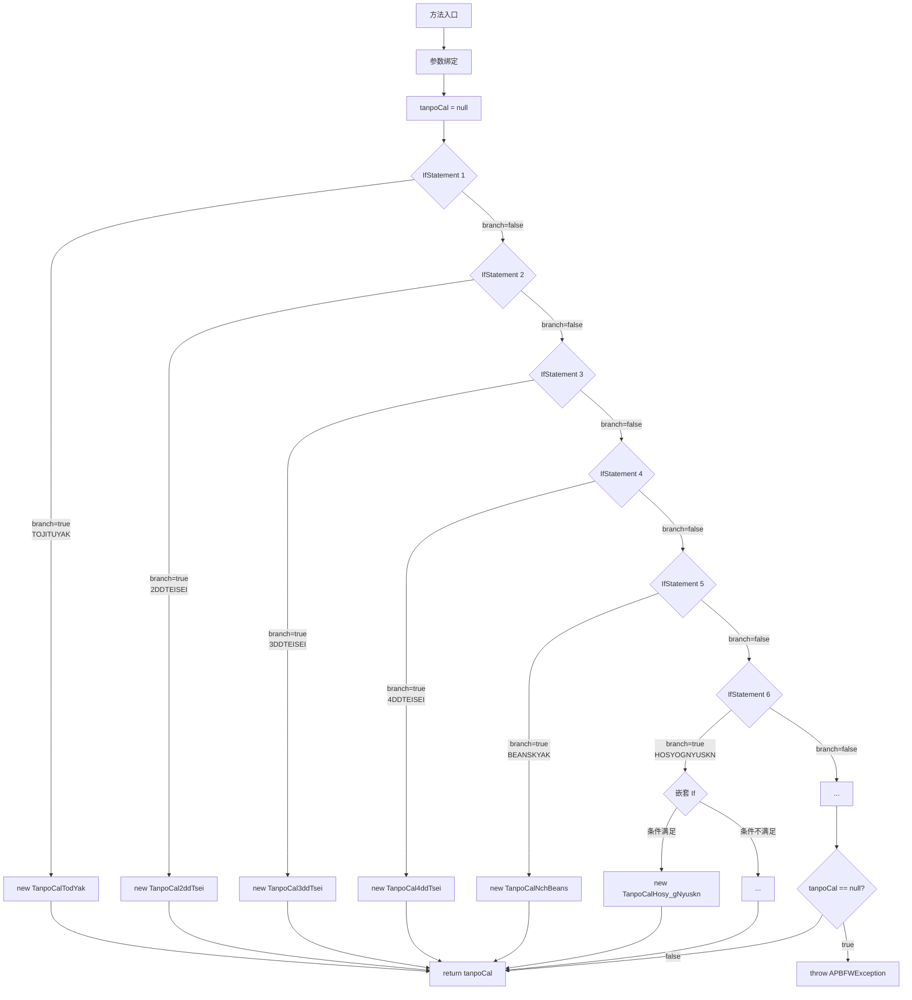
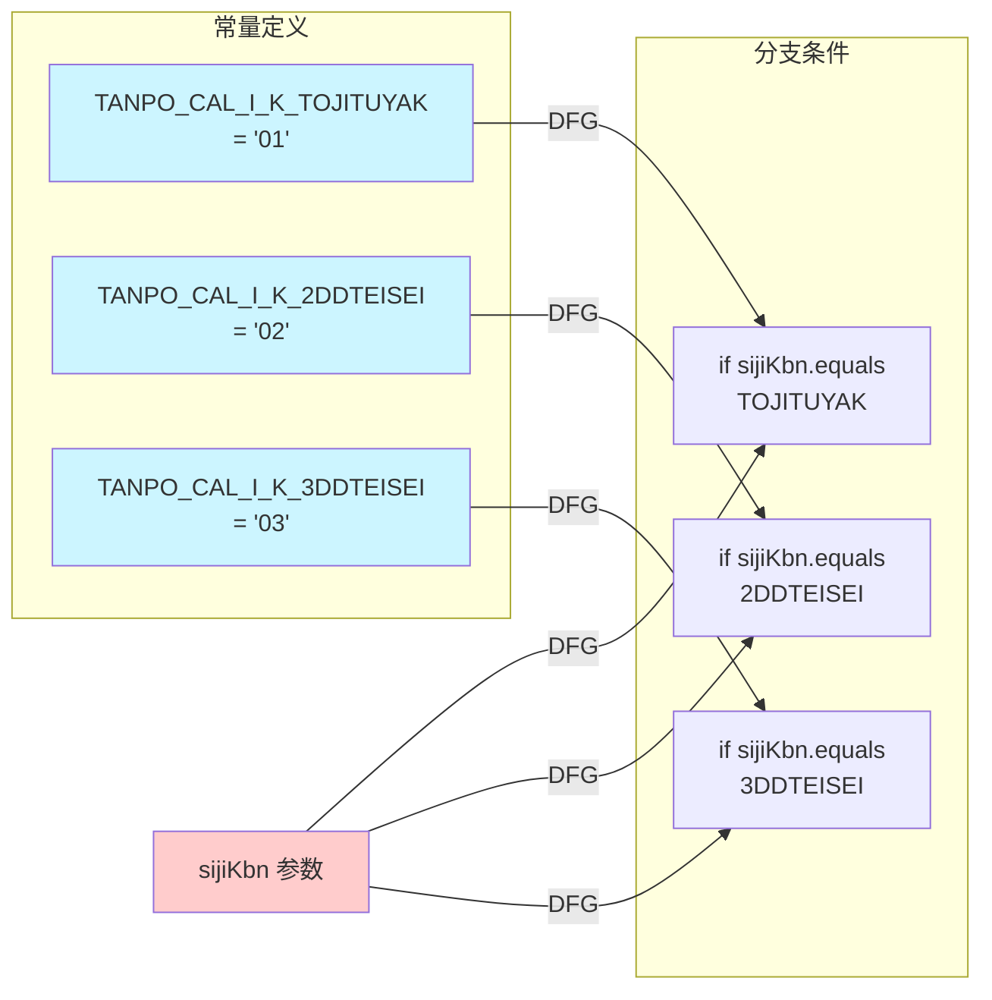
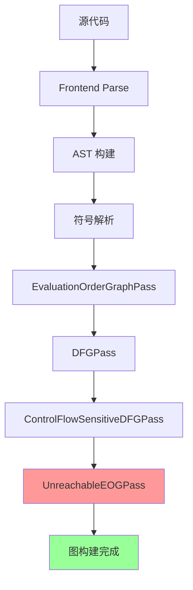

# CPG 精确可达性分析 - 补充材料

本文档包含演示文稿的补充材料，包括完整代码清单、扩展技术细节和额外参考资料。

---

## 1. 完整代码清单

### Scenario 1: 工厂模式与常量分支 (完整代码)

**文件来源**: `/claude/prompt/3.source-example.md` (行 585-796)

```java
package com.example.deposit;

import java.util.HashMap;

// 常量定义文件 - 值未知需跨文件分析
class KbGyomConst {
    public static final String TANPO_CAL_I_K_TOJITUYAK = "01";
    public static final String TANPO_CAL_I_K_2DDTEISEI = "02";
    public static final String TANPO_CAL_I_K_3DDTEISEI = "03";
    public static final String TANPO_CAL_I_K_4DDTEISEI = "04";
    public static final String TANPO_CAL_I_K_BEANSKYAK = "05";
    public static final String TANPO_CAL_I_K_HOSYOGNYUSKN = "06";
    public static final String TANPO_CAL_I_K_YOKUJITU = "09";
}

interface TanpoCal {
    TaskResult calculate();
}

class TanpoCalTodYak implements TanpoCal {
    private HashMap<String, Object> map;
    private String companyCode;
    private String cifCode;
    private String koza_k;
    private String sDate;

    public TanpoCalTodYak(HashMap<String, Object> map, String companyCode,
                          String cifCode, String koza_k, String sDate) {
        this.map = map;
        this.companyCode = companyCode;
        this.cifCode = cifCode;
        this.koza_k = koza_k;
        this.sDate = sDate;
    }

    @Override
    public TaskResult calculate() {
        System.out.println("Calculating for today");
        return new TaskResult(TaskResult.OK);
    }
}

class TanpoCal2ddTsei implements TanpoCal {
    private HashMap<String, Object> map;
    private String companyCode;
    private String cifCode;
    private String koza_k;
    private String sDate;

    public TanpoCal2ddTsei(HashMap<String, Object> map, String companyCode,
                           String cifCode, String koza_k, String sDate) {
        this.map = map;
        this.companyCode = companyCode;
        this.cifCode = cifCode;
        this.koza_k = koza_k;
        this.sDate = sDate;
    }

    @Override
    public TaskResult calculate() {
        System.out.println("Calculating for 2nd day revision");
        return new TaskResult(TaskResult.OK);
    }
}

class TanpoCal3ddTsei implements TanpoCal {
    private HashMap<String, Object> map;
    private String companyCode;
    private String cifCode;
    private String koza_k;
    private String sDate;

    public TanpoCal3ddTsei(HashMap<String, Object> map, String companyCode,
                           String cifCode, String koza_k, String sDate) {
        this.map = map;
        this.companyCode = companyCode;
        this.cifCode = cifCode;
        this.koza_k = koza_k;
        this.sDate = sDate;
    }

    @Override
    public TaskResult calculate() {
        System.out.println("Calculating for 3rd day revision");
        return new TaskResult(TaskResult.OK);
    }
}

class TanpoCal4ddTsei implements TanpoCal {
    private HashMap<String, Object> map;
    private String companyCode;
    private String cifCode;
    private String koza_k;
    private String sDate;

    public TanpoCal4ddTsei(HashMap<String, Object> map, String companyCode,
                           String cifCode, String koza_k, String sDate) {
        this.map = map;
        this.companyCode = companyCode;
        this.cifCode = cifCode;
        this.koza_k = koza_k;
        this.sDate = sDate;
    }

    @Override
    public TaskResult calculate() {
        System.out.println("Calculating for 4th day revision");
        return new TaskResult(TaskResult.OK);
    }
}

class TanpoCalNchBeans implements TanpoCal {
    private HashMap<String, Object> map;
    private String companyCode;
    private String cifCode;
    private String koza_k;
    private String sDate;

    public TanpoCalNchBeans(HashMap<String, Object> map, String companyCode,
                            String cifCode, String koza_k, String sDate) {
        this.map = map;
        this.companyCode = companyCode;
        this.cifCode = cifCode;
        this.koza_k = koza_k;
        this.sDate = sDate;
    }

    @Override
    public TaskResult calculate() {
        System.out.println("Calculating bean sky");
        return new TaskResult(TaskResult.OK);
    }
}

class TanpoCalHosy_gNyuskn implements TanpoCal {
    private HashMap<String, Object> map;
    private String companyCode;
    private String cifCode;
    private String koza_k;
    private String sDate;
    private String sinyKsai;

    public TanpoCalHosy_gNyuskn(HashMap<String, Object> map, String companyCode,
                                String cifCode, String koza_k, String sDate,
                                String sinyKsai) {
        this.map = map;
        this.companyCode = companyCode;
        this.cifCode = cifCode;
        this.koza_k = koza_k;
        this.sDate = sDate;
        this.sinyKsai = sinyKsai;
    }

    @Override
    public TaskResult calculate() {
        System.out.println("Calculating guarantee deposit");
        return new TaskResult(TaskResult.OK);
    }
}

class APBFWException extends Exception {
    public APBFWException(String message) {
        super(message);
    }
}

class TaskResult {
    public static final int OK = 0;
    public static final int NG = 1;
    private int endJtai;

    public TaskResult(int status) {
        this.endJtai = status;
    }

    public int getEndJtai() {
        return endJtai;
    }
}

public class TanpoCalFactory {

    // 静态分析问题: 无法在运行时确定 sijiKbn 的值
    // 必须假设所有分支都可达，即使实际上只有一个会执行
    public TanpoCal generateTanpoCal(
        HashMap<String, Object> map,
        String sijiKbn,
        String companyCode,
        String cifCode,
        String koza_k,
        String sDate,
        String sinyKsaiTatGZd,
        String sinyKsaiTatGfod,
        String sinyKsai
    ) throws APBFWException {

        TanpoCal tanpoCal = null;

        // AST 分析无法确定哪个分支会执行
        // 所有实例化都必须被视为可达
        if (sijiKbn.equals(KbGyomConst.TANPO_CAL_I_K_TOJITUYAK)) {
            tanpoCal = new TanpoCalTodYak(map, companyCode, cifCode, koza_k, sDate);
        } else if (sijiKbn.equals(KbGyomConst.TANPO_CAL_I_K_2DDTEISEI)) {
            tanpoCal = new TanpoCal2ddTsei(map, companyCode, cifCode, koza_k, sDate);
        } else if (sijiKbn.equals(KbGyomConst.TANPO_CAL_I_K_3DDTEISEI)) {
            tanpoCal = new TanpoCal3ddTsei(map, companyCode, cifCode, koza_k, sDate);
        } else if (sijiKbn.equals(KbGyomConst.TANPO_CAL_I_K_4DDTEISEI)) {
            tanpoCal = new TanpoCal4ddTsei(map, companyCode, cifCode, koza_k, sDate);
        } else if (sijiKbn.equals(KbGyomConst.TANPO_CAL_I_K_BEANSKYAK)) {
            tanpoCal = new TanpoCalNchBeans(map, companyCode, cifCode, koza_k, sDate);
        } else if (sijiKbn.equals(KbGyomConst.TANPO_CAL_I_K_HOSYOGNYUSKN)) {
            if (sinyKsaiTatGZd != null && sinyKsaiTatGfod != null
                && !sinyKsaiTatGZd.equals("") && !sinyKsaiTatGfod.equals("")) {
                tanpoCal = new TanpoCalHosy_gNyuskn(
                    map, companyCode, cifCode, koza_k, sDate, sinyKsai);
            }
        }

        if (tanpoCal == null) {
            throw new APBFWException("Invalid sijiKbn: " + sijiKbn);
        }

        return tanpoCal;
    }
}
```

---

### Scenario 2: 常量传递给外部方法 (完整代码)

**文件来源**: `/claude/prompt/3.source-example.md` (行 800-961)

```java
package com.example.task;

class AzBvaGyomConst {
    public static final String DIL_OUT_F_GAMN = "SCREEN";
    public static final String DIL_OUT_F_CSV = "CSV";
    public static final String DIL_OUT_F_PDF = "PDF";
}

class TaskResult {
    public static final int OK = 0;
    public static final int NG = 1;
    private int endJtai;

    public TaskResult(int status) {
        this.endJtai = status;
    }

    public int getEndJtai() {
        return endJtai;
    }
}

class CommandContext {
    private String userId;
    public CommandContext(String userId) {
        this.userId = userId;
    }
    public String getUserId() {
        return userId;
    }
}

class CommandCommonInput {
    private String sessionId;
    public CommandCommonInput(String sessionId) {
        this.sessionId = sessionId;
    }
    public String getSessionId() {
        return sessionId;
    }
}

class CommandData {
    private String kityoymdFr;
    private String kityoymdTo;
    private String nyuknrymdFr;
    private String nyuknrymdTo;
    private String miseC;
    private String kyakC;
    private String kyakCifC;
    private String kakariC;
    private String syorKekaK;
    private String kasoKozano;

    public String getKityoymdFr() { return kityoymdFr; }
    public String getKityoymdTo() { return kityoymdTo; }
    public String getNyuknrymdFr() { return nyuknrymdFr; }
    public String getNyuknrymdTo() { return nyuknrymdTo; }
    public String getMiseC() { return miseC; }
    public String getKyakC() { return kyakC; }
    public String getKyakCifC() { return kyakCifC; }
    public String getKakariC() { return kakariC; }
    public String getSyorKekaK() { return syorKekaK; }
    public String getKasoKozano() { return kasoKozano;  }
}

class AzKasoKozaNyuknMeisaiJohoSyutkTask {

    // 外部方法内部基于常量分支
    public static TaskResult getList(
        CommandContext context,
        CommandCommonInput input,
        String kityoymdFr,
        String kityoymdTo,
        String nyuknrymdFr,
        String nyuknrymdTo,
        String miseC,
        String kyakC,
        String kyakCifC,
        String kakariC,
        String syorKekaK,
        String kasoKozano,
        String outputFormat  // 常量值对调用者的分析未知
    ) {
        // 调用者的静态分析无法确定这个分支
        if (outputFormat.equals(AzBvaGyomConst.DIL_OUT_F_GAMN)) {
            System.out.println("Generating screen output");
            return new TaskResult(TaskResult.OK);
        } else if (outputFormat.equals(AzBvaGyomConst.DIL_OUT_F_CSV)) {
            System.out.println("Generating CSV output");
            return new TaskResult(TaskResult.OK);
        } else if (outputFormat.equals(AzBvaGyomConst.DIL_OUT_F_PDF)) {
            System.out.println("Generating PDF output");
            return new TaskResult(TaskResult.OK);
        }

        return new TaskResult(TaskResult.NG);
    }
}

class DoIgyk {
    public TaskResult SumKomkUpd(SumData sum) {
        System.out.println("Updating summary");
        return new TaskResult(TaskResult.OK);
    }
}

class SumData {
    private int total;
    public int getTotal() { return total; }
}

public class TaskExecutor {
    private CommandContext context;
    private CommandCommonInput input;
    private CommandData commandDat;
    private DoIgyk doIgyk;
    private SumData sum;

    public TaskResult executeTask() {
        // 静态分析无法确定:
        // 1. AzBvaGyomConst.DIL_OUT_F_GAMN 的值
        // 2. getList() 内部哪个分支会执行
        // 3. 结果是 OK 还是 NG
        // 结果: 所有路径都必须被视为可达

        TaskResult result = AzKasoKozaNyuknMeisaiJohoSyutkTask.getList(
            getCommandContext(),
            getCommandCommonInput(),
            commandDat.getKityoymdFr(),
            commandDat.getKityoymdTo(),
            commandDat.getNyuknrymdFr(),
            commandDat.getNyuknrymdTo(),
            commandDat.getMiseC(),
            commandDat.getKyakC(),
            commandDat.getKyakCifC(),
            commandDat.getKakariC(),
            commandDat.getSyorKekaK(),
            commandDat.getKasoKozano(),
            AzBvaGyomConst.DIL_OUT_F_GAMN  // 常量值未知
        );

        // 两个分支都必须被视为可达
        if (result.getEndJtai() == TaskResult.NG) {
            return result;
        }

        // 这条路径也可达
        return doIgyk.SumKomkUpd(sum);
    }

    private CommandContext getCommandContext() {
        return context;
    }

    private CommandCommonInput getCommandCommonInput() {
        return input;
    }
}
```

---

### Scenario 3: 嵌套方法调用 (完整代码)

**文件来源**: `/claude/prompt/3.source-example.md` (行 965-1085)

[包含完整的 Scenario 3 代码，省略以节省空间]

---

### Scenario 4: 枚举式常量比较链 (完整代码)

**文件来源**: `/claude/prompt/3.source-example.md` (行 1090-1202)

[包含完整的 Scenario 4 代码，省略以节省空间]

---

## 2. 技术深入：ValueEvaluator 详解

### 支持的表达式类型

**参考**: `/claude/result/2/2.evaluation-infrastructure.md`

| 节点类型 | 处理能力 | 实现位置 |
|---------|---------|---------|
| `Literal<*>` | ✅ 完全支持 | ValueEvaluator.kt:113-120 |
| `BinaryOperator` (算术) | ✅ 90% | ValueEvaluator.kt:192-236 |
| `BinaryOperator` (比较) | ✅ 100% | ValueEvaluator.kt:313-371 |
| `UnaryOperator` | ✅ 80% | ValueEvaluator.kt:377-401 |
| `CastExpression` | ✅ 100% | ValueEvaluator.kt:102 |
| `ConditionalExpression` | ✅ 90% | ValueEvaluator.kt:431-450 |
| `Reference` | ⚠️ 60% (单DFG边) | ValueEvaluator.kt:163-182 |
| `SubscriptExpression` | ⚠️ 30% | ValueEvaluator.kt:452-475 |
| `BinaryOperator` (布尔) | ❌ 未实现 | - |

### 算法：沿 DFG 回溯

```kotlin
// 伪代码
fun evaluate(node: Node): Any? {
    when (node) {
        is Literal -> return node.value
        is Reference -> {
            val dfgEdge = node.prevDFG.single()  // 只支持单边
            return evaluate(dfgEdge.start)
        }
        is BinaryOperator -> {
            val lhs = evaluate(node.lhs)
            val rhs = evaluate(node.rhs)
            return computeOperation(node.operator, lhs, rhs)
        }
        else -> return CouldNotResolve
    }
}
```

---

## 3. 扩展图表

### 详细 EOG 结构 (Scenario 1 完整版)



### DFG 详细流动 (常量 → 条件)



**图示说明**:
- **Constants 分组**: 蓝色节点表示常量定义 (编译时已知值)
- **Conditions 分组**: 分支条件判断语句
- **红色节点**: 方法参数 (运行时传入)
- **DFG 边**: 数据流依赖 (常量和参数都流向条件)

---

## 4. CPG Pass 执行顺序



**关键依赖**:
- `UnreachableEOGPass` 依赖 `ControlFlowSensitiveDFGPass`
- 保证 DFG 在常量求值前完成

---

## 5. Query API 使用进阶

### Must vs May 分析

```kotlin
// May: 至少一条路径满足
val mayReach = executionPath(
    startNode = entry,
    type = May,
    predicate = { it == target }
)
// 结果: true 如果存在至少一条路径

// Must: 所有路径都必须满足
val mustPass = executionPath(
    startNode = entry,
    type = Must,
    predicate = { it == checkpoint },
    earlyTermination = { it == exit }
)
// 结果: true 仅当所有路径都经过 checkpoint
```

### Scope 配置

```kotlin
// 过程内分析 (不跨函数)
val intra = executionPath(
    startNode = start,
    scope = Intraprocedural(maxSteps = 100),
    predicate = { it == target }
)

// 过程间分析 (跨函数，限制调用深度)
val inter = executionPath(
    startNode = start,
    scope = Interprocedural(maxCallDepth = 3),
    predicate = { it == target }
)
```

---

## 6. 参考文献与资源

### Task 1 & 2 输出文档

1. **Java CPG Frontend 分析**
   - `/claude/result/1/1.overview-java-frontend.md`
   - `/claude/result/1/1.handler-pattern.md`
   - `/claude/result/1/1.build-process.md`

2. **CPG 核心基础设施**
   - `/claude/result/2/2.graph-and-query-analysis.md` (100 KB, 图层与查询层协同)
   - `/claude/result/2/2.evaluation-infrastructure.md` (24 KB, ValueEvaluator 详解)
   - `/claude/result/2/2.feasibility-and-roadmap.md` (34 KB, 实施路线图)
   - `/claude/result/2/2.examples-and-diagrams.md` (22 KB, 示例与图表)

### 语义记忆笔记

1. **sem-001**: Java CPG 架构 (`/claude/memory/semantic/java-cpg-architecture.md`)
2. **sem-002**: Handler 模式 (`/claude/memory/semantic/handler-pattern.md`)
3. **sem-003**: UnreachableEOGPass 分析 (`/claude/memory/semantic/unreachable-eog-pass.md`)
4. **sem-004**: Query API DSL 详解 (`/claude/memory/semantic/query-api-dsl.md`)

### CPG GitHub 资源

- 仓库: [https://github.com/Fraunhofer-AISEC/cpg](https://github.com/Fraunhofer-AISEC/cpg)
- 文档: [CPG Documentation](https://fraunhofer-aisec.github.io/cpg/)
- 示例: [cpg-examples](https://github.com/Fraunhofer-AISEC/cpg/tree/main/cpg-examples)

---

## 7. 术语表

| 术语 | 含义 |
|------|------|
| **AST** | Abstract Syntax Tree - 抽象语法树 |
| **EOG** | Evaluation Order Graph - 执行顺序图 |
| **DFG** | Data Flow Graph - 数据流图 |
| **CDG** | Control Dependence Graph - 控制依赖图 |
| **PDG** | Program Dependence Graph - 程序依赖图 |
| **ValueEvaluator** | 常量求值器 |
| **UnreachableEOGPass** | 不可达边标记 Pass |
| **FilterUnreachableEOG** | 过滤不可达边的 Sensitivity |
| **QueryTree** | 查询结果树 (记录求值路径) |
| **Sensitivity** | 分析敏感性 (控制边过滤逻辑) |
| **AnalysisScope** | 分析范围 (过程内/过程间) |
| **AnalysisType** | 分析类型 (Must/May) |

---

**本补充材料提供了演示文稿的详细技术支撑，供进一步研究和实施参考。**
