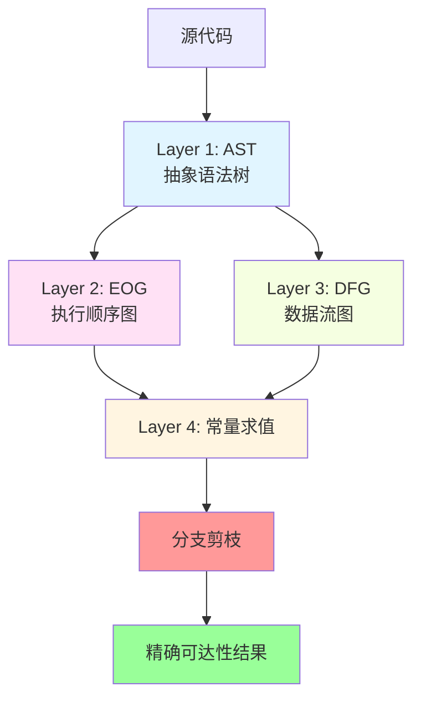
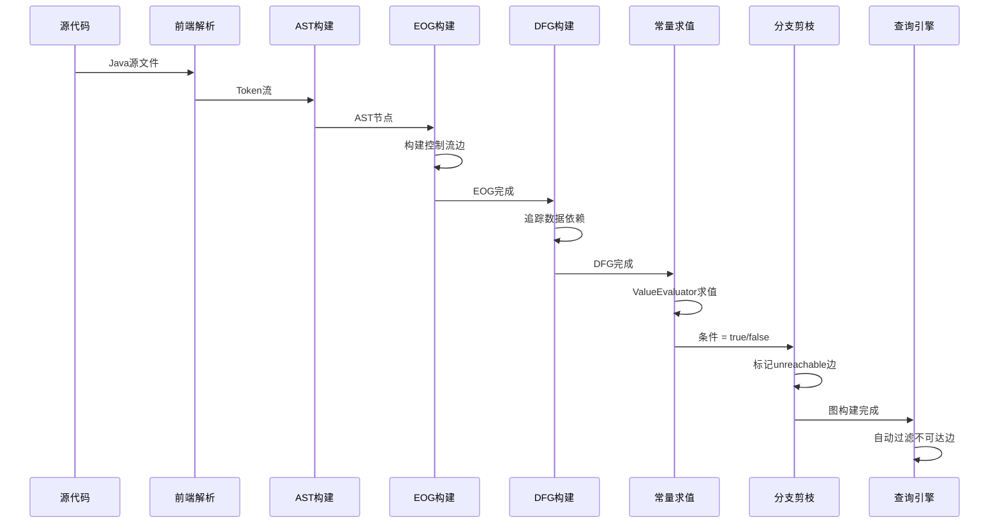
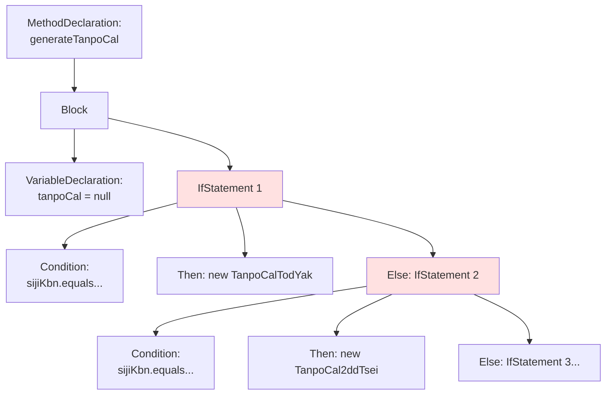
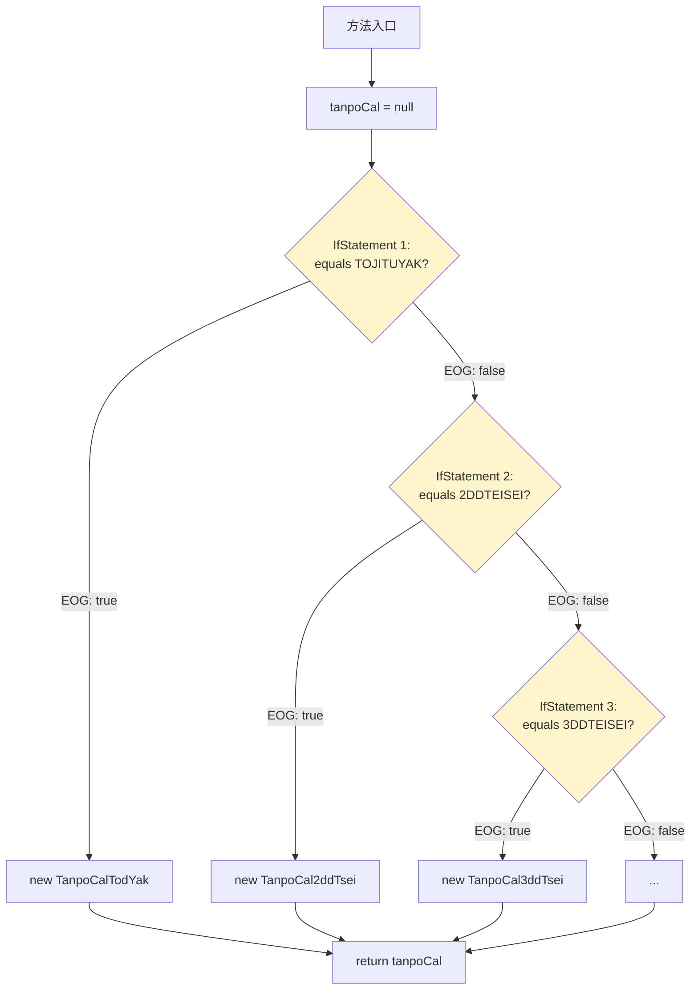
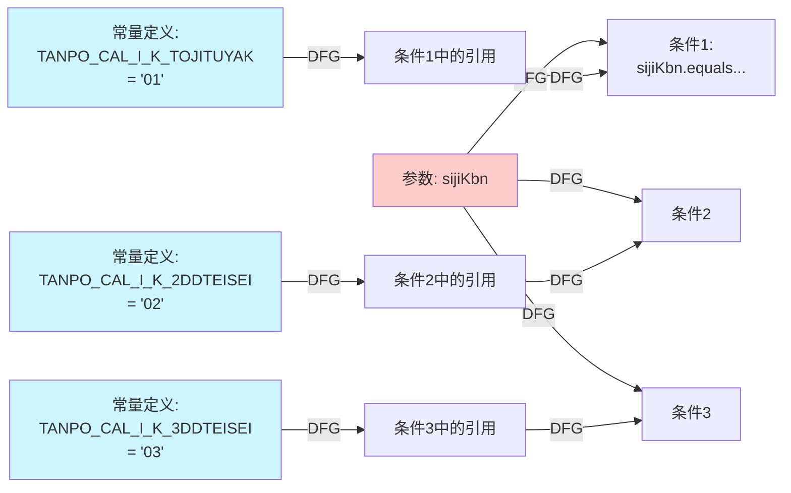
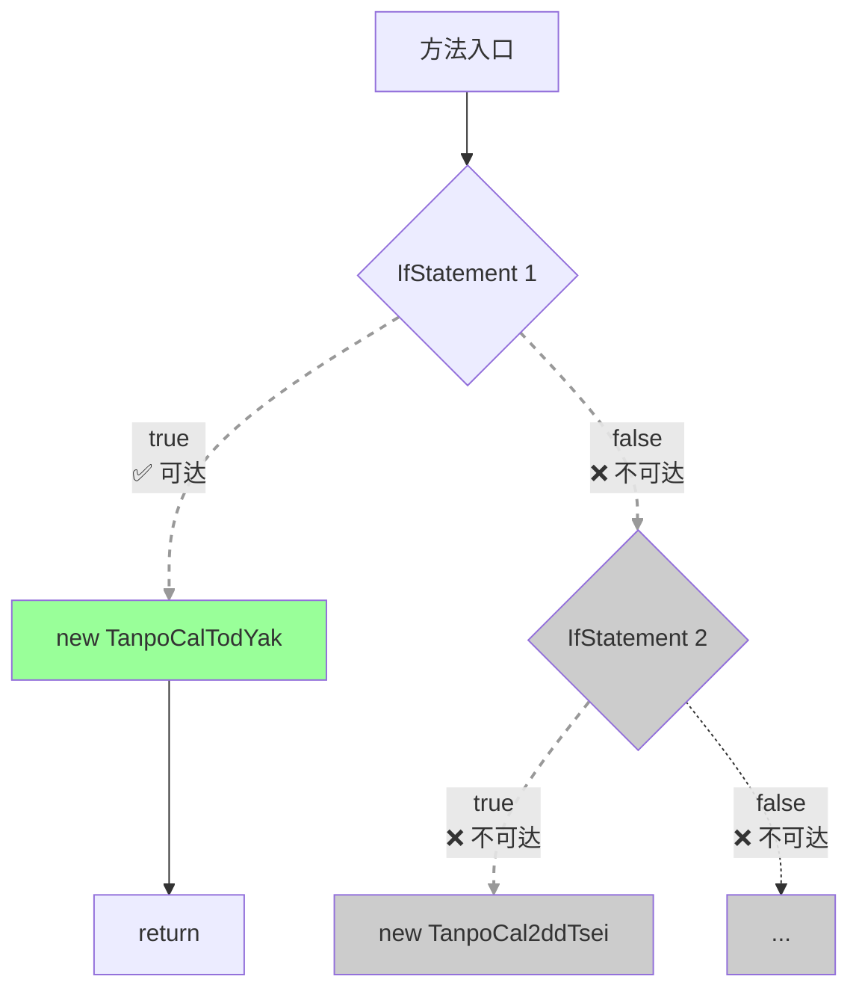
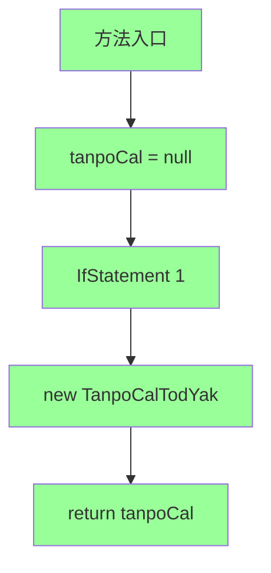
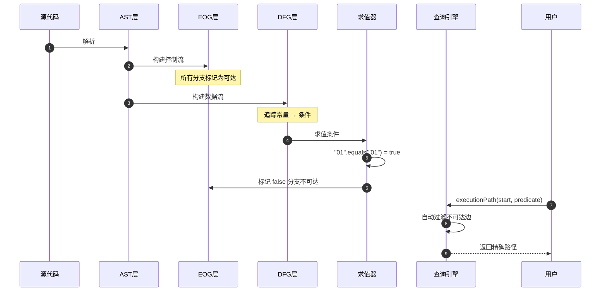
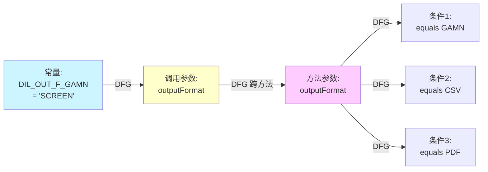
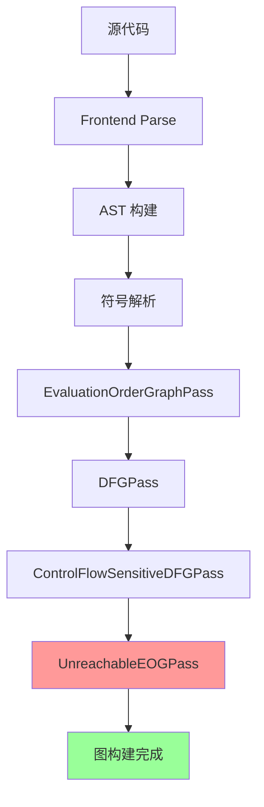

# CPG 精确可达性分析 - Mermaid 图表源码

本文档包含演示文稿中所有 Mermaid 图表的源代码，方便编辑和复用。

---

## 图表清单

| 图表编号 | 名称 | 幻灯片 | 类型 |
|---------|------|--------|------|
| D1 | CPG 四层架构 | 5 | flowchart |
| D2 | 完整流程序列图 | 7 | sequenceDiagram |
| D3 | AST 结构树 | 10 | graph |
| D4 | EOG 构建 (所有分支) | 12 | flowchart |
| D5 | DFG 常量流动 | 13 | flowchart |
| D6 | EOG 剪枝后 | 16 | flowchart |
| D7 | 最终可达图 | 17 | flowchart |
| D8 | 完整流程回顾 | 19 | sequenceDiagram |
| D9 | Scenario 2 DFG | 21 | flowchart |
| D10 | Pass 执行顺序 | 附录 | graph |

---

## D1: CPG 四层架构 (幻灯片 5)



**用途**: 展示 CPG 的整体架构和数据流动

**编辑建议**:
- 可以添加更多层次细节
- 可以调整颜色以匹配品牌色

---

## D2: 完整流程序列图 (幻灯片 7)



**用途**: 展示从源码到结果的完整流程

**编辑建议**:
- 可以添加更多交互细节
- 可以添加错误处理路径

---

## D3: AST 结构树 (幻灯片 10)



**用途**: 展示 AST 的树形结构

---

## D4: EOG 构建 - 所有分支可达 (幻灯片 12)



**用途**: 展示 EOG 边的初始状态（所有分支可达）

---

## D5: DFG 常量流动 (幻灯片 13)



**用途**: 展示 DFG 如何连接常量定义与条件表达式

**节点说明**:
- 蓝色节点: 常量定义 (编译时已知值)
- 红色节点: 方法参数 (运行时传入)
- DFG 箭头: 数据流依赖关系

---

## D6: EOG 剪枝后 (幻灯片 16)



**用途**: 展示分支剪枝后的 EOG 状态

---

## D7: 最终可达图 (幻灯片 17)



**用途**: 展示最终的可达节点

---

## D8: 完整流程回顾 (幻灯片 19)



**用途**: 完整流程的序列图回顾

---

## D9: Scenario 2 DFG (幻灯片 21)



**用途**: 展示跨方法边界的 DFG

**节点说明**:
- 蓝色节点: 常量定义 ("SCREEN")
- 黄色节点: 调用参数 (传递常量)
- 紫色节点: 方法参数 (接收常量)
- "DFG 跨方法": 表示数据流跨越方法边界

---

## D10: Pass 执行顺序 (附录)



**用途**: 展示 CPG Pass 的执行顺序和依赖关系

---

## 图表复用指南

### 如何复用这些图表

1. **复制源码**: 直接复制对应图表的 Mermaid 代码
2. **调整样式**: 修改 `style` 命令改变颜色和形状
3. **添加节点**: 在相应位置添加新的节点和边
4. **导出图片**: 使用 Mermaid Live Editor 或 Marp CLI 导出为 SVG/PNG

### Mermaid 语法快速参考

```mermaid
# 流程图
flowchart TD
    A[矩形] --> B{菱形}
    B -->|是| C[结果1]
    B -->|否| D[结果2]

# 序列图
sequenceDiagram
    Alice->>Bob: 消息
    Bob-->>Alice: 响应

# 类图
graph TD
    Parent --> Child1
    Parent --> Child2
```

---

## 颜色方案

| 用途 | 颜色代码 | 示例 |
|------|---------|------|
| 可达节点 | `#99ff99` | 绿色 |
| 不可达节点 | `#cccccc` | 灰色 |
| 常量 | `#ccf5ff` | 蓝色 |
| AST 层 | `#e1f5ff` | 浅蓝 |
| EOG 层 | `#ffe1f5` | 粉色 |
| DFG 层 | `#f5ffe1` | 浅绿 |
| 求值层 | `#fff5e1` | 米色 |
| 警告/错误 | `#ff9999` | 红色 |

---

**所有图表源码可直接用于 Mermaid Live Editor (https://mermaid.live/) 预览和编辑**
