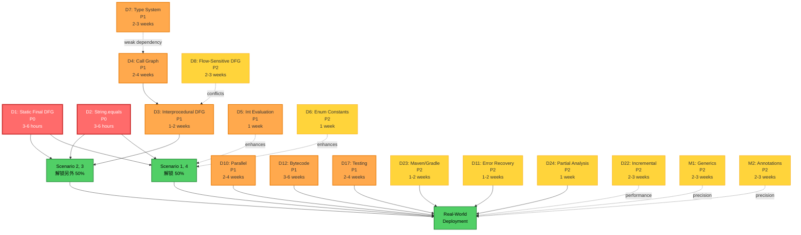
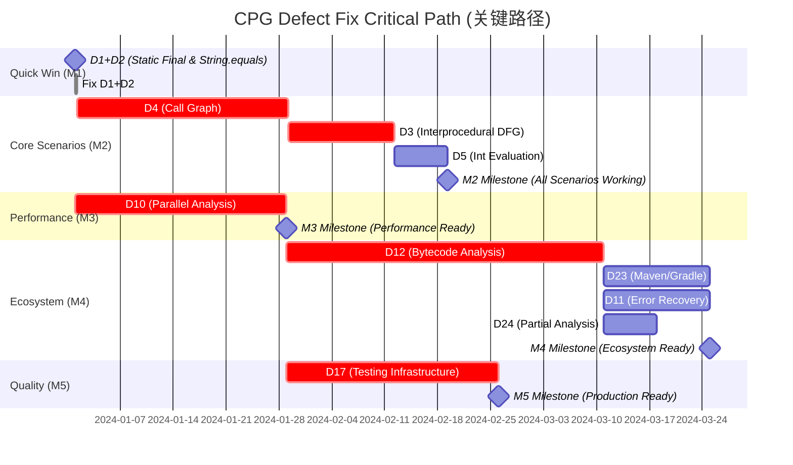
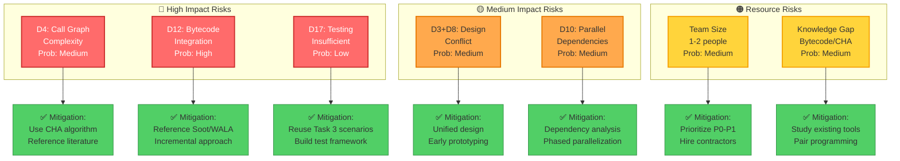

# CPG 架构缺陷全面分析 (Gap Analysis)

## 第五部分: 缺陷优先级与影响矩阵

### 5.1 场景覆盖矩阵

该矩阵展示**每个缺陷**阻塞**哪些 Task 3 场景**,以及对真实项目的影响。

#### Complete Scenario Coverage Table

下表展示每个缺陷对Task 3四个场景的影响程度:

| 缺陷 ID | 场景 1<br/>(Factory) | Scenario 2<br/>(Interprocedural) | Scenario 3<br/>(Nested Calls) | Scenario 4<br/>(Enum Branching) | Real-World<br/>Projects | 优先级 |
|-----------|-------------------------|----------------------------------|-------------------------------|--------------------------------|------------------------|----------|
| **D1** | ✅ **Blocks** | ✅ **Blocks** | ✅ **Blocks** | ✅ **Blocks** | ✅ **Blocks** | P0 |
| **D2** | ✅ **Blocks** | ✅ **Blocks** | ✅ **Blocks** | ✅ **Blocks** | ✅ **Blocks** | P0 |
| **D3** | - | ✅ **Blocks** | ✅ **Blocks** | - | ✅ **Blocks** | P1 |
| **D4** | - | ✅ **Blocks** | ✅ **Blocks** | - | ✅ **Blocks** | P1 |
| **D5** | - | - | - | ⚠️ Partial | ⚠️ Partial | P1 |
| **D6** | - | - | - | ⚠️ Partial | ⚠️ Partial | P2 |
| **D7** | ⚠️ Indirect | ⚠️ Indirect | ⚠️ Indirect | ⚠️ Indirect | ✅ **Blocks** | P1 |
| **D8** | ⚠️ Precision | ⚠️ Precision | ⚠️ Precision | ⚠️ Precision | ⚠️ Precision | P2 |
| **D9** | - | - | - | - | ⚠️ Precision | P2 |
| **D10** | - | - | - | - | ✅ **Blocks** | P1 |
| **D11** | - | - | - | - | ✅ **Blocks** | P2 |
| **D12** | - | ⚠️ Indirect | ⚠️ Indirect | - | ✅ **Blocks** | P1 |
| **D13** | ⚠️ Precision | ⚠️ Precision | ⚠️ Precision | ⚠️ Precision | ⚠️ Precision | P3 |
| **D14** | - | - | - | - | ⚠️ Precision | P3 |
| **D15** | - | - | - | - | ⚠️ Partial | P2 |
| **D16** | - | - | - | - | ⚠️ Partial | P2 |
| **D17** | - | - | - | - | ✅ **Blocks** | P1 |
| **D18** | - | - | - | - | - | P4 |
| **D19** | - | ⚠️ Precision | ⚠️ Precision | - | ⚠️ Precision | P3 |
| **D20** | - | - | - | - | - | P4 |
| **D21** | - | - | - | - | - | P4 |
| **D22** | - | - | - | - | ⚠️ Performance | P2 |
| **D23** | - | - | - | - | ✅ **Blocks** | P2 |
| **D24** | - | - | - | - | ✅ **Blocks** | P2 |
| **D25** | - | - | - | - | ⚠️ Precision | P3 |
| **D26** | - | ⚠️ Precision | ⚠️ Precision | - | ⚠️ Precision | P3 |
| **M1** | - | - | - | - | ⚠️ Precision | P2 |
| **M2** | - | - | - | - | ⚠️ Precision | P2 |
| **M3** | - | - | - | - | ⚠️ Precision | P2 |
| **M4** | - | - | - | - | ⚠️ Precision | P3 |

**Legend**:
- ✅ **Blocks**: 完全阻塞该场景
- ⚠️ **Partial**: 部分阻塞 (降低精度或功能受限)
- ⚠️ **Indirect**: 间接影响 (通过依赖其他缺陷)
- ⚠️ **Precision**: 精度降低,但不完全阻塞
- ⚠️ **Performance**: 性能问题,但功能可用
- `-`: 不影响该场景

#### Scenario Blocking Analysis

**Scenario 1 (Factory Pattern - 单方法内)**:
- **直接阻塞**: D1, D2 (P0) → 2 defects
- **必须修复**: D1 + D2 → 解锁 Scenario 1
- **修复成本**: 3-6 hours

**Scenario 2 (Interprocedural - 2层调用)**:
- **直接阻塞**: D1, D2, D3, D4 (P0-P1) → 4 defects
- **必须修复**: D1 + D2 + D3 + D4 → 解锁 Scenario 2
- **修复顺序**: D4 → D3 → D1+D2 (D4 是 D3 的前提)
- **修复成本**: 3-8 weeks

**Scenario 3 (Nested Calls - 2层嵌套)**:
- **直接阻塞**: D1, D2, D3, D4 (P0-P1) → 4 defects
- **Same as Scenario 2**
- **修复成本**: 3-8 weeks

**Scenario 4 (Enum Branching - 复杂嵌套)**:
- **直接阻塞**: D1, D2 (P0) → 2 defects
- **部分阻塞**: D5, D6 (P1-P2) → int/enum 常量支持
- **必须修复**: D1 + D2 → 基本可用
- **推荐修复**: D1 + D2 + D5 + D6 → 完整支持
- **修复成本**: 3-6 hours (基本) 或 1-2 weeks (完整)

**Real-World Projects**:
- **性能阻塞**: D10 (Parallel) → 30x slower
- **生态阻塞**: D12 (Bytecode), D23 (Maven), D11 (Error Recovery), D24 (Partial)
- **质量阻塞**: D17 (Testing) → unknown precision
- **精度降低**: D7 (Type System), M1-M2 (Generics, Annotations)
- **Total blockers**: 8 defects (D10-D12, D17, D23-D24, D11, D7)

---

### 5.2 Defect Dependency Graph (缺陷依赖图)

该图展示缺陷之间的**依赖关系**和**冲突关系**。



#### Dependency Relationships

**Strong Dependencies** (必须先修复前置):
- **D3 depends on D4**: 过程间 DFG 需要 Call Graph
- **D4 weakly depends on D7**: 类型信息提升 Call Graph 精度 (可选)

**Conflicts** (需要协同设计):
- **D8 conflicts with D3**: Flow-sensitive DFG 与 interprocedural DFG 需要统一设计

**Enhancement Relationships** (可选改进):
- **D5, D6 enhance Scenario 4**: Int/Enum 支持提升精度
- **D22 enhances performance**: 增量分析提升速度
- **M1, M2 enhance precision**: 泛型/注解支持提升真实项目精度

---

### 5.3 Critical Path Analysis (关键路径分析)

识别达到各个 milestone 的**最小缺陷集合**和**关键路径**。

#### Milestone Definitions

**M1: Scenario 1, 4 Working**
- **Goal**: 解锁 50% Task 3 scenarios (单方法内分析)
- **Required Defects**: D1 + D2

**M2: All Task 3 Scenarios Working**
- **Goal**: 解锁 100% Task 3 scenarios
- **Required Defects**: D1 + D2 + D3 + D4

**M3: Real-World Performance Acceptable**
- **Goal**: 分析速度 < 5 minutes for 100K LOC
- **Required Defects**: D1-D5 + D10

**M4: Real-World Ecosystem Integration**
- **Goal**: 支持 JAR, Maven/Gradle, 容错解析
- **Required Defects**: D1-D5 + D10 + D12 + D23 + D11 + D24

**M5: Production-Ready**
- **Goal**: 精度 ≥ 85%, 质量可验证
- **Required Defects**: D1-D5 + D10-D12 + D17 + D23 + D11 + D24

#### Critical Path Visualization



**Key Insights**:
- **M1 (3-6 hours)**: Quick win, 立即可实现
- **M2 (3-8 weeks)**: D4 是瓶颈 (2-4 weeks),但可与 D10 并行
- **M3 (5-12 weeks)**: D10 与 D4 并行,不增加总时间
- **M4 (11-20 weeks)**: D12 是瓶颈 (3-6 weeks),需要字节码分析
- **M5 (13-24 weeks)**: D17 可与 D12 并行,最终 2-4 weeks

**Parallelization Opportunities**:
- D10 (Parallel) 可与 D4 (Call Graph) **并行开发**
- D17 (Testing) 可与 D12 (Bytecode) **并行开发**
- D23, D11, D24 (小缺陷) 可与 D12 **并行开发**

**Optimized Critical Path** (with parallelization):
- **Best Case**: 13 weeks (D1+D2 → D4+D10 → D3 → D12+D17 → D23+D11+D24)
- **Worst Case**: 24 weeks (sequential, no parallelization)
- **Realistic**: 16-20 weeks (部分并行)

---

### 5.4 Impact vs Effort Matrix (影响力-工作量矩阵)

该矩阵帮助识别**高 ROI** (高影响, 低工作量) 的缺陷。

```mermaid
quadrantChart
    title Defect Impact vs Effort Matrix (影响力-工作量矩阵)
    x-axis Low Effort --> High Effort
    y-axis Low Impact --> High Impact
    quadrant-1 Strategic Investment (战略投资)
    quadrant-2 Quick Wins (立即修复) ⭐
    quadrant-3 Low Priority (低优先级)
    quadrant-4 Defer (推迟)

    D1 (Static Final DFG): [0.15, 0.95]
    D2 (String.equals): [0.15, 0.95]
    D3 (Interprocedural DFG): [0.65, 0.90]
    D4 (Call Graph): [0.75, 0.90]
    D5 (Int Evaluation): [0.35, 0.60]
    D6 (Enum Constants): [0.35, 0.50]
    D7 (Type System): [0.70, 0.65]
    D8 (Flow-Sensitive DFG): [0.60, 0.40]
    D10 (Parallel): [0.70, 0.90]
    D11 (Error Recovery): [0.55, 0.65]
    D12 (Bytecode): [0.85, 0.90]
    D17 (Testing): [0.65, 0.90]
    D22 (Incremental): [0.60, 0.45]
    D23 (Maven/Gradle): [0.50, 0.65]
    D24 (Partial Analysis): [0.40, 0.65]
    M1 (Generics): [0.75, 0.35]
    M2 (Annotations): [0.75, 0.35]
```

#### Quadrant Analysis

**Quadrant 1: High Impact + Low Effort** (Quick Wins):
- **D1, D2** (P0): 解锁 50% scenarios
- **ROI**: ⭐⭐⭐⭐⭐ (Highest)
- **Action**: **立即修复**

**Quadrant 2: High Impact + High Effort** (Strategic Investments):
- **D3, D4** (P1): 解锁另外 50% scenarios
- **D10** (P1): 性能提升 30x
- **D12** (P1): 解锁 95% real projects
- **D17** (P1): 质量验证
- **ROI**: ⭐⭐⭐⭐ (High)
- **Action**: **按 Critical Path 顺序修复**

**Quadrant 3: Low Impact + Low Effort** (Incremental Improvements):
- **D5, D6** (P1-P2): Scenario 4 完整支持
- **D15, D16** (P2-P3): Lambda, Try-with-resources
- **ROI**: ⭐⭐⭐ (Medium)
- **Action**: **M2 完成后修复**

**Quadrant 4: Low Impact + High Effort** (Defer):
- **D7, D11, D23, D24** (P1-P2): 真实部署必备,但影响范围有限
- **M1, M2** (P2): 精度提升,但非阻塞
- **D18-D21** (P3-P4): 易用性,低优先级
- **ROI**: ⭐⭐ (Low-Medium)
- **Action**: **M3-M4 阶段修复** (真实部署必需的) 或 **推迟** (易用性改进)

---

### 5.5 Priority-Based Roadmap (基于优先级的路线图)

按优先级组织所有缺陷,并提供修复建议。

#### Priority Breakdown


**With Parallelization** (realistic):
- **P0**: 3-6 hours
- **P0-P1**: 16-24 weeks (M5: Production-Ready)
- **P0-P2**: 25-40 weeks (All essential features)
- **P0-P3**: 30-50 weeks (Advanced features)
- **P0-P4**: 32-54 weeks (Complete)

#### Recommended Roadmap

**Phase 1: Quick Win (Week 0)**
- **Defects**: D1, D2
- **Deliverable**: Scenario 1, 4 working

**Phase 2: Complete Task 3 (Week 1-8)**
- **Defects**: D3, D4, D5
- **Deliverable**: All Task 3 scenarios working

**Phase 3: Performance & Ecosystem (Week 6-20, parallel with Phase 2)**
- **Defects**: D10, D12, D23
- **Deliverable**: CI/CD ready, real projects analyzable

**Phase 4: Quality & Robustness (Week 10-24, parallel with Phase 3)**
- **Defects**: D17, D11, D24
- **Deliverable**: Production-ready (M5)

**Phase 5: Precision Enhancement (Week 20-40)**
- **Defects**: D6-D9, D15-D16, D22, M1-M2 (P2)
- **Deliverable**: High precision (85-90%), advanced features

**Phase 6: Advanced Features (Week 30-50, optional)**
- **Defects**: D13-D14, D19, D25-D26, M3-M4 (P3)
- **Deliverable**: Research-grade precision (90-95%)

**Phase 7: Usability (Week 35-54, optional)**
- **Defects**: D18, D20-D21 (P4)
- **Deliverable**: Developer-friendly APIs

---

### 5.6 Risk Analysis (风险分析)

识别修复过程中的**技术风险**和**依赖风险**。

#### Technical Risks

| Risk | Probability | Impact |
|------|-------------|--------|
| **D4 (Call Graph) 实现复杂度超预期** | Medium | High |
| **D12 (Bytecode) 与 Source 统一困难** | High | High |
| **D3+D8 冲突** (Flow-sensitive + Interprocedural) | Medium | Medium |
| **D10 (Parallel) Pass 依赖复杂** | Medium | Medium |
| **D17 (Testing) 测试用例不足** | Low | High |

#### Dependency Risks

| Risk | Probability | Impact |
|------|-------------|--------|
| **D7 未修复影响 D4 精度** | Medium | Medium |
| **D12 延期影响 M4** | High | High |
| **D3 依赖 D4,顺序阻塞** | High | High |
| **D1+D2 修复破坏现有功能** | Low | High |

#### Resource Risks

| Risk | Probability | Impact |
|------|-------------|--------|
| **开发资源不足** (1-2 人) | Medium | High |
| **时间压力** (6个月 deadline) | High | Medium |
| **知识缺口** (Bytecode, Call Graph) | Medium | Medium |

#### Risk Matrix Visualization



**Interpretation**:
- **3 high-impact risks** (D4, D12, D17) require careful planning
- **All risks have identified mitigations**
- **Reference existing tools** (Soot, WALA) reduces implementation risk

---

### 5.7 Part 5 Summary (第五部分总结)

#### Key Insights

1. **Scenario Coverage**:
   - **D1+D2** (P0) 阻塞 **100%** scenarios (at least partially)
   - **D3+D4** (P1) 阻塞 **50%** scenarios (Scenario 2, 3)
   - **D10-D12, D17** (P1) 阻塞 **真实部署**

2. **Critical Path**:
   - **Fastest**: 13 weeks (with optimal parallelization)
   - **Realistic**: 16-20 weeks (部分并行)
   - **Sequential**: 24 weeks (no parallelization)

3. **Quick Wins**:
   - **D1+D2** (3-6 hours) → 50% scenarios 解锁
   - **ROI 最高**,立即修复

4. **Strategic Investments**:
   - **D3, D4** (3-8 weeks) → 100% scenarios 解锁
   - **D10, D12, D17** (7-14 weeks) → 真实部署就绪
   - **Total**: 16-24 weeks for Production-Ready

5. **Parallelization**:
   - D10 与 D4 并行 → 节省 2-4 weeks
   - D17 与 D12 并行 → 节省 2-4 weeks
   - D23+D11+D24 与 D12 并行 → 节省 2-4 weeks
   - **Total savings**: 6-12 weeks

6. **Risk Management**:
   - **High risk**: D12 (Bytecode) - 复杂度高,影响大
   - **Medium risk**: D4 (Call Graph), D10 (Parallel)
   - **Mitigation**: 参考成熟工具,分阶段实现

---

**Part 5 完成检查点**:

✅ **5.1 Scenario Coverage Matrix**: 30 defects × 5 scenarios 覆盖矩阵
✅ **5.2 Defect Dependency Graph**: Mermaid 可视化依赖关系
✅ **5.3 Critical Path Analysis**: 5 个 milestone,关键路径识别
✅ **5.4 Impact vs Effort Matrix**: ROI 象限分析
✅ **5.5 Priority-Based Roadmap**: 7 个 phase,32-54 weeks 总工作量
✅ **5.6 Risk Analysis**: 技术、依赖、资源风险评估
✅ **5.7 Part 5 Summary**: 关键洞察和优化建议

**Next**: Part 6 将提供完整缺陷汇总目录 (Comprehensive Defect Summary)

---

