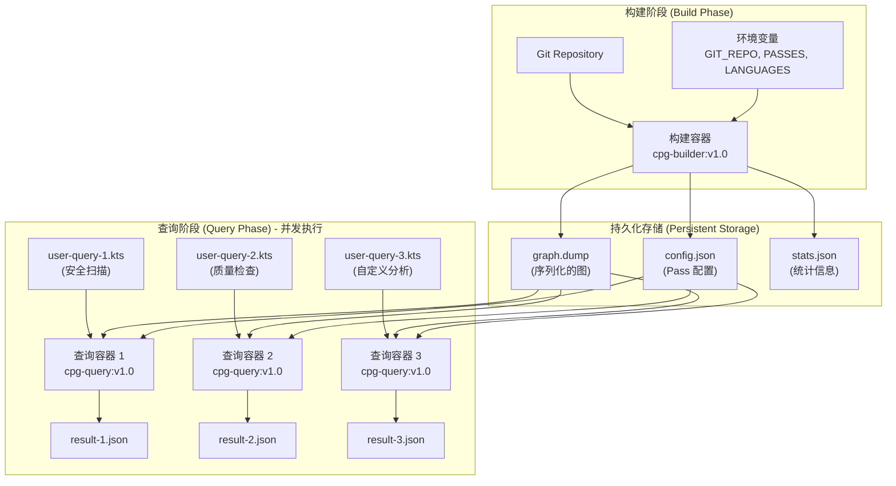
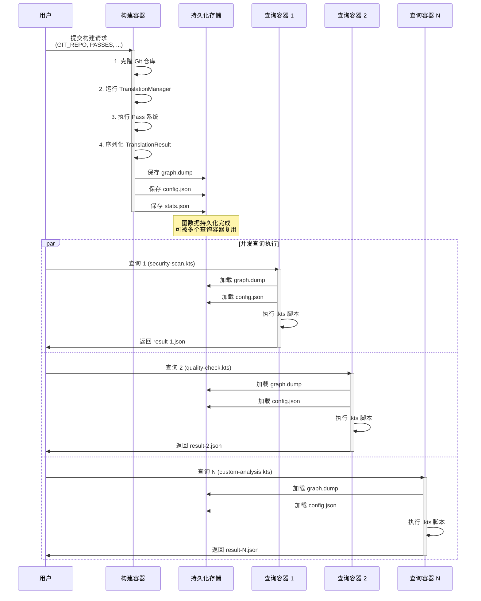
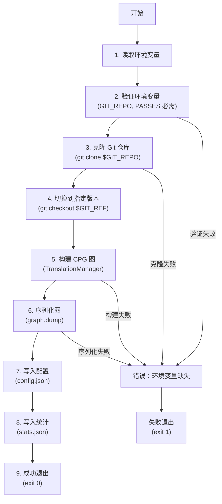
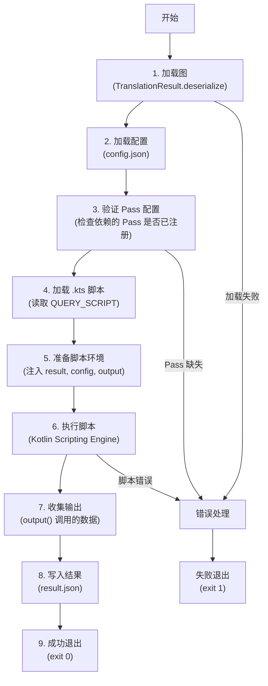

# 8.1 CPG 容器化架构设计

**文档版本**: 1.0
**创建日期**: 2025-11-12
**目标读者**: 架构师、技术决策者、开发团队负责人
**文档目标**: 理解 CPG 容器化架构的设计原则、技术选型和实施路径

---

## 目录

1. [问题陈述](#1-问题陈述)
2. [架构愿景](#2-架构愿景)
3. [核心设计原则](#3-核心设计原则)
4. [目标架构](#4-目标架构)
5. [数据流设计](#5-数据流设计)
6. [构建容器设计](#6-构建容器设计)
7. [查询容器设计](#7-查询容器设计)
8. [序列化方案设计](#8-序列化方案设计)
9. [关键技术挑战](#9-关键技术挑战)
10. [成功标准](#10-成功标准)
11. [总结](#11-总结)

---

## 1. 问题陈述

### 1.1 当前 CPG 使用模式的局限性

当前 CPG（Code Property Graph）采用**单体运行模式**：在同一个进程中完成图构建和查询，无法复用构建结果。

**典型工作流**：
```kotlin
// 每次分析都需要重新构建图
val result = TranslationManager.builder()
    .config(config)
    .build()
    .analyze()  // 构建图（耗时：大型项目 10+ 分钟）

// 立即查询
result.executionPath(...) { ... }  // 查询 1
result.dataFlow(...) { ... }       // 查询 2
```

**存在的问题**：

1. **无法复用构建结果**
   - 每次查询都需要重新构建图
   - 大型项目构建耗时可能超过 10 分钟
   - 多个分析任务重复构建，浪费资源

2. **无法横向扩展查询**
   - 一个构建结果无法被多个查询进程共享
   - 并发查询需要多次构建同一个图
   - 资源利用率低

3. **无法离线分析**
   - 构建和查询绑定在同一个运行环境
   - CI/CD 集成困难（构建环境和分析环境往往不同）
   - 无法分离"图构建"和"业务分析"的职责

4. **缺乏持久化能力**
   - 构建结果只存在于内存
   - 进程退出后，构建结果丢失
   - 无法在不同时间、不同环境复用同一个图

---

### 1.2 实际业务场景需求

#### 场景 1: CI/CD 代码扫描

**需求**：
```
PR 提交 → 构建容器分析代码 → 多个查询容器并行执行：
  ├─ 安全漏洞扫描（query-security.kts）
  ├─ 代码质量检查（query-quality.kts）
  ├─ 许可证合规检查（query-license.kts）
  └─ 自定义业务规则验证（query-custom.kts）
```

**当前痛点**：
- 每个检查都需要重新构建图（4 次构建 → 40+ 分钟）
- 无法并行执行（单进程）

**期望**：
- 构建一次图（10 分钟）
- 4 个查询容器并行执行（每个 <1 分钟）
- 总耗时：~10 分钟（75% 时间节省）

---

#### 场景 2: 代码审计平台

**需求**：
```
用户上传代码 → 后台构建图 → 用户通过 Web UI 执行动态查询：
  ├─ 查找特定 API 调用
  ├─ 分析数据流路径
  ├─ 生成调用图
  └─ 导出分析报告
```

**当前痛点**：
- 用户每次查询都需要重新构建（体验差）
- 无法支持"探索式分析"（用户需要多次调整查询逻辑）

**期望**：
- 后台一次性构建图（异步任务）
- 用户多次查询，无需等待构建
- 查询响应时间 <5 秒

---

#### 场景 3: 大规模代码分析

**需求**：
```
构建一次（夜间批处理）→ 多个分析任务（白天）：
  ├─ 100+ 个代码仓库
  ├─ 每个仓库 10+ 个分析维度
  └─ 需要支持增量更新
```

**当前痛点**：
- 100 个仓库 × 10 个分析 = 1000 次构建（不现实）
- 无法利用云原生架构（Kubernetes, Serverless）

**期望**：
- 100 个仓库各构建一次（夜间批处理）
- 白天 1000 个查询容器并行执行（Serverless 模式）
- 可横向扩展（根据负载动态增加查询容器）

---

### 1.3 核心需求总结

**目标模式**：**Build Once, Query Many**

```
┌────────────────┐
│  Build Once    │  构建一次，持久化存储
└────────┬───────┘
         │
         ├─────► Query 1 (并发)
         ├─────► Query 2 (并发)
         ├─────► Query 3 (并发)
         └─────► ... (N 个查询)
```

**核心价值**：
- ✅ **性能提升**：避免重复构建，节省 70-90% 时间
- ✅ **资源优化**：构建一次，查询多次，提高资源利用率
- ✅ **横向扩展**：查询容器无状态，可根据负载动态扩展
- ✅ **灵活部署**：构建和查询可在不同环境运行（云端构建，本地查询）

---

## 2. 架构愿景

### 2.1 目标架构概览

```
┌─────────────────────────────────────────────────────────┐
│  Phase 1: BUILD (构建容器)                                │
│  ──────────────────────────────────────────────────────│
│  Input:  Git Repository + 环境变量配置                    │
│  Output: graph.dump + config.json + stats.json         │
└──────────────────────┬──────────────────────────────────┘
                       │
                       ↓ (持久化到存储)
                 ┌──────────────┐
                 │  Storage     │
                 │  ──────────  │
                 │  • File Sys  │
                 │  • S3/OSS    │
                 │  • NFS       │
                 └──────┬───────┘
                       │ (加载)
                       ↓
┌─────────────────────────────────────────────────────────┐
│  Phase 2: QUERY (查询容器, N 实例并行)                    │
│  ──────────────────────────────────────────────────────│
│  Input:  user-query.kts + graph reference              │
│  Output: query-result.json + logs.txt                  │
└─────────────────────────────────────────────────────────┘
```

---

### 2.2 关键架构特性

**1. 构建与查询完全解耦**
- 构建容器：只负责构建图，不执行查询
- 查询容器：只负责查询，不构建图
- 两者通过持久化存储通信（文件系统/对象存储）

**2. 查询容器无状态**
- 查询容器是 Serverless Function 模式
- 用户提供 Kotlin Script (.kts) 代码，容器执行并返回结果
- 支持并发执行多个查询（N 个查询容器 → 1 个构建产物）

**3. 配置即代码**
- 构建配置通过环境变量传递（`GIT_REPO`, `PASSES`, `LANGUAGES`）
- 查询容器从持久化存储加载配置（`registeredPasses`）
- 支持声明式配置（YAML/JSON）

---

## 3. 核心设计原则

### 原则 1: 构建与查询完全解耦

**设计目标**：构建容器和查询容器可以在不同机器、不同时间、不同环境运行。

**实现方式**：
- ✅ 通过持久化存储传递数据（而非共享内存）
- ✅ 构建容器输出标准化格式（graph.dump, config.json, stats.json）
- ✅ 查询容器只读图数据（不修改图）

**验证标准**：
```bash
# 场景：构建在云端，查询在本地
docker run cpg-builder:v1.0 \
  -e GIT_REPO=https://github.com/user/repo.git \
  -v /mnt/s3/graphs:/output

# 下载到本地
aws s3 cp s3://cpg-graphs/repo/graph.dump ./graph.dump

# 本地查询
docker run cpg-query:v1.0 \
  -e GRAPH_PATH=./graph.dump \
  -e QUERY_SCRIPT=./my-query.kts
```

---

### 原则 2: 查询容器无状态且可横向扩展

**设计目标**：查询容器类似 Serverless Function，可根据负载动态扩展。

**实现方式**：
- ✅ 查询容器不保存状态（每次查询独立）
- ✅ 图数据是只读的（并发查询无冲突）
- ✅ 查询结果输出到独立目录（隔离）

**扩展模型**：
```yaml
# Docker Compose 扩展示例
docker-compose up --scale query=10  # 启动 10 个查询容器

# Kubernetes HPA 示例
apiVersion: autoscaling/v2
kind: HorizontalPodAutoscaler
metadata:
  name: cpg-query-hpa
spec:
  scaleTargetRef:
    apiVersion: apps/v1
    kind: Deployment
    name: cpg-query
  minReplicas: 3
  maxReplicas: 100
  metrics:
    - type: Resource
      resource:
        name: cpu
        target:
          type: Utilization
          averageUtilization: 70
```

---

### 原则 3: 配置即代码，环境变量驱动

**设计目标**：所有配置通过环境变量传递，支持声明式配置。

**构建容器配置**：
```bash
# 必需环境变量
GIT_REPO=https://github.com/user/repo.git
GIT_REF=main  # branch, tag, or commit SHA

# Pass 配置（逗号分隔）
PASSES=EvaluationOrderGraphPass,ControlFlowSensitiveDFGPass,UnreachableEOGPass

# 语言前端（逗号分隔）
LANGUAGES=java,kotlin

# 输出路径
OUTPUT_PATH=/output/graph.dump
```

**查询容器配置**：
```bash
# 图路径
GRAPH_PATH=/input/graph.dump

# 查询脚本路径
QUERY_SCRIPT=/queries/user-query.kts

# 查询超时（秒）
QUERY_TIMEOUT=300

# 内存限制（MB）
MAX_MEMORY=4096
```

---

## 4. 目标架构

### 4.1 整体架构图



---

### 4.2 组件职责划分

| 组件 | 职责 | 输入 | 输出 |
|------|------|------|------|
| **构建容器** | 克隆代码、构建图、序列化 | Git Repo + 环境变量 | graph.dump, config.json, stats.json |
| **存储层** | 持久化图数据 | 构建容器输出 | 查询容器输入 |
| **查询容器** | 加载图、执行 .kts 脚本、输出结果 | graph.dump + user-query.kts | result.json |

---

## 5. 数据流设计

### 5.1 完整数据流图



---

### 5.2 数据格式规范

#### 5.2.1 graph.dump（序列化的图）

**格式**：紧凑的二进制格式（非人类可读）

**内容**：
- 所有节点（Node）及其属性
- 所有边（EOG, DFG, CDG, PDG, Invoke, ...）及其属性
- 节点引用关系（处理循环引用）

**大小估算**：
- 10K LOC 项目：~50-100 MB
- 50K LOC 项目：~200-500 MB
- 100K LOC 项目：~500-1000 MB

**存储位置**：
- 本地文件系统：`/output/graph.dump`
- 对象存储：`s3://cpg-graphs/repo-name/commit-sha/graph.dump`

---

#### 5.2.2 config.json（配置元数据）

**格式**：JSON（人类可读）

**内容**：
```json
{
  "version": "cpg-8.2.0",
  "registeredPasses": [
    "EvaluationOrderGraphPass",
    "ControlFlowSensitiveDFGPass",
    "UnreachableEOGPass"
  ],
  "languages": ["java", "kotlin"],
  "buildTimestamp": "2025-11-12T10:30:00Z",
  "gitInfo": {
    "repo": "https://github.com/user/repo.git",
    "ref": "main",
    "commit": "a1b2c3d4e5f6"
  }
}
```

**用途**：
- 查询容器加载后，验证 Pass 配置
- 用户查看构建配置（调试）

---

#### 5.2.3 stats.json（统计信息）

**格式**：JSON（人类可读）

**内容**：
```json
{
  "nodeCount": 125000,
  "edgeCount": 450000,
  "buildDurationSeconds": 180,
  "linesOfCode": 50000,
  "fileCount": 250,
  "memoryUsedMB": 2048
}
```

**用途**：
- 监控构建性能
- 预估查询容器内存需求

---

## 6. 构建容器设计

### 6.1 构建容器职责

**核心任务**：
1. 克隆 Git 仓库（根据 `GIT_REPO`, `GIT_REF`）
2. 运行 TranslationManager（根据 `PASSES`, `LANGUAGES`）
3. 序列化 TranslationResult 到文件
4. 输出配置元数据和统计信息

---

### 6.2 环境变量配置

| 环境变量 | 必需 | 默认值 | 说明 |
|---------|------|--------|------|
| `GIT_REPO` | ✅ | - | Git 仓库 URL |
| `GIT_REF` | ✅ | `main` | 分支、标签或 commit SHA |
| `PASSES` | ✅ | - | Pass 列表（逗号分隔） |
| `LANGUAGES` | ✅ | - | 语言前端列表（逗号分隔） |
| `OUTPUT_PATH` | ❌ | `/output` | 输出目录路径 |
| `SOURCE_INCLUDES` | ❌ | `**/*.java,**/*.kt` | 源码路径过滤（包含） |
| `SOURCE_EXCLUDES` | ❌ | `**/test/**,**/generated/**` | 源码路径过滤（排除） |

---

### 6.3 构建流程



---

### 6.4 构建产物规范

**输出目录结构**：
```
/output/
├── graph.dump          # 序列化的图（二进制）
├── config.json         # 配置元数据（JSON）
├── stats.json          # 统计信息（JSON）
└── build.log           # 构建日志（可选）
```

---

## 7. 查询容器设计

### 7.1 查询容器职责

**核心任务**：
1. 加载序列化的图（从 `GRAPH_PATH`）
2. 加载配置元数据（验证 Pass 完整性）
3. 执行用户提供的 .kts 脚本
4. 输出查询结果（JSON 格式）

---

### 7.2 为什么使用 Kotlin Script (.kts)？

| 维度 | Kotlin Script (.kts) | 普通 Kotlin (.kt) | 推荐 |
|------|---------------------|------------------|------|
| **执行方式** | 直接运行，无需编译 | 需要编译成 JAR | ✅ .kts |
| **用户体验** | 类似脚本语言（Python/Shell）| 需要构建系统（Gradle）| ✅ .kts |
| **动态加载** | 运行时加载执行 | 编译时固化 | ✅ .kts |
| **快速迭代** | 修改后立即执行 | 修改 → 编译 → 执行 | ✅ .kts |
| **Serverless 兼容** | 天然适合（函数即代码）| 需要打包成 JAR | ✅ .kts |
| **IDE 支持** | IntelliJ 完整支持 | IntelliJ 完整支持 | ✅ 两者都好 |
| **类型检查** | ✅ 编译时检查 | ✅ 编译时检查 | ✅ 两者都好 |

**结论**：.kts 更适合"用户自定义查询脚本"场景。

---

### 7.3 查询脚本示例

```kotlin
// user-query.kts
// 查询容器自动注入以下变量：
// - val result: TranslationResult
// - val config: TranslationConfiguration
// - fun output(data: Any)  // 输出结果到 JSON

// 用户查询逻辑（纯 Kotlin DSL）
val ifStatements = result.allNodes<IfStatement>()

val unreachableBranches = ifStatements.filter { ifStmt ->
    ifStmt.nextEOGEdges.any { edge ->
        edge is EvaluationOrder && edge.unreachable == true
    }
}

// 输出结果（自动转 JSON）
output(mapOf(
    "totalIfStatements" to ifStatements.size,
    "unreachableBranches" to unreachableBranches.map {
        mapOf(
            "file" to it.location?.artifactLocation?.uri,
            "line" to it.location?.region?.startLine
        )
    }
))
```

**执行流程**：
```
1. 用户编写 user-query.kts（纯业务逻辑）
2. 上传到查询容器（通过 Volume 挂载）
3. 查询容器加载图 → 执行脚本 → 输出结果
4. 无需编译、打包、构建
```

---

### 7.4 查询容器流程



---

### 7.5 Kotlin Scripting Engine 集成

**核心代码**：
```kotlin
// query-runner.kt (查询容器入口)
import kotlin.script.experimental.api.*
import kotlin.script.experimental.jvm.*
import kotlin.script.experimental.host.toScriptSource

fun main() {
    // 1. 加载图
    val result = TranslationResult.deserialize(System.getenv("GRAPH_PATH"))

    // 2. 准备脚本环境
    val scriptEngine = KotlinJvmScriptEngine()
    val scriptContext = ScriptContext(
        providedValues = mapOf(
            "result" to result,
            "config" to result.config,
            "output" to ::outputToJson
        )
    )

    // 3. 执行用户脚本
    val scriptFile = File(System.getenv("QUERY_SCRIPT"))
    val evalResult = scriptEngine.eval(
        scriptFile.toScriptSource(),
        scriptContext
    )

    // 4. 处理结果或异常
    when (evalResult) {
        is ResultWithDiagnostics.Success -> println("Query completed")
        is ResultWithDiagnostics.Failure -> {
            evalResult.reports.forEach { println(it.message) }
            exitProcess(1)
        }
    }
}
```

**依赖**：
```kotlin
dependencies {
    implementation("org.jetbrains.kotlin:kotlin-scripting-jvm")
    implementation("org.jetbrains.kotlin:kotlin-scripting-jvm-host")
    implementation("org.jetbrains.kotlin:kotlin-scripting-common")
}
```

---

## 8. 序列化方案设计

### 8.1 为什么不用 Neo4j？

**CPG 查询模式 vs Neo4j 设计目标不匹配**：

| 维度 | Neo4j 设计目标 | CPG 查询需求 | 结论 |
|------|---------------|-------------|------|
| **查询深度** | 浅层关系查询（1-3 跳）| 深度遍历（数千层）| ❌ 不匹配 |
| **典型应用** | 社交网络、推荐系统 | 过程间数据流分析 | ❌ 不匹配 |
| **查询语言** | Cypher（声明式） | Kotlin DSL（命令式）| ❌ 不匹配 |
| **性能模型** | O(degree^N)（指数级）| O(N)（线性）| ❌ 性能差 |

**结论**：所有查询必须发生在 Kotlin DSL（内存），因此必须将完整图加载到内存。

---

### 8.2 二进制序列化要求

**核心要求**（用户明确）：
- ✅ **紧凑的二进制格式**（不是 JSON/YAML 等人类可读格式）
- ✅ **快速序列化/反序列化**（大型图 50K+ 节点）
- ✅ **处理循环引用**（CPG 图中大量循环引用）
- ✅ **JVM 原生**（只在 Kotlin/JVM 使用，不需要跨语言）
- ✅ **文件格式稳定**（至少在同一 CPG 版本内可用）

---

### 8.3 候选序列化库对比

| 库 | 紧凑性 | 速度 | 循环引用 | JVM 原生 | 成熟度 | 备注 |
|---|--------|------|---------|---------|--------|------|
| **Kryo** | ⭐⭐⭐⭐⭐ | ⭐⭐⭐⭐⭐ | ✅ 自动 | ✅ | ⭐⭐⭐⭐⭐ | 最紧凑、最快 |
| **FST** | ⭐⭐⭐⭐ | ⭐⭐⭐⭐ | ✅ 自动 | ✅ | ⭐⭐⭐ | Kryo 替代品 |
| **Protocol Buffers** | ⭐⭐⭐ | ⭐⭐⭐ | ❌ 需手动 | ❌ | ⭐⭐⭐⭐⭐ | 跨语言（但不需要）|
| **Avro** | ⭐⭐⭐ | ⭐⭐⭐ | ❌ 需手动 | ❌ | ⭐⭐⭐⭐ | Hadoop 生态 |
| **Java Serialization** | ⭐⭐ | ⭐ | ✅ 自动 | ✅ | ⭐⭐ | 性能差、已过时 |

---

### 8.4 评估维度（Phase 1 第一步）

**1. 基准测试**：
- 小型图（<10K 节点）：序列化/反序列化耗时、文件大小
- 大型图（50K+ 节点）：序列化/反序列化耗时、文件大小

**2. 循环引用处理**：
- 自动测试 CPG 的循环引用场景
- 验证往返一致性（序列化 → 反序列化 → 图结构一致）

**3. 集成难度**：
- 与 CPG 现有代码集成的复杂度
- 依赖管理（需要添加哪些库）

**4. 决策推迟到 Phase 1**：
- ⏳ 具体库选型需要实际测试数据
- ⏳ 优先测试 Kryo（社区推荐最多）
- ⏳ 备选方案：FST（如果 Kryo 有问题）

---

### 8.5 序列化 API 设计

**序列化**：
```kotlin
// TranslationResult.kt (扩展函数)
fun TranslationResult.serialize(path: String) {
    // 1. 创建序列化器（使用选定的库）
    val serializer = createSerializer()

    // 2. 序列化图（处理循环引用）
    val graphBytes = serializer.serialize(this)

    // 3. 写入文件
    File(path).writeBytes(graphBytes)

    // 4. 写入配置元数据
    File("$path.config.json").writeText(config.toJSON())

    // 5. 写入统计信息
    File("$path.stats.json").writeText(stats.toJSON())
}
```

**反序列化**：
```kotlin
fun TranslationResult.Companion.deserialize(path: String): TranslationResult {
    // 1. 读取文件
    val graphBytes = File(path).readBytes()

    // 2. 反序列化图
    val deserializer = createDeserializer()
    val result = deserializer.deserialize<TranslationResult>(graphBytes)

    // 3. 验证配置完整性
    val config = File("$path.config.json").readText().parseJSON()
    result.validateConfig(config)

    return result
}
```

---

## 9. 关键技术挑战

### 9.1 挑战 1: 图的序列化（循环引用）

**问题**：CPG 是有向图，存在循环引用（如递归函数调用）

**解决方案**：两阶段序列化

```kotlin
// Phase 1: 序列化所有节点（分配全局 ID）
val nodeIdMap = mutableMapOf<Node, Long>()
nodes.forEachIndexed { index, node ->
    nodeIdMap[node] = index.toLong()
}

// Phase 2: 序列化边（引用节点 ID）
edges.forEach { edge ->
    proto.addEdge(EdgeProto(
        startId = nodeIdMap[edge.start],
        endId = nodeIdMap[edge.end],
        type = edge::class.simpleName,
        properties = edge.serializeProperties()
    ))
}

// 反序列化时，先恢复所有节点，再恢复边引用
```

---

### 9.2 挑战 2: 序列化文件过大

**问题**：大型项目可能产生 GB 级文件，加载慢

**解决方案 1: 分块存储**
```
graph.cpg/
├── manifest.json        # 元数据（节点数、分块信息）
├── nodes/
│   ├── chunk-0.bin     # 前 10K 节点
│   ├── chunk-1.bin     # 下 10K 节点
│   └── ...
└── edges/
    ├── eog.bin         # EOG 边
    ├── dfg.bin         # DFG 边
    └── ...
```

**解决方案 2: 延迟加载（Lazy Loading）**
```kotlin
class LazyTranslationResult(manifest: Manifest) : TranslationResult {
    private val nodeCache = mutableMapOf<Long, Node>()

    override fun getNode(id: Long): Node {
        return nodeCache.getOrPut(id) {
            // 从磁盘加载单个节点
            loadNodeFromDisk(id)
        }
    }
}
```

---

### 9.3 挑战 3: Pass 配置验证

**问题**：查询时使用 `FilterUnreachableEOG`，但构建时未注册 `UnreachableEOGPass`

**解决方案**：运行时验证

```kotlin
// 在 Sensitivity 初始化时验证
object FilterUnreachableEOG : AnalysisSensitivity() {
    init {
        // 在首次使用时验证（lazy 初始化）
        validatePassRegistered(UnreachableEOGPass::class)
    }
}

// 辅助函数
fun validatePassRegistered(passClass: KClass<out Pass<*>>) {
    val registered = currentResult.config.registeredPasses.flatten()
    if (passClass !in registered) {
        throw MissingPassException(
            required = passClass.simpleName,
            registered = registered.map { it.simpleName }
        )
    }
}
```

---

### 9.4 挑战 4: Kotlin Script Engine 集成

**问题**：如何在查询容器中执行用户上传的 .kts 脚本？

**解决方案**：集成 Kotlin Scripting Host（见 7.5 节）

**关键技术点**：
- ✅ 变量注入（result, config, output）
- ✅ 默认 Import（自动 import CPG API）
- ✅ 脚本编译缓存（同一脚本多次执行只编译一次）
- ✅ 脚本沙箱（限制文件系统、网络访问）

---

### 9.5 挑战 5: 并发查询的隔离

**问题**：多个查询容器并发访问同一个图，可能冲突

**解决方案**：
- ✅ **图不可变**：序列化后的图是只读的，查询不修改图
- ✅ **查询结果隔离**：每个查询容器有独立的输出目录
- ✅ **内存隔离**：每个查询容器独立进程，不共享内存
- ✅ **脚本隔离**：每个查询容器执行独立的 .kts 文件

---

## 10. 成功标准

### 10.1 功能性标准

| 标准 | 验证方法 |
|------|---------|
| ✅ 构建与查询完全解耦 | 构建容器和查询容器可以在不同机器运行 |
| ✅ 图序列化完整性 | 序列化 → 反序列化后，节点数/边数/属性完全一致 |
| ✅ Pass 配置验证 | 查询时使用未注册 Pass 的 Sensitivity，抛出清晰错误 |
| ✅ 并发查询隔离 | 10 个查询容器并发查询同一个图，结果正确且无冲突 |
| ✅ Kotlin Script 执行 | 用户可以编写 .kts 脚本，无需编译即可执行 |
| ✅ 脚本类型检查 | .kts 脚本编译时检查类型，提供清晰错误 |
| ✅ IDE 支持 | IntelliJ 可以编辑 .kts 并提供代码补全（验证 import 正确）|

---

### 10.2 性能标准

| 指标 | 目标 | 验证项目 |
|------|------|---------|
| 构建耗时 | ≤ 单体运行的 1.2x | 10K LOC 项目 |
| 序列化耗时 | ≤ 30 秒 | 50K 节点图 |
| 反序列化耗时 | ≤ 60 秒 | 50K 节点图 |
| .kts 脚本启动 | ≤ 5 秒 | 首次编译 + 加载（含图加载时间）|
| 查询响应时间 | ≤ 单体运行的 1.1x | executionPath 查询（图已加载后）|
| 文件大小 | ≤ 100MB | 10K LOC 项目的序列化文件 |

---

### 10.3 易用性标准

| 标准 | 验证方法 |
|------|---------|
| ✅ 快速开始 | 新用户 5 分钟内完成第一次构建+查询（使用示例 .kts）|
| ✅ 脚本即用 | 用户修改 .kts 后，无需重新构建容器即可执行 |
| ✅ 错误提示清晰 | 所有常见错误（Pass 未注册、脚本语法错误、...）有清晰提示 |
| ✅ 文档完整 | 架构设计、实现指南、用户手册、API 参考、.kts 示例齐全 |
| ✅ 示例丰富 | 至少 5 个 .kts 查询脚本示例（安全、质量、合规、...）|

---

## 11. 总结

### 11.1 核心价值

**1. 性能提升**
- 避免重复构建，节省 70-90% 时间
- 并发查询，充分利用资源

**2. 架构灵活性**
- 构建和查询可在不同环境运行
- 支持云原生架构（Kubernetes, Serverless）

**3. 用户体验**
- Kotlin Script (.kts) 支持快速迭代
- 无需编译，修改后立即执行

**4. 可扩展性**
- 查询容器无状态，可横向扩展
- 支持 100+ 并发查询

---

### 11.2 架构优势

| 优势 | 说明 |
|------|------|
| **解耦** | 构建和查询完全分离，职责清晰 |
| **无状态** | 查询容器可横向扩展，支持 Serverless |
| **持久化** | 图数据持久化存储，可复用 |
| **灵活** | 支持多种存储后端（文件系统、S3/OSS、NFS）|
| **高效** | 紧凑的二进制序列化，快速加载 |
| **安全** | 脚本沙箱，限制文件系统和网络访问 |

---

### 11.3 下一步

**阅读相关文档**：
- **8.2-实现-分步指南.md**：详细实施步骤（Phase 1-2）
- **8.3-手册-使用指南.md**：快速开始和常见问题
- **8.4-参考-API文档.md**：API 签名和环境变量参考

**开始实施**：
- **Phase 1**: 序列化/反序列化实现（2-3 周）
- **Phase 2**: 容器化打包（1 周）

---

**文档版本**: 1.0
**最后更新**: 2025-11-12
**下一版本计划**: 添加 Kubernetes 部署架构图
