# Home

<!-- Source: docs/index.md -->

---
title: "Home"
linkTitle: "Home"
weight: 20
no_list: false
menu:
  main:
    weight: 20
hide:
  - navigation
description: >
    The CPG library is a language-agnostic graph representation of source code.
---

## What does the CPG library offer?


A Code Property Graph (CPG) is a graph-based representation of code which unites
several concepts such as an Abstract Syntax Tree (AST), Control Flow Graph
(CFG) or Evaluation Order Graph (EOG), Data Flow Graph (DFG) or Control Dependence
Graph (CDG), among others, in a single supergraph. This is beneficial because
the CPG contains the most relevant information to conduct static program
analysis and yet, the graph provides a certain abstraction of the respective
programming language.


<p class="empty-small" />

<div style="display:grid;grid-template-columns: auto auto auto;" markdown>

 <div class="box 1" markdown>
  <h3>Supported Languages</h3>

  ---

  The library supports the following programming languages out of the box:

  * Java (Source code, JVM bytecode and Jimple)
  * C/C++
  * Go
  * Python
  * TypeScript
  * LLVM-IR
  * Ruby

  Nothing suitable found? [Write your own language frontend](./CPG/impl/language.md)
  for the respective language.
  </div>

  <div class="box 2" markdown>
  <h3>Built-in Analyses</h3>

  ---

  The library currently provides different analyses:
  
  * Dataflow Analysis
  * Reachability Analysis
  * Constant Propagation
  * Intraprocedural Order Evaluation of Statements
  </div>

  <div class="box 3" markdown>
  <h3>Accessing the Graph</h3>
  
  ---
  
  The library can be used by analysts or tools in different ways:

  * The graph can be exported to the graph database [neo4j](https://neo4j.com)
  * The CPG can be included into every project as a library
  * [Codyze](./GettingStarted/codyze.md), a tool checking for compliance of your software artifacts against certain requirements and visualizing the graph and the results in a webconsole
  * We provide an API for querying the graph for interesting properties
  </div>

  <div class="box 4" markdown>
  <h3>Highly Extensible</h3>
  
  ---
  
  The library is easily extensible. You can add new...

  * language frontends <font size="2">[Tell me more about it!](./CPG/impl/language.md)</font>,
  * passes <font size="2">[Tell me more about it!](./CPG/impl/passes.md)</font> or
  * analyses.
  </div>

  <div class="box 5" markdown>
  <h3>Handling Incomplete Code</h3>
  
  ---
  
  The code you have to analyze is missing dependencies, is under active development and might
  miss some code fragments?
  <br>
  No problem! Our tooling provides a certain resilience against such problems.
   <!--This allows our toolchain to analyze programs even if the current code base is incomplete and incorrect to a certain extent.-->
  </div>

  <div class="box 6" markdown>
  </div>

</div>

<p class="empty"/>

<div class="float-container" markdown>
<div class="left-picture">

</div>
<div class="left-picture-text" markdown>

## About Us

We're a team of researchers at <a href="https://www.aisec.fraunhofer.de/">Fraunhofer AISEC</a>.
We're interested in different topics in the area of static program analysis. If
you're interested in our work, feel free to reach out to us - we're happy to
collaborate and push the boundaries of static code analysis.
</div>
</div>

<p class="empty" style="border-top: 1px solid #c7cacc;" />


## Publications

### 2024

<div class="papers">

<div class="admonition paper">
  <p class="admonition-title">Analyzing the Impact of Copying-and-Pasting Vulnerable Solidity Code Snippets from Question-and-Answer Websites</p>
  <div class="left">
    <p class="authors">Konrad Weiss, Christof Ferreira Torres, Florian Wendland</p>
    <p class="conference">In: ACM Internet Measurement Conference (IMC). Madrid, Spain.</p>
    <details>
      <summary>bibtex</summary>
      <pre><code>@inproceedings{weiss2024solidity,
  author={Weiss, Konrad and Ferreira Torres, Christof and Wendland, Florian},
  title={Analyzing the Impact of Copying-and-Pasting Vulnerable Solidity Code Snippets from Question-and-Answer Websites},
  year={2024},
  booktitle={Proceedings of the 2024 ACM on Internet Measurement Conference},
  series={IMC '24},
  doi = {10.1145/3646547.3688437},
  location = {Madrid, Spain},
  publisher={ACM}
}</code></pre>
    </details>
  </div>
  <div class="right">
    <a class="green-button" href="https://doi.org/10.1145/3646547.3688437">paper</a>
  </div>
</div>

</div>

### 2023

<div class="papers">

<div class="admonition paper">
  <p class="admonition-title">A Uniform Representation of Classical and Quantum Source Code for Static Code Analysis</p>
  <div class="left">
    <p class="authors">Maximilian Kaul, Alexander Küchler, Christian Banse</p>
    <p class="conference">In: IEEE International Conference on Quantum Computing and Engineering (QCE). Bellevue, WA, USA.</p>
    <details>
      <summary>bibtex</summary>
      <pre><code>@inproceedings{kaul2023qcpg,
  author={Maximilian Kaul and Alexander K\"uchler and Christian Banse},
  title={A Uniform Representation of Classical and Quantum Source Code for Static Code Analysis},
  year={2023},
  booktitle={2023 IEEE International Conference on Quantum Computing and Engineering},
  series={QCE '23},
  doi={10.1109/QCE57702.2023.00115},
  location={Bellevue, WA, USA},
  publisher={IEEE}
}</code></pre>
    </details>
  </div>
  <div class="right">
    <a class="green-button" href="https://arxiv.org/pdf/2308.06113.pdf">preprint</a><br />
    <a class="green-button" href="https://doi.org/10.1109/QCE57702.2023.00115">paper</a>
  </div>
</div>

<div class="admonition paper">
  <p class="admonition-title">AbsIntIO: Towards Showing the Absence of Integer Overflows in Binaries using Abstract Interpretation</p>
  <div class="left">
    <p class="authors">Alexander Küchler, Leon Wenning, Florian Wendland</p>
    <p class="conference">In: ACM ASIA Conference on Computer and Communications Security (Asia CCS). Melbourne, VIC, Australia.</p>
    <details>
      <summary>bibtex</summary>
      <pre><code>@inproceedings{kuechler2023absintio,
  author={Alexander K\"uchler and Leon Wenning and Florian Wendland},
  title={AbsIntIO: Towards Showing the Absence of Integer Overflows in Binaries using Abstract Interpretation},
  year={2023},
  booktitle={ACM ASIA Conference on Computer and Communications Security},
  series={Asia CCS '23},
  doi={10.1145/3579856.3582814},
  location={Melbourne, VIC, Australia},
  publisher={ACM}
}</code></pre>
    </details>
  </div>
  <div class="right">
    <a class="green-button" href="https://doi.org/10.1145/3579856.3582814">paper</a>
  </div>
</div>

</div>

### 2022

<div class="papers">

<div class="admonition paper">
  <p class="admonition-title">Representing LLVM-IR in a Code Property Graph</p>
  <div class="left">
    <p class="authors">Alexander Küchler, Christian Banse</p>
    <p class="conference">In: 25th Information Security Conference (ISC). Bali, Indonesia.</p>
    <details>
      <summary>bibtex</summary>
      <pre><code>@inproceedings{kuechler2022representing,
  author={Alexander K\"uchler and Christian Banse},
  title={Representing LLVM-IR in a Code Property Graph},
  year={2022},
  booktitle={25th Information Security Conference},
  series={ISC},
  doi={10.1007/978-3-031-22390-7\_21},
  location={Bali, Indonesia},
  publisher={Springer}
}</code></pre>
    </details>
  </div>
  <div class="right">
    <a class="green-button" href="https://arxiv.org/pdf/2211.05627.pdf">preprint</a><br />
    <a class="green-button" href="https://link.springer.com/chapter/10.1007/978-3-031-22390-7_21">paper</a>
  </div>
</div>

<div class="admonition paper">
  <p class="admonition-title">A Language-Independent Analysis Platform for Source Code</p>
  <div class="left">
    <p class="authors">Konrad Weiss, Christian Banse</p>
    <details>
      <summary>bibtex</summary>
      <pre><code>@misc{weiss2022a,
  doi = {10.48550/ARXIV.2203.08424},
  url = {https://arxiv.org/abs/2203.08424},
  author = {Weiss, Konrad and Banse, Christian},
  title = {A Language-Independent Analysis Platform for Source Code},
  publisher = {arXiv},
  year = {2022},
}</code></pre>
    </details>
  </div>
  <div class="right">
    <a class="green-button" href="https://arxiv.org/pdf/2203.08424.pdf">paper</a>
  </div>
</div>

</div>

### 2021

<div class="papers" style=" border-bottom: 1px solid #c7cacc;">

<div class="admonition paper">
  <p class="admonition-title">Cloud Property Graph: Connecting Cloud Security Assessments with Static Code Analysis</p>
  <div class="left">
    <p class="authors">Christian Banse, Immanuel Kunz, Angelika Schneider, Konrad Weiss</p>
    <p class="conference">In: 2021 IEEE 14th International Conference on Cloud Computing (CLOUD). Los Alamitos, CA, USA</p>
    <details>
      <summary>bibtex</summary>
      <pre><code>@inproceedings{banse2021cloudpg,
  author = {Christian Banse and Immanuel Kunz and Angelika Schneider and Konrad Weiss},
  booktitle = {2021 IEEE 14th International Conference on Cloud Computing (CLOUD)},
  title = {Cloud Property Graph: Connecting Cloud Security Assessments with Static Code Analysis},
  year = {2021},
  pages = {13-19},
  doi = {10.1109/CLOUD53861.2021.00014},
  url = {https://doi.ieeecomputersociety.org/10.1109/CLOUD53861.2021.00014},
  publisher = {IEEE Computer Society},
  address = {Los Alamitos, CA, USA},
  month = {sep}
}</code></pre>
    </details>
  </div>
  <div class="right">
    <a class="green-button" href="https://arxiv.org/pdf/2206.06938.pdf">preprint</a><br />
    <a class="green-button" href="https://www.computer.org/csdl/proceedings-article/cloud/2021/006000a013/1ymJ7POIlxe">paper</a>
  </div>
</div>

</div>


# Getting Started

<!-- Source: docs/GettingStarted/index.md -->

---
title: "Getting Started"
linkTitle: "Getting Started"
no_list: true
weight: 2
date: 2020-01-30
description: >
  Using the CPG library
---


# Getting Started

The CPG can be used in different ways:

* [Using Codyze](./codyze.md)
* [As a library for Kotlin/Java](./library.md)
* [With custom automated analyses using the Query API](./query.md)
* [Via neo4j](./neo4j.md)


In the first three cases, the [Shortcuts](./shortcuts) provide you a convenient way to
quickly explore some of the most relevant information.


## Getting Started / Using Codyze

<!-- Source: docs/GettingStarted/codyze.md -->

---
title: "Using Codyze"
linkTitle: "Using Codyze"
no_list: true
weight: 2
date: 2025-03-17
description: >
  Using Codyze
---

# Codyze - The swiss army knife for the code property graph

Codyze is a command line tool that allows you to analyze source code using the Code Property Graph (CPG). It is a powerful tool for static analysis, vulnerability detection, and code exploration.

## Build

Build (and install) a distribution using Gradle

```
./gradlew :codyze:installDist
```

Please remember to adjust the `gradle.properties` before building the project.

## Usage

You can then use `codyze` from the command line by running the installed `./codyze/build/install/codyze/bin/codyze` binary.

```
Usage: codyze [<options>] <command> [<args>]...

Options:
  -h, --help  Show this message and exit

Commands:
  console
  compliance  
```

### Console Command

The `console` command is used to start an interactive console for exploring the CPG. It allows you to explore the code and see the CPG in a more visual way. In the future we will offer a way to run interactive queries in the console.


### Compliance Command

The `compliance` command is used to check compliance with various coding standards and guidelines. It can be used to analyze code for potential vulnerabilities and coding issues. We are currently working on adding more compliance checks and this documentation will be updated accordingly.

The `compliance` command has several subcommands:
```
Usage: codyze compliance [<options>] <command> [<args>]...

Options:
  -h, --help  Show this message and exit

Commands:
  scan
  list-security-goals
```

With the most important being the `scan` command, which is used to scan a project for compliance with the specified security goals.

```
Usage: codyze compliance scan [<options>]

Project Options:
  --project-dir=<path>  The project directory
  --console=true|false  Starts the Codyze web console after the analysis

CPG Translation Options:
  --sources=<path>             A list of source files. They will be all added to a single component 'app'.
  --components=<text>          The components to analyze. They must be located inside the 'components' folder inside the project directory. The 'components' folder will be taken as the topLevel property for the
                               translation configuration.
  --exclusion-patterns=<text>  A pattern of files to exclude

Options:
  -h, --help  Show this message and exit
```


### Getting Started / Usage as library / Adding the Dependency

<!-- Source: docs/GettingStarted/library.md -->

---
title: "Usage as library"
linkTitle: "Usage as library"
no_list: true
weight: 1
date: 2017-01-05
description: >
    Usage as library
---

You can use the CPG library in your kotlin project.

## 1. Add the CPG library to your dependencies

First, get the required dependencies, e.g. by installing either the whole
project or selected submodules from maven central.
Here's an excerpt from a `build.gradle.kts` file:
```kotlin
...
repositories {
    mavenCentral()
    ...
}

dependencies {
    implementation("de.fraunhofer.aisec:cpg-core:9.0.2") // The core functionality
    implementation("de.fraunhofer.aisec:cpg-language-java:9.0.2") // Only the java language frontend
    ...
}
```

## 2. Configuring the translation

Before constructing the CPG, you have to configure how you want to translate the
code to the CPG. You have to use the `TranslationConfiguration` and the
`InferenceConfiguration`. It allows you to specify which frontends, and passes
you want to use and can steer some analyses. 

The following lines give you a small example:
```kotlin
val inferenceConfig = InferenceConfiguration
    .builder()
    .guessCastExpressions(true)
    .inferRecords(true)
    .inferDfgForUnresolvedCalls(true)
    .build()

val translationConfig = TranslationConfiguration
    .builder()
    .inferenceConfiguration(inferenceConfig)
    .defaultPasses()
    .registerPass<MyCustomPass>()
    .registerFrontend<MyFrontend>()
    .sourceLocations(filePaths)
    .build()
```

For a complete list of available methods, please check the KDoc.

If you want/have to specify data flow summaries for some methods or functions, you add the method `registerFunctionSummary` when building the `TranslationCOnfiguration` and add a file with the format specified [here](../CPG/specs/dfg-function-summaries.md)

## 3. Running the analysis

Now it's time to get the CPG. All you have to do is to run the analysis with the
given configuration.
```kotlin
val translationResult = TranslationManager
    .builder()
    .config(translationConfig)
    .build()
    .analyze()
    .get()
```

The CPG is available in the `translationResult`. You can now run analyses or
explore the graph.


### Getting Started / Usage as library / Using the Query API

<!-- Source: docs/GettingStarted/query.md -->

---
title: "The Query API"
linkTitle: "The Query API"
weight: 20
no_list: false
menu:
  main:
    weight: 20
description: >
    The CPG library is a language-agnostic graph representation of source code.
---

# The Query API
The Query API serves as an easy-to-use interface to explore the graph and check if
certain properties hold. This allows you to assemble a set of queries that you
can use to identify bugs or vulnerabilities in the code under analysis. You can
use a number of operations that you know from arithmetics, logics and many
programming languages.

The Query API provides a way validate if nodes in the graph fulfill certain
requirements. It is a mixture of typical logical expressions (e.g. and, or, xor,
implies), quantors (e.g. forall, exists), comparisons (e.g. <, >, ==, !=), some
special operations (e.g., `in` to check for collections or `is` for types) and a
couple of operations.

## Operation modes
The Query API has two modes of operations which determine the depth of the output:

1. The detailed mode reasons about every single step performed to check if the
   query is fulfilled.
2. The less detailed mode only provides the final output (true, false) and the
   nodes which serve as input.

To use the detailed mode, it is necessary to use specific operators in a textual
representation whereas the other modes relies on the operators as known from any
programming language.

The following example output from the test case `testMemcpyTooLargeQuery2` shows
the difference:

**Less detailed:**
```
[CallExpression[name=memcpy,location=vulnerable.cpp(3:5-3:38),type=UNKNOWN,base=<null>]]
```

**Detailed mode:**
```
all (==> false)
--------
    Starting at CallExpression[name=memcpy,location=vulnerable.cpp(3:5-3:38),type=UNKNOWN,base=<null>]: 5 > 11 (==> false)
------------------------
        sizeof(Reference[Reference[name=array,location=vulnerable.cpp(3:12-3:17),type=PointerType[name=char[]]],refersTo=VariableDeclaration[name=array,location=vulnerable.cpp(2:10-2:28),initializer=Literal[location=vulnerable.cpp(2:21-2:28),type=PointerType[name=char[]],value=hello]]]) (==> 5)
----------------------------------------
------------------------
        sizeof(Literal[location=vulnerable.cpp(3:19-3:32),type=PointerType[name=char[]],value=Hello world]) (==> 11)
----------------------------------------
------------------------
--------
```

## Operators of the detailed mode

The starting point of an analysis is typically one operation inspired by predicate
logics (**allExtended** or **existsExtended**) which work as follows:

- They allow you to specify which type of nodes serve as starting point via
  a reified type parameter.
- The first argument is a function/lambda which describes certain pre-filtering
  requirements for the nodes to check. This can be used to write something like
  "implies" in the logical sense.
- The second argument check the condition which has to hold for all or at least
  one of these pre-filtered nodes.

Example (the first argument of a call to "foo" must be 2): 
```
result.allExtended<CallExpression>{it.name.localName == "foo"} {it.argument[0].intValue eq const(2) }
```

Numerous methods allow to evaluate the queries while keeping track of all the
steps. Currently, the following operations are supported:

- **eq**: Equality of two values.
- **ne**: Inequality of two values.
- **IN**: Checks if a value is contained in a [Collection]
- **IS**: Checks if a value implements a type ([Class]).

Additionally, some functions are available only for certain types of values.

For boolean values:

- **and**: Logical and operation (&&)
- **or**: Logical or operation (||)
- **xor**: Logical exclusive or operation (xor)
- **implies**: Logical implication

For numeric values:

- **gt**: Grater than (>)
- **ge**: Grater than or equal (>=)
- **lt**: Less than (<)
- **le**: Less than or equal (<=)

**Note:** The detailed mode and its operators require the user to take care of
the correct order. I.e., the user has to put the brackets!

For a full list of available methods, check the dokka documentation pages functions
and properties and look for the methods which somehow make use of the `QueryTree`
[here](https://fraunhofer-aisec.github.io/cpg/dokka/main/cpg-analysis/de.fraunhofer.aisec.cpg.query/index.html).

## Operators of the less detailed mode

Numerous methods allow to evaluate the queries:

- **==**: Equality of two values.
- **!=**: Inequality of two values.
- **in** : Checks if a value is contained in a [Collection]. The value of a
  query tree has to be accessed by the property `value`.
- **is**: Checks if a value implements a type ([Class]). The value of a query
  tree has to be accessed by the property `value`.
- **&&**: Logical and operation
- **||**: Logical or operation
- **xor**: Logical exclusive or operation
- **>**: Grater than
- **>=**: Grater than or equal
- **<**: Less than
- **<=**: Less than or equal

## Functions of the Query API

Since these operators cannot cover all interesting values, we provide an initial
set of analyses and functions to use them. These are:

- **min(n: Node)**: Minimal value of a node
- **max(n: Node)**: Maximal value of a node
- **evaluate(evaluator: ValueEvaluator)**: Evaluates the value of a node. You
  can use different evaluators which can affect the possible results. In general,
  it makes sense to check if the evaluation succeeded and/or transfer the types.
  E.g., the default value evaluator could return different numbers (transferring
  them e.g. with `toLong()` or `toFloat()` could make sense), a string, or an error.
- **sizeof(n: Node)**: The length of an array or string
- **dataFlow(startNode: Node, direction: AnalysisDirection, type: AnalysisType, vararg sensitivities: AnalysisSensitivity, scope: AnalysisScope = Interprocedural(), verbose: Boolean, earlyTermination: ((Node) -> Boolean)?, predicate: (Node) -> Boolean)**:
  Checks if a data flow is possible between the nodes `from` as a source and a
  node matching the `predicate` as sink and has various configuration options:
  * It can be configured as `Must` or `May` analysis via the argument `type`.
  * There are several options for `sensitivities` which can be used to specify
    which requirements you have for the analysis, e.g. `FieldSensitive`,
    `ContextSensitive`, `OnlyFullDFG` or `Implicit`.
  * The `scope` can be used to configure an `Intraprocedural` or `Interprocedural`
    analysis or to look up only a certain number of steps or depth in the call
    stack.
  * `earlyTermination` lets the query fail early if there was no node matching
    `predicate` on the path so far.
- **executionPath(startNode: Node, direction: AnalysisDirection, type: AnalysisType, vararg sensitivities: AnalysisSensitivity, scope: AnalysisScope = Interprocedural(), verbose: Boolean, earlyTermination: ((Node) -> Boolean)?, predicate: (Node) -> Boolean)**:
  Checks if an execution path is possible between the nodes `from` as a source
  and a node matching the `predicate` as sink and has various configuration
  options which are the same as the ones for `dataFlow`. However, other options
  for `sensitivities` make more sense in this context.
- **dataFlowWithValidator(source: Node, validatorPredicate: (Node) -> Boolean, sinkPredicate: (Node) -> Boolean, scope: AnalysisScope, vararg sensitivities: AnalysisSensitivity)**:
  Checks if each execution path between the `source` and a sink matching
  `sinkPredicate` has a node matching `validatorPredicate`, where the data
  in `source` also flow into `validatorPredicate`. This is interesting to
 "sanitize" data on the given path.
- **Node.alwaysFlowsTo(allowOverwritingValue: Boolean, earlyTermination: ((Node) -> Boolean)?, scope: AnalysisScope, vararg sensitivities: AnalysisSensitivity, predicate: (Node) -> Boolean)**:
  Checks if on each execution path starting at `source`, the data kept in
  `source` reach a sink matching `predicate` without passing another node
  matching `earlyTermination`.

## Running a query

The query can use any of these operators and functions and additionally operate
on the fields of a node. To simplify the generation of queries, we provide an
initial set of extensions for certain nodes.

An example for such a query could look as follows for the detailed mode:
```kotlin
val memcpyTooLargeQuery = { node: CallExpression ->
    sizeof(node.arguments[0]) gt sizeof(node.arguments[1])
}
```

The same query in the less detailed mode:
```kotlin
val memcpyTooLargeQuery = { node: CallExpression ->
    sizeof(node.arguments[0]) > sizeof(node.arguments[1])
}
```

After assembling a query of the respective operators and functions, we want to
run it for a subset of nodes in the graph. We therefore provide two operators:
`all` (or `allExtended` for the detailed output) and `exists` (or
`existsExtended` for the detailed output). Both are used in a similar way.
They enable the user to optionally specify conditions to determine on which
nodes we want to run a query (e.g., only on `CallExpression`s which call a
function called "memcpy").

The following snippets use the queries from above to run them on all calls of
the function "memcpy" contained in the `TranslationResult` `result`:
```kotlin
val queryTreeResult =
    result.allExtended<CallExpression>(
        { it.name == "memcpy" },
        { sizeof(it.arguments[0]) gt sizeof(it.arguments[1]) }
    )
```

Less detailed:
```kotlin
val queryTreeResult =
    result.all<CallExpression>(
        { it.name == "memcpy" },
        { sizeof(it.arguments[0]) > sizeof(it.arguments[1]) }
    )
```


### Getting Started / Usage as library / Shortcuts to Explore the Graph

<!-- Source: docs/GettingStarted/shortcuts.md -->

---
title: "Shortcuts to Explore the Graph"
linkTitle: "Shortcuts to Explore the Graph"
weight: 20
no_list: false
menu:
  main:
    weight: 20
description: >
    The CPG library is a language-agnostic graph representation of source code.
---

# Shortcuts to Explore the Graph

When analyzing software, there are some information which are interesting to
explore. To facilitate accessing the information even without in-depth knowledge
about the graph and the graph model, we provide a number of shortcuts which can
be used on all nodes to find the nodes you're looking for.

All you have to do to use this functionality is to add the `import
de.fraunhofer.aisec.cpg.graph.*`.

## AST subtree traversal

It is often useful to find nodes which are in the AST subtree of another node.
We provide the following shortcuts to gain a quick overview of relevant types of
nodes:

Starting from node `n`...

* ...get all function/method calls with `n.calls`
* ...get all member calls (i.e., calls which are called on an object or class)
  with `n.mcalls`
* ...get all method declarations with `n.methods`
* ...get all function (and method) declarations with `n.functions`
* ...get all field declarations with `n.fields`
* ...get all parameters with `n.parameters`
* ...get all record declarations (e.g. classes, structs) with `n.records`
* ...get all namespaces with `n.namespaces`
* ...get all variables with `n.variables`
* ...get all literals with `n.literals`
* ...get all references to variables, fields, functions, etc. with `n.refs`
* ...get all assignments with `n.assignments`

## Filtering the results

The lists you get here can be quite long, and it's a good idea to filter them. To
do so, we provide different operators:

* To retrieve a single element, you can use the `[]` (get) operator and specify
  your criterion inside the brackets.
* To retrieve a single element and get an exception if there are multiple
  options, add the `SearchModifiers.UNIQUE` to the query.
* To retrieve a list of nodes, you can use the `()` (invokes) operator to
  specify your criterion.

Both notations allow you to quickly filter for the name by providing the
respective string or by accessing the fields and writing conditions on them.

Examples:
```kotlin
import de.fraunhofer.aisec.cpg.graph.*

// returns the first variable in the graph which has the name "a"
var a = result.variables["a"]

// returns the only variable with the name "a" or an exception otherwise
var theOnlyA = result.variables["a", SearchModifiers.UNIQUE]

// returns the first variable in the graph which does have an initializer
var anyWithInitializer = result.variables[{ it.initializer != null }]

// returns the only variable in the graph which does not have an initializer or throws an exception
var uniqueWithInitializer = result.variables[{ it.initializer != null }, SearchModifiers.UNIQUE]

// returns a list of all VariableDeclarations in the graph with the name "a"
var aList = result.variables("a")

// returns a list of FunctionDeclarations that have no parameter
var noArgs = result.functions { it.parameters.isEmpty() }
```

## More information needed?

In some cases, the AST-based traversals won't suffice to filter the nodes that
you're interested in. For this reason, there are a number of additional methods
which search for other patterns in the graph. Note that these are often less
stable than the information from above!

* The size of an array is evaluated using
  `SubscriptExpression.arraySize`. Unfortunately, this only works if the
  size is given in the initialization. Updates are not considered.
* Control dependencies are currently available via the extensions
  `Node.controlledBy()` and `IfStatement.controls()`.
*  `Node.eogDistanceTo(to: Node)` calculates the number of EOG edges between
   this node and `to`.
* `FunctionDeclaration.get(n: Int)`: Returns the n-th statement of the body of
  this function.
* `FunctionDeclaration.callees`: Returns the functions which are called from
  this function.
* `TranslationResult.callersOf(function: FunctionDeclaration)` determines which
  functions call the specified function.
* The methods
  ```kotlin
  Node.followEOGEdgesUntilHit(
      collectFailedPaths: Boolean,
      findAllPossiblePaths: Boolean,
      direction: AnalysisDirection,
      vararg sensitivities: AnalysisSensitivity,
      scope: AnalysisScope,
      earlyTermination: (Node, Context) -> Boolean,
      predicate: (Node) -> Boolean
  ): FulfilledAndFailedPaths
  ```
  and
  ```kotlin
  Node.followDFGEdgesUntilHit(
      collectFailedPaths: Boolean,
      findAllPossiblePaths: Boolean,
      direction: AnalysisDirection,
      vararg sensitivities: AnalysisSensitivity,
      scope: AnalysisScope,
      earlyTermination: (Node, Context) -> Boolean,
      predicate: (Node) -> Boolean
  ): FulfilledAndFailedPaths
  ```
  enable you a fine-grained configuration of how to collect EOG or DFG paths
  between the node and the first node matching the `predicate` unless  there is
  a node matching the `earlyTermination` criterion on the path.
  - The `scope` allows to choose between an intraprocedural and interprocedural
    analysis and to configure the number of steps or depth in the call chain to
    follow.
  - The methods can further be configured to collect failed paths (to see path
    exists which does not fulfill a flow requirement) or to identify all
    possible paths reaching the predicate.
  - By default, they are configured to run a `Forward` analysis, but you can
    equally opt for a `Backward` analysis by setting the `direction`
    accordingly.
  - The `sensitivities` allow you to filter which edges should be followed.
    These are partially based on typical sensitivities for dataflow
    analysis(`ContextSensitive`, `FieldSensitive`), but actually allow a wider
    range of filters, e.g. to only follow full DFG edges, reachable EOG paths,
    or even configure the whole analysis system to follow implicit dataflows by
    following the program dependence graph.
  - They return all failed and all fulfilled  paths. This allows reasoning more
    precisely about the program's behavior.
* The methods
 `Node.followPrevCDGEdgesUntilHit(collectFailedPaths: Boolean, findAllPossiblePaths: Boolean, interproceduralAnalysis: Boolean, predicate: (Node) -> Boolean)`,
 `Node.followNextCDGEdgesUntilHit(collectFailedPaths: Boolean, findAllPossiblePaths: Boolean, interproceduralAnalysis: Boolean, predicate: (Node) -> Boolean)`,
 `Node.followPrevPDGEdgesUntilHit(collectFailedPaths: Boolean, findAllPossiblePaths: Boolean, interproceduralAnalysis: Boolean, predicate: (Node) -> Boolean)`,
 `Node.followNextPDGEdgesUntilHit(collectFailedPaths: Boolean, findAllPossiblePaths: Boolean, interproceduralAnalysis: Boolean, predicate: (Node) -> Boolean)`,
  collect the CDG/PDG path between the node and the first node
  matching the predicate. The methods can be configured to collect failed
  paths (to see if a path exists which does not fulfill a
  requirement), to identify all possible paths reaching a predicate and
  partially follow calls as well. They return all failed and all fulfilled
  paths. This allows reasoning more precisely about the program's behavior.
* If you're interested in all nodes reachable via one of the sub-graphs from
  a certain node, the methods
  `Node.collectAllPrevFullDFGPaths()`,
  `Node.collectAllNextFullDFGPaths()`,
  `Node.collectAllPrevEOGPaths()`,
  `Node.collectAllNextEOGPaths()`,
  `Node.collectAllPrevCDGPaths(interproceduralAnalysis: Boolean)`,
  `Node.collectAllNextCDGPaths(interproceduralAnalysis: Boolean)`,
  `Node.collectAllPrevPDGPaths(interproceduralAnalysis: Boolean)`,
  `Node.collectAllNextPDGPaths(interproceduralAnalysis: Boolean)`
  can be used.


## Getting Started / Using neo4j

<!-- Source: docs/GettingStarted/neo4j.md -->

---
title: "Using neo4j"
linkTitle: "Using neo4j"
no_list: true
weight: 2
date: 2025-01-10
description: >
  Using neo4j for visualization (cpg-n2o4j)
---

# Neo4J visualisation tool for the Code Property Graph 

A simple tool to export a *code property graph* to a neo4j database.

## Requirements

The application requires Java 21.

## Build

Build (and install) a distribution using Gradle

```
../gradlew installDist
```

Please remember to adjust the `gradle.properties` before building the project.

## Usage

```
./build/install/cpg-neo4j/bin/cpg-neo4j  [--infer-nodes] [--load-includes] [--no-default-passes]
                    [--no-neo4j] [--no-purge-db] [--print-benchmark]
                    [--use-unity-build] [--benchmark-json=<benchmarkJson>]
                    [--custom-pass-list=<customPasses>]
                    [--export-json=<exportJsonFile>] [--host=<host>]
                    [--includes-file=<includesFile>]
                    [--password=<neo4jPassword>] [--port=<port>]
                    [--save-depth=<depth>] [--top-level=<topLevel>]
                    [--user=<neo4jUsername>] ([<files>...] | -S=<String=String>
                    [-S=<String=String>]... |
                    --json-compilation-database=<jsonCompilationDatabase> |
                    --list-passes)
      [<files>...]           The paths to analyze. If module support is
                               enabled, the paths will be looked at if they
                               contain modules
      --benchmark-json=<benchmarkJson>
                             Save benchmark results to json file
      --custom-pass-list=<customPasses>
                             Add custom list of passes (includes
                               --no-default-passes) which is passed as a
                               comma-separated list; give either pass name if
                               pass is in list, or its FQDN (e.g.
                               --custom-pass-list=DFGPass,CallResolver)
      --export-json=<exportJsonFile>
                             Export cpg as json
      --host=<host>          Set the host of the neo4j Database (default:
                               localhost).
      --includes-file=<includesFile>
                             Load includes from file
      --infer-nodes          Create inferred nodes for missing declarations
      --json-compilation-database=<jsonCompilationDatabase>
                             The path to an optional a JSON compilation database
      --list-passes          Prints the list available passes
      --load-includes        Enable TranslationConfiguration option loadIncludes
      --no-default-passes    Do not register default passes [used for debugging]
      --no-neo4j             Do not push cpg into neo4j [used for debugging]
      --no-purge-db          Do no purge neo4j database before pushing the cpg
      --password=<neo4jPassword>
                             Neo4j password (default: password
      --port=<port>          Set the port of the neo4j Database (default: 7687).
      --print-benchmark      Print benchmark result as markdown table
  -S, --softwareComponents=<String=String>
                             Maps the names of software components to their
                               respective files. The files are separated by
                               commas (No whitespace!).
                             Example: -S App1=./file1.c,./file2.c -S App2=.
                               /Main.java,./Class.java
      --save-depth=<depth>   Performance optimisation: Limit recursion depth
                               form neo4j OGM when leaving the AST. -1
                               (default) means no limit is used.
      --top-level=<topLevel> Set top level directory of project structure.
                               Default: Largest common path of all source files
      --use-unity-build      Enable unity build mode for C++ (requires
                               --load-includes)
      --user=<neo4jUsername> Neo4j user name (default: neo4j)
```
You can provide a list of paths of arbitrary length that can contain both file paths and directory paths.

## Json export

It is possible to export the cpg as json file with the `--export-json` option.
The graph is serialized as list of nodes and edges:
```json
{
   "nodes": [...],
   "edges": [...]
}
```
Documentation about the graph schema can be found at:
[https://fraunhofer-aisec.github.io/cpg/CPG/specs/graph](https://fraunhofer-aisec.github.io/cpg/CPG/specs/graph)

Usage example:
```
$ build/install/cpg-neo4j/bin/cpg-neo4j --export-json cpg-export.json --no-neo4j src/test/resources/client.cpp
```

To export the cpg from a neo4j database, you can use the neo4j `apoc` plugin.
There it's also possible to export only parts of the graph.

## Known issues:

- While importing sufficiently large projects with the parameter <code>--save-depth=-1</code> 
        a <code>java.lang.StackOverflowError</code> may occur.
    - This error could be solved by increasing the stack size with the JavaVM option: <code>-Xss4m</code>
    - Otherwise, the depth must be limited (e.g. 3 or 5)

- While pushing a constant value larger than 2^63 - 1 a <code>java.lang.IllegalArgumentException</code> occurs.


# Specifications

<!-- Source: docs/CPG/specs/index.md -->

---
title: "Specifications"
linkTitle: "Specifications"
weight: 20
no_list: false
menu:
  main:
    weight: 20
description: >
    The CPG library is a language-agnostic graph representation of source code.
---

# Specifications
The core of the code property graph are its nodes and edges. Here, you find the
links to the specifications of the following concepts:

* Explore our [Graph Model](./graph)
* [Data Flow Graph (DFG)](./dfg)
* [Data Flow Graph (DFG) Function Summaries](./dfg-function-summaries.md)
* [Evaluation Order Graph (EOG)](./eog)
* [Program Dependence Graph (DFG)](./pdg)
* [Our inference rules](./inference) which may modify the graph
* Read about [our overlay graph](./overlays) if you want to encode more information


## Specifications / Graph Schema

<!-- Source: docs/CPG/specs/graph.md -->

<style>.superclassLabel{background:#dddddd;border-radius:5%;line-height:26px;display:inline-block;text-align:center;margin-bottom:10px;padding-left:10px;padding-right:10px;}.classLabel{background:#aabbff;border-radius:5%;line-height:26px;display:inline-block;text-align:center;margin-bottom:10px;padding-left:10px;padding-right:10px;}.child{background:#dddddd;border-radius:5%;line-height:26px;display:inline-block;text-align:center;margin-bottom:10px;padding-left:10px;padding-right:10px;}.relationship{background:#aaffbb;border-radius:5%;line-height:26px;display:inline-block;text-align:center;margin-bottom:10px;padding-left:10px;padding-right:10px;}.inherited-relationship{background:#dddddd;border-radius:5%;line-height:26px;display:inline-block;text-align:center;margin-bottom:10px;padding-left:10px;padding-right:10px;}</style>

# CPG Schema
This file shows all node labels and relationships between them that are persisted from the in memory CPG to the Neo4j database. The specification is generated automatically and always up to date.
## Node<a id="enode"></a>
### Children
<span class="child">[Statement](#estatement)</span>
<span class="child">[Declaration](#edeclaration)</span>
<span class="child">[Type](#etype)</span>
<span class="child">[Scope](#escope)</span>
<span class="child">[OverlayNode](#eoverlaynode)</span>
<span class="child">[AnnotationMember](#eannotationmember)</span>
<span class="child">[Annotation](#eannotation)</span>
<span class="child">[Component](#ecomponent)</span>

### Relationships
<span class="relationship">[ADDITIONAL_PROBLEMS](#NodeADDITIONAL_PROBLEMS)</span>
<span class="relationship">[EOG](#NodeEOG)</span>
<span class="relationship">[CDG](#NodeCDG)</span>
<span class="relationship">[DFG](#NodeDFG)</span>
<span class="relationship">[ANNOTATIONS](#NodeANNOTATIONS)</span>
<span class="relationship">[PDG](#NodePDG)</span>
<span class="relationship">[AST](#NodeAST)</span>
<span class="relationship">[SCOPE](#NodeSCOPE)</span>
#### ADDITIONAL_PROBLEMS<a id="NodeADDITIONAL_PROBLEMS"></a>
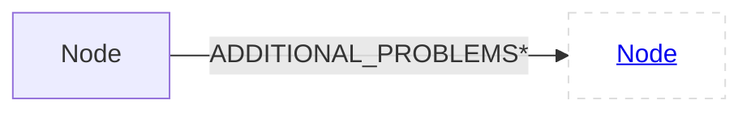
#### EOG<a id="NodeEOG"></a>
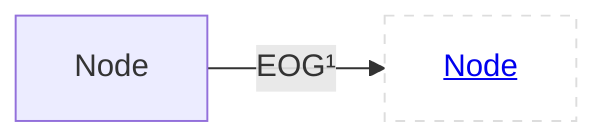
#### CDG<a id="NodeCDG"></a>
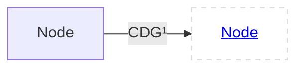
#### DFG<a id="NodeDFG"></a>

#### ANNOTATIONS<a id="NodeANNOTATIONS"></a>
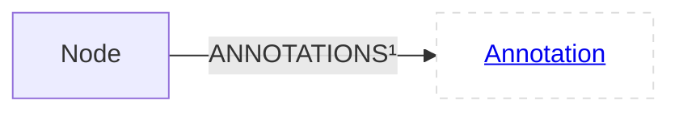
#### PDG<a id="NodePDG"></a>

#### AST<a id="NodeAST"></a>
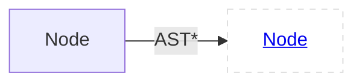
#### SCOPE<a id="NodeSCOPE"></a>
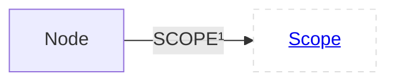
### Properties
code : String

argumentIndex : int

file : String

isImplicit : boolean

overlayEdges : Overlays

fullName : String

localName : String

name : String

nameDelimiter : String

comment : String

artifact : String

startLine : int

endLine : int

startColumn : int

endColumn : int

isInferred : boolean

## Statement<a id="estatement"></a>
**Labels**:<span class="superclassLabel">[Node](#enode)</span>
<span class="classLabel">[Statement](#estatement)</span>

### Children
<span class="child">[AssertStatement](#eassertstatement)</span>
<span class="child">[LoopStatement](#eloopstatement)</span>
<span class="child">[Expression](#eexpression)</span>
<span class="child">[CaseStatement](#ecasestatement)</span>
<span class="child">[ReturnStatement](#ereturnstatement)</span>
<span class="child">[LabelStatement](#elabelstatement)</span>
<span class="child">[EmptyStatement](#eemptystatement)</span>
<span class="child">[IfStatement](#eifstatement)</span>
<span class="child">[CatchClause](#ecatchclause)</span>
<span class="child">[SwitchStatement](#eswitchstatement)</span>
<span class="child">[GotoStatement](#egotostatement)</span>
<span class="child">[ContinueStatement](#econtinuestatement)</span>
<span class="child">[DefaultStatement](#edefaultstatement)</span>
<span class="child">[SynchronizedStatement](#esynchronizedstatement)</span>
<span class="child">[TryStatement](#etrystatement)</span>
<span class="child">[BreakStatement](#ebreakstatement)</span>
<span class="child">[LookupScopeStatement](#elookupscopestatement)</span>
<span class="child">[DeclarationStatement](#edeclarationstatement)</span>

### Relationships
<span class="relationship">[LOCALS](#StatementLOCALS)</span>
<div class="papers" markdown>
??? info "Inherited Relationships"

    <span class="inherited-relationship">[ADDITIONAL_PROBLEMS](#NodeADDITIONAL_PROBLEMS)</span>

    <span class="inherited-relationship">[EOG](#NodeEOG)</span>

    <span class="inherited-relationship">[CDG](#NodeCDG)</span>

    <span class="inherited-relationship">[DFG](#NodeDFG)</span>

    <span class="inherited-relationship">[ANNOTATIONS](#NodeANNOTATIONS)</span>

    <span class="inherited-relationship">[PDG](#NodePDG)</span>

    <span class="inherited-relationship">[AST](#NodeAST)</span>

    <span class="inherited-relationship">[SCOPE](#NodeSCOPE)</span>

</div>

#### LOCALS<a id="StatementLOCALS"></a>
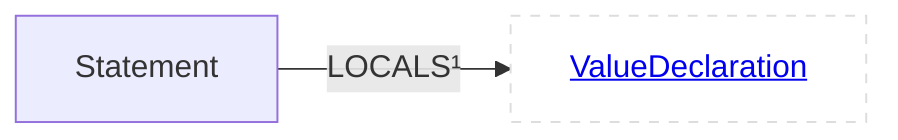
### Properties
<div class="papers" markdown>
??? info "Inherited Properties"
    code : String

    argumentIndex : int

    file : String

    isImplicit : boolean

    overlayEdges : Overlays

    fullName : String

    localName : String

    name : String

    nameDelimiter : String

    comment : String

    artifact : String

    startLine : int

    endLine : int

    startColumn : int

    endColumn : int

    isInferred : boolean

</div>

## AssertStatement<a id="eassertstatement"></a>
**Labels**:<span class="superclassLabel">[Node](#enode)</span>
<span class="superclassLabel">[Statement](#estatement)</span>
<span class="classLabel">[AssertStatement](#eassertstatement)</span>

### Relationships
<span class="relationship">[MESSAGE](#AssertStatementMESSAGE)</span>
<span class="relationship">[CONDITION](#AssertStatementCONDITION)</span>
<div class="papers" markdown>
??? info "Inherited Relationships"

    <span class="inherited-relationship">[LOCALS](#StatementLOCALS)</span>

    <span class="inherited-relationship">[ADDITIONAL_PROBLEMS](#NodeADDITIONAL_PROBLEMS)</span>

    <span class="inherited-relationship">[EOG](#NodeEOG)</span>

    <span class="inherited-relationship">[CDG](#NodeCDG)</span>

    <span class="inherited-relationship">[DFG](#NodeDFG)</span>

    <span class="inherited-relationship">[ANNOTATIONS](#NodeANNOTATIONS)</span>

    <span class="inherited-relationship">[PDG](#NodePDG)</span>

    <span class="inherited-relationship">[AST](#NodeAST)</span>

    <span class="inherited-relationship">[SCOPE](#NodeSCOPE)</span>

</div>

#### MESSAGE<a id="AssertStatementMESSAGE"></a>
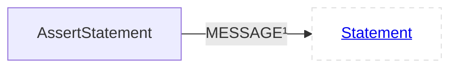
#### CONDITION<a id="AssertStatementCONDITION"></a>

### Properties
<div class="papers" markdown>
??? info "Inherited Properties"
    code : String

    argumentIndex : int

    file : String

    isImplicit : boolean

    overlayEdges : Overlays

    fullName : String

    localName : String

    name : String

    nameDelimiter : String

    comment : String

    artifact : String

    startLine : int

    endLine : int

    startColumn : int

    endColumn : int

    isInferred : boolean

</div>

## LoopStatement<a id="eloopstatement"></a>
**Labels**:<span class="superclassLabel">[Node](#enode)</span>
<span class="superclassLabel">[Statement](#estatement)</span>
<span class="classLabel">[LoopStatement](#eloopstatement)</span>

### Children
<span class="child">[DoStatement](#edostatement)</span>
<span class="child">[ForStatement](#eforstatement)</span>
<span class="child">[WhileStatement](#ewhilestatement)</span>
<span class="child">[ForEachStatement](#eforeachstatement)</span>

### Relationships
<span class="relationship">[ELSE_STATEMENT](#LoopStatementELSE_STATEMENT)</span>
<span class="relationship">[STATEMENT](#LoopStatementSTATEMENT)</span>
<div class="papers" markdown>
??? info "Inherited Relationships"

    <span class="inherited-relationship">[LOCALS](#StatementLOCALS)</span>

    <span class="inherited-relationship">[ADDITIONAL_PROBLEMS](#NodeADDITIONAL_PROBLEMS)</span>

    <span class="inherited-relationship">[EOG](#NodeEOG)</span>

    <span class="inherited-relationship">[CDG](#NodeCDG)</span>

    <span class="inherited-relationship">[DFG](#NodeDFG)</span>

    <span class="inherited-relationship">[ANNOTATIONS](#NodeANNOTATIONS)</span>

    <span class="inherited-relationship">[PDG](#NodePDG)</span>

    <span class="inherited-relationship">[AST](#NodeAST)</span>

    <span class="inherited-relationship">[SCOPE](#NodeSCOPE)</span>

</div>

#### ELSE_STATEMENT<a id="LoopStatementELSE_STATEMENT"></a>
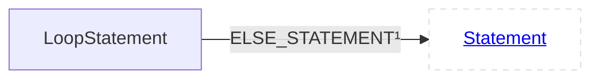
#### STATEMENT<a id="LoopStatementSTATEMENT"></a>
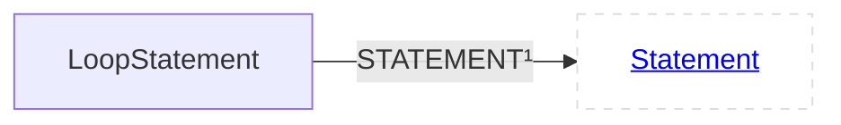
### Properties
<div class="papers" markdown>
??? info "Inherited Properties"
    code : String

    argumentIndex : int

    file : String

    isImplicit : boolean

    overlayEdges : Overlays

    fullName : String

    localName : String

    name : String

    nameDelimiter : String

    comment : String

    artifact : String

    startLine : int

    endLine : int

    startColumn : int

    endColumn : int

    isInferred : boolean

</div>

## DoStatement<a id="edostatement"></a>
**Labels**:<span class="superclassLabel">[Node](#enode)</span>
<span class="superclassLabel">[Statement](#estatement)</span>
<span class="superclassLabel">[LoopStatement](#eloopstatement)</span>
<span class="classLabel">[DoStatement](#edostatement)</span>

### Relationships
<span class="relationship">[CONDITION](#DoStatementCONDITION)</span>
<div class="papers" markdown>
??? info "Inherited Relationships"

    <span class="inherited-relationship">[ELSE_STATEMENT](#LoopStatementELSE_STATEMENT)</span>

    <span class="inherited-relationship">[STATEMENT](#LoopStatementSTATEMENT)</span>

    <span class="inherited-relationship">[LOCALS](#StatementLOCALS)</span>

    <span class="inherited-relationship">[ADDITIONAL_PROBLEMS](#NodeADDITIONAL_PROBLEMS)</span>

    <span class="inherited-relationship">[EOG](#NodeEOG)</span>

    <span class="inherited-relationship">[CDG](#NodeCDG)</span>

    <span class="inherited-relationship">[DFG](#NodeDFG)</span>

    <span class="inherited-relationship">[ANNOTATIONS](#NodeANNOTATIONS)</span>

    <span class="inherited-relationship">[PDG](#NodePDG)</span>

    <span class="inherited-relationship">[AST](#NodeAST)</span>

    <span class="inherited-relationship">[SCOPE](#NodeSCOPE)</span>

</div>

#### CONDITION<a id="DoStatementCONDITION"></a>

### Properties
<div class="papers" markdown>
??? info "Inherited Properties"
    code : String

    argumentIndex : int

    file : String

    isImplicit : boolean

    overlayEdges : Overlays

    fullName : String

    localName : String

    name : String

    nameDelimiter : String

    comment : String

    artifact : String

    startLine : int

    endLine : int

    startColumn : int

    endColumn : int

    isInferred : boolean

</div>

## ForStatement<a id="eforstatement"></a>
**Labels**:<span class="superclassLabel">[Node](#enode)</span>
<span class="superclassLabel">[Statement](#estatement)</span>
<span class="superclassLabel">[LoopStatement](#eloopstatement)</span>
<span class="classLabel">[ForStatement](#eforstatement)</span>

### Relationships
<span class="relationship">[CONDITION_DECLARATION](#ForStatementCONDITION_DECLARATION)</span>
<span class="relationship">[CONDITION](#ForStatementCONDITION)</span>
<span class="relationship">[ITERATION_STATEMENT](#ForStatementITERATION_STATEMENT)</span>
<span class="relationship">[INITIALIZER_STATEMENT](#ForStatementINITIALIZER_STATEMENT)</span>
<div class="papers" markdown>
??? info "Inherited Relationships"

    <span class="inherited-relationship">[ELSE_STATEMENT](#LoopStatementELSE_STATEMENT)</span>

    <span class="inherited-relationship">[STATEMENT](#LoopStatementSTATEMENT)</span>

    <span class="inherited-relationship">[LOCALS](#StatementLOCALS)</span>

    <span class="inherited-relationship">[ADDITIONAL_PROBLEMS](#NodeADDITIONAL_PROBLEMS)</span>

    <span class="inherited-relationship">[EOG](#NodeEOG)</span>

    <span class="inherited-relationship">[CDG](#NodeCDG)</span>

    <span class="inherited-relationship">[DFG](#NodeDFG)</span>

    <span class="inherited-relationship">[ANNOTATIONS](#NodeANNOTATIONS)</span>

    <span class="inherited-relationship">[PDG](#NodePDG)</span>

    <span class="inherited-relationship">[AST](#NodeAST)</span>

    <span class="inherited-relationship">[SCOPE](#NodeSCOPE)</span>

</div>

#### CONDITION_DECLARATION<a id="ForStatementCONDITION_DECLARATION"></a>
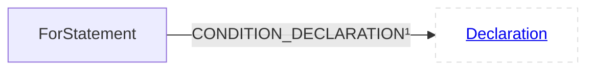
#### CONDITION<a id="ForStatementCONDITION"></a>

#### ITERATION_STATEMENT<a id="ForStatementITERATION_STATEMENT"></a>
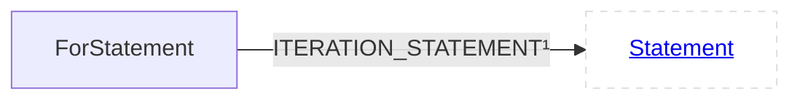
#### INITIALIZER_STATEMENT<a id="ForStatementINITIALIZER_STATEMENT"></a>
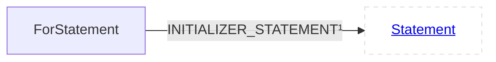
### Properties
<div class="papers" markdown>
??? info "Inherited Properties"
    code : String

    argumentIndex : int

    file : String

    isImplicit : boolean

    overlayEdges : Overlays

    fullName : String

    localName : String

    name : String

    nameDelimiter : String

    comment : String

    artifact : String

    startLine : int

    endLine : int

    startColumn : int

    endColumn : int

    isInferred : boolean

</div>

## WhileStatement<a id="ewhilestatement"></a>
**Labels**:<span class="superclassLabel">[Node](#enode)</span>
<span class="superclassLabel">[Statement](#estatement)</span>
<span class="superclassLabel">[LoopStatement](#eloopstatement)</span>
<span class="classLabel">[WhileStatement](#ewhilestatement)</span>

### Relationships
<span class="relationship">[CONDITION_DECLARATION](#WhileStatementCONDITION_DECLARATION)</span>
<span class="relationship">[CONDITION](#WhileStatementCONDITION)</span>
<div class="papers" markdown>
??? info "Inherited Relationships"

    <span class="inherited-relationship">[ELSE_STATEMENT](#LoopStatementELSE_STATEMENT)</span>

    <span class="inherited-relationship">[STATEMENT](#LoopStatementSTATEMENT)</span>

    <span class="inherited-relationship">[LOCALS](#StatementLOCALS)</span>

    <span class="inherited-relationship">[ADDITIONAL_PROBLEMS](#NodeADDITIONAL_PROBLEMS)</span>

    <span class="inherited-relationship">[EOG](#NodeEOG)</span>

    <span class="inherited-relationship">[CDG](#NodeCDG)</span>

    <span class="inherited-relationship">[DFG](#NodeDFG)</span>

    <span class="inherited-relationship">[ANNOTATIONS](#NodeANNOTATIONS)</span>

    <span class="inherited-relationship">[PDG](#NodePDG)</span>

    <span class="inherited-relationship">[AST](#NodeAST)</span>

    <span class="inherited-relationship">[SCOPE](#NodeSCOPE)</span>

</div>

#### CONDITION_DECLARATION<a id="WhileStatementCONDITION_DECLARATION"></a>
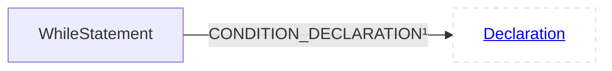
#### CONDITION<a id="WhileStatementCONDITION"></a>

### Properties
<div class="papers" markdown>
??? info "Inherited Properties"
    code : String

    argumentIndex : int

    file : String

    isImplicit : boolean

    overlayEdges : Overlays

    fullName : String

    localName : String

    name : String

    nameDelimiter : String

    comment : String

    artifact : String

    startLine : int

    endLine : int

    startColumn : int

    endColumn : int

    isInferred : boolean

</div>

## ForEachStatement<a id="eforeachstatement"></a>
**Labels**:<span class="superclassLabel">[Node](#enode)</span>
<span class="superclassLabel">[Statement](#estatement)</span>
<span class="superclassLabel">[LoopStatement](#eloopstatement)</span>
<span class="classLabel">[ForEachStatement](#eforeachstatement)</span>

### Relationships
<span class="relationship">[ITERABLE](#ForEachStatementITERABLE)</span>
<span class="relationship">[VARIABLE](#ForEachStatementVARIABLE)</span>
<div class="papers" markdown>
??? info "Inherited Relationships"

    <span class="inherited-relationship">[ELSE_STATEMENT](#LoopStatementELSE_STATEMENT)</span>

    <span class="inherited-relationship">[STATEMENT](#LoopStatementSTATEMENT)</span>

    <span class="inherited-relationship">[LOCALS](#StatementLOCALS)</span>

    <span class="inherited-relationship">[ADDITIONAL_PROBLEMS](#NodeADDITIONAL_PROBLEMS)</span>

    <span class="inherited-relationship">[EOG](#NodeEOG)</span>

    <span class="inherited-relationship">[CDG](#NodeCDG)</span>

    <span class="inherited-relationship">[DFG](#NodeDFG)</span>

    <span class="inherited-relationship">[ANNOTATIONS](#NodeANNOTATIONS)</span>

    <span class="inherited-relationship">[PDG](#NodePDG)</span>

    <span class="inherited-relationship">[AST](#NodeAST)</span>

    <span class="inherited-relationship">[SCOPE](#NodeSCOPE)</span>

</div>

#### ITERABLE<a id="ForEachStatementITERABLE"></a>
```mermaid
flowchart LR
  classDef outer fill:#fff,stroke:#ddd,stroke-dasharray:5 5;  classDef special fill:#afa,stroke:#5a5,stroke-dasharray:5 5;
ForEachStatement--"ITERABLE¹"-->ForEachStatementITERABLE[<a href='#estatement'>Statement</a>]:::outer
```
#### VARIABLE<a id="ForEachStatementVARIABLE"></a>
```mermaid
flowchart LR
  classDef outer fill:#fff,stroke:#ddd,stroke-dasharray:5 5;  classDef special fill:#afa,stroke:#5a5,stroke-dasharray:5 5;
ForEachStatement--"VARIABLE¹"-->ForEachStatementVARIABLE[<a href='#estatement'>Statement</a>]:::outer
```
### Properties
<div class="papers" markdown>
??? info "Inherited Properties"
    code : String

    argumentIndex : int

    file : String

    isImplicit : boolean

    overlayEdges : Overlays

    fullName : String

    localName : String

    name : String

    nameDelimiter : String

    comment : String

    artifact : String

    startLine : int

    endLine : int

    startColumn : int

    endColumn : int

    isInferred : boolean

</div>

## Expression<a id="eexpression"></a>
**Labels**:<span class="superclassLabel">[Node](#enode)</span>
<span class="superclassLabel">[Statement](#estatement)</span>
<span class="classLabel">[Expression](#eexpression)</span>

### Children
<span class="child">[CallExpression](#ecallexpression)</span>
<span class="child">[NewExpression](#enewexpression)</span>
<span class="child">[UnaryOperator](#eunaryoperator)</span>
<span class="child">[CollectionComprehension](#ecollectioncomprehension)</span>
<span class="child">[ThrowExpression](#ethrowexpression)</span>
<span class="child">[Block](#eblock)</span>
<span class="child">[CastExpression](#ecastexpression)</span>
<span class="child">[Reference](#ereference)</span>
<span class="child">[BinaryOperator](#ebinaryoperator)</span>
<span class="child">[ConditionalExpression](#econditionalexpression)</span>
<span class="child">[DeleteExpression](#edeleteexpression)</span>
<span class="child">[SubscriptExpression](#esubscriptexpression)</span>
<span class="child">[ProblemExpression](#eproblemexpression)</span>
<span class="child">[RangeExpression](#erangeexpression)</span>
<span class="child">[LambdaExpression](#elambdaexpression)</span>
<span class="child">[NewArrayExpression](#enewarrayexpression)</span>
<span class="child">[KeyValueExpression](#ekeyvalueexpression)</span>
<span class="child">[AssignExpression](#eassignexpression)</span>
<span class="child">[ComprehensionExpression](#ecomprehensionexpression)</span>
<span class="child">[TypeExpression](#etypeexpression)</span>
<span class="child">[InitializerListExpression](#einitializerlistexpression)</span>
<span class="child">[Literal](#eliteral)</span>
<span class="child">[TypeIdExpression](#etypeidexpression)</span>
<span class="child">[ExpressionList](#eexpressionlist)</span>

### Relationships
<span class="relationship">[TYPE](#ExpressionTYPE)</span>
<span class="relationship">[ASSIGNED_TYPES](#ExpressionASSIGNED_TYPES)</span>
<div class="papers" markdown>
??? info "Inherited Relationships"

    <span class="inherited-relationship">[LOCALS](#StatementLOCALS)</span>

    <span class="inherited-relationship">[ADDITIONAL_PROBLEMS](#NodeADDITIONAL_PROBLEMS)</span>

    <span class="inherited-relationship">[EOG](#NodeEOG)</span>

    <span class="inherited-relationship">[CDG](#NodeCDG)</span>

    <span class="inherited-relationship">[DFG](#NodeDFG)</span>

    <span class="inherited-relationship">[ANNOTATIONS](#NodeANNOTATIONS)</span>

    <span class="inherited-relationship">[PDG](#NodePDG)</span>

    <span class="inherited-relationship">[AST](#NodeAST)</span>

    <span class="inherited-relationship">[SCOPE](#NodeSCOPE)</span>

</div>

#### TYPE<a id="ExpressionTYPE"></a>
```mermaid
flowchart LR
  classDef outer fill:#fff,stroke:#ddd,stroke-dasharray:5 5;  classDef special fill:#afa,stroke:#5a5,stroke-dasharray:5 5;
Expression--"TYPE¹"-->ExpressionTYPE[<a href='#etype'>Type</a>]:::outer
```
#### ASSIGNED_TYPES<a id="ExpressionASSIGNED_TYPES"></a>
```mermaid
flowchart LR
  classDef outer fill:#fff,stroke:#ddd,stroke-dasharray:5 5;  classDef special fill:#afa,stroke:#5a5,stroke-dasharray:5 5;
Expression--"ASSIGNED_TYPES*"-->ExpressionASSIGNED_TYPES[<a href='#etype'>Type</a>]:::outer
```
### Properties
<div class="papers" markdown>
??? info "Inherited Properties"
    code : String

    argumentIndex : int

    file : String

    isImplicit : boolean

    overlayEdges : Overlays

    fullName : String

    localName : String

    name : String

    nameDelimiter : String

    comment : String

    artifact : String

    startLine : int

    endLine : int

    startColumn : int

    endColumn : int

    isInferred : boolean

</div>

## CallExpression<a id="ecallexpression"></a>
**Labels**:<span class="superclassLabel">[Node](#enode)</span>
<span class="superclassLabel">[Statement](#estatement)</span>
<span class="superclassLabel">[Expression](#eexpression)</span>
<span class="classLabel">[CallExpression](#ecallexpression)</span>

### Children
<span class="child">[OperatorCallExpression](#eoperatorcallexpression)</span>
<span class="child">[ConstructExpression](#econstructexpression)</span>
<span class="child">[MemberCallExpression](#emembercallexpression)</span>

### Relationships
<span class="relationship">[CALLEE](#CallExpressionCALLEE)</span>
<span class="relationship">[INVOKES](#CallExpressionINVOKES)</span>
<span class="relationship">[TEMPLATE_INSTANTIATION](#CallExpressionTEMPLATE_INSTANTIATION)</span>
<span class="relationship">[TEMPLATE_ARGUMENTS](#CallExpressionTEMPLATE_ARGUMENTS)</span>
<span class="relationship">[ARGUMENTS](#CallExpressionARGUMENTS)</span>
<div class="papers" markdown>
??? info "Inherited Relationships"

    <span class="inherited-relationship">[TYPE](#ExpressionTYPE)</span>

    <span class="inherited-relationship">[ASSIGNED_TYPES](#ExpressionASSIGNED_TYPES)</span>

    <span class="inherited-relationship">[LOCALS](#StatementLOCALS)</span>

    <span class="inherited-relationship">[ADDITIONAL_PROBLEMS](#NodeADDITIONAL_PROBLEMS)</span>

    <span class="inherited-relationship">[EOG](#NodeEOG)</span>

    <span class="inherited-relationship">[CDG](#NodeCDG)</span>

    <span class="inherited-relationship">[DFG](#NodeDFG)</span>

    <span class="inherited-relationship">[ANNOTATIONS](#NodeANNOTATIONS)</span>

    <span class="inherited-relationship">[PDG](#NodePDG)</span>

    <span class="inherited-relationship">[AST](#NodeAST)</span>

    <span class="inherited-relationship">[SCOPE](#NodeSCOPE)</span>

</div>

#### CALLEE<a id="CallExpressionCALLEE"></a>
```mermaid
flowchart LR
  classDef outer fill:#fff,stroke:#ddd,stroke-dasharray:5 5;  classDef special fill:#afa,stroke:#5a5,stroke-dasharray:5 5;
CallExpression--"CALLEE¹"-->CallExpressionCALLEE[<a href='#eexpression'>Expression</a>]:::outer
```
#### INVOKES<a id="CallExpressionINVOKES"></a>
```mermaid
flowchart LR
  classDef outer fill:#fff,stroke:#ddd,stroke-dasharray:5 5;  classDef special fill:#afa,stroke:#5a5,stroke-dasharray:5 5;
CallExpression--"INVOKES¹"-->CallExpressionINVOKES[<a href='#efunctiondeclaration'>FunctionDeclaration</a>]:::outer
```
#### TEMPLATE_INSTANTIATION<a id="CallExpressionTEMPLATE_INSTANTIATION"></a>
```mermaid
flowchart LR
  classDef outer fill:#fff,stroke:#ddd,stroke-dasharray:5 5;  classDef special fill:#afa,stroke:#5a5,stroke-dasharray:5 5;
CallExpression--"TEMPLATE_INSTANTIATION¹"-->CallExpressionTEMPLATE_INSTANTIATION[<a href='#etemplatedeclaration'>TemplateDeclaration</a>]:::outer
```
#### TEMPLATE_ARGUMENTS<a id="CallExpressionTEMPLATE_ARGUMENTS"></a>
```mermaid
flowchart LR
  classDef outer fill:#fff,stroke:#ddd,stroke-dasharray:5 5;  classDef special fill:#afa,stroke:#5a5,stroke-dasharray:5 5;
CallExpression--"TEMPLATE_ARGUMENTS¹"-->CallExpressionTEMPLATE_ARGUMENTS[<a href='#enode'>Node</a>]:::outer
```
#### ARGUMENTS<a id="CallExpressionARGUMENTS"></a>
```mermaid
flowchart LR
  classDef outer fill:#fff,stroke:#ddd,stroke-dasharray:5 5;  classDef special fill:#afa,stroke:#5a5,stroke-dasharray:5 5;
CallExpression--"ARGUMENTS¹"-->CallExpressionARGUMENTS[<a href='#eexpression'>Expression</a>]:::outer
```
### Properties
template : boolean

<div class="papers" markdown>
??? info "Inherited Properties"
    code : String

    file : String

    isInferred : boolean

    argumentIndex : int

    isImplicit : boolean

    overlayEdges : Overlays

    fullName : String

    localName : String

    name : String

    nameDelimiter : String

    comment : String

    artifact : String

    startLine : int

    endLine : int

    startColumn : int

    endColumn : int

</div>

## OperatorCallExpression<a id="eoperatorcallexpression"></a>
**Labels**:<span class="superclassLabel">[Node](#enode)</span>
<span class="superclassLabel">[Statement](#estatement)</span>
<span class="superclassLabel">[Expression](#eexpression)</span>
<span class="superclassLabel">[CallExpression](#ecallexpression)</span>
<span class="classLabel">[OperatorCallExpression](#eoperatorcallexpression)</span>

### Relationships
<div class="papers" markdown>
??? info "Inherited Relationships"

    <span class="inherited-relationship">[CALLEE](#CallExpressionCALLEE)</span>

    <span class="inherited-relationship">[INVOKES](#CallExpressionINVOKES)</span>

    <span class="inherited-relationship">[TEMPLATE_INSTANTIATION](#CallExpressionTEMPLATE_INSTANTIATION)</span>

    <span class="inherited-relationship">[TEMPLATE_ARGUMENTS](#CallExpressionTEMPLATE_ARGUMENTS)</span>

    <span class="inherited-relationship">[ARGUMENTS](#CallExpressionARGUMENTS)</span>

    <span class="inherited-relationship">[TYPE](#ExpressionTYPE)</span>

    <span class="inherited-relationship">[ASSIGNED_TYPES](#ExpressionASSIGNED_TYPES)</span>

    <span class="inherited-relationship">[LOCALS](#StatementLOCALS)</span>

    <span class="inherited-relationship">[ADDITIONAL_PROBLEMS](#NodeADDITIONAL_PROBLEMS)</span>

    <span class="inherited-relationship">[EOG](#NodeEOG)</span>

    <span class="inherited-relationship">[CDG](#NodeCDG)</span>

    <span class="inherited-relationship">[DFG](#NodeDFG)</span>

    <span class="inherited-relationship">[ANNOTATIONS](#NodeANNOTATIONS)</span>

    <span class="inherited-relationship">[PDG](#NodePDG)</span>

    <span class="inherited-relationship">[AST](#NodeAST)</span>

    <span class="inherited-relationship">[SCOPE](#NodeSCOPE)</span>

</div>

### Properties
operatorCode : String

<div class="papers" markdown>
??? info "Inherited Properties"
    template : boolean

    code : String

    file : String

    isInferred : boolean

    argumentIndex : int

    isImplicit : boolean

    overlayEdges : Overlays

    fullName : String

    localName : String

    name : String

    nameDelimiter : String

    comment : String

    artifact : String

    startLine : int

    endLine : int

    startColumn : int

    endColumn : int

</div>

## ConstructExpression<a id="econstructexpression"></a>
**Labels**:<span class="superclassLabel">[Node](#enode)</span>
<span class="superclassLabel">[Statement](#estatement)</span>
<span class="superclassLabel">[Expression](#eexpression)</span>
<span class="superclassLabel">[CallExpression](#ecallexpression)</span>
<span class="classLabel">[ConstructExpression](#econstructexpression)</span>

### Relationships
<span class="relationship">[INSTANTIATES](#ConstructExpressionINSTANTIATES)</span>
<span class="relationship">[ANONYMOUS_CLASS](#ConstructExpressionANONYMOUS_CLASS)</span>
<span class="relationship">[CONSTRUCTOR](#ConstructExpressionCONSTRUCTOR)</span>
<div class="papers" markdown>
??? info "Inherited Relationships"

    <span class="inherited-relationship">[CALLEE](#CallExpressionCALLEE)</span>

    <span class="inherited-relationship">[INVOKES](#CallExpressionINVOKES)</span>

    <span class="inherited-relationship">[TEMPLATE_INSTANTIATION](#CallExpressionTEMPLATE_INSTANTIATION)</span>

    <span class="inherited-relationship">[TEMPLATE_ARGUMENTS](#CallExpressionTEMPLATE_ARGUMENTS)</span>

    <span class="inherited-relationship">[ARGUMENTS](#CallExpressionARGUMENTS)</span>

    <span class="inherited-relationship">[TYPE](#ExpressionTYPE)</span>

    <span class="inherited-relationship">[ASSIGNED_TYPES](#ExpressionASSIGNED_TYPES)</span>

    <span class="inherited-relationship">[LOCALS](#StatementLOCALS)</span>

    <span class="inherited-relationship">[ADDITIONAL_PROBLEMS](#NodeADDITIONAL_PROBLEMS)</span>

    <span class="inherited-relationship">[EOG](#NodeEOG)</span>

    <span class="inherited-relationship">[CDG](#NodeCDG)</span>

    <span class="inherited-relationship">[DFG](#NodeDFG)</span>

    <span class="inherited-relationship">[ANNOTATIONS](#NodeANNOTATIONS)</span>

    <span class="inherited-relationship">[PDG](#NodePDG)</span>

    <span class="inherited-relationship">[AST](#NodeAST)</span>

    <span class="inherited-relationship">[SCOPE](#NodeSCOPE)</span>

</div>

#### INSTANTIATES<a id="ConstructExpressionINSTANTIATES"></a>
```mermaid
flowchart LR
  classDef outer fill:#fff,stroke:#ddd,stroke-dasharray:5 5;  classDef special fill:#afa,stroke:#5a5,stroke-dasharray:5 5;
ConstructExpression--"INSTANTIATES¹"-->ConstructExpressionINSTANTIATES[<a href='#edeclaration'>Declaration</a>]:::outer
```
#### ANONYMOUS_CLASS<a id="ConstructExpressionANONYMOUS_CLASS"></a>
```mermaid
flowchart LR
  classDef outer fill:#fff,stroke:#ddd,stroke-dasharray:5 5;  classDef special fill:#afa,stroke:#5a5,stroke-dasharray:5 5;
ConstructExpression--"ANONYMOUS_CLASS¹"-->ConstructExpressionANONYMOUS_CLASS[<a href='#erecorddeclaration'>RecordDeclaration</a>]:::outer
```
#### CONSTRUCTOR<a id="ConstructExpressionCONSTRUCTOR"></a>
```mermaid
flowchart LR
  classDef outer fill:#fff,stroke:#ddd,stroke-dasharray:5 5;  classDef special fill:#afa,stroke:#5a5,stroke-dasharray:5 5;
ConstructExpression--"CONSTRUCTOR¹"-->ConstructExpressionCONSTRUCTOR[<a href='#econstructordeclaration'>ConstructorDeclaration</a>]:::outer
```
### Properties
<div class="papers" markdown>
??? info "Inherited Properties"
    template : boolean

    code : String

    file : String

    isInferred : boolean

    argumentIndex : int

    isImplicit : boolean

    overlayEdges : Overlays

    fullName : String

    localName : String

    name : String

    nameDelimiter : String

    comment : String

    artifact : String

    startLine : int

    endLine : int

    startColumn : int

    endColumn : int

</div>

## MemberCallExpression<a id="emembercallexpression"></a>
**Labels**:<span class="superclassLabel">[Node](#enode)</span>
<span class="superclassLabel">[Statement](#estatement)</span>
<span class="superclassLabel">[Expression](#eexpression)</span>
<span class="superclassLabel">[CallExpression](#ecallexpression)</span>
<span class="classLabel">[MemberCallExpression](#emembercallexpression)</span>

### Relationships
<div class="papers" markdown>
??? info "Inherited Relationships"

    <span class="inherited-relationship">[CALLEE](#CallExpressionCALLEE)</span>

    <span class="inherited-relationship">[INVOKES](#CallExpressionINVOKES)</span>

    <span class="inherited-relationship">[TEMPLATE_INSTANTIATION](#CallExpressionTEMPLATE_INSTANTIATION)</span>

    <span class="inherited-relationship">[TEMPLATE_ARGUMENTS](#CallExpressionTEMPLATE_ARGUMENTS)</span>

    <span class="inherited-relationship">[ARGUMENTS](#CallExpressionARGUMENTS)</span>

    <span class="inherited-relationship">[TYPE](#ExpressionTYPE)</span>

    <span class="inherited-relationship">[ASSIGNED_TYPES](#ExpressionASSIGNED_TYPES)</span>

    <span class="inherited-relationship">[LOCALS](#StatementLOCALS)</span>

    <span class="inherited-relationship">[ADDITIONAL_PROBLEMS](#NodeADDITIONAL_PROBLEMS)</span>

    <span class="inherited-relationship">[EOG](#NodeEOG)</span>

    <span class="inherited-relationship">[CDG](#NodeCDG)</span>

    <span class="inherited-relationship">[DFG](#NodeDFG)</span>

    <span class="inherited-relationship">[ANNOTATIONS](#NodeANNOTATIONS)</span>

    <span class="inherited-relationship">[PDG](#NodePDG)</span>

    <span class="inherited-relationship">[AST](#NodeAST)</span>

    <span class="inherited-relationship">[SCOPE](#NodeSCOPE)</span>

</div>

### Properties
isStatic : boolean

<div class="papers" markdown>
??? info "Inherited Properties"
    template : boolean

    code : String

    file : String

    isInferred : boolean

    argumentIndex : int

    isImplicit : boolean

    overlayEdges : Overlays

    fullName : String

    localName : String

    name : String

    nameDelimiter : String

    comment : String

    artifact : String

    startLine : int

    endLine : int

    startColumn : int

    endColumn : int

</div>

## NewExpression<a id="enewexpression"></a>
**Labels**:<span class="superclassLabel">[Node](#enode)</span>
<span class="superclassLabel">[Statement](#estatement)</span>
<span class="superclassLabel">[Expression](#eexpression)</span>
<span class="classLabel">[NewExpression](#enewexpression)</span>

### Relationships
<span class="relationship">[INITIALIZER](#NewExpressionINITIALIZER)</span>
<span class="relationship">[TEMPLATE_PARAMETERS](#NewExpressionTEMPLATE_PARAMETERS)</span>
<div class="papers" markdown>
??? info "Inherited Relationships"

    <span class="inherited-relationship">[TYPE](#ExpressionTYPE)</span>

    <span class="inherited-relationship">[ASSIGNED_TYPES](#ExpressionASSIGNED_TYPES)</span>

    <span class="inherited-relationship">[LOCALS](#StatementLOCALS)</span>

    <span class="inherited-relationship">[ADDITIONAL_PROBLEMS](#NodeADDITIONAL_PROBLEMS)</span>

    <span class="inherited-relationship">[EOG](#NodeEOG)</span>

    <span class="inherited-relationship">[CDG](#NodeCDG)</span>

    <span class="inherited-relationship">[DFG](#NodeDFG)</span>

    <span class="inherited-relationship">[ANNOTATIONS](#NodeANNOTATIONS)</span>

    <span class="inherited-relationship">[PDG](#NodePDG)</span>

    <span class="inherited-relationship">[AST](#NodeAST)</span>

    <span class="inherited-relationship">[SCOPE](#NodeSCOPE)</span>

</div>

#### INITIALIZER<a id="NewExpressionINITIALIZER"></a>
```mermaid
flowchart LR
  classDef outer fill:#fff,stroke:#ddd,stroke-dasharray:5 5;  classDef special fill:#afa,stroke:#5a5,stroke-dasharray:5 5;
NewExpression--"INITIALIZER¹"-->NewExpressionINITIALIZER[<a href='#eexpression'>Expression</a>]:::outer
```
#### TEMPLATE_PARAMETERS<a id="NewExpressionTEMPLATE_PARAMETERS"></a>
```mermaid
flowchart LR
  classDef outer fill:#fff,stroke:#ddd,stroke-dasharray:5 5;  classDef special fill:#afa,stroke:#5a5,stroke-dasharray:5 5;
NewExpression--"TEMPLATE_PARAMETERS¹"-->NewExpressionTEMPLATE_PARAMETERS[<a href='#enode'>Node</a>]:::outer
```
### Properties
<div class="papers" markdown>
??? info "Inherited Properties"
    code : String

    argumentIndex : int

    file : String

    isImplicit : boolean

    overlayEdges : Overlays

    fullName : String

    localName : String

    name : String

    nameDelimiter : String

    comment : String

    artifact : String

    startLine : int

    endLine : int

    startColumn : int

    endColumn : int

    isInferred : boolean

</div>

## UnaryOperator<a id="eunaryoperator"></a>
**Labels**:<span class="superclassLabel">[Node](#enode)</span>
<span class="superclassLabel">[Statement](#estatement)</span>
<span class="superclassLabel">[Expression](#eexpression)</span>
<span class="classLabel">[UnaryOperator](#eunaryoperator)</span>

### Relationships
<span class="relationship">[INPUT](#UnaryOperatorINPUT)</span>
<div class="papers" markdown>
??? info "Inherited Relationships"

    <span class="inherited-relationship">[TYPE](#ExpressionTYPE)</span>

    <span class="inherited-relationship">[ASSIGNED_TYPES](#ExpressionASSIGNED_TYPES)</span>

    <span class="inherited-relationship">[LOCALS](#StatementLOCALS)</span>

    <span class="inherited-relationship">[ADDITIONAL_PROBLEMS](#NodeADDITIONAL_PROBLEMS)</span>

    <span class="inherited-relationship">[EOG](#NodeEOG)</span>

    <span class="inherited-relationship">[CDG](#NodeCDG)</span>

    <span class="inherited-relationship">[DFG](#NodeDFG)</span>

    <span class="inherited-relationship">[ANNOTATIONS](#NodeANNOTATIONS)</span>

    <span class="inherited-relationship">[PDG](#NodePDG)</span>

    <span class="inherited-relationship">[AST](#NodeAST)</span>

    <span class="inherited-relationship">[SCOPE](#NodeSCOPE)</span>

</div>

#### INPUT<a id="UnaryOperatorINPUT"></a>
```mermaid
flowchart LR
  classDef outer fill:#fff,stroke:#ddd,stroke-dasharray:5 5;  classDef special fill:#afa,stroke:#5a5,stroke-dasharray:5 5;
UnaryOperator--"INPUT¹"-->UnaryOperatorINPUT[<a href='#eexpression'>Expression</a>]:::outer
```
### Properties
operatorCode : String

isPostfix : boolean

isPrefix : boolean

<div class="papers" markdown>
??? info "Inherited Properties"
    code : String

    argumentIndex : int

    file : String

    isImplicit : boolean

    overlayEdges : Overlays

    fullName : String

    localName : String

    name : String

    nameDelimiter : String

    comment : String

    artifact : String

    startLine : int

    endLine : int

    startColumn : int

    endColumn : int

    isInferred : boolean

</div>

## CollectionComprehension<a id="ecollectioncomprehension"></a>
**Labels**:<span class="superclassLabel">[Node](#enode)</span>
<span class="superclassLabel">[Statement](#estatement)</span>
<span class="superclassLabel">[Expression](#eexpression)</span>
<span class="classLabel">[CollectionComprehension](#ecollectioncomprehension)</span>

### Relationships
<span class="relationship">[COMPREHENSION_EXPRESSIONS](#CollectionComprehensionCOMPREHENSION_EXPRESSIONS)</span>
<span class="relationship">[STATEMENT](#CollectionComprehensionSTATEMENT)</span>
<div class="papers" markdown>
??? info "Inherited Relationships"

    <span class="inherited-relationship">[TYPE](#ExpressionTYPE)</span>

    <span class="inherited-relationship">[ASSIGNED_TYPES](#ExpressionASSIGNED_TYPES)</span>

    <span class="inherited-relationship">[LOCALS](#StatementLOCALS)</span>

    <span class="inherited-relationship">[ADDITIONAL_PROBLEMS](#NodeADDITIONAL_PROBLEMS)</span>

    <span class="inherited-relationship">[EOG](#NodeEOG)</span>

    <span class="inherited-relationship">[CDG](#NodeCDG)</span>

    <span class="inherited-relationship">[DFG](#NodeDFG)</span>

    <span class="inherited-relationship">[ANNOTATIONS](#NodeANNOTATIONS)</span>

    <span class="inherited-relationship">[PDG](#NodePDG)</span>

    <span class="inherited-relationship">[AST](#NodeAST)</span>

    <span class="inherited-relationship">[SCOPE](#NodeSCOPE)</span>

</div>

#### COMPREHENSION_EXPRESSIONS<a id="CollectionComprehensionCOMPREHENSION_EXPRESSIONS"></a>
```mermaid
flowchart LR
  classDef outer fill:#fff,stroke:#ddd,stroke-dasharray:5 5;  classDef special fill:#afa,stroke:#5a5,stroke-dasharray:5 5;
CollectionComprehension--"COMPREHENSION_EXPRESSIONS¹"-->CollectionComprehensionCOMPREHENSION_EXPRESSIONS[<a href='#ecomprehensionexpression'>ComprehensionExpression</a>]:::outer
```
#### STATEMENT<a id="CollectionComprehensionSTATEMENT"></a>
```mermaid
flowchart LR
  classDef outer fill:#fff,stroke:#ddd,stroke-dasharray:5 5;  classDef special fill:#afa,stroke:#5a5,stroke-dasharray:5 5;
CollectionComprehension--"STATEMENT¹"-->CollectionComprehensionSTATEMENT[<a href='#estatement'>Statement</a>]:::outer
```
### Properties
<div class="papers" markdown>
??? info "Inherited Properties"
    code : String

    argumentIndex : int

    file : String

    isImplicit : boolean

    overlayEdges : Overlays

    fullName : String

    localName : String

    name : String

    nameDelimiter : String

    comment : String

    artifact : String

    startLine : int

    endLine : int

    startColumn : int

    endColumn : int

    isInferred : boolean

</div>

## ThrowExpression<a id="ethrowexpression"></a>
**Labels**:<span class="superclassLabel">[Node](#enode)</span>
<span class="superclassLabel">[Statement](#estatement)</span>
<span class="superclassLabel">[Expression](#eexpression)</span>
<span class="classLabel">[ThrowExpression](#ethrowexpression)</span>

### Relationships
<span class="relationship">[PARENT_EXCEPTION](#ThrowExpressionPARENT_EXCEPTION)</span>
<span class="relationship">[EXCEPTION](#ThrowExpressionEXCEPTION)</span>
<div class="papers" markdown>
??? info "Inherited Relationships"

    <span class="inherited-relationship">[TYPE](#ExpressionTYPE)</span>

    <span class="inherited-relationship">[ASSIGNED_TYPES](#ExpressionASSIGNED_TYPES)</span>

    <span class="inherited-relationship">[LOCALS](#StatementLOCALS)</span>

    <span class="inherited-relationship">[ADDITIONAL_PROBLEMS](#NodeADDITIONAL_PROBLEMS)</span>

    <span class="inherited-relationship">[EOG](#NodeEOG)</span>

    <span class="inherited-relationship">[CDG](#NodeCDG)</span>

    <span class="inherited-relationship">[DFG](#NodeDFG)</span>

    <span class="inherited-relationship">[ANNOTATIONS](#NodeANNOTATIONS)</span>

    <span class="inherited-relationship">[PDG](#NodePDG)</span>

    <span class="inherited-relationship">[AST](#NodeAST)</span>

    <span class="inherited-relationship">[SCOPE](#NodeSCOPE)</span>

</div>

#### PARENT_EXCEPTION<a id="ThrowExpressionPARENT_EXCEPTION"></a>
```mermaid
flowchart LR
  classDef outer fill:#fff,stroke:#ddd,stroke-dasharray:5 5;  classDef special fill:#afa,stroke:#5a5,stroke-dasharray:5 5;
ThrowExpression--"PARENT_EXCEPTION¹"-->ThrowExpressionPARENT_EXCEPTION[<a href='#eexpression'>Expression</a>]:::outer
```
#### EXCEPTION<a id="ThrowExpressionEXCEPTION"></a>
```mermaid
flowchart LR
  classDef outer fill:#fff,stroke:#ddd,stroke-dasharray:5 5;  classDef special fill:#afa,stroke:#5a5,stroke-dasharray:5 5;
ThrowExpression--"EXCEPTION¹"-->ThrowExpressionEXCEPTION[<a href='#eexpression'>Expression</a>]:::outer
```
### Properties
<div class="papers" markdown>
??? info "Inherited Properties"
    code : String

    argumentIndex : int

    file : String

    isImplicit : boolean

    overlayEdges : Overlays

    fullName : String

    localName : String

    name : String

    nameDelimiter : String

    comment : String

    artifact : String

    startLine : int

    endLine : int

    startColumn : int

    endColumn : int

    isInferred : boolean

</div>

## Block<a id="eblock"></a>
**Labels**:<span class="superclassLabel">[Node](#enode)</span>
<span class="superclassLabel">[Statement](#estatement)</span>
<span class="superclassLabel">[Expression](#eexpression)</span>
<span class="classLabel">[Block](#eblock)</span>

### Children
<span class="child">[DistinctLanguageBlock](#edistinctlanguageblock)</span>

### Relationships
<span class="relationship">[STATEMENTS](#BlockSTATEMENTS)</span>
<div class="papers" markdown>
??? info "Inherited Relationships"

    <span class="inherited-relationship">[TYPE](#ExpressionTYPE)</span>

    <span class="inherited-relationship">[ASSIGNED_TYPES](#ExpressionASSIGNED_TYPES)</span>

    <span class="inherited-relationship">[LOCALS](#StatementLOCALS)</span>

    <span class="inherited-relationship">[ADDITIONAL_PROBLEMS](#NodeADDITIONAL_PROBLEMS)</span>

    <span class="inherited-relationship">[EOG](#NodeEOG)</span>

    <span class="inherited-relationship">[CDG](#NodeCDG)</span>

    <span class="inherited-relationship">[DFG](#NodeDFG)</span>

    <span class="inherited-relationship">[ANNOTATIONS](#NodeANNOTATIONS)</span>

    <span class="inherited-relationship">[PDG](#NodePDG)</span>

    <span class="inherited-relationship">[AST](#NodeAST)</span>

    <span class="inherited-relationship">[SCOPE](#NodeSCOPE)</span>

</div>

#### STATEMENTS<a id="BlockSTATEMENTS"></a>
```mermaid
flowchart LR
  classDef outer fill:#fff,stroke:#ddd,stroke-dasharray:5 5;  classDef special fill:#afa,stroke:#5a5,stroke-dasharray:5 5;
Block--"STATEMENTS¹"-->BlockSTATEMENTS[<a href='#estatement'>Statement</a>]:::outer
```
### Properties
isStaticBlock : boolean

<div class="papers" markdown>
??? info "Inherited Properties"
    code : String

    argumentIndex : int

    file : String

    isImplicit : boolean

    overlayEdges : Overlays

    fullName : String

    localName : String

    name : String

    nameDelimiter : String

    comment : String

    artifact : String

    startLine : int

    endLine : int

    startColumn : int

    endColumn : int

    isInferred : boolean

</div>

## DistinctLanguageBlock<a id="edistinctlanguageblock"></a>
**Labels**:<span class="superclassLabel">[Node](#enode)</span>
<span class="superclassLabel">[Statement](#estatement)</span>
<span class="superclassLabel">[Expression](#eexpression)</span>
<span class="superclassLabel">[Block](#eblock)</span>
<span class="classLabel">[DistinctLanguageBlock](#edistinctlanguageblock)</span>

### Relationships
<div class="papers" markdown>
??? info "Inherited Relationships"

    <span class="inherited-relationship">[STATEMENTS](#BlockSTATEMENTS)</span>

    <span class="inherited-relationship">[TYPE](#ExpressionTYPE)</span>

    <span class="inherited-relationship">[ASSIGNED_TYPES](#ExpressionASSIGNED_TYPES)</span>

    <span class="inherited-relationship">[LOCALS](#StatementLOCALS)</span>

    <span class="inherited-relationship">[ADDITIONAL_PROBLEMS](#NodeADDITIONAL_PROBLEMS)</span>

    <span class="inherited-relationship">[EOG](#NodeEOG)</span>

    <span class="inherited-relationship">[CDG](#NodeCDG)</span>

    <span class="inherited-relationship">[DFG](#NodeDFG)</span>

    <span class="inherited-relationship">[ANNOTATIONS](#NodeANNOTATIONS)</span>

    <span class="inherited-relationship">[PDG](#NodePDG)</span>

    <span class="inherited-relationship">[AST](#NodeAST)</span>

    <span class="inherited-relationship">[SCOPE](#NodeSCOPE)</span>

</div>

### Properties
<div class="papers" markdown>
??? info "Inherited Properties"
    code : String

    argumentIndex : int

    file : String

    isImplicit : boolean

    overlayEdges : Overlays

    isStaticBlock : boolean

    fullName : String

    localName : String

    name : String

    nameDelimiter : String

    comment : String

    artifact : String

    startLine : int

    endLine : int

    startColumn : int

    endColumn : int

    isInferred : boolean

</div>

## CastExpression<a id="ecastexpression"></a>
**Labels**:<span class="superclassLabel">[Node](#enode)</span>
<span class="superclassLabel">[Statement](#estatement)</span>
<span class="superclassLabel">[Expression](#eexpression)</span>
<span class="classLabel">[CastExpression](#ecastexpression)</span>

### Relationships
<span class="relationship">[CAST_TYPE](#CastExpressionCAST_TYPE)</span>
<span class="relationship">[EXPRESSION](#CastExpressionEXPRESSION)</span>
<div class="papers" markdown>
??? info "Inherited Relationships"

    <span class="inherited-relationship">[TYPE](#ExpressionTYPE)</span>

    <span class="inherited-relationship">[ASSIGNED_TYPES](#ExpressionASSIGNED_TYPES)</span>

    <span class="inherited-relationship">[LOCALS](#StatementLOCALS)</span>

    <span class="inherited-relationship">[ADDITIONAL_PROBLEMS](#NodeADDITIONAL_PROBLEMS)</span>

    <span class="inherited-relationship">[EOG](#NodeEOG)</span>

    <span class="inherited-relationship">[CDG](#NodeCDG)</span>

    <span class="inherited-relationship">[DFG](#NodeDFG)</span>

    <span class="inherited-relationship">[ANNOTATIONS](#NodeANNOTATIONS)</span>

    <span class="inherited-relationship">[PDG](#NodePDG)</span>

    <span class="inherited-relationship">[AST](#NodeAST)</span>

    <span class="inherited-relationship">[SCOPE](#NodeSCOPE)</span>

</div>

#### CAST_TYPE<a id="CastExpressionCAST_TYPE"></a>
```mermaid
flowchart LR
  classDef outer fill:#fff,stroke:#ddd,stroke-dasharray:5 5;  classDef special fill:#afa,stroke:#5a5,stroke-dasharray:5 5;
CastExpression--"CAST_TYPE¹"-->CastExpressionCAST_TYPE[<a href='#etype'>Type</a>]:::outer
```
#### EXPRESSION<a id="CastExpressionEXPRESSION"></a>
```mermaid
flowchart LR
  classDef outer fill:#fff,stroke:#ddd,stroke-dasharray:5 5;  classDef special fill:#afa,stroke:#5a5,stroke-dasharray:5 5;
CastExpression--"EXPRESSION¹"-->CastExpressionEXPRESSION[<a href='#eexpression'>Expression</a>]:::outer
```
### Properties
<div class="papers" markdown>
??? info "Inherited Properties"
    code : String

    argumentIndex : int

    file : String

    isImplicit : boolean

    overlayEdges : Overlays

    fullName : String

    localName : String

    name : String

    nameDelimiter : String

    comment : String

    artifact : String

    startLine : int

    endLine : int

    startColumn : int

    endColumn : int

    isInferred : boolean

</div>

## Reference<a id="ereference"></a>
**Labels**:<span class="superclassLabel">[Node](#enode)</span>
<span class="superclassLabel">[Statement](#estatement)</span>
<span class="superclassLabel">[Expression](#eexpression)</span>
<span class="classLabel">[Reference](#ereference)</span>

### Children
<span class="child">[MemberExpression](#ememberexpression)</span>

### Relationships
<span class="relationship">[REFERS_TO](#ReferenceREFERS_TO)</span>
<span class="relationship">[ALIASES](#ReferenceALIASES)</span>
<span class="relationship">[RESOLUTION_HELPER](#ReferenceRESOLUTION_HELPER)</span>
<span class="relationship">[CANDIDATES](#ReferenceCANDIDATES)</span>
<div class="papers" markdown>
??? info "Inherited Relationships"

    <span class="inherited-relationship">[TYPE](#ExpressionTYPE)</span>

    <span class="inherited-relationship">[ASSIGNED_TYPES](#ExpressionASSIGNED_TYPES)</span>

    <span class="inherited-relationship">[LOCALS](#StatementLOCALS)</span>

    <span class="inherited-relationship">[ADDITIONAL_PROBLEMS](#NodeADDITIONAL_PROBLEMS)</span>

    <span class="inherited-relationship">[EOG](#NodeEOG)</span>

    <span class="inherited-relationship">[CDG](#NodeCDG)</span>

    <span class="inherited-relationship">[DFG](#NodeDFG)</span>

    <span class="inherited-relationship">[ANNOTATIONS](#NodeANNOTATIONS)</span>

    <span class="inherited-relationship">[PDG](#NodePDG)</span>

    <span class="inherited-relationship">[AST](#NodeAST)</span>

    <span class="inherited-relationship">[SCOPE](#NodeSCOPE)</span>

</div>

#### REFERS_TO<a id="ReferenceREFERS_TO"></a>
```mermaid
flowchart LR
  classDef outer fill:#fff,stroke:#ddd,stroke-dasharray:5 5;  classDef special fill:#afa,stroke:#5a5,stroke-dasharray:5 5;
Reference--"REFERS_TO¹"-->ReferenceREFERS_TO[<a href='#edeclaration'>Declaration</a>]:::outer
```
#### ALIASES<a id="ReferenceALIASES"></a>
```mermaid
flowchart LR
  classDef outer fill:#fff,stroke:#ddd,stroke-dasharray:5 5;  classDef special fill:#afa,stroke:#5a5,stroke-dasharray:5 5;
Reference--"ALIASES*"-->ReferenceALIASES[<a href='#enode'>Node</a>]:::outer
```
#### RESOLUTION_HELPER<a id="ReferenceRESOLUTION_HELPER"></a>
```mermaid
flowchart LR
  classDef outer fill:#fff,stroke:#ddd,stroke-dasharray:5 5;  classDef special fill:#afa,stroke:#5a5,stroke-dasharray:5 5;
Reference--"RESOLUTION_HELPER¹"-->ReferenceRESOLUTION_HELPER[<a href='#enode'>Node</a>]:::outer
```
#### CANDIDATES<a id="ReferenceCANDIDATES"></a>
```mermaid
flowchart LR
  classDef outer fill:#fff,stroke:#ddd,stroke-dasharray:5 5;  classDef special fill:#afa,stroke:#5a5,stroke-dasharray:5 5;
Reference--"CANDIDATES*"-->ReferenceCANDIDATES[<a href='#edeclaration'>Declaration</a>]:::outer
```
### Properties
access : AccessValues

isStaticAccess : boolean

<div class="papers" markdown>
??? info "Inherited Properties"
    code : String

    file : String

    isInferred : boolean

    argumentIndex : int

    isImplicit : boolean

    overlayEdges : Overlays

    fullName : String

    localName : String

    name : String

    nameDelimiter : String

    comment : String

    artifact : String

    startLine : int

    endLine : int

    startColumn : int

    endColumn : int

</div>

## MemberExpression<a id="ememberexpression"></a>
**Labels**:<span class="superclassLabel">[Node](#enode)</span>
<span class="superclassLabel">[Statement](#estatement)</span>
<span class="superclassLabel">[Expression](#eexpression)</span>
<span class="superclassLabel">[Reference](#ereference)</span>
<span class="classLabel">[MemberExpression](#ememberexpression)</span>

### Relationships
<span class="relationship">[BASE](#MemberExpressionBASE)</span>
<div class="papers" markdown>
??? info "Inherited Relationships"

    <span class="inherited-relationship">[REFERS_TO](#ReferenceREFERS_TO)</span>

    <span class="inherited-relationship">[ALIASES](#ReferenceALIASES)</span>

    <span class="inherited-relationship">[RESOLUTION_HELPER](#ReferenceRESOLUTION_HELPER)</span>

    <span class="inherited-relationship">[CANDIDATES](#ReferenceCANDIDATES)</span>

    <span class="inherited-relationship">[TYPE](#ExpressionTYPE)</span>

    <span class="inherited-relationship">[ASSIGNED_TYPES](#ExpressionASSIGNED_TYPES)</span>

    <span class="inherited-relationship">[LOCALS](#StatementLOCALS)</span>

    <span class="inherited-relationship">[ADDITIONAL_PROBLEMS](#NodeADDITIONAL_PROBLEMS)</span>

    <span class="inherited-relationship">[EOG](#NodeEOG)</span>

    <span class="inherited-relationship">[CDG](#NodeCDG)</span>

    <span class="inherited-relationship">[DFG](#NodeDFG)</span>

    <span class="inherited-relationship">[ANNOTATIONS](#NodeANNOTATIONS)</span>

    <span class="inherited-relationship">[PDG](#NodePDG)</span>

    <span class="inherited-relationship">[AST](#NodeAST)</span>

    <span class="inherited-relationship">[SCOPE](#NodeSCOPE)</span>

</div>

#### BASE<a id="MemberExpressionBASE"></a>
```mermaid
flowchart LR
  classDef outer fill:#fff,stroke:#ddd,stroke-dasharray:5 5;  classDef special fill:#afa,stroke:#5a5,stroke-dasharray:5 5;
MemberExpression--"BASE¹"-->MemberExpressionBASE[<a href='#eexpression'>Expression</a>]:::outer
```
### Properties
operatorCode : String

<div class="papers" markdown>
??? info "Inherited Properties"
    access : AccessValues

    code : String

    file : String

    isInferred : boolean

    isStaticAccess : boolean

    argumentIndex : int

    isImplicit : boolean

    overlayEdges : Overlays

    fullName : String

    localName : String

    name : String

    nameDelimiter : String

    comment : String

    artifact : String

    startLine : int

    endLine : int

    startColumn : int

    endColumn : int

</div>

## BinaryOperator<a id="ebinaryoperator"></a>
**Labels**:<span class="superclassLabel">[Node](#enode)</span>
<span class="superclassLabel">[Statement](#estatement)</span>
<span class="superclassLabel">[Expression](#eexpression)</span>
<span class="classLabel">[BinaryOperator](#ebinaryoperator)</span>

### Children
<span class="child">[ShortCircuitOperator](#eshortcircuitoperator)</span>

### Relationships
<span class="relationship">[RHS](#BinaryOperatorRHS)</span>
<span class="relationship">[LHS](#BinaryOperatorLHS)</span>
<div class="papers" markdown>
??? info "Inherited Relationships"

    <span class="inherited-relationship">[TYPE](#ExpressionTYPE)</span>

    <span class="inherited-relationship">[ASSIGNED_TYPES](#ExpressionASSIGNED_TYPES)</span>

    <span class="inherited-relationship">[LOCALS](#StatementLOCALS)</span>

    <span class="inherited-relationship">[ADDITIONAL_PROBLEMS](#NodeADDITIONAL_PROBLEMS)</span>

    <span class="inherited-relationship">[EOG](#NodeEOG)</span>

    <span class="inherited-relationship">[CDG](#NodeCDG)</span>

    <span class="inherited-relationship">[DFG](#NodeDFG)</span>

    <span class="inherited-relationship">[ANNOTATIONS](#NodeANNOTATIONS)</span>

    <span class="inherited-relationship">[PDG](#NodePDG)</span>

    <span class="inherited-relationship">[AST](#NodeAST)</span>

    <span class="inherited-relationship">[SCOPE](#NodeSCOPE)</span>

</div>

#### RHS<a id="BinaryOperatorRHS"></a>
```mermaid
flowchart LR
  classDef outer fill:#fff,stroke:#ddd,stroke-dasharray:5 5;  classDef special fill:#afa,stroke:#5a5,stroke-dasharray:5 5;
BinaryOperator--"RHS¹"-->BinaryOperatorRHS[<a href='#eexpression'>Expression</a>]:::outer
```
#### LHS<a id="BinaryOperatorLHS"></a>
```mermaid
flowchart LR
  classDef outer fill:#fff,stroke:#ddd,stroke-dasharray:5 5;  classDef special fill:#afa,stroke:#5a5,stroke-dasharray:5 5;
BinaryOperator--"LHS¹"-->BinaryOperatorLHS[<a href='#eexpression'>Expression</a>]:::outer
```
### Properties
operatorCode : String

<div class="papers" markdown>
??? info "Inherited Properties"
    code : String

    argumentIndex : int

    file : String

    isImplicit : boolean

    overlayEdges : Overlays

    fullName : String

    localName : String

    name : String

    nameDelimiter : String

    comment : String

    artifact : String

    startLine : int

    endLine : int

    startColumn : int

    endColumn : int

    isInferred : boolean

</div>

## ShortCircuitOperator<a id="eshortcircuitoperator"></a>
**Labels**:<span class="superclassLabel">[Node](#enode)</span>
<span class="superclassLabel">[Statement](#estatement)</span>
<span class="superclassLabel">[Expression](#eexpression)</span>
<span class="superclassLabel">[BinaryOperator](#ebinaryoperator)</span>
<span class="classLabel">[ShortCircuitOperator](#eshortcircuitoperator)</span>

### Relationships
<div class="papers" markdown>
??? info "Inherited Relationships"

    <span class="inherited-relationship">[RHS](#BinaryOperatorRHS)</span>

    <span class="inherited-relationship">[LHS](#BinaryOperatorLHS)</span>

    <span class="inherited-relationship">[TYPE](#ExpressionTYPE)</span>

    <span class="inherited-relationship">[ASSIGNED_TYPES](#ExpressionASSIGNED_TYPES)</span>

    <span class="inherited-relationship">[LOCALS](#StatementLOCALS)</span>

    <span class="inherited-relationship">[ADDITIONAL_PROBLEMS](#NodeADDITIONAL_PROBLEMS)</span>

    <span class="inherited-relationship">[EOG](#NodeEOG)</span>

    <span class="inherited-relationship">[CDG](#NodeCDG)</span>

    <span class="inherited-relationship">[DFG](#NodeDFG)</span>

    <span class="inherited-relationship">[ANNOTATIONS](#NodeANNOTATIONS)</span>

    <span class="inherited-relationship">[PDG](#NodePDG)</span>

    <span class="inherited-relationship">[AST](#NodeAST)</span>

    <span class="inherited-relationship">[SCOPE](#NodeSCOPE)</span>

</div>

### Properties
<div class="papers" markdown>
??? info "Inherited Properties"
    code : String

    operatorCode : String

    argumentIndex : int

    file : String

    isImplicit : boolean

    overlayEdges : Overlays

    fullName : String

    localName : String

    name : String

    nameDelimiter : String

    comment : String

    artifact : String

    startLine : int

    endLine : int

    startColumn : int

    endColumn : int

    isInferred : boolean

</div>

## ConditionalExpression<a id="econditionalexpression"></a>
**Labels**:<span class="superclassLabel">[Node](#enode)</span>
<span class="superclassLabel">[Statement](#estatement)</span>
<span class="superclassLabel">[Expression](#eexpression)</span>
<span class="classLabel">[ConditionalExpression](#econditionalexpression)</span>

### Relationships
<span class="relationship">[THEN_EXPRESSION](#ConditionalExpressionTHEN_EXPRESSION)</span>
<span class="relationship">[CONDITION](#ConditionalExpressionCONDITION)</span>
<span class="relationship">[ELSE_EXPRESSION](#ConditionalExpressionELSE_EXPRESSION)</span>
<div class="papers" markdown>
??? info "Inherited Relationships"

    <span class="inherited-relationship">[TYPE](#ExpressionTYPE)</span>

    <span class="inherited-relationship">[ASSIGNED_TYPES](#ExpressionASSIGNED_TYPES)</span>

    <span class="inherited-relationship">[LOCALS](#StatementLOCALS)</span>

    <span class="inherited-relationship">[ADDITIONAL_PROBLEMS](#NodeADDITIONAL_PROBLEMS)</span>

    <span class="inherited-relationship">[EOG](#NodeEOG)</span>

    <span class="inherited-relationship">[CDG](#NodeCDG)</span>

    <span class="inherited-relationship">[DFG](#NodeDFG)</span>

    <span class="inherited-relationship">[ANNOTATIONS](#NodeANNOTATIONS)</span>

    <span class="inherited-relationship">[PDG](#NodePDG)</span>

    <span class="inherited-relationship">[AST](#NodeAST)</span>

    <span class="inherited-relationship">[SCOPE](#NodeSCOPE)</span>

</div>

#### THEN_EXPRESSION<a id="ConditionalExpressionTHEN_EXPRESSION"></a>
```mermaid
flowchart LR
  classDef outer fill:#fff,stroke:#ddd,stroke-dasharray:5 5;  classDef special fill:#afa,stroke:#5a5,stroke-dasharray:5 5;
ConditionalExpression--"THEN_EXPRESSION¹"-->ConditionalExpressionTHEN_EXPRESSION[<a href='#eexpression'>Expression</a>]:::outer
```
#### CONDITION<a id="ConditionalExpressionCONDITION"></a>
```mermaid
flowchart LR
  classDef outer fill:#fff,stroke:#ddd,stroke-dasharray:5 5;  classDef special fill:#afa,stroke:#5a5,stroke-dasharray:5 5;
ConditionalExpression--"CONDITION¹"-->ConditionalExpressionCONDITION[<a href='#eexpression'>Expression</a>]:::outer
```
#### ELSE_EXPRESSION<a id="ConditionalExpressionELSE_EXPRESSION"></a>
```mermaid
flowchart LR
  classDef outer fill:#fff,stroke:#ddd,stroke-dasharray:5 5;  classDef special fill:#afa,stroke:#5a5,stroke-dasharray:5 5;
ConditionalExpression--"ELSE_EXPRESSION¹"-->ConditionalExpressionELSE_EXPRESSION[<a href='#eexpression'>Expression</a>]:::outer
```
### Properties
<div class="papers" markdown>
??? info "Inherited Properties"
    code : String

    argumentIndex : int

    file : String

    isImplicit : boolean

    overlayEdges : Overlays

    fullName : String

    localName : String

    name : String

    nameDelimiter : String

    comment : String

    artifact : String

    startLine : int

    endLine : int

    startColumn : int

    endColumn : int

    isInferred : boolean

</div>

## DeleteExpression<a id="edeleteexpression"></a>
**Labels**:<span class="superclassLabel">[Node](#enode)</span>
<span class="superclassLabel">[Statement](#estatement)</span>
<span class="superclassLabel">[Expression](#eexpression)</span>
<span class="classLabel">[DeleteExpression](#edeleteexpression)</span>

### Relationships
<span class="relationship">[OPERANDS](#DeleteExpressionOPERANDS)</span>
<div class="papers" markdown>
??? info "Inherited Relationships"

    <span class="inherited-relationship">[TYPE](#ExpressionTYPE)</span>

    <span class="inherited-relationship">[ASSIGNED_TYPES](#ExpressionASSIGNED_TYPES)</span>

    <span class="inherited-relationship">[LOCALS](#StatementLOCALS)</span>

    <span class="inherited-relationship">[ADDITIONAL_PROBLEMS](#NodeADDITIONAL_PROBLEMS)</span>

    <span class="inherited-relationship">[EOG](#NodeEOG)</span>

    <span class="inherited-relationship">[CDG](#NodeCDG)</span>

    <span class="inherited-relationship">[DFG](#NodeDFG)</span>

    <span class="inherited-relationship">[ANNOTATIONS](#NodeANNOTATIONS)</span>

    <span class="inherited-relationship">[PDG](#NodePDG)</span>

    <span class="inherited-relationship">[AST](#NodeAST)</span>

    <span class="inherited-relationship">[SCOPE](#NodeSCOPE)</span>

</div>

#### OPERANDS<a id="DeleteExpressionOPERANDS"></a>
```mermaid
flowchart LR
  classDef outer fill:#fff,stroke:#ddd,stroke-dasharray:5 5;  classDef special fill:#afa,stroke:#5a5,stroke-dasharray:5 5;
DeleteExpression--"OPERANDS¹"-->DeleteExpressionOPERANDS[<a href='#eexpression'>Expression</a>]:::outer
```
### Properties
<div class="papers" markdown>
??? info "Inherited Properties"
    code : String

    argumentIndex : int

    file : String

    isImplicit : boolean

    overlayEdges : Overlays

    fullName : String

    localName : String

    name : String

    nameDelimiter : String

    comment : String

    artifact : String

    startLine : int

    endLine : int

    startColumn : int

    endColumn : int

    isInferred : boolean

</div>

## SubscriptExpression<a id="esubscriptexpression"></a>
**Labels**:<span class="superclassLabel">[Node](#enode)</span>
<span class="superclassLabel">[Statement](#estatement)</span>
<span class="superclassLabel">[Expression](#eexpression)</span>
<span class="classLabel">[SubscriptExpression](#esubscriptexpression)</span>

### Relationships
<span class="relationship">[ARRAY_EXPRESSION](#SubscriptExpressionARRAY_EXPRESSION)</span>
<span class="relationship">[SUBSCRIPT_EXPRESSION](#SubscriptExpressionSUBSCRIPT_EXPRESSION)</span>
<div class="papers" markdown>
??? info "Inherited Relationships"

    <span class="inherited-relationship">[TYPE](#ExpressionTYPE)</span>

    <span class="inherited-relationship">[ASSIGNED_TYPES](#ExpressionASSIGNED_TYPES)</span>

    <span class="inherited-relationship">[LOCALS](#StatementLOCALS)</span>

    <span class="inherited-relationship">[ADDITIONAL_PROBLEMS](#NodeADDITIONAL_PROBLEMS)</span>

    <span class="inherited-relationship">[EOG](#NodeEOG)</span>

    <span class="inherited-relationship">[CDG](#NodeCDG)</span>

    <span class="inherited-relationship">[DFG](#NodeDFG)</span>

    <span class="inherited-relationship">[ANNOTATIONS](#NodeANNOTATIONS)</span>

    <span class="inherited-relationship">[PDG](#NodePDG)</span>

    <span class="inherited-relationship">[AST](#NodeAST)</span>

    <span class="inherited-relationship">[SCOPE](#NodeSCOPE)</span>

</div>

#### ARRAY_EXPRESSION<a id="SubscriptExpressionARRAY_EXPRESSION"></a>
```mermaid
flowchart LR
  classDef outer fill:#fff,stroke:#ddd,stroke-dasharray:5 5;  classDef special fill:#afa,stroke:#5a5,stroke-dasharray:5 5;
SubscriptExpression--"ARRAY_EXPRESSION¹"-->SubscriptExpressionARRAY_EXPRESSION[<a href='#eexpression'>Expression</a>]:::outer
```
#### SUBSCRIPT_EXPRESSION<a id="SubscriptExpressionSUBSCRIPT_EXPRESSION"></a>
```mermaid
flowchart LR
  classDef outer fill:#fff,stroke:#ddd,stroke-dasharray:5 5;  classDef special fill:#afa,stroke:#5a5,stroke-dasharray:5 5;
SubscriptExpression--"SUBSCRIPT_EXPRESSION¹"-->SubscriptExpressionSUBSCRIPT_EXPRESSION[<a href='#eexpression'>Expression</a>]:::outer
```
### Properties
<div class="papers" markdown>
??? info "Inherited Properties"
    code : String

    argumentIndex : int

    file : String

    isImplicit : boolean

    overlayEdges : Overlays

    fullName : String

    localName : String

    name : String

    nameDelimiter : String

    comment : String

    artifact : String

    startLine : int

    endLine : int

    startColumn : int

    endColumn : int

    isInferred : boolean

</div>

## ProblemExpression<a id="eproblemexpression"></a>
**Labels**:<span class="superclassLabel">[Node](#enode)</span>
<span class="superclassLabel">[Statement](#estatement)</span>
<span class="superclassLabel">[Expression](#eexpression)</span>
<span class="classLabel">[ProblemExpression](#eproblemexpression)</span>

### Relationships
<div class="papers" markdown>
??? info "Inherited Relationships"

    <span class="inherited-relationship">[TYPE](#ExpressionTYPE)</span>

    <span class="inherited-relationship">[ASSIGNED_TYPES](#ExpressionASSIGNED_TYPES)</span>

    <span class="inherited-relationship">[LOCALS](#StatementLOCALS)</span>

    <span class="inherited-relationship">[ADDITIONAL_PROBLEMS](#NodeADDITIONAL_PROBLEMS)</span>

    <span class="inherited-relationship">[EOG](#NodeEOG)</span>

    <span class="inherited-relationship">[CDG](#NodeCDG)</span>

    <span class="inherited-relationship">[DFG](#NodeDFG)</span>

    <span class="inherited-relationship">[ANNOTATIONS](#NodeANNOTATIONS)</span>

    <span class="inherited-relationship">[PDG](#NodePDG)</span>

    <span class="inherited-relationship">[AST](#NodeAST)</span>

    <span class="inherited-relationship">[SCOPE](#NodeSCOPE)</span>

</div>

### Properties
problem : String

problemType : ProblemType

<div class="papers" markdown>
??? info "Inherited Properties"
    code : String

    argumentIndex : int

    file : String

    isImplicit : boolean

    overlayEdges : Overlays

    fullName : String

    localName : String

    name : String

    nameDelimiter : String

    comment : String

    artifact : String

    startLine : int

    endLine : int

    startColumn : int

    endColumn : int

    isInferred : boolean

</div>

## RangeExpression<a id="erangeexpression"></a>
**Labels**:<span class="superclassLabel">[Node](#enode)</span>
<span class="superclassLabel">[Statement](#estatement)</span>
<span class="superclassLabel">[Expression](#eexpression)</span>
<span class="classLabel">[RangeExpression](#erangeexpression)</span>

### Relationships
<span class="relationship">[FLOOR](#RangeExpressionFLOOR)</span>
<span class="relationship">[CEILING](#RangeExpressionCEILING)</span>
<span class="relationship">[THIRD](#RangeExpressionTHIRD)</span>
<div class="papers" markdown>
??? info "Inherited Relationships"

    <span class="inherited-relationship">[TYPE](#ExpressionTYPE)</span>

    <span class="inherited-relationship">[ASSIGNED_TYPES](#ExpressionASSIGNED_TYPES)</span>

    <span class="inherited-relationship">[LOCALS](#StatementLOCALS)</span>

    <span class="inherited-relationship">[ADDITIONAL_PROBLEMS](#NodeADDITIONAL_PROBLEMS)</span>

    <span class="inherited-relationship">[EOG](#NodeEOG)</span>

    <span class="inherited-relationship">[CDG](#NodeCDG)</span>

    <span class="inherited-relationship">[DFG](#NodeDFG)</span>

    <span class="inherited-relationship">[ANNOTATIONS](#NodeANNOTATIONS)</span>

    <span class="inherited-relationship">[PDG](#NodePDG)</span>

    <span class="inherited-relationship">[AST](#NodeAST)</span>

    <span class="inherited-relationship">[SCOPE](#NodeSCOPE)</span>

</div>

#### FLOOR<a id="RangeExpressionFLOOR"></a>
```mermaid
flowchart LR
  classDef outer fill:#fff,stroke:#ddd,stroke-dasharray:5 5;  classDef special fill:#afa,stroke:#5a5,stroke-dasharray:5 5;
RangeExpression--"FLOOR¹"-->RangeExpressionFLOOR[<a href='#eexpression'>Expression</a>]:::outer
```
#### CEILING<a id="RangeExpressionCEILING"></a>
```mermaid
flowchart LR
  classDef outer fill:#fff,stroke:#ddd,stroke-dasharray:5 5;  classDef special fill:#afa,stroke:#5a5,stroke-dasharray:5 5;
RangeExpression--"CEILING¹"-->RangeExpressionCEILING[<a href='#eexpression'>Expression</a>]:::outer
```
#### THIRD<a id="RangeExpressionTHIRD"></a>
```mermaid
flowchart LR
  classDef outer fill:#fff,stroke:#ddd,stroke-dasharray:5 5;  classDef special fill:#afa,stroke:#5a5,stroke-dasharray:5 5;
RangeExpression--"THIRD¹"-->RangeExpressionTHIRD[<a href='#eexpression'>Expression</a>]:::outer
```
### Properties
operatorCode : String

<div class="papers" markdown>
??? info "Inherited Properties"
    code : String

    argumentIndex : int

    file : String

    isImplicit : boolean

    overlayEdges : Overlays

    fullName : String

    localName : String

    name : String

    nameDelimiter : String

    comment : String

    artifact : String

    startLine : int

    endLine : int

    startColumn : int

    endColumn : int

    isInferred : boolean

</div>

## LambdaExpression<a id="elambdaexpression"></a>
**Labels**:<span class="superclassLabel">[Node](#enode)</span>
<span class="superclassLabel">[Statement](#estatement)</span>
<span class="superclassLabel">[Expression](#eexpression)</span>
<span class="classLabel">[LambdaExpression](#elambdaexpression)</span>

### Relationships
<span class="relationship">[MUTABLE_VARIABLES](#LambdaExpressionMUTABLE_VARIABLES)</span>
<span class="relationship">[FUNCTION](#LambdaExpressionFUNCTION)</span>
<div class="papers" markdown>
??? info "Inherited Relationships"

    <span class="inherited-relationship">[TYPE](#ExpressionTYPE)</span>

    <span class="inherited-relationship">[ASSIGNED_TYPES](#ExpressionASSIGNED_TYPES)</span>

    <span class="inherited-relationship">[LOCALS](#StatementLOCALS)</span>

    <span class="inherited-relationship">[ADDITIONAL_PROBLEMS](#NodeADDITIONAL_PROBLEMS)</span>

    <span class="inherited-relationship">[EOG](#NodeEOG)</span>

    <span class="inherited-relationship">[CDG](#NodeCDG)</span>

    <span class="inherited-relationship">[DFG](#NodeDFG)</span>

    <span class="inherited-relationship">[ANNOTATIONS](#NodeANNOTATIONS)</span>

    <span class="inherited-relationship">[PDG](#NodePDG)</span>

    <span class="inherited-relationship">[AST](#NodeAST)</span>

    <span class="inherited-relationship">[SCOPE](#NodeSCOPE)</span>

</div>

#### MUTABLE_VARIABLES<a id="LambdaExpressionMUTABLE_VARIABLES"></a>
```mermaid
flowchart LR
  classDef outer fill:#fff,stroke:#ddd,stroke-dasharray:5 5;  classDef special fill:#afa,stroke:#5a5,stroke-dasharray:5 5;
LambdaExpression--"MUTABLE_VARIABLES*"-->LambdaExpressionMUTABLE_VARIABLES[<a href='#evaluedeclaration'>ValueDeclaration</a>]:::outer
```
#### FUNCTION<a id="LambdaExpressionFUNCTION"></a>
```mermaid
flowchart LR
  classDef outer fill:#fff,stroke:#ddd,stroke-dasharray:5 5;  classDef special fill:#afa,stroke:#5a5,stroke-dasharray:5 5;
LambdaExpression--"FUNCTION¹"-->LambdaExpressionFUNCTION[<a href='#efunctiondeclaration'>FunctionDeclaration</a>]:::outer
```
### Properties
areVariablesMutable : boolean

<div class="papers" markdown>
??? info "Inherited Properties"
    code : String

    argumentIndex : int

    file : String

    isImplicit : boolean

    overlayEdges : Overlays

    fullName : String

    localName : String

    name : String

    nameDelimiter : String

    comment : String

    artifact : String

    startLine : int

    endLine : int

    startColumn : int

    endColumn : int

    isInferred : boolean

</div>

## NewArrayExpression<a id="enewarrayexpression"></a>
**Labels**:<span class="superclassLabel">[Node](#enode)</span>
<span class="superclassLabel">[Statement](#estatement)</span>
<span class="superclassLabel">[Expression](#eexpression)</span>
<span class="classLabel">[NewArrayExpression](#enewarrayexpression)</span>

### Relationships
<span class="relationship">[INITIALIZER](#NewArrayExpressionINITIALIZER)</span>
<span class="relationship">[DIMENSIONS](#NewArrayExpressionDIMENSIONS)</span>
<div class="papers" markdown>
??? info "Inherited Relationships"

    <span class="inherited-relationship">[TYPE](#ExpressionTYPE)</span>

    <span class="inherited-relationship">[ASSIGNED_TYPES](#ExpressionASSIGNED_TYPES)</span>

    <span class="inherited-relationship">[LOCALS](#StatementLOCALS)</span>

    <span class="inherited-relationship">[ADDITIONAL_PROBLEMS](#NodeADDITIONAL_PROBLEMS)</span>

    <span class="inherited-relationship">[EOG](#NodeEOG)</span>

    <span class="inherited-relationship">[CDG](#NodeCDG)</span>

    <span class="inherited-relationship">[DFG](#NodeDFG)</span>

    <span class="inherited-relationship">[ANNOTATIONS](#NodeANNOTATIONS)</span>

    <span class="inherited-relationship">[PDG](#NodePDG)</span>

    <span class="inherited-relationship">[AST](#NodeAST)</span>

    <span class="inherited-relationship">[SCOPE](#NodeSCOPE)</span>

</div>

#### INITIALIZER<a id="NewArrayExpressionINITIALIZER"></a>
```mermaid
flowchart LR
  classDef outer fill:#fff,stroke:#ddd,stroke-dasharray:5 5;  classDef special fill:#afa,stroke:#5a5,stroke-dasharray:5 5;
NewArrayExpression--"INITIALIZER¹"-->NewArrayExpressionINITIALIZER[<a href='#eexpression'>Expression</a>]:::outer
```
#### DIMENSIONS<a id="NewArrayExpressionDIMENSIONS"></a>
```mermaid
flowchart LR
  classDef outer fill:#fff,stroke:#ddd,stroke-dasharray:5 5;  classDef special fill:#afa,stroke:#5a5,stroke-dasharray:5 5;
NewArrayExpression--"DIMENSIONS¹"-->NewArrayExpressionDIMENSIONS[<a href='#eexpression'>Expression</a>]:::outer
```
### Properties
<div class="papers" markdown>
??? info "Inherited Properties"
    code : String

    argumentIndex : int

    file : String

    isImplicit : boolean

    overlayEdges : Overlays

    fullName : String

    localName : String

    name : String

    nameDelimiter : String

    comment : String

    artifact : String

    startLine : int

    endLine : int

    startColumn : int

    endColumn : int

    isInferred : boolean

</div>

## KeyValueExpression<a id="ekeyvalueexpression"></a>
**Labels**:<span class="superclassLabel">[Node](#enode)</span>
<span class="superclassLabel">[Statement](#estatement)</span>
<span class="superclassLabel">[Expression](#eexpression)</span>
<span class="classLabel">[KeyValueExpression](#ekeyvalueexpression)</span>

### Relationships
<span class="relationship">[KEY](#KeyValueExpressionKEY)</span>
<span class="relationship">[VALUE](#KeyValueExpressionVALUE)</span>
<div class="papers" markdown>
??? info "Inherited Relationships"

    <span class="inherited-relationship">[TYPE](#ExpressionTYPE)</span>

    <span class="inherited-relationship">[ASSIGNED_TYPES](#ExpressionASSIGNED_TYPES)</span>

    <span class="inherited-relationship">[LOCALS](#StatementLOCALS)</span>

    <span class="inherited-relationship">[ADDITIONAL_PROBLEMS](#NodeADDITIONAL_PROBLEMS)</span>

    <span class="inherited-relationship">[EOG](#NodeEOG)</span>

    <span class="inherited-relationship">[CDG](#NodeCDG)</span>

    <span class="inherited-relationship">[DFG](#NodeDFG)</span>

    <span class="inherited-relationship">[ANNOTATIONS](#NodeANNOTATIONS)</span>

    <span class="inherited-relationship">[PDG](#NodePDG)</span>

    <span class="inherited-relationship">[AST](#NodeAST)</span>

    <span class="inherited-relationship">[SCOPE](#NodeSCOPE)</span>

</div>

#### KEY<a id="KeyValueExpressionKEY"></a>
```mermaid
flowchart LR
  classDef outer fill:#fff,stroke:#ddd,stroke-dasharray:5 5;  classDef special fill:#afa,stroke:#5a5,stroke-dasharray:5 5;
KeyValueExpression--"KEY¹"-->KeyValueExpressionKEY[<a href='#eexpression'>Expression</a>]:::outer
```
#### VALUE<a id="KeyValueExpressionVALUE"></a>
```mermaid
flowchart LR
  classDef outer fill:#fff,stroke:#ddd,stroke-dasharray:5 5;  classDef special fill:#afa,stroke:#5a5,stroke-dasharray:5 5;
KeyValueExpression--"VALUE¹"-->KeyValueExpressionVALUE[<a href='#eexpression'>Expression</a>]:::outer
```
### Properties
<div class="papers" markdown>
??? info "Inherited Properties"
    code : String

    argumentIndex : int

    file : String

    isImplicit : boolean

    overlayEdges : Overlays

    fullName : String

    localName : String

    name : String

    nameDelimiter : String

    comment : String

    artifact : String

    startLine : int

    endLine : int

    startColumn : int

    endColumn : int

    isInferred : boolean

</div>

## AssignExpression<a id="eassignexpression"></a>
**Labels**:<span class="superclassLabel">[Node](#enode)</span>
<span class="superclassLabel">[Statement](#estatement)</span>
<span class="superclassLabel">[Expression](#eexpression)</span>
<span class="classLabel">[AssignExpression](#eassignexpression)</span>

### Relationships
<span class="relationship">[LHS](#AssignExpressionLHS)</span>
<span class="relationship">[DECLARATIONS](#AssignExpressionDECLARATIONS)</span>
<span class="relationship">[RHS](#AssignExpressionRHS)</span>
<div class="papers" markdown>
??? info "Inherited Relationships"

    <span class="inherited-relationship">[TYPE](#ExpressionTYPE)</span>

    <span class="inherited-relationship">[ASSIGNED_TYPES](#ExpressionASSIGNED_TYPES)</span>

    <span class="inherited-relationship">[LOCALS](#StatementLOCALS)</span>

    <span class="inherited-relationship">[ADDITIONAL_PROBLEMS](#NodeADDITIONAL_PROBLEMS)</span>

    <span class="inherited-relationship">[EOG](#NodeEOG)</span>

    <span class="inherited-relationship">[CDG](#NodeCDG)</span>

    <span class="inherited-relationship">[DFG](#NodeDFG)</span>

    <span class="inherited-relationship">[ANNOTATIONS](#NodeANNOTATIONS)</span>

    <span class="inherited-relationship">[PDG](#NodePDG)</span>

    <span class="inherited-relationship">[AST](#NodeAST)</span>

    <span class="inherited-relationship">[SCOPE](#NodeSCOPE)</span>

</div>

#### LHS<a id="AssignExpressionLHS"></a>
```mermaid
flowchart LR
  classDef outer fill:#fff,stroke:#ddd,stroke-dasharray:5 5;  classDef special fill:#afa,stroke:#5a5,stroke-dasharray:5 5;
AssignExpression--"LHS¹"-->AssignExpressionLHS[<a href='#eexpression'>Expression</a>]:::outer
```
#### DECLARATIONS<a id="AssignExpressionDECLARATIONS"></a>
```mermaid
flowchart LR
  classDef outer fill:#fff,stroke:#ddd,stroke-dasharray:5 5;  classDef special fill:#afa,stroke:#5a5,stroke-dasharray:5 5;
AssignExpression--"DECLARATIONS¹"-->AssignExpressionDECLARATIONS[<a href='#evariabledeclaration'>VariableDeclaration</a>]:::outer
```
#### RHS<a id="AssignExpressionRHS"></a>
```mermaid
flowchart LR
  classDef outer fill:#fff,stroke:#ddd,stroke-dasharray:5 5;  classDef special fill:#afa,stroke:#5a5,stroke-dasharray:5 5;
AssignExpression--"RHS¹"-->AssignExpressionRHS[<a href='#eexpression'>Expression</a>]:::outer
```
### Properties
usedAsExpression : boolean

operatorCode : String

<div class="papers" markdown>
??? info "Inherited Properties"
    code : String

    argumentIndex : int

    file : String

    isImplicit : boolean

    overlayEdges : Overlays

    fullName : String

    localName : String

    name : String

    nameDelimiter : String

    comment : String

    artifact : String

    startLine : int

    endLine : int

    startColumn : int

    endColumn : int

    isInferred : boolean

</div>

## ComprehensionExpression<a id="ecomprehensionexpression"></a>
**Labels**:<span class="superclassLabel">[Node](#enode)</span>
<span class="superclassLabel">[Statement](#estatement)</span>
<span class="superclassLabel">[Expression](#eexpression)</span>
<span class="classLabel">[ComprehensionExpression](#ecomprehensionexpression)</span>

### Relationships
<span class="relationship">[PREDICATE](#ComprehensionExpressionPREDICATE)</span>
<span class="relationship">[ITERABLE](#ComprehensionExpressionITERABLE)</span>
<span class="relationship">[VARIABLE](#ComprehensionExpressionVARIABLE)</span>
<div class="papers" markdown>
??? info "Inherited Relationships"

    <span class="inherited-relationship">[TYPE](#ExpressionTYPE)</span>

    <span class="inherited-relationship">[ASSIGNED_TYPES](#ExpressionASSIGNED_TYPES)</span>

    <span class="inherited-relationship">[LOCALS](#StatementLOCALS)</span>

    <span class="inherited-relationship">[ADDITIONAL_PROBLEMS](#NodeADDITIONAL_PROBLEMS)</span>

    <span class="inherited-relationship">[EOG](#NodeEOG)</span>

    <span class="inherited-relationship">[CDG](#NodeCDG)</span>

    <span class="inherited-relationship">[DFG](#NodeDFG)</span>

    <span class="inherited-relationship">[ANNOTATIONS](#NodeANNOTATIONS)</span>

    <span class="inherited-relationship">[PDG](#NodePDG)</span>

    <span class="inherited-relationship">[AST](#NodeAST)</span>

    <span class="inherited-relationship">[SCOPE](#NodeSCOPE)</span>

</div>

#### PREDICATE<a id="ComprehensionExpressionPREDICATE"></a>
```mermaid
flowchart LR
  classDef outer fill:#fff,stroke:#ddd,stroke-dasharray:5 5;  classDef special fill:#afa,stroke:#5a5,stroke-dasharray:5 5;
ComprehensionExpression--"PREDICATE¹"-->ComprehensionExpressionPREDICATE[<a href='#estatement'>Statement</a>]:::outer
```
#### ITERABLE<a id="ComprehensionExpressionITERABLE"></a>
```mermaid
flowchart LR
  classDef outer fill:#fff,stroke:#ddd,stroke-dasharray:5 5;  classDef special fill:#afa,stroke:#5a5,stroke-dasharray:5 5;
ComprehensionExpression--"ITERABLE¹"-->ComprehensionExpressionITERABLE[<a href='#eexpression'>Expression</a>]:::outer
```
#### VARIABLE<a id="ComprehensionExpressionVARIABLE"></a>
```mermaid
flowchart LR
  classDef outer fill:#fff,stroke:#ddd,stroke-dasharray:5 5;  classDef special fill:#afa,stroke:#5a5,stroke-dasharray:5 5;
ComprehensionExpression--"VARIABLE¹"-->ComprehensionExpressionVARIABLE[<a href='#estatement'>Statement</a>]:::outer
```
### Properties
<div class="papers" markdown>
??? info "Inherited Properties"
    code : String

    argumentIndex : int

    file : String

    isImplicit : boolean

    overlayEdges : Overlays

    fullName : String

    localName : String

    name : String

    nameDelimiter : String

    comment : String

    artifact : String

    startLine : int

    endLine : int

    startColumn : int

    endColumn : int

    isInferred : boolean

</div>

## TypeExpression<a id="etypeexpression"></a>
**Labels**:<span class="superclassLabel">[Node](#enode)</span>
<span class="superclassLabel">[Statement](#estatement)</span>
<span class="superclassLabel">[Expression](#eexpression)</span>
<span class="classLabel">[TypeExpression](#etypeexpression)</span>

### Relationships
<div class="papers" markdown>
??? info "Inherited Relationships"

    <span class="inherited-relationship">[TYPE](#ExpressionTYPE)</span>

    <span class="inherited-relationship">[ASSIGNED_TYPES](#ExpressionASSIGNED_TYPES)</span>

    <span class="inherited-relationship">[LOCALS](#StatementLOCALS)</span>

    <span class="inherited-relationship">[ADDITIONAL_PROBLEMS](#NodeADDITIONAL_PROBLEMS)</span>

    <span class="inherited-relationship">[EOG](#NodeEOG)</span>

    <span class="inherited-relationship">[CDG](#NodeCDG)</span>

    <span class="inherited-relationship">[DFG](#NodeDFG)</span>

    <span class="inherited-relationship">[ANNOTATIONS](#NodeANNOTATIONS)</span>

    <span class="inherited-relationship">[PDG](#NodePDG)</span>

    <span class="inherited-relationship">[AST](#NodeAST)</span>

    <span class="inherited-relationship">[SCOPE](#NodeSCOPE)</span>

</div>

### Properties
<div class="papers" markdown>
??? info "Inherited Properties"
    code : String

    argumentIndex : int

    file : String

    isImplicit : boolean

    overlayEdges : Overlays

    fullName : String

    localName : String

    name : String

    nameDelimiter : String

    comment : String

    artifact : String

    startLine : int

    endLine : int

    startColumn : int

    endColumn : int

    isInferred : boolean

</div>

## InitializerListExpression<a id="einitializerlistexpression"></a>
**Labels**:<span class="superclassLabel">[Node](#enode)</span>
<span class="superclassLabel">[Statement](#estatement)</span>
<span class="superclassLabel">[Expression](#eexpression)</span>
<span class="classLabel">[InitializerListExpression](#einitializerlistexpression)</span>

### Relationships
<span class="relationship">[INITIALIZERS](#InitializerListExpressionINITIALIZERS)</span>
<div class="papers" markdown>
??? info "Inherited Relationships"

    <span class="inherited-relationship">[TYPE](#ExpressionTYPE)</span>

    <span class="inherited-relationship">[ASSIGNED_TYPES](#ExpressionASSIGNED_TYPES)</span>

    <span class="inherited-relationship">[LOCALS](#StatementLOCALS)</span>

    <span class="inherited-relationship">[ADDITIONAL_PROBLEMS](#NodeADDITIONAL_PROBLEMS)</span>

    <span class="inherited-relationship">[EOG](#NodeEOG)</span>

    <span class="inherited-relationship">[CDG](#NodeCDG)</span>

    <span class="inherited-relationship">[DFG](#NodeDFG)</span>

    <span class="inherited-relationship">[ANNOTATIONS](#NodeANNOTATIONS)</span>

    <span class="inherited-relationship">[PDG](#NodePDG)</span>

    <span class="inherited-relationship">[AST](#NodeAST)</span>

    <span class="inherited-relationship">[SCOPE](#NodeSCOPE)</span>

</div>

#### INITIALIZERS<a id="InitializerListExpressionINITIALIZERS"></a>
```mermaid
flowchart LR
  classDef outer fill:#fff,stroke:#ddd,stroke-dasharray:5 5;  classDef special fill:#afa,stroke:#5a5,stroke-dasharray:5 5;
InitializerListExpression--"INITIALIZERS¹"-->InitializerListExpressionINITIALIZERS[<a href='#eexpression'>Expression</a>]:::outer
```
### Properties
<div class="papers" markdown>
??? info "Inherited Properties"
    code : String

    argumentIndex : int

    file : String

    isImplicit : boolean

    overlayEdges : Overlays

    fullName : String

    localName : String

    name : String

    nameDelimiter : String

    comment : String

    artifact : String

    startLine : int

    endLine : int

    startColumn : int

    endColumn : int

    isInferred : boolean

</div>

## Literal<a id="eliteral"></a>
**Labels**:<span class="superclassLabel">[Node](#enode)</span>
<span class="superclassLabel">[Statement](#estatement)</span>
<span class="superclassLabel">[Expression](#eexpression)</span>
<span class="classLabel">[Literal](#eliteral)</span>

### Relationships
<div class="papers" markdown>
??? info "Inherited Relationships"

    <span class="inherited-relationship">[TYPE](#ExpressionTYPE)</span>

    <span class="inherited-relationship">[ASSIGNED_TYPES](#ExpressionASSIGNED_TYPES)</span>

    <span class="inherited-relationship">[LOCALS](#StatementLOCALS)</span>

    <span class="inherited-relationship">[ADDITIONAL_PROBLEMS](#NodeADDITIONAL_PROBLEMS)</span>

    <span class="inherited-relationship">[EOG](#NodeEOG)</span>

    <span class="inherited-relationship">[CDG](#NodeCDG)</span>

    <span class="inherited-relationship">[DFG](#NodeDFG)</span>

    <span class="inherited-relationship">[ANNOTATIONS](#NodeANNOTATIONS)</span>

    <span class="inherited-relationship">[PDG](#NodePDG)</span>

    <span class="inherited-relationship">[AST](#NodeAST)</span>

    <span class="inherited-relationship">[SCOPE](#NodeSCOPE)</span>

</div>

### Properties
value : Object

<div class="papers" markdown>
??? info "Inherited Properties"
    code : String

    argumentIndex : int

    file : String

    isImplicit : boolean

    overlayEdges : Overlays

    fullName : String

    localName : String

    name : String

    nameDelimiter : String

    comment : String

    artifact : String

    startLine : int

    endLine : int

    startColumn : int

    endColumn : int

    isInferred : boolean

</div>

## TypeIdExpression<a id="etypeidexpression"></a>
**Labels**:<span class="superclassLabel">[Node](#enode)</span>
<span class="superclassLabel">[Statement](#estatement)</span>
<span class="superclassLabel">[Expression](#eexpression)</span>
<span class="classLabel">[TypeIdExpression](#etypeidexpression)</span>

### Relationships
<span class="relationship">[REFERENCED_TYPE](#TypeIdExpressionREFERENCED_TYPE)</span>
<div class="papers" markdown>
??? info "Inherited Relationships"

    <span class="inherited-relationship">[TYPE](#ExpressionTYPE)</span>

    <span class="inherited-relationship">[ASSIGNED_TYPES](#ExpressionASSIGNED_TYPES)</span>

    <span class="inherited-relationship">[LOCALS](#StatementLOCALS)</span>

    <span class="inherited-relationship">[ADDITIONAL_PROBLEMS](#NodeADDITIONAL_PROBLEMS)</span>

    <span class="inherited-relationship">[EOG](#NodeEOG)</span>

    <span class="inherited-relationship">[CDG](#NodeCDG)</span>

    <span class="inherited-relationship">[DFG](#NodeDFG)</span>

    <span class="inherited-relationship">[ANNOTATIONS](#NodeANNOTATIONS)</span>

    <span class="inherited-relationship">[PDG](#NodePDG)</span>

    <span class="inherited-relationship">[AST](#NodeAST)</span>

    <span class="inherited-relationship">[SCOPE](#NodeSCOPE)</span>

</div>

#### REFERENCED_TYPE<a id="TypeIdExpressionREFERENCED_TYPE"></a>
```mermaid
flowchart LR
  classDef outer fill:#fff,stroke:#ddd,stroke-dasharray:5 5;  classDef special fill:#afa,stroke:#5a5,stroke-dasharray:5 5;
TypeIdExpression--"REFERENCED_TYPE¹"-->TypeIdExpressionREFERENCED_TYPE[<a href='#etype'>Type</a>]:::outer
```
### Properties
operatorCode : String

<div class="papers" markdown>
??? info "Inherited Properties"
    code : String

    argumentIndex : int

    file : String

    isImplicit : boolean

    overlayEdges : Overlays

    fullName : String

    localName : String

    name : String

    nameDelimiter : String

    comment : String

    artifact : String

    startLine : int

    endLine : int

    startColumn : int

    endColumn : int

    isInferred : boolean

</div>

## ExpressionList<a id="eexpressionlist"></a>
**Labels**:<span class="superclassLabel">[Node](#enode)</span>
<span class="superclassLabel">[Statement](#estatement)</span>
<span class="superclassLabel">[Expression](#eexpression)</span>
<span class="classLabel">[ExpressionList](#eexpressionlist)</span>

### Relationships
<span class="relationship">[SUBEXPR](#ExpressionListSUBEXPR)</span>
<div class="papers" markdown>
??? info "Inherited Relationships"

    <span class="inherited-relationship">[TYPE](#ExpressionTYPE)</span>

    <span class="inherited-relationship">[ASSIGNED_TYPES](#ExpressionASSIGNED_TYPES)</span>

    <span class="inherited-relationship">[LOCALS](#StatementLOCALS)</span>

    <span class="inherited-relationship">[ADDITIONAL_PROBLEMS](#NodeADDITIONAL_PROBLEMS)</span>

    <span class="inherited-relationship">[EOG](#NodeEOG)</span>

    <span class="inherited-relationship">[CDG](#NodeCDG)</span>

    <span class="inherited-relationship">[DFG](#NodeDFG)</span>

    <span class="inherited-relationship">[ANNOTATIONS](#NodeANNOTATIONS)</span>

    <span class="inherited-relationship">[PDG](#NodePDG)</span>

    <span class="inherited-relationship">[AST](#NodeAST)</span>

    <span class="inherited-relationship">[SCOPE](#NodeSCOPE)</span>

</div>

#### SUBEXPR<a id="ExpressionListSUBEXPR"></a>
```mermaid
flowchart LR
  classDef outer fill:#fff,stroke:#ddd,stroke-dasharray:5 5;  classDef special fill:#afa,stroke:#5a5,stroke-dasharray:5 5;
ExpressionList--"SUBEXPR¹"-->ExpressionListSUBEXPR[<a href='#estatement'>Statement</a>]:::outer
```
### Properties
<div class="papers" markdown>
??? info "Inherited Properties"
    code : String

    argumentIndex : int

    file : String

    isImplicit : boolean

    overlayEdges : Overlays

    fullName : String

    localName : String

    name : String

    nameDelimiter : String

    comment : String

    artifact : String

    startLine : int

    endLine : int

    startColumn : int

    endColumn : int

    isInferred : boolean

</div>

## CaseStatement<a id="ecasestatement"></a>
**Labels**:<span class="superclassLabel">[Node](#enode)</span>
<span class="superclassLabel">[Statement](#estatement)</span>
<span class="classLabel">[CaseStatement](#ecasestatement)</span>

### Relationships
<span class="relationship">[CASE_EXPRESSION](#CaseStatementCASE_EXPRESSION)</span>
<div class="papers" markdown>
??? info "Inherited Relationships"

    <span class="inherited-relationship">[LOCALS](#StatementLOCALS)</span>

    <span class="inherited-relationship">[ADDITIONAL_PROBLEMS](#NodeADDITIONAL_PROBLEMS)</span>

    <span class="inherited-relationship">[EOG](#NodeEOG)</span>

    <span class="inherited-relationship">[CDG](#NodeCDG)</span>

    <span class="inherited-relationship">[DFG](#NodeDFG)</span>

    <span class="inherited-relationship">[ANNOTATIONS](#NodeANNOTATIONS)</span>

    <span class="inherited-relationship">[PDG](#NodePDG)</span>

    <span class="inherited-relationship">[AST](#NodeAST)</span>

    <span class="inherited-relationship">[SCOPE](#NodeSCOPE)</span>

</div>

#### CASE_EXPRESSION<a id="CaseStatementCASE_EXPRESSION"></a>
```mermaid
flowchart LR
  classDef outer fill:#fff,stroke:#ddd,stroke-dasharray:5 5;  classDef special fill:#afa,stroke:#5a5,stroke-dasharray:5 5;
CaseStatement--"CASE_EXPRESSION¹"-->CaseStatementCASE_EXPRESSION[<a href='#eexpression'>Expression</a>]:::outer
```
### Properties
<div class="papers" markdown>
??? info "Inherited Properties"
    code : String

    argumentIndex : int

    file : String

    isImplicit : boolean

    overlayEdges : Overlays

    fullName : String

    localName : String

    name : String

    nameDelimiter : String

    comment : String

    artifact : String

    startLine : int

    endLine : int

    startColumn : int

    endColumn : int

    isInferred : boolean

</div>

## ReturnStatement<a id="ereturnstatement"></a>
**Labels**:<span class="superclassLabel">[Node](#enode)</span>
<span class="superclassLabel">[Statement](#estatement)</span>
<span class="classLabel">[ReturnStatement](#ereturnstatement)</span>

### Relationships
<span class="relationship">[RETURN_VALUES](#ReturnStatementRETURN_VALUES)</span>
<div class="papers" markdown>
??? info "Inherited Relationships"

    <span class="inherited-relationship">[LOCALS](#StatementLOCALS)</span>

    <span class="inherited-relationship">[ADDITIONAL_PROBLEMS](#NodeADDITIONAL_PROBLEMS)</span>

    <span class="inherited-relationship">[EOG](#NodeEOG)</span>

    <span class="inherited-relationship">[CDG](#NodeCDG)</span>

    <span class="inherited-relationship">[DFG](#NodeDFG)</span>

    <span class="inherited-relationship">[ANNOTATIONS](#NodeANNOTATIONS)</span>

    <span class="inherited-relationship">[PDG](#NodePDG)</span>

    <span class="inherited-relationship">[AST](#NodeAST)</span>

    <span class="inherited-relationship">[SCOPE](#NodeSCOPE)</span>

</div>

#### RETURN_VALUES<a id="ReturnStatementRETURN_VALUES"></a>
```mermaid
flowchart LR
  classDef outer fill:#fff,stroke:#ddd,stroke-dasharray:5 5;  classDef special fill:#afa,stroke:#5a5,stroke-dasharray:5 5;
ReturnStatement--"RETURN_VALUES¹"-->ReturnStatementRETURN_VALUES[<a href='#eexpression'>Expression</a>]:::outer
```
### Properties
<div class="papers" markdown>
??? info "Inherited Properties"
    code : String

    argumentIndex : int

    file : String

    isImplicit : boolean

    overlayEdges : Overlays

    fullName : String

    localName : String

    name : String

    nameDelimiter : String

    comment : String

    artifact : String

    startLine : int

    endLine : int

    startColumn : int

    endColumn : int

    isInferred : boolean

</div>

## LabelStatement<a id="elabelstatement"></a>
**Labels**:<span class="superclassLabel">[Node](#enode)</span>
<span class="superclassLabel">[Statement](#estatement)</span>
<span class="classLabel">[LabelStatement](#elabelstatement)</span>

### Relationships
<span class="relationship">[SUB_STATEMENT](#LabelStatementSUB_STATEMENT)</span>
<div class="papers" markdown>
??? info "Inherited Relationships"

    <span class="inherited-relationship">[LOCALS](#StatementLOCALS)</span>

    <span class="inherited-relationship">[ADDITIONAL_PROBLEMS](#NodeADDITIONAL_PROBLEMS)</span>

    <span class="inherited-relationship">[EOG](#NodeEOG)</span>

    <span class="inherited-relationship">[CDG](#NodeCDG)</span>

    <span class="inherited-relationship">[DFG](#NodeDFG)</span>

    <span class="inherited-relationship">[ANNOTATIONS](#NodeANNOTATIONS)</span>

    <span class="inherited-relationship">[PDG](#NodePDG)</span>

    <span class="inherited-relationship">[AST](#NodeAST)</span>

    <span class="inherited-relationship">[SCOPE](#NodeSCOPE)</span>

</div>

#### SUB_STATEMENT<a id="LabelStatementSUB_STATEMENT"></a>
```mermaid
flowchart LR
  classDef outer fill:#fff,stroke:#ddd,stroke-dasharray:5 5;  classDef special fill:#afa,stroke:#5a5,stroke-dasharray:5 5;
LabelStatement--"SUB_STATEMENT¹"-->LabelStatementSUB_STATEMENT[<a href='#estatement'>Statement</a>]:::outer
```
### Properties
label : String

<div class="papers" markdown>
??? info "Inherited Properties"
    code : String

    argumentIndex : int

    file : String

    isImplicit : boolean

    overlayEdges : Overlays

    fullName : String

    localName : String

    name : String

    nameDelimiter : String

    comment : String

    artifact : String

    startLine : int

    endLine : int

    startColumn : int

    endColumn : int

    isInferred : boolean

</div>

## EmptyStatement<a id="eemptystatement"></a>
**Labels**:<span class="superclassLabel">[Node](#enode)</span>
<span class="superclassLabel">[Statement](#estatement)</span>
<span class="classLabel">[EmptyStatement](#eemptystatement)</span>

### Relationships
<div class="papers" markdown>
??? info "Inherited Relationships"

    <span class="inherited-relationship">[LOCALS](#StatementLOCALS)</span>

    <span class="inherited-relationship">[ADDITIONAL_PROBLEMS](#NodeADDITIONAL_PROBLEMS)</span>

    <span class="inherited-relationship">[EOG](#NodeEOG)</span>

    <span class="inherited-relationship">[CDG](#NodeCDG)</span>

    <span class="inherited-relationship">[DFG](#NodeDFG)</span>

    <span class="inherited-relationship">[ANNOTATIONS](#NodeANNOTATIONS)</span>

    <span class="inherited-relationship">[PDG](#NodePDG)</span>

    <span class="inherited-relationship">[AST](#NodeAST)</span>

    <span class="inherited-relationship">[SCOPE](#NodeSCOPE)</span>

</div>

### Properties
<div class="papers" markdown>
??? info "Inherited Properties"
    code : String

    argumentIndex : int

    file : String

    isImplicit : boolean

    overlayEdges : Overlays

    fullName : String

    localName : String

    name : String

    nameDelimiter : String

    comment : String

    artifact : String

    startLine : int

    endLine : int

    startColumn : int

    endColumn : int

    isInferred : boolean

</div>

## IfStatement<a id="eifstatement"></a>
**Labels**:<span class="superclassLabel">[Node](#enode)</span>
<span class="superclassLabel">[Statement](#estatement)</span>
<span class="classLabel">[IfStatement](#eifstatement)</span>

### Relationships
<span class="relationship">[THEN_STATEMENT](#IfStatementTHEN_STATEMENT)</span>
<span class="relationship">[ELSE_STATEMENT](#IfStatementELSE_STATEMENT)</span>
<span class="relationship">[CONDITION_DECLARATION](#IfStatementCONDITION_DECLARATION)</span>
<span class="relationship">[CONDITION](#IfStatementCONDITION)</span>
<span class="relationship">[INITIALIZER_STATEMENT](#IfStatementINITIALIZER_STATEMENT)</span>
<div class="papers" markdown>
??? info "Inherited Relationships"

    <span class="inherited-relationship">[LOCALS](#StatementLOCALS)</span>

    <span class="inherited-relationship">[ADDITIONAL_PROBLEMS](#NodeADDITIONAL_PROBLEMS)</span>

    <span class="inherited-relationship">[EOG](#NodeEOG)</span>

    <span class="inherited-relationship">[CDG](#NodeCDG)</span>

    <span class="inherited-relationship">[DFG](#NodeDFG)</span>

    <span class="inherited-relationship">[ANNOTATIONS](#NodeANNOTATIONS)</span>

    <span class="inherited-relationship">[PDG](#NodePDG)</span>

    <span class="inherited-relationship">[AST](#NodeAST)</span>

    <span class="inherited-relationship">[SCOPE](#NodeSCOPE)</span>

</div>

#### THEN_STATEMENT<a id="IfStatementTHEN_STATEMENT"></a>
```mermaid
flowchart LR
  classDef outer fill:#fff,stroke:#ddd,stroke-dasharray:5 5;  classDef special fill:#afa,stroke:#5a5,stroke-dasharray:5 5;
IfStatement--"THEN_STATEMENT¹"-->IfStatementTHEN_STATEMENT[<a href='#estatement'>Statement</a>]:::outer
```
#### ELSE_STATEMENT<a id="IfStatementELSE_STATEMENT"></a>
```mermaid
flowchart LR
  classDef outer fill:#fff,stroke:#ddd,stroke-dasharray:5 5;  classDef special fill:#afa,stroke:#5a5,stroke-dasharray:5 5;
IfStatement--"ELSE_STATEMENT¹"-->IfStatementELSE_STATEMENT[<a href='#estatement'>Statement</a>]:::outer
```
#### CONDITION_DECLARATION<a id="IfStatementCONDITION_DECLARATION"></a>
```mermaid
flowchart LR
  classDef outer fill:#fff,stroke:#ddd,stroke-dasharray:5 5;  classDef special fill:#afa,stroke:#5a5,stroke-dasharray:5 5;
IfStatement--"CONDITION_DECLARATION¹"-->IfStatementCONDITION_DECLARATION[<a href='#edeclaration'>Declaration</a>]:::outer
```
#### CONDITION<a id="IfStatementCONDITION"></a>
```mermaid
flowchart LR
  classDef outer fill:#fff,stroke:#ddd,stroke-dasharray:5 5;  classDef special fill:#afa,stroke:#5a5,stroke-dasharray:5 5;
IfStatement--"CONDITION¹"-->IfStatementCONDITION[<a href='#eexpression'>Expression</a>]:::outer
```
#### INITIALIZER_STATEMENT<a id="IfStatementINITIALIZER_STATEMENT"></a>
```mermaid
flowchart LR
  classDef outer fill:#fff,stroke:#ddd,stroke-dasharray:5 5;  classDef special fill:#afa,stroke:#5a5,stroke-dasharray:5 5;
IfStatement--"INITIALIZER_STATEMENT¹"-->IfStatementINITIALIZER_STATEMENT[<a href='#estatement'>Statement</a>]:::outer
```
### Properties
isConstExpression : boolean

<div class="papers" markdown>
??? info "Inherited Properties"
    code : String

    argumentIndex : int

    file : String

    isImplicit : boolean

    overlayEdges : Overlays

    fullName : String

    localName : String

    name : String

    nameDelimiter : String

    comment : String

    artifact : String

    startLine : int

    endLine : int

    startColumn : int

    endColumn : int

    isInferred : boolean

</div>

## CatchClause<a id="ecatchclause"></a>
**Labels**:<span class="superclassLabel">[Node](#enode)</span>
<span class="superclassLabel">[Statement](#estatement)</span>
<span class="classLabel">[CatchClause](#ecatchclause)</span>

### Relationships
<span class="relationship">[BODY](#CatchClauseBODY)</span>
<span class="relationship">[PARAMETER](#CatchClausePARAMETER)</span>
<div class="papers" markdown>
??? info "Inherited Relationships"

    <span class="inherited-relationship">[LOCALS](#StatementLOCALS)</span>

    <span class="inherited-relationship">[ADDITIONAL_PROBLEMS](#NodeADDITIONAL_PROBLEMS)</span>

    <span class="inherited-relationship">[EOG](#NodeEOG)</span>

    <span class="inherited-relationship">[CDG](#NodeCDG)</span>

    <span class="inherited-relationship">[DFG](#NodeDFG)</span>

    <span class="inherited-relationship">[ANNOTATIONS](#NodeANNOTATIONS)</span>

    <span class="inherited-relationship">[PDG](#NodePDG)</span>

    <span class="inherited-relationship">[AST](#NodeAST)</span>

    <span class="inherited-relationship">[SCOPE](#NodeSCOPE)</span>

</div>

#### BODY<a id="CatchClauseBODY"></a>
```mermaid
flowchart LR
  classDef outer fill:#fff,stroke:#ddd,stroke-dasharray:5 5;  classDef special fill:#afa,stroke:#5a5,stroke-dasharray:5 5;
CatchClause--"BODY¹"-->CatchClauseBODY[<a href='#eblock'>Block</a>]:::outer
```
#### PARAMETER<a id="CatchClausePARAMETER"></a>
```mermaid
flowchart LR
  classDef outer fill:#fff,stroke:#ddd,stroke-dasharray:5 5;  classDef special fill:#afa,stroke:#5a5,stroke-dasharray:5 5;
CatchClause--"PARAMETER¹"-->CatchClausePARAMETER[<a href='#evariabledeclaration'>VariableDeclaration</a>]:::outer
```
### Properties
<div class="papers" markdown>
??? info "Inherited Properties"
    code : String

    argumentIndex : int

    file : String

    isImplicit : boolean

    overlayEdges : Overlays

    fullName : String

    localName : String

    name : String

    nameDelimiter : String

    comment : String

    artifact : String

    startLine : int

    endLine : int

    startColumn : int

    endColumn : int

    isInferred : boolean

</div>

## SwitchStatement<a id="eswitchstatement"></a>
**Labels**:<span class="superclassLabel">[Node](#enode)</span>
<span class="superclassLabel">[Statement](#estatement)</span>
<span class="classLabel">[SwitchStatement](#eswitchstatement)</span>

### Relationships
<span class="relationship">[SELECTOR](#SwitchStatementSELECTOR)</span>
<span class="relationship">[INITIALIZER_STATEMENT](#SwitchStatementINITIALIZER_STATEMENT)</span>
<span class="relationship">[STATEMENT](#SwitchStatementSTATEMENT)</span>
<span class="relationship">[SELECTOR_DECLARATION](#SwitchStatementSELECTOR_DECLARATION)</span>
<div class="papers" markdown>
??? info "Inherited Relationships"

    <span class="inherited-relationship">[LOCALS](#StatementLOCALS)</span>

    <span class="inherited-relationship">[ADDITIONAL_PROBLEMS](#NodeADDITIONAL_PROBLEMS)</span>

    <span class="inherited-relationship">[EOG](#NodeEOG)</span>

    <span class="inherited-relationship">[CDG](#NodeCDG)</span>

    <span class="inherited-relationship">[DFG](#NodeDFG)</span>

    <span class="inherited-relationship">[ANNOTATIONS](#NodeANNOTATIONS)</span>

    <span class="inherited-relationship">[PDG](#NodePDG)</span>

    <span class="inherited-relationship">[AST](#NodeAST)</span>

    <span class="inherited-relationship">[SCOPE](#NodeSCOPE)</span>

</div>

#### SELECTOR<a id="SwitchStatementSELECTOR"></a>
```mermaid
flowchart LR
  classDef outer fill:#fff,stroke:#ddd,stroke-dasharray:5 5;  classDef special fill:#afa,stroke:#5a5,stroke-dasharray:5 5;
SwitchStatement--"SELECTOR¹"-->SwitchStatementSELECTOR[<a href='#eexpression'>Expression</a>]:::outer
```
#### INITIALIZER_STATEMENT<a id="SwitchStatementINITIALIZER_STATEMENT"></a>
```mermaid
flowchart LR
  classDef outer fill:#fff,stroke:#ddd,stroke-dasharray:5 5;  classDef special fill:#afa,stroke:#5a5,stroke-dasharray:5 5;
SwitchStatement--"INITIALIZER_STATEMENT¹"-->SwitchStatementINITIALIZER_STATEMENT[<a href='#estatement'>Statement</a>]:::outer
```
#### STATEMENT<a id="SwitchStatementSTATEMENT"></a>
```mermaid
flowchart LR
  classDef outer fill:#fff,stroke:#ddd,stroke-dasharray:5 5;  classDef special fill:#afa,stroke:#5a5,stroke-dasharray:5 5;
SwitchStatement--"STATEMENT¹"-->SwitchStatementSTATEMENT[<a href='#estatement'>Statement</a>]:::outer
```
#### SELECTOR_DECLARATION<a id="SwitchStatementSELECTOR_DECLARATION"></a>
```mermaid
flowchart LR
  classDef outer fill:#fff,stroke:#ddd,stroke-dasharray:5 5;  classDef special fill:#afa,stroke:#5a5,stroke-dasharray:5 5;
SwitchStatement--"SELECTOR_DECLARATION¹"-->SwitchStatementSELECTOR_DECLARATION[<a href='#edeclaration'>Declaration</a>]:::outer
```
### Properties
<div class="papers" markdown>
??? info "Inherited Properties"
    code : String

    argumentIndex : int

    file : String

    isImplicit : boolean

    overlayEdges : Overlays

    fullName : String

    localName : String

    name : String

    nameDelimiter : String

    comment : String

    artifact : String

    startLine : int

    endLine : int

    startColumn : int

    endColumn : int

    isInferred : boolean

</div>

## GotoStatement<a id="egotostatement"></a>
**Labels**:<span class="superclassLabel">[Node](#enode)</span>
<span class="superclassLabel">[Statement](#estatement)</span>
<span class="classLabel">[GotoStatement](#egotostatement)</span>

### Relationships
<span class="relationship">[TARGET_LABEL](#GotoStatementTARGET_LABEL)</span>
<div class="papers" markdown>
??? info "Inherited Relationships"

    <span class="inherited-relationship">[LOCALS](#StatementLOCALS)</span>

    <span class="inherited-relationship">[ADDITIONAL_PROBLEMS](#NodeADDITIONAL_PROBLEMS)</span>

    <span class="inherited-relationship">[EOG](#NodeEOG)</span>

    <span class="inherited-relationship">[CDG](#NodeCDG)</span>

    <span class="inherited-relationship">[DFG](#NodeDFG)</span>

    <span class="inherited-relationship">[ANNOTATIONS](#NodeANNOTATIONS)</span>

    <span class="inherited-relationship">[PDG](#NodePDG)</span>

    <span class="inherited-relationship">[AST](#NodeAST)</span>

    <span class="inherited-relationship">[SCOPE](#NodeSCOPE)</span>

</div>

#### TARGET_LABEL<a id="GotoStatementTARGET_LABEL"></a>
```mermaid
flowchart LR
  classDef outer fill:#fff,stroke:#ddd,stroke-dasharray:5 5;  classDef special fill:#afa,stroke:#5a5,stroke-dasharray:5 5;
GotoStatement--"TARGET_LABEL¹"-->GotoStatementTARGET_LABEL[<a href='#elabelstatement'>LabelStatement</a>]:::outer
```
### Properties
labelName : String

<div class="papers" markdown>
??? info "Inherited Properties"
    code : String

    argumentIndex : int

    file : String

    isImplicit : boolean

    overlayEdges : Overlays

    fullName : String

    localName : String

    name : String

    nameDelimiter : String

    comment : String

    artifact : String

    startLine : int

    endLine : int

    startColumn : int

    endColumn : int

    isInferred : boolean

</div>

## ContinueStatement<a id="econtinuestatement"></a>
**Labels**:<span class="superclassLabel">[Node](#enode)</span>
<span class="superclassLabel">[Statement](#estatement)</span>
<span class="classLabel">[ContinueStatement](#econtinuestatement)</span>

### Relationships
<div class="papers" markdown>
??? info "Inherited Relationships"

    <span class="inherited-relationship">[LOCALS](#StatementLOCALS)</span>

    <span class="inherited-relationship">[ADDITIONAL_PROBLEMS](#NodeADDITIONAL_PROBLEMS)</span>

    <span class="inherited-relationship">[EOG](#NodeEOG)</span>

    <span class="inherited-relationship">[CDG](#NodeCDG)</span>

    <span class="inherited-relationship">[DFG](#NodeDFG)</span>

    <span class="inherited-relationship">[ANNOTATIONS](#NodeANNOTATIONS)</span>

    <span class="inherited-relationship">[PDG](#NodePDG)</span>

    <span class="inherited-relationship">[AST](#NodeAST)</span>

    <span class="inherited-relationship">[SCOPE](#NodeSCOPE)</span>

</div>

### Properties
label : String

<div class="papers" markdown>
??? info "Inherited Properties"
    code : String

    argumentIndex : int

    file : String

    isImplicit : boolean

    overlayEdges : Overlays

    fullName : String

    localName : String

    name : String

    nameDelimiter : String

    comment : String

    artifact : String

    startLine : int

    endLine : int

    startColumn : int

    endColumn : int

    isInferred : boolean

</div>

## DefaultStatement<a id="edefaultstatement"></a>
**Labels**:<span class="superclassLabel">[Node](#enode)</span>
<span class="superclassLabel">[Statement](#estatement)</span>
<span class="classLabel">[DefaultStatement](#edefaultstatement)</span>

### Relationships
<div class="papers" markdown>
??? info "Inherited Relationships"

    <span class="inherited-relationship">[LOCALS](#StatementLOCALS)</span>

    <span class="inherited-relationship">[ADDITIONAL_PROBLEMS](#NodeADDITIONAL_PROBLEMS)</span>

    <span class="inherited-relationship">[EOG](#NodeEOG)</span>

    <span class="inherited-relationship">[CDG](#NodeCDG)</span>

    <span class="inherited-relationship">[DFG](#NodeDFG)</span>

    <span class="inherited-relationship">[ANNOTATIONS](#NodeANNOTATIONS)</span>

    <span class="inherited-relationship">[PDG](#NodePDG)</span>

    <span class="inherited-relationship">[AST](#NodeAST)</span>

    <span class="inherited-relationship">[SCOPE](#NodeSCOPE)</span>

</div>

### Properties
<div class="papers" markdown>
??? info "Inherited Properties"
    code : String

    argumentIndex : int

    file : String

    isImplicit : boolean

    overlayEdges : Overlays

    fullName : String

    localName : String

    name : String

    nameDelimiter : String

    comment : String

    artifact : String

    startLine : int

    endLine : int

    startColumn : int

    endColumn : int

    isInferred : boolean

</div>

## SynchronizedStatement<a id="esynchronizedstatement"></a>
**Labels**:<span class="superclassLabel">[Node](#enode)</span>
<span class="superclassLabel">[Statement](#estatement)</span>
<span class="classLabel">[SynchronizedStatement](#esynchronizedstatement)</span>

### Relationships
<span class="relationship">[BLOCK](#SynchronizedStatementBLOCK)</span>
<span class="relationship">[EXPRESSION](#SynchronizedStatementEXPRESSION)</span>
<div class="papers" markdown>
??? info "Inherited Relationships"

    <span class="inherited-relationship">[LOCALS](#StatementLOCALS)</span>

    <span class="inherited-relationship">[ADDITIONAL_PROBLEMS](#NodeADDITIONAL_PROBLEMS)</span>

    <span class="inherited-relationship">[EOG](#NodeEOG)</span>

    <span class="inherited-relationship">[CDG](#NodeCDG)</span>

    <span class="inherited-relationship">[DFG](#NodeDFG)</span>

    <span class="inherited-relationship">[ANNOTATIONS](#NodeANNOTATIONS)</span>

    <span class="inherited-relationship">[PDG](#NodePDG)</span>

    <span class="inherited-relationship">[AST](#NodeAST)</span>

    <span class="inherited-relationship">[SCOPE](#NodeSCOPE)</span>

</div>

#### BLOCK<a id="SynchronizedStatementBLOCK"></a>
```mermaid
flowchart LR
  classDef outer fill:#fff,stroke:#ddd,stroke-dasharray:5 5;  classDef special fill:#afa,stroke:#5a5,stroke-dasharray:5 5;
SynchronizedStatement--"BLOCK¹"-->SynchronizedStatementBLOCK[<a href='#eblock'>Block</a>]:::outer
```
#### EXPRESSION<a id="SynchronizedStatementEXPRESSION"></a>
```mermaid
flowchart LR
  classDef outer fill:#fff,stroke:#ddd,stroke-dasharray:5 5;  classDef special fill:#afa,stroke:#5a5,stroke-dasharray:5 5;
SynchronizedStatement--"EXPRESSION¹"-->SynchronizedStatementEXPRESSION[<a href='#eexpression'>Expression</a>]:::outer
```
### Properties
<div class="papers" markdown>
??? info "Inherited Properties"
    code : String

    argumentIndex : int

    file : String

    isImplicit : boolean

    overlayEdges : Overlays

    fullName : String

    localName : String

    name : String

    nameDelimiter : String

    comment : String

    artifact : String

    startLine : int

    endLine : int

    startColumn : int

    endColumn : int

    isInferred : boolean

</div>

## TryStatement<a id="etrystatement"></a>
**Labels**:<span class="superclassLabel">[Node](#enode)</span>
<span class="superclassLabel">[Statement](#estatement)</span>
<span class="classLabel">[TryStatement](#etrystatement)</span>

### Relationships
<span class="relationship">[RESOURCES](#TryStatementRESOURCES)</span>
<span class="relationship">[ELSE_BLOCK](#TryStatementELSE_BLOCK)</span>
<span class="relationship">[TRY_BLOCK](#TryStatementTRY_BLOCK)</span>
<span class="relationship">[FINALLY_BLOCK](#TryStatementFINALLY_BLOCK)</span>
<span class="relationship">[CATCH_CLAUSES](#TryStatementCATCH_CLAUSES)</span>
<div class="papers" markdown>
??? info "Inherited Relationships"

    <span class="inherited-relationship">[LOCALS](#StatementLOCALS)</span>

    <span class="inherited-relationship">[ADDITIONAL_PROBLEMS](#NodeADDITIONAL_PROBLEMS)</span>

    <span class="inherited-relationship">[EOG](#NodeEOG)</span>

    <span class="inherited-relationship">[CDG](#NodeCDG)</span>

    <span class="inherited-relationship">[DFG](#NodeDFG)</span>

    <span class="inherited-relationship">[ANNOTATIONS](#NodeANNOTATIONS)</span>

    <span class="inherited-relationship">[PDG](#NodePDG)</span>

    <span class="inherited-relationship">[AST](#NodeAST)</span>

    <span class="inherited-relationship">[SCOPE](#NodeSCOPE)</span>

</div>

#### RESOURCES<a id="TryStatementRESOURCES"></a>
```mermaid
flowchart LR
  classDef outer fill:#fff,stroke:#ddd,stroke-dasharray:5 5;  classDef special fill:#afa,stroke:#5a5,stroke-dasharray:5 5;
TryStatement--"RESOURCES¹"-->TryStatementRESOURCES[<a href='#estatement'>Statement</a>]:::outer
```
#### ELSE_BLOCK<a id="TryStatementELSE_BLOCK"></a>
```mermaid
flowchart LR
  classDef outer fill:#fff,stroke:#ddd,stroke-dasharray:5 5;  classDef special fill:#afa,stroke:#5a5,stroke-dasharray:5 5;
TryStatement--"ELSE_BLOCK¹"-->TryStatementELSE_BLOCK[<a href='#eblock'>Block</a>]:::outer
```
#### TRY_BLOCK<a id="TryStatementTRY_BLOCK"></a>
```mermaid
flowchart LR
  classDef outer fill:#fff,stroke:#ddd,stroke-dasharray:5 5;  classDef special fill:#afa,stroke:#5a5,stroke-dasharray:5 5;
TryStatement--"TRY_BLOCK¹"-->TryStatementTRY_BLOCK[<a href='#eblock'>Block</a>]:::outer
```
#### FINALLY_BLOCK<a id="TryStatementFINALLY_BLOCK"></a>
```mermaid
flowchart LR
  classDef outer fill:#fff,stroke:#ddd,stroke-dasharray:5 5;  classDef special fill:#afa,stroke:#5a5,stroke-dasharray:5 5;
TryStatement--"FINALLY_BLOCK¹"-->TryStatementFINALLY_BLOCK[<a href='#eblock'>Block</a>]:::outer
```
#### CATCH_CLAUSES<a id="TryStatementCATCH_CLAUSES"></a>
```mermaid
flowchart LR
  classDef outer fill:#fff,stroke:#ddd,stroke-dasharray:5 5;  classDef special fill:#afa,stroke:#5a5,stroke-dasharray:5 5;
TryStatement--"CATCH_CLAUSES¹"-->TryStatementCATCH_CLAUSES[<a href='#ecatchclause'>CatchClause</a>]:::outer
```
### Properties
<div class="papers" markdown>
??? info "Inherited Properties"
    code : String

    argumentIndex : int

    file : String

    isImplicit : boolean

    overlayEdges : Overlays

    fullName : String

    localName : String

    name : String

    nameDelimiter : String

    comment : String

    artifact : String

    startLine : int

    endLine : int

    startColumn : int

    endColumn : int

    isInferred : boolean

</div>

## BreakStatement<a id="ebreakstatement"></a>
**Labels**:<span class="superclassLabel">[Node](#enode)</span>
<span class="superclassLabel">[Statement](#estatement)</span>
<span class="classLabel">[BreakStatement](#ebreakstatement)</span>

### Relationships
<div class="papers" markdown>
??? info "Inherited Relationships"

    <span class="inherited-relationship">[LOCALS](#StatementLOCALS)</span>

    <span class="inherited-relationship">[ADDITIONAL_PROBLEMS](#NodeADDITIONAL_PROBLEMS)</span>

    <span class="inherited-relationship">[EOG](#NodeEOG)</span>

    <span class="inherited-relationship">[CDG](#NodeCDG)</span>

    <span class="inherited-relationship">[DFG](#NodeDFG)</span>

    <span class="inherited-relationship">[ANNOTATIONS](#NodeANNOTATIONS)</span>

    <span class="inherited-relationship">[PDG](#NodePDG)</span>

    <span class="inherited-relationship">[AST](#NodeAST)</span>

    <span class="inherited-relationship">[SCOPE](#NodeSCOPE)</span>

</div>

### Properties
label : String

<div class="papers" markdown>
??? info "Inherited Properties"
    code : String

    argumentIndex : int

    file : String

    isImplicit : boolean

    overlayEdges : Overlays

    fullName : String

    localName : String

    name : String

    nameDelimiter : String

    comment : String

    artifact : String

    startLine : int

    endLine : int

    startColumn : int

    endColumn : int

    isInferred : boolean

</div>

## LookupScopeStatement<a id="elookupscopestatement"></a>
**Labels**:<span class="superclassLabel">[Node](#enode)</span>
<span class="superclassLabel">[Statement](#estatement)</span>
<span class="classLabel">[LookupScopeStatement](#elookupscopestatement)</span>

### Relationships
<span class="relationship">[TARGET_SCOPE](#LookupScopeStatementTARGET_SCOPE)</span>
<div class="papers" markdown>
??? info "Inherited Relationships"

    <span class="inherited-relationship">[LOCALS](#StatementLOCALS)</span>

    <span class="inherited-relationship">[ADDITIONAL_PROBLEMS](#NodeADDITIONAL_PROBLEMS)</span>

    <span class="inherited-relationship">[EOG](#NodeEOG)</span>

    <span class="inherited-relationship">[CDG](#NodeCDG)</span>

    <span class="inherited-relationship">[DFG](#NodeDFG)</span>

    <span class="inherited-relationship">[ANNOTATIONS](#NodeANNOTATIONS)</span>

    <span class="inherited-relationship">[PDG](#NodePDG)</span>

    <span class="inherited-relationship">[AST](#NodeAST)</span>

    <span class="inherited-relationship">[SCOPE](#NodeSCOPE)</span>

</div>

#### TARGET_SCOPE<a id="LookupScopeStatementTARGET_SCOPE"></a>
```mermaid
flowchart LR
  classDef outer fill:#fff,stroke:#ddd,stroke-dasharray:5 5;  classDef special fill:#afa,stroke:#5a5,stroke-dasharray:5 5;
LookupScopeStatement--"TARGET_SCOPE¹"-->LookupScopeStatementTARGET_SCOPE[<a href='#escope'>Scope</a>]:::outer
```
### Properties
symbols : List

<div class="papers" markdown>
??? info "Inherited Properties"
    code : String

    argumentIndex : int

    file : String

    isImplicit : boolean

    overlayEdges : Overlays

    fullName : String

    localName : String

    name : String

    nameDelimiter : String

    comment : String

    artifact : String

    startLine : int

    endLine : int

    startColumn : int

    endColumn : int

    isInferred : boolean

</div>

## DeclarationStatement<a id="edeclarationstatement"></a>
**Labels**:<span class="superclassLabel">[Node](#enode)</span>
<span class="superclassLabel">[Statement](#estatement)</span>
<span class="classLabel">[DeclarationStatement](#edeclarationstatement)</span>

### Relationships
<span class="relationship">[DECLARATIONS](#DeclarationStatementDECLARATIONS)</span>
<div class="papers" markdown>
??? info "Inherited Relationships"

    <span class="inherited-relationship">[LOCALS](#StatementLOCALS)</span>

    <span class="inherited-relationship">[ADDITIONAL_PROBLEMS](#NodeADDITIONAL_PROBLEMS)</span>

    <span class="inherited-relationship">[EOG](#NodeEOG)</span>

    <span class="inherited-relationship">[CDG](#NodeCDG)</span>

    <span class="inherited-relationship">[DFG](#NodeDFG)</span>

    <span class="inherited-relationship">[ANNOTATIONS](#NodeANNOTATIONS)</span>

    <span class="inherited-relationship">[PDG](#NodePDG)</span>

    <span class="inherited-relationship">[AST](#NodeAST)</span>

    <span class="inherited-relationship">[SCOPE](#NodeSCOPE)</span>

</div>

#### DECLARATIONS<a id="DeclarationStatementDECLARATIONS"></a>
```mermaid
flowchart LR
  classDef outer fill:#fff,stroke:#ddd,stroke-dasharray:5 5;  classDef special fill:#afa,stroke:#5a5,stroke-dasharray:5 5;
DeclarationStatement--"DECLARATIONS¹"-->DeclarationStatementDECLARATIONS[<a href='#edeclaration'>Declaration</a>]:::outer
```
### Properties
<div class="papers" markdown>
??? info "Inherited Properties"
    code : String

    argumentIndex : int

    file : String

    isImplicit : boolean

    overlayEdges : Overlays

    fullName : String

    localName : String

    name : String

    nameDelimiter : String

    comment : String

    artifact : String

    startLine : int

    endLine : int

    startColumn : int

    endColumn : int

    isInferred : boolean

</div>

## Declaration<a id="edeclaration"></a>
**Labels**:<span class="superclassLabel">[Node](#enode)</span>
<span class="classLabel">[Declaration](#edeclaration)</span>

### Children
<span class="child">[ValueDeclaration](#evaluedeclaration)</span>
<span class="child">[TemplateDeclaration](#etemplatedeclaration)</span>
<span class="child">[NamespaceDeclaration](#enamespacedeclaration)</span>
<span class="child">[RecordDeclaration](#erecorddeclaration)</span>
<span class="child">[TranslationUnitDeclaration](#etranslationunitdeclaration)</span>
<span class="child">[ImportDeclaration](#eimportdeclaration)</span>
<span class="child">[IncludeDeclaration](#eincludedeclaration)</span>
<span class="child">[TypedefDeclaration](#etypedefdeclaration)</span>
<span class="child">[DeclarationSequence](#edeclarationsequence)</span>

### Relationships
<div class="papers" markdown>
??? info "Inherited Relationships"

    <span class="inherited-relationship">[ADDITIONAL_PROBLEMS](#NodeADDITIONAL_PROBLEMS)</span>

    <span class="inherited-relationship">[EOG](#NodeEOG)</span>

    <span class="inherited-relationship">[CDG](#NodeCDG)</span>

    <span class="inherited-relationship">[DFG](#NodeDFG)</span>

    <span class="inherited-relationship">[ANNOTATIONS](#NodeANNOTATIONS)</span>

    <span class="inherited-relationship">[PDG](#NodePDG)</span>

    <span class="inherited-relationship">[AST](#NodeAST)</span>

    <span class="inherited-relationship">[SCOPE](#NodeSCOPE)</span>

</div>

### Properties
<div class="papers" markdown>
??? info "Inherited Properties"
    code : String

    argumentIndex : int

    file : String

    isImplicit : boolean

    overlayEdges : Overlays

    fullName : String

    localName : String

    name : String

    nameDelimiter : String

    comment : String

    artifact : String

    startLine : int

    endLine : int

    startColumn : int

    endColumn : int

    isInferred : boolean

</div>

## ValueDeclaration<a id="evaluedeclaration"></a>
**Labels**:<span class="superclassLabel">[Node](#enode)</span>
<span class="superclassLabel">[Declaration](#edeclaration)</span>
<span class="classLabel">[ValueDeclaration](#evaluedeclaration)</span>

### Children
<span class="child">[VariableDeclaration](#evariabledeclaration)</span>
<span class="child">[EnumConstantDeclaration](#eenumconstantdeclaration)</span>
<span class="child">[TypeParameterDeclaration](#etypeparameterdeclaration)</span>
<span class="child">[ParameterDeclaration](#eparameterdeclaration)</span>
<span class="child">[FunctionDeclaration](#efunctiondeclaration)</span>
<span class="child">[ProblemDeclaration](#eproblemdeclaration)</span>

### Relationships
<span class="relationship">[ALIASES](#ValueDeclarationALIASES)</span>
<span class="relationship">[TYPE](#ValueDeclarationTYPE)</span>
<span class="relationship">[ASSIGNED_TYPES](#ValueDeclarationASSIGNED_TYPES)</span>
<span class="relationship">[USAGE](#ValueDeclarationUSAGE)</span>
<span class="relationship">[TYPE_OBSERVERS](#ValueDeclarationTYPE_OBSERVERS)</span>
<div class="papers" markdown>
??? info "Inherited Relationships"

    <span class="inherited-relationship">[ADDITIONAL_PROBLEMS](#NodeADDITIONAL_PROBLEMS)</span>

    <span class="inherited-relationship">[EOG](#NodeEOG)</span>

    <span class="inherited-relationship">[CDG](#NodeCDG)</span>

    <span class="inherited-relationship">[DFG](#NodeDFG)</span>

    <span class="inherited-relationship">[ANNOTATIONS](#NodeANNOTATIONS)</span>

    <span class="inherited-relationship">[PDG](#NodePDG)</span>

    <span class="inherited-relationship">[AST](#NodeAST)</span>

    <span class="inherited-relationship">[SCOPE](#NodeSCOPE)</span>

</div>

#### ALIASES<a id="ValueDeclarationALIASES"></a>
```mermaid
flowchart LR
  classDef outer fill:#fff,stroke:#ddd,stroke-dasharray:5 5;  classDef special fill:#afa,stroke:#5a5,stroke-dasharray:5 5;
ValueDeclaration--"ALIASES*"-->ValueDeclarationALIASES[<a href='#enode'>Node</a>]:::outer
```
#### TYPE<a id="ValueDeclarationTYPE"></a>
```mermaid
flowchart LR
  classDef outer fill:#fff,stroke:#ddd,stroke-dasharray:5 5;  classDef special fill:#afa,stroke:#5a5,stroke-dasharray:5 5;
ValueDeclaration--"TYPE¹"-->ValueDeclarationTYPE[<a href='#etype'>Type</a>]:::outer
```
#### ASSIGNED_TYPES<a id="ValueDeclarationASSIGNED_TYPES"></a>
```mermaid
flowchart LR
  classDef outer fill:#fff,stroke:#ddd,stroke-dasharray:5 5;  classDef special fill:#afa,stroke:#5a5,stroke-dasharray:5 5;
ValueDeclaration--"ASSIGNED_TYPES*"-->ValueDeclarationASSIGNED_TYPES[<a href='#etype'>Type</a>]:::outer
```
#### USAGE<a id="ValueDeclarationUSAGE"></a>
```mermaid
flowchart LR
  classDef outer fill:#fff,stroke:#ddd,stroke-dasharray:5 5;  classDef special fill:#afa,stroke:#5a5,stroke-dasharray:5 5;
ValueDeclaration--"USAGE¹"-->ValueDeclarationUSAGE[<a href='#ereference'>Reference</a>]:::outer
```
#### TYPE_OBSERVERS<a id="ValueDeclarationTYPE_OBSERVERS"></a>
```mermaid
flowchart LR
  classDef outer fill:#fff,stroke:#ddd,stroke-dasharray:5 5;  classDef special fill:#afa,stroke:#5a5,stroke-dasharray:5 5;
ValueDeclaration--"TYPE_OBSERVERS*"-->ValueDeclarationTYPE_OBSERVERS[<a href='#enode'>Node</a>]:::outer
```
### Properties
<div class="papers" markdown>
??? info "Inherited Properties"
    code : String

    argumentIndex : int

    file : String

    isImplicit : boolean

    overlayEdges : Overlays

    fullName : String

    localName : String

    name : String

    nameDelimiter : String

    comment : String

    artifact : String

    startLine : int

    endLine : int

    startColumn : int

    endColumn : int

    isInferred : boolean

</div>

## VariableDeclaration<a id="evariabledeclaration"></a>
**Labels**:<span class="superclassLabel">[Node](#enode)</span>
<span class="superclassLabel">[Declaration](#edeclaration)</span>
<span class="superclassLabel">[ValueDeclaration](#evaluedeclaration)</span>
<span class="classLabel">[VariableDeclaration](#evariabledeclaration)</span>

### Children
<span class="child">[TupleDeclaration](#etupledeclaration)</span>
<span class="child">[FieldDeclaration](#efielddeclaration)</span>

### Relationships
<span class="relationship">[INITIALIZER](#VariableDeclarationINITIALIZER)</span>
<span class="relationship">[TEMPLATE_PARAMETERS](#VariableDeclarationTEMPLATE_PARAMETERS)</span>
<div class="papers" markdown>
??? info "Inherited Relationships"

    <span class="inherited-relationship">[ALIASES](#ValueDeclarationALIASES)</span>

    <span class="inherited-relationship">[TYPE](#ValueDeclarationTYPE)</span>

    <span class="inherited-relationship">[ASSIGNED_TYPES](#ValueDeclarationASSIGNED_TYPES)</span>

    <span class="inherited-relationship">[USAGE](#ValueDeclarationUSAGE)</span>

    <span class="inherited-relationship">[TYPE_OBSERVERS](#ValueDeclarationTYPE_OBSERVERS)</span>

    <span class="inherited-relationship">[ADDITIONAL_PROBLEMS](#NodeADDITIONAL_PROBLEMS)</span>

    <span class="inherited-relationship">[EOG](#NodeEOG)</span>

    <span class="inherited-relationship">[CDG](#NodeCDG)</span>

    <span class="inherited-relationship">[DFG](#NodeDFG)</span>

    <span class="inherited-relationship">[ANNOTATIONS](#NodeANNOTATIONS)</span>

    <span class="inherited-relationship">[PDG](#NodePDG)</span>

    <span class="inherited-relationship">[AST](#NodeAST)</span>

    <span class="inherited-relationship">[SCOPE](#NodeSCOPE)</span>

</div>

#### INITIALIZER<a id="VariableDeclarationINITIALIZER"></a>
```mermaid
flowchart LR
  classDef outer fill:#fff,stroke:#ddd,stroke-dasharray:5 5;  classDef special fill:#afa,stroke:#5a5,stroke-dasharray:5 5;
VariableDeclaration--"INITIALIZER¹"-->VariableDeclarationINITIALIZER[<a href='#eexpression'>Expression</a>]:::outer
```
#### TEMPLATE_PARAMETERS<a id="VariableDeclarationTEMPLATE_PARAMETERS"></a>
```mermaid
flowchart LR
  classDef outer fill:#fff,stroke:#ddd,stroke-dasharray:5 5;  classDef special fill:#afa,stroke:#5a5,stroke-dasharray:5 5;
VariableDeclaration--"TEMPLATE_PARAMETERS¹"-->VariableDeclarationTEMPLATE_PARAMETERS[<a href='#enode'>Node</a>]:::outer
```
### Properties
isImplicitInitializerAllowed : boolean

isArray : boolean

<div class="papers" markdown>
??? info "Inherited Properties"
    code : String

    file : String

    isInferred : boolean

    argumentIndex : int

    isImplicit : boolean

    overlayEdges : Overlays

    fullName : String

    localName : String

    name : String

    nameDelimiter : String

    comment : String

    artifact : String

    startLine : int

    endLine : int

    startColumn : int

    endColumn : int

</div>

## TupleDeclaration<a id="etupledeclaration"></a>
**Labels**:<span class="superclassLabel">[Node](#enode)</span>
<span class="superclassLabel">[Declaration](#edeclaration)</span>
<span class="superclassLabel">[ValueDeclaration](#evaluedeclaration)</span>
<span class="superclassLabel">[VariableDeclaration](#evariabledeclaration)</span>
<span class="classLabel">[TupleDeclaration](#etupledeclaration)</span>

### Relationships
<span class="relationship">[ELEMENT_EDGES](#TupleDeclarationELEMENT_EDGES)</span>
<div class="papers" markdown>
??? info "Inherited Relationships"

    <span class="inherited-relationship">[INITIALIZER](#VariableDeclarationINITIALIZER)</span>

    <span class="inherited-relationship">[TEMPLATE_PARAMETERS](#VariableDeclarationTEMPLATE_PARAMETERS)</span>

    <span class="inherited-relationship">[ALIASES](#ValueDeclarationALIASES)</span>

    <span class="inherited-relationship">[TYPE](#ValueDeclarationTYPE)</span>

    <span class="inherited-relationship">[ASSIGNED_TYPES](#ValueDeclarationASSIGNED_TYPES)</span>

    <span class="inherited-relationship">[USAGE](#ValueDeclarationUSAGE)</span>

    <span class="inherited-relationship">[TYPE_OBSERVERS](#ValueDeclarationTYPE_OBSERVERS)</span>

    <span class="inherited-relationship">[ADDITIONAL_PROBLEMS](#NodeADDITIONAL_PROBLEMS)</span>

    <span class="inherited-relationship">[EOG](#NodeEOG)</span>

    <span class="inherited-relationship">[CDG](#NodeCDG)</span>

    <span class="inherited-relationship">[DFG](#NodeDFG)</span>

    <span class="inherited-relationship">[ANNOTATIONS](#NodeANNOTATIONS)</span>

    <span class="inherited-relationship">[PDG](#NodePDG)</span>

    <span class="inherited-relationship">[AST](#NodeAST)</span>

    <span class="inherited-relationship">[SCOPE](#NodeSCOPE)</span>

</div>

#### ELEMENT_EDGES<a id="TupleDeclarationELEMENT_EDGES"></a>
```mermaid
flowchart LR
  classDef outer fill:#fff,stroke:#ddd,stroke-dasharray:5 5;  classDef special fill:#afa,stroke:#5a5,stroke-dasharray:5 5;
TupleDeclaration--"ELEMENT_EDGES¹"-->TupleDeclarationELEMENT_EDGES[<a href='#evariabledeclaration'>VariableDeclaration</a>]:::outer
```
### Properties
<div class="papers" markdown>
??? info "Inherited Properties"
    code : String

    file : String

    isInferred : boolean

    argumentIndex : int

    isImplicit : boolean

    overlayEdges : Overlays

    isImplicitInitializerAllowed : boolean

    fullName : String

    localName : String

    name : String

    nameDelimiter : String

    isArray : boolean

    comment : String

    artifact : String

    startLine : int

    endLine : int

    startColumn : int

    endColumn : int

</div>

## FieldDeclaration<a id="efielddeclaration"></a>
**Labels**:<span class="superclassLabel">[Node](#enode)</span>
<span class="superclassLabel">[Declaration](#edeclaration)</span>
<span class="superclassLabel">[ValueDeclaration](#evaluedeclaration)</span>
<span class="superclassLabel">[VariableDeclaration](#evariabledeclaration)</span>
<span class="classLabel">[FieldDeclaration](#efielddeclaration)</span>

### Relationships
<span class="relationship">[DEFINES](#FieldDeclarationDEFINES)</span>
<div class="papers" markdown>
??? info "Inherited Relationships"

    <span class="inherited-relationship">[INITIALIZER](#VariableDeclarationINITIALIZER)</span>

    <span class="inherited-relationship">[TEMPLATE_PARAMETERS](#VariableDeclarationTEMPLATE_PARAMETERS)</span>

    <span class="inherited-relationship">[ALIASES](#ValueDeclarationALIASES)</span>

    <span class="inherited-relationship">[TYPE](#ValueDeclarationTYPE)</span>

    <span class="inherited-relationship">[ASSIGNED_TYPES](#ValueDeclarationASSIGNED_TYPES)</span>

    <span class="inherited-relationship">[USAGE](#ValueDeclarationUSAGE)</span>

    <span class="inherited-relationship">[TYPE_OBSERVERS](#ValueDeclarationTYPE_OBSERVERS)</span>

    <span class="inherited-relationship">[ADDITIONAL_PROBLEMS](#NodeADDITIONAL_PROBLEMS)</span>

    <span class="inherited-relationship">[EOG](#NodeEOG)</span>

    <span class="inherited-relationship">[CDG](#NodeCDG)</span>

    <span class="inherited-relationship">[DFG](#NodeDFG)</span>

    <span class="inherited-relationship">[ANNOTATIONS](#NodeANNOTATIONS)</span>

    <span class="inherited-relationship">[PDG](#NodePDG)</span>

    <span class="inherited-relationship">[AST](#NodeAST)</span>

    <span class="inherited-relationship">[SCOPE](#NodeSCOPE)</span>

</div>

#### DEFINES<a id="FieldDeclarationDEFINES"></a>
```mermaid
flowchart LR
  classDef outer fill:#fff,stroke:#ddd,stroke-dasharray:5 5;  classDef special fill:#afa,stroke:#5a5,stroke-dasharray:5 5;
FieldDeclaration--"DEFINES¹"-->FieldDeclarationDEFINES[<a href='#efielddeclaration'>FieldDeclaration</a>]:::outer
```
### Properties
modifiers : List

isDefinition : boolean

<div class="papers" markdown>
??? info "Inherited Properties"
    code : String

    file : String

    isInferred : boolean

    argumentIndex : int

    isImplicit : boolean

    overlayEdges : Overlays

    isImplicitInitializerAllowed : boolean

    fullName : String

    localName : String

    name : String

    nameDelimiter : String

    isArray : boolean

    comment : String

    artifact : String

    startLine : int

    endLine : int

    startColumn : int

    endColumn : int

</div>

## EnumConstantDeclaration<a id="eenumconstantdeclaration"></a>
**Labels**:<span class="superclassLabel">[Node](#enode)</span>
<span class="superclassLabel">[Declaration](#edeclaration)</span>
<span class="superclassLabel">[ValueDeclaration](#evaluedeclaration)</span>
<span class="classLabel">[EnumConstantDeclaration](#eenumconstantdeclaration)</span>

### Relationships
<span class="relationship">[INITIALIZER](#EnumConstantDeclarationINITIALIZER)</span>
<div class="papers" markdown>
??? info "Inherited Relationships"

    <span class="inherited-relationship">[ALIASES](#ValueDeclarationALIASES)</span>

    <span class="inherited-relationship">[TYPE](#ValueDeclarationTYPE)</span>

    <span class="inherited-relationship">[ASSIGNED_TYPES](#ValueDeclarationASSIGNED_TYPES)</span>

    <span class="inherited-relationship">[USAGE](#ValueDeclarationUSAGE)</span>

    <span class="inherited-relationship">[TYPE_OBSERVERS](#ValueDeclarationTYPE_OBSERVERS)</span>

    <span class="inherited-relationship">[ADDITIONAL_PROBLEMS](#NodeADDITIONAL_PROBLEMS)</span>

    <span class="inherited-relationship">[EOG](#NodeEOG)</span>

    <span class="inherited-relationship">[CDG](#NodeCDG)</span>

    <span class="inherited-relationship">[DFG](#NodeDFG)</span>

    <span class="inherited-relationship">[ANNOTATIONS](#NodeANNOTATIONS)</span>

    <span class="inherited-relationship">[PDG](#NodePDG)</span>

    <span class="inherited-relationship">[AST](#NodeAST)</span>

    <span class="inherited-relationship">[SCOPE](#NodeSCOPE)</span>

</div>

#### INITIALIZER<a id="EnumConstantDeclarationINITIALIZER"></a>
```mermaid
flowchart LR
  classDef outer fill:#fff,stroke:#ddd,stroke-dasharray:5 5;  classDef special fill:#afa,stroke:#5a5,stroke-dasharray:5 5;
EnumConstantDeclaration--"INITIALIZER¹"-->EnumConstantDeclarationINITIALIZER[<a href='#eexpression'>Expression</a>]:::outer
```
### Properties
<div class="papers" markdown>
??? info "Inherited Properties"
    code : String

    argumentIndex : int

    file : String

    isImplicit : boolean

    overlayEdges : Overlays

    fullName : String

    localName : String

    name : String

    nameDelimiter : String

    comment : String

    artifact : String

    startLine : int

    endLine : int

    startColumn : int

    endColumn : int

    isInferred : boolean

</div>

## TypeParameterDeclaration<a id="etypeparameterdeclaration"></a>
**Labels**:<span class="superclassLabel">[Node](#enode)</span>
<span class="superclassLabel">[Declaration](#edeclaration)</span>
<span class="superclassLabel">[ValueDeclaration](#evaluedeclaration)</span>
<span class="classLabel">[TypeParameterDeclaration](#etypeparameterdeclaration)</span>

### Relationships
<span class="relationship">[DEFAULT](#TypeParameterDeclarationDEFAULT)</span>
<div class="papers" markdown>
??? info "Inherited Relationships"

    <span class="inherited-relationship">[ALIASES](#ValueDeclarationALIASES)</span>

    <span class="inherited-relationship">[TYPE](#ValueDeclarationTYPE)</span>

    <span class="inherited-relationship">[ASSIGNED_TYPES](#ValueDeclarationASSIGNED_TYPES)</span>

    <span class="inherited-relationship">[USAGE](#ValueDeclarationUSAGE)</span>

    <span class="inherited-relationship">[TYPE_OBSERVERS](#ValueDeclarationTYPE_OBSERVERS)</span>

    <span class="inherited-relationship">[ADDITIONAL_PROBLEMS](#NodeADDITIONAL_PROBLEMS)</span>

    <span class="inherited-relationship">[EOG](#NodeEOG)</span>

    <span class="inherited-relationship">[CDG](#NodeCDG)</span>

    <span class="inherited-relationship">[DFG](#NodeDFG)</span>

    <span class="inherited-relationship">[ANNOTATIONS](#NodeANNOTATIONS)</span>

    <span class="inherited-relationship">[PDG](#NodePDG)</span>

    <span class="inherited-relationship">[AST](#NodeAST)</span>

    <span class="inherited-relationship">[SCOPE](#NodeSCOPE)</span>

</div>

#### DEFAULT<a id="TypeParameterDeclarationDEFAULT"></a>
```mermaid
flowchart LR
  classDef outer fill:#fff,stroke:#ddd,stroke-dasharray:5 5;  classDef special fill:#afa,stroke:#5a5,stroke-dasharray:5 5;
TypeParameterDeclaration--"DEFAULT¹"-->TypeParameterDeclarationDEFAULT[<a href='#etype'>Type</a>]:::outer
```
### Properties
<div class="papers" markdown>
??? info "Inherited Properties"
    code : String

    argumentIndex : int

    file : String

    isImplicit : boolean

    overlayEdges : Overlays

    fullName : String

    localName : String

    name : String

    nameDelimiter : String

    comment : String

    artifact : String

    startLine : int

    endLine : int

    startColumn : int

    endColumn : int

    isInferred : boolean

</div>

## ParameterDeclaration<a id="eparameterdeclaration"></a>
**Labels**:<span class="superclassLabel">[Node](#enode)</span>
<span class="superclassLabel">[Declaration](#edeclaration)</span>
<span class="superclassLabel">[ValueDeclaration](#evaluedeclaration)</span>
<span class="classLabel">[ParameterDeclaration](#eparameterdeclaration)</span>

### Relationships
<span class="relationship">[DEFAULT](#ParameterDeclarationDEFAULT)</span>
<div class="papers" markdown>
??? info "Inherited Relationships"

    <span class="inherited-relationship">[ALIASES](#ValueDeclarationALIASES)</span>

    <span class="inherited-relationship">[TYPE](#ValueDeclarationTYPE)</span>

    <span class="inherited-relationship">[ASSIGNED_TYPES](#ValueDeclarationASSIGNED_TYPES)</span>

    <span class="inherited-relationship">[USAGE](#ValueDeclarationUSAGE)</span>

    <span class="inherited-relationship">[TYPE_OBSERVERS](#ValueDeclarationTYPE_OBSERVERS)</span>

    <span class="inherited-relationship">[ADDITIONAL_PROBLEMS](#NodeADDITIONAL_PROBLEMS)</span>

    <span class="inherited-relationship">[EOG](#NodeEOG)</span>

    <span class="inherited-relationship">[CDG](#NodeCDG)</span>

    <span class="inherited-relationship">[DFG](#NodeDFG)</span>

    <span class="inherited-relationship">[ANNOTATIONS](#NodeANNOTATIONS)</span>

    <span class="inherited-relationship">[PDG](#NodePDG)</span>

    <span class="inherited-relationship">[AST](#NodeAST)</span>

    <span class="inherited-relationship">[SCOPE](#NodeSCOPE)</span>

</div>

#### DEFAULT<a id="ParameterDeclarationDEFAULT"></a>
```mermaid
flowchart LR
  classDef outer fill:#fff,stroke:#ddd,stroke-dasharray:5 5;  classDef special fill:#afa,stroke:#5a5,stroke-dasharray:5 5;
ParameterDeclaration--"DEFAULT¹"-->ParameterDeclarationDEFAULT[<a href='#eexpression'>Expression</a>]:::outer
```
### Properties
modifiers : List

isVariadic : boolean

<div class="papers" markdown>
??? info "Inherited Properties"
    code : String

    argumentIndex : int

    file : String

    isImplicit : boolean

    overlayEdges : Overlays

    fullName : String

    localName : String

    name : String

    nameDelimiter : String

    comment : String

    artifact : String

    startLine : int

    endLine : int

    startColumn : int

    endColumn : int

    isInferred : boolean

</div>

## FunctionDeclaration<a id="efunctiondeclaration"></a>
**Labels**:<span class="superclassLabel">[Node](#enode)</span>
<span class="superclassLabel">[Declaration](#edeclaration)</span>
<span class="superclassLabel">[ValueDeclaration](#evaluedeclaration)</span>
<span class="classLabel">[FunctionDeclaration](#efunctiondeclaration)</span>

### Children
<span class="child">[MethodDeclaration](#emethoddeclaration)</span>

### Relationships
<span class="relationship">[THROWS_TYPES](#FunctionDeclarationTHROWS_TYPES)</span>
<span class="relationship">[OVERRIDES](#FunctionDeclarationOVERRIDES)</span>
<span class="relationship">[BODY](#FunctionDeclarationBODY)</span>
<span class="relationship">[DEFINES](#FunctionDeclarationDEFINES)</span>
<span class="relationship">[RETURN_TYPES](#FunctionDeclarationRETURN_TYPES)</span>
<span class="relationship">[PARAMETERS](#FunctionDeclarationPARAMETERS)</span>
<div class="papers" markdown>
??? info "Inherited Relationships"

    <span class="inherited-relationship">[ALIASES](#ValueDeclarationALIASES)</span>

    <span class="inherited-relationship">[TYPE](#ValueDeclarationTYPE)</span>

    <span class="inherited-relationship">[ASSIGNED_TYPES](#ValueDeclarationASSIGNED_TYPES)</span>

    <span class="inherited-relationship">[USAGE](#ValueDeclarationUSAGE)</span>

    <span class="inherited-relationship">[TYPE_OBSERVERS](#ValueDeclarationTYPE_OBSERVERS)</span>

    <span class="inherited-relationship">[ADDITIONAL_PROBLEMS](#NodeADDITIONAL_PROBLEMS)</span>

    <span class="inherited-relationship">[EOG](#NodeEOG)</span>

    <span class="inherited-relationship">[CDG](#NodeCDG)</span>

    <span class="inherited-relationship">[DFG](#NodeDFG)</span>

    <span class="inherited-relationship">[ANNOTATIONS](#NodeANNOTATIONS)</span>

    <span class="inherited-relationship">[PDG](#NodePDG)</span>

    <span class="inherited-relationship">[AST](#NodeAST)</span>

    <span class="inherited-relationship">[SCOPE](#NodeSCOPE)</span>

</div>

#### THROWS_TYPES<a id="FunctionDeclarationTHROWS_TYPES"></a>
```mermaid
flowchart LR
  classDef outer fill:#fff,stroke:#ddd,stroke-dasharray:5 5;  classDef special fill:#afa,stroke:#5a5,stroke-dasharray:5 5;
FunctionDeclaration--"THROWS_TYPES*"-->FunctionDeclarationTHROWS_TYPES[<a href='#etype'>Type</a>]:::outer
```
#### OVERRIDES<a id="FunctionDeclarationOVERRIDES"></a>
```mermaid
flowchart LR
  classDef outer fill:#fff,stroke:#ddd,stroke-dasharray:5 5;  classDef special fill:#afa,stroke:#5a5,stroke-dasharray:5 5;
FunctionDeclaration--"OVERRIDES*"-->FunctionDeclarationOVERRIDES[<a href='#efunctiondeclaration'>FunctionDeclaration</a>]:::outer
```
#### BODY<a id="FunctionDeclarationBODY"></a>
```mermaid
flowchart LR
  classDef outer fill:#fff,stroke:#ddd,stroke-dasharray:5 5;  classDef special fill:#afa,stroke:#5a5,stroke-dasharray:5 5;
FunctionDeclaration--"BODY¹"-->FunctionDeclarationBODY[<a href='#estatement'>Statement</a>]:::outer
```
#### DEFINES<a id="FunctionDeclarationDEFINES"></a>
```mermaid
flowchart LR
  classDef outer fill:#fff,stroke:#ddd,stroke-dasharray:5 5;  classDef special fill:#afa,stroke:#5a5,stroke-dasharray:5 5;
FunctionDeclaration--"DEFINES¹"-->FunctionDeclarationDEFINES[<a href='#efunctiondeclaration'>FunctionDeclaration</a>]:::outer
```
#### RETURN_TYPES<a id="FunctionDeclarationRETURN_TYPES"></a>
```mermaid
flowchart LR
  classDef outer fill:#fff,stroke:#ddd,stroke-dasharray:5 5;  classDef special fill:#afa,stroke:#5a5,stroke-dasharray:5 5;
FunctionDeclaration--"RETURN_TYPES*"-->FunctionDeclarationRETURN_TYPES[<a href='#etype'>Type</a>]:::outer
```
#### PARAMETERS<a id="FunctionDeclarationPARAMETERS"></a>
```mermaid
flowchart LR
  classDef outer fill:#fff,stroke:#ddd,stroke-dasharray:5 5;  classDef special fill:#afa,stroke:#5a5,stroke-dasharray:5 5;
FunctionDeclaration--"PARAMETERS¹"-->FunctionDeclarationPARAMETERS[<a href='#eparameterdeclaration'>ParameterDeclaration</a>]:::outer
```
### Properties
isDefinition : boolean

<div class="papers" markdown>
??? info "Inherited Properties"
    code : String

    file : String

    isInferred : boolean

    argumentIndex : int

    isImplicit : boolean

    overlayEdges : Overlays

    fullName : String

    localName : String

    name : String

    nameDelimiter : String

    comment : String

    artifact : String

    startLine : int

    endLine : int

    startColumn : int

    endColumn : int

</div>

## MethodDeclaration<a id="emethoddeclaration"></a>
**Labels**:<span class="superclassLabel">[Node](#enode)</span>
<span class="superclassLabel">[Declaration](#edeclaration)</span>
<span class="superclassLabel">[ValueDeclaration](#evaluedeclaration)</span>
<span class="superclassLabel">[FunctionDeclaration](#efunctiondeclaration)</span>
<span class="classLabel">[MethodDeclaration](#emethoddeclaration)</span>

### Children
<span class="child">[ConstructorDeclaration](#econstructordeclaration)</span>
<span class="child">[OperatorDeclaration](#eoperatordeclaration)</span>

### Relationships
<span class="relationship">[RECORD_DECLARATION](#MethodDeclarationRECORD_DECLARATION)</span>
<span class="relationship">[RECEIVER](#MethodDeclarationRECEIVER)</span>
<div class="papers" markdown>
??? info "Inherited Relationships"

    <span class="inherited-relationship">[THROWS_TYPES](#FunctionDeclarationTHROWS_TYPES)</span>

    <span class="inherited-relationship">[OVERRIDES](#FunctionDeclarationOVERRIDES)</span>

    <span class="inherited-relationship">[BODY](#FunctionDeclarationBODY)</span>

    <span class="inherited-relationship">[DEFINES](#FunctionDeclarationDEFINES)</span>

    <span class="inherited-relationship">[RETURN_TYPES](#FunctionDeclarationRETURN_TYPES)</span>

    <span class="inherited-relationship">[PARAMETERS](#FunctionDeclarationPARAMETERS)</span>

    <span class="inherited-relationship">[ALIASES](#ValueDeclarationALIASES)</span>

    <span class="inherited-relationship">[TYPE](#ValueDeclarationTYPE)</span>

    <span class="inherited-relationship">[ASSIGNED_TYPES](#ValueDeclarationASSIGNED_TYPES)</span>

    <span class="inherited-relationship">[USAGE](#ValueDeclarationUSAGE)</span>

    <span class="inherited-relationship">[TYPE_OBSERVERS](#ValueDeclarationTYPE_OBSERVERS)</span>

    <span class="inherited-relationship">[ADDITIONAL_PROBLEMS](#NodeADDITIONAL_PROBLEMS)</span>

    <span class="inherited-relationship">[EOG](#NodeEOG)</span>

    <span class="inherited-relationship">[CDG](#NodeCDG)</span>

    <span class="inherited-relationship">[DFG](#NodeDFG)</span>

    <span class="inherited-relationship">[ANNOTATIONS](#NodeANNOTATIONS)</span>

    <span class="inherited-relationship">[PDG](#NodePDG)</span>

    <span class="inherited-relationship">[AST](#NodeAST)</span>

    <span class="inherited-relationship">[SCOPE](#NodeSCOPE)</span>

</div>

#### RECORD_DECLARATION<a id="MethodDeclarationRECORD_DECLARATION"></a>
```mermaid
flowchart LR
  classDef outer fill:#fff,stroke:#ddd,stroke-dasharray:5 5;  classDef special fill:#afa,stroke:#5a5,stroke-dasharray:5 5;
MethodDeclaration--"RECORD_DECLARATION¹"-->MethodDeclarationRECORD_DECLARATION[<a href='#erecorddeclaration'>RecordDeclaration</a>]:::outer
```
#### RECEIVER<a id="MethodDeclarationRECEIVER"></a>
```mermaid
flowchart LR
  classDef outer fill:#fff,stroke:#ddd,stroke-dasharray:5 5;  classDef special fill:#afa,stroke:#5a5,stroke-dasharray:5 5;
MethodDeclaration--"RECEIVER¹"-->MethodDeclarationRECEIVER[<a href='#evariabledeclaration'>VariableDeclaration</a>]:::outer
```
### Properties
isStatic : boolean

<div class="papers" markdown>
??? info "Inherited Properties"
    code : String

    file : String

    isInferred : boolean

    isDefinition : boolean

    argumentIndex : int

    isImplicit : boolean

    overlayEdges : Overlays

    fullName : String

    localName : String

    name : String

    nameDelimiter : String

    comment : String

    artifact : String

    startLine : int

    endLine : int

    startColumn : int

    endColumn : int

</div>

## ConstructorDeclaration<a id="econstructordeclaration"></a>
**Labels**:<span class="superclassLabel">[Node](#enode)</span>
<span class="superclassLabel">[Declaration](#edeclaration)</span>
<span class="superclassLabel">[ValueDeclaration](#evaluedeclaration)</span>
<span class="superclassLabel">[FunctionDeclaration](#efunctiondeclaration)</span>
<span class="superclassLabel">[MethodDeclaration](#emethoddeclaration)</span>
<span class="classLabel">[ConstructorDeclaration](#econstructordeclaration)</span>

### Relationships
<div class="papers" markdown>
??? info "Inherited Relationships"

    <span class="inherited-relationship">[RECORD_DECLARATION](#MethodDeclarationRECORD_DECLARATION)</span>

    <span class="inherited-relationship">[RECEIVER](#MethodDeclarationRECEIVER)</span>

    <span class="inherited-relationship">[THROWS_TYPES](#FunctionDeclarationTHROWS_TYPES)</span>

    <span class="inherited-relationship">[OVERRIDES](#FunctionDeclarationOVERRIDES)</span>

    <span class="inherited-relationship">[BODY](#FunctionDeclarationBODY)</span>

    <span class="inherited-relationship">[DEFINES](#FunctionDeclarationDEFINES)</span>

    <span class="inherited-relationship">[RETURN_TYPES](#FunctionDeclarationRETURN_TYPES)</span>

    <span class="inherited-relationship">[PARAMETERS](#FunctionDeclarationPARAMETERS)</span>

    <span class="inherited-relationship">[ALIASES](#ValueDeclarationALIASES)</span>

    <span class="inherited-relationship">[TYPE](#ValueDeclarationTYPE)</span>

    <span class="inherited-relationship">[ASSIGNED_TYPES](#ValueDeclarationASSIGNED_TYPES)</span>

    <span class="inherited-relationship">[USAGE](#ValueDeclarationUSAGE)</span>

    <span class="inherited-relationship">[TYPE_OBSERVERS](#ValueDeclarationTYPE_OBSERVERS)</span>

    <span class="inherited-relationship">[ADDITIONAL_PROBLEMS](#NodeADDITIONAL_PROBLEMS)</span>

    <span class="inherited-relationship">[EOG](#NodeEOG)</span>

    <span class="inherited-relationship">[CDG](#NodeCDG)</span>

    <span class="inherited-relationship">[DFG](#NodeDFG)</span>

    <span class="inherited-relationship">[ANNOTATIONS](#NodeANNOTATIONS)</span>

    <span class="inherited-relationship">[PDG](#NodePDG)</span>

    <span class="inherited-relationship">[AST](#NodeAST)</span>

    <span class="inherited-relationship">[SCOPE](#NodeSCOPE)</span>

</div>

### Properties
<div class="papers" markdown>
??? info "Inherited Properties"
    isStatic : boolean

    code : String

    file : String

    isInferred : boolean

    isDefinition : boolean

    argumentIndex : int

    isImplicit : boolean

    overlayEdges : Overlays

    fullName : String

    localName : String

    name : String

    nameDelimiter : String

    comment : String

    artifact : String

    startLine : int

    endLine : int

    startColumn : int

    endColumn : int

</div>

## OperatorDeclaration<a id="eoperatordeclaration"></a>
**Labels**:<span class="superclassLabel">[Node](#enode)</span>
<span class="superclassLabel">[Declaration](#edeclaration)</span>
<span class="superclassLabel">[ValueDeclaration](#evaluedeclaration)</span>
<span class="superclassLabel">[FunctionDeclaration](#efunctiondeclaration)</span>
<span class="superclassLabel">[MethodDeclaration](#emethoddeclaration)</span>
<span class="classLabel">[OperatorDeclaration](#eoperatordeclaration)</span>

### Relationships
<div class="papers" markdown>
??? info "Inherited Relationships"

    <span class="inherited-relationship">[RECORD_DECLARATION](#MethodDeclarationRECORD_DECLARATION)</span>

    <span class="inherited-relationship">[RECEIVER](#MethodDeclarationRECEIVER)</span>

    <span class="inherited-relationship">[THROWS_TYPES](#FunctionDeclarationTHROWS_TYPES)</span>

    <span class="inherited-relationship">[OVERRIDES](#FunctionDeclarationOVERRIDES)</span>

    <span class="inherited-relationship">[BODY](#FunctionDeclarationBODY)</span>

    <span class="inherited-relationship">[DEFINES](#FunctionDeclarationDEFINES)</span>

    <span class="inherited-relationship">[RETURN_TYPES](#FunctionDeclarationRETURN_TYPES)</span>

    <span class="inherited-relationship">[PARAMETERS](#FunctionDeclarationPARAMETERS)</span>

    <span class="inherited-relationship">[ALIASES](#ValueDeclarationALIASES)</span>

    <span class="inherited-relationship">[TYPE](#ValueDeclarationTYPE)</span>

    <span class="inherited-relationship">[ASSIGNED_TYPES](#ValueDeclarationASSIGNED_TYPES)</span>

    <span class="inherited-relationship">[USAGE](#ValueDeclarationUSAGE)</span>

    <span class="inherited-relationship">[TYPE_OBSERVERS](#ValueDeclarationTYPE_OBSERVERS)</span>

    <span class="inherited-relationship">[ADDITIONAL_PROBLEMS](#NodeADDITIONAL_PROBLEMS)</span>

    <span class="inherited-relationship">[EOG](#NodeEOG)</span>

    <span class="inherited-relationship">[CDG](#NodeCDG)</span>

    <span class="inherited-relationship">[DFG](#NodeDFG)</span>

    <span class="inherited-relationship">[ANNOTATIONS](#NodeANNOTATIONS)</span>

    <span class="inherited-relationship">[PDG](#NodePDG)</span>

    <span class="inherited-relationship">[AST](#NodeAST)</span>

    <span class="inherited-relationship">[SCOPE](#NodeSCOPE)</span>

</div>

### Properties
operatorCode : String

isPrefix : boolean

isPostfix : boolean

<div class="papers" markdown>
??? info "Inherited Properties"
    isStatic : boolean

    code : String

    file : String

    isInferred : boolean

    isDefinition : boolean

    argumentIndex : int

    isImplicit : boolean

    overlayEdges : Overlays

    fullName : String

    localName : String

    name : String

    nameDelimiter : String

    comment : String

    artifact : String

    startLine : int

    endLine : int

    startColumn : int

    endColumn : int

</div>

## ProblemDeclaration<a id="eproblemdeclaration"></a>
**Labels**:<span class="superclassLabel">[Node](#enode)</span>
<span class="superclassLabel">[Declaration](#edeclaration)</span>
<span class="superclassLabel">[ValueDeclaration](#evaluedeclaration)</span>
<span class="classLabel">[ProblemDeclaration](#eproblemdeclaration)</span>

### Relationships
<div class="papers" markdown>
??? info "Inherited Relationships"

    <span class="inherited-relationship">[ALIASES](#ValueDeclarationALIASES)</span>

    <span class="inherited-relationship">[TYPE](#ValueDeclarationTYPE)</span>

    <span class="inherited-relationship">[ASSIGNED_TYPES](#ValueDeclarationASSIGNED_TYPES)</span>

    <span class="inherited-relationship">[USAGE](#ValueDeclarationUSAGE)</span>

    <span class="inherited-relationship">[TYPE_OBSERVERS](#ValueDeclarationTYPE_OBSERVERS)</span>

    <span class="inherited-relationship">[ADDITIONAL_PROBLEMS](#NodeADDITIONAL_PROBLEMS)</span>

    <span class="inherited-relationship">[EOG](#NodeEOG)</span>

    <span class="inherited-relationship">[CDG](#NodeCDG)</span>

    <span class="inherited-relationship">[DFG](#NodeDFG)</span>

    <span class="inherited-relationship">[ANNOTATIONS](#NodeANNOTATIONS)</span>

    <span class="inherited-relationship">[PDG](#NodePDG)</span>

    <span class="inherited-relationship">[AST](#NodeAST)</span>

    <span class="inherited-relationship">[SCOPE](#NodeSCOPE)</span>

</div>

### Properties
problem : String

problemType : ProblemType

<div class="papers" markdown>
??? info "Inherited Properties"
    code : String

    argumentIndex : int

    file : String

    isImplicit : boolean

    overlayEdges : Overlays

    fullName : String

    localName : String

    name : String

    nameDelimiter : String

    comment : String

    artifact : String

    startLine : int

    endLine : int

    startColumn : int

    endColumn : int

    isInferred : boolean

</div>

## TemplateDeclaration<a id="etemplatedeclaration"></a>
**Labels**:<span class="superclassLabel">[Node](#enode)</span>
<span class="superclassLabel">[Declaration](#edeclaration)</span>
<span class="classLabel">[TemplateDeclaration](#etemplatedeclaration)</span>

### Children
<span class="child">[RecordTemplateDeclaration](#erecordtemplatedeclaration)</span>
<span class="child">[FunctionTemplateDeclaration](#efunctiontemplatedeclaration)</span>

### Relationships
<span class="relationship">[PARAMETERS](#TemplateDeclarationPARAMETERS)</span>
<div class="papers" markdown>
??? info "Inherited Relationships"

    <span class="inherited-relationship">[ADDITIONAL_PROBLEMS](#NodeADDITIONAL_PROBLEMS)</span>

    <span class="inherited-relationship">[EOG](#NodeEOG)</span>

    <span class="inherited-relationship">[CDG](#NodeCDG)</span>

    <span class="inherited-relationship">[DFG](#NodeDFG)</span>

    <span class="inherited-relationship">[ANNOTATIONS](#NodeANNOTATIONS)</span>

    <span class="inherited-relationship">[PDG](#NodePDG)</span>

    <span class="inherited-relationship">[AST](#NodeAST)</span>

    <span class="inherited-relationship">[SCOPE](#NodeSCOPE)</span>

</div>

#### PARAMETERS<a id="TemplateDeclarationPARAMETERS"></a>
```mermaid
flowchart LR
  classDef outer fill:#fff,stroke:#ddd,stroke-dasharray:5 5;  classDef special fill:#afa,stroke:#5a5,stroke-dasharray:5 5;
TemplateDeclaration--"PARAMETERS¹"-->TemplateDeclarationPARAMETERS[<a href='#edeclaration'>Declaration</a>]:::outer
```
### Properties
<div class="papers" markdown>
??? info "Inherited Properties"
    code : String

    argumentIndex : int

    file : String

    isImplicit : boolean

    overlayEdges : Overlays

    fullName : String

    localName : String

    name : String

    nameDelimiter : String

    comment : String

    artifact : String

    startLine : int

    endLine : int

    startColumn : int

    endColumn : int

    isInferred : boolean

</div>

## RecordTemplateDeclaration<a id="erecordtemplatedeclaration"></a>
**Labels**:<span class="superclassLabel">[Node](#enode)</span>
<span class="superclassLabel">[Declaration](#edeclaration)</span>
<span class="superclassLabel">[TemplateDeclaration](#etemplatedeclaration)</span>
<span class="classLabel">[RecordTemplateDeclaration](#erecordtemplatedeclaration)</span>

### Relationships
<span class="relationship">[REALIZATION](#RecordTemplateDeclarationREALIZATION)</span>
<div class="papers" markdown>
??? info "Inherited Relationships"

    <span class="inherited-relationship">[PARAMETERS](#TemplateDeclarationPARAMETERS)</span>

    <span class="inherited-relationship">[ADDITIONAL_PROBLEMS](#NodeADDITIONAL_PROBLEMS)</span>

    <span class="inherited-relationship">[EOG](#NodeEOG)</span>

    <span class="inherited-relationship">[CDG](#NodeCDG)</span>

    <span class="inherited-relationship">[DFG](#NodeDFG)</span>

    <span class="inherited-relationship">[ANNOTATIONS](#NodeANNOTATIONS)</span>

    <span class="inherited-relationship">[PDG](#NodePDG)</span>

    <span class="inherited-relationship">[AST](#NodeAST)</span>

    <span class="inherited-relationship">[SCOPE](#NodeSCOPE)</span>

</div>

#### REALIZATION<a id="RecordTemplateDeclarationREALIZATION"></a>
```mermaid
flowchart LR
  classDef outer fill:#fff,stroke:#ddd,stroke-dasharray:5 5;  classDef special fill:#afa,stroke:#5a5,stroke-dasharray:5 5;
RecordTemplateDeclaration--"REALIZATION¹"-->RecordTemplateDeclarationREALIZATION[<a href='#erecorddeclaration'>RecordDeclaration</a>]:::outer
```
### Properties
<div class="papers" markdown>
??? info "Inherited Properties"
    code : String

    argumentIndex : int

    file : String

    isImplicit : boolean

    overlayEdges : Overlays

    fullName : String

    localName : String

    name : String

    nameDelimiter : String

    comment : String

    artifact : String

    startLine : int

    endLine : int

    startColumn : int

    endColumn : int

    isInferred : boolean

</div>

## FunctionTemplateDeclaration<a id="efunctiontemplatedeclaration"></a>
**Labels**:<span class="superclassLabel">[Node](#enode)</span>
<span class="superclassLabel">[Declaration](#edeclaration)</span>
<span class="superclassLabel">[TemplateDeclaration](#etemplatedeclaration)</span>
<span class="classLabel">[FunctionTemplateDeclaration](#efunctiontemplatedeclaration)</span>

### Relationships
<span class="relationship">[REALIZATION](#FunctionTemplateDeclarationREALIZATION)</span>
<div class="papers" markdown>
??? info "Inherited Relationships"

    <span class="inherited-relationship">[PARAMETERS](#TemplateDeclarationPARAMETERS)</span>

    <span class="inherited-relationship">[ADDITIONAL_PROBLEMS](#NodeADDITIONAL_PROBLEMS)</span>

    <span class="inherited-relationship">[EOG](#NodeEOG)</span>

    <span class="inherited-relationship">[CDG](#NodeCDG)</span>

    <span class="inherited-relationship">[DFG](#NodeDFG)</span>

    <span class="inherited-relationship">[ANNOTATIONS](#NodeANNOTATIONS)</span>

    <span class="inherited-relationship">[PDG](#NodePDG)</span>

    <span class="inherited-relationship">[AST](#NodeAST)</span>

    <span class="inherited-relationship">[SCOPE](#NodeSCOPE)</span>

</div>

#### REALIZATION<a id="FunctionTemplateDeclarationREALIZATION"></a>
```mermaid
flowchart LR
  classDef outer fill:#fff,stroke:#ddd,stroke-dasharray:5 5;  classDef special fill:#afa,stroke:#5a5,stroke-dasharray:5 5;
FunctionTemplateDeclaration--"REALIZATION¹"-->FunctionTemplateDeclarationREALIZATION[<a href='#efunctiondeclaration'>FunctionDeclaration</a>]:::outer
```
### Properties
<div class="papers" markdown>
??? info "Inherited Properties"
    code : String

    argumentIndex : int

    file : String

    isImplicit : boolean

    overlayEdges : Overlays

    fullName : String

    localName : String

    name : String

    nameDelimiter : String

    comment : String

    artifact : String

    startLine : int

    endLine : int

    startColumn : int

    endColumn : int

    isInferred : boolean

</div>

## NamespaceDeclaration<a id="enamespacedeclaration"></a>
**Labels**:<span class="superclassLabel">[Node](#enode)</span>
<span class="superclassLabel">[Declaration](#edeclaration)</span>
<span class="classLabel">[NamespaceDeclaration](#enamespacedeclaration)</span>

### Relationships
<span class="relationship">[DECLARATION_EDGES](#NamespaceDeclarationDECLARATION_EDGES)</span>
<span class="relationship">[STATEMENTS](#NamespaceDeclarationSTATEMENTS)</span>
<div class="papers" markdown>
??? info "Inherited Relationships"

    <span class="inherited-relationship">[ADDITIONAL_PROBLEMS](#NodeADDITIONAL_PROBLEMS)</span>

    <span class="inherited-relationship">[EOG](#NodeEOG)</span>

    <span class="inherited-relationship">[CDG](#NodeCDG)</span>

    <span class="inherited-relationship">[DFG](#NodeDFG)</span>

    <span class="inherited-relationship">[ANNOTATIONS](#NodeANNOTATIONS)</span>

    <span class="inherited-relationship">[PDG](#NodePDG)</span>

    <span class="inherited-relationship">[AST](#NodeAST)</span>

    <span class="inherited-relationship">[SCOPE](#NodeSCOPE)</span>

</div>

#### DECLARATION_EDGES<a id="NamespaceDeclarationDECLARATION_EDGES"></a>
```mermaid
flowchart LR
  classDef outer fill:#fff,stroke:#ddd,stroke-dasharray:5 5;  classDef special fill:#afa,stroke:#5a5,stroke-dasharray:5 5;
NamespaceDeclaration--"DECLARATION_EDGES¹"-->NamespaceDeclarationDECLARATION_EDGES[<a href='#edeclaration'>Declaration</a>]:::outer
```
#### STATEMENTS<a id="NamespaceDeclarationSTATEMENTS"></a>
```mermaid
flowchart LR
  classDef outer fill:#fff,stroke:#ddd,stroke-dasharray:5 5;  classDef special fill:#afa,stroke:#5a5,stroke-dasharray:5 5;
NamespaceDeclaration--"STATEMENTS¹"-->NamespaceDeclarationSTATEMENTS[<a href='#estatement'>Statement</a>]:::outer
```
### Properties
path : String

<div class="papers" markdown>
??? info "Inherited Properties"
    code : String

    argumentIndex : int

    file : String

    isImplicit : boolean

    overlayEdges : Overlays

    fullName : String

    localName : String

    name : String

    nameDelimiter : String

    comment : String

    artifact : String

    startLine : int

    endLine : int

    startColumn : int

    endColumn : int

    isInferred : boolean

</div>

## RecordDeclaration<a id="erecorddeclaration"></a>
**Labels**:<span class="superclassLabel">[Node](#enode)</span>
<span class="superclassLabel">[Declaration](#edeclaration)</span>
<span class="classLabel">[RecordDeclaration](#erecorddeclaration)</span>

### Children
<span class="child">[EnumDeclaration](#eenumdeclaration)</span>

### Relationships
<span class="relationship">[IMPORTS](#RecordDeclarationIMPORTS)</span>
<span class="relationship">[CONSTRUCTORS](#RecordDeclarationCONSTRUCTORS)</span>
<span class="relationship">[FIELDS](#RecordDeclarationFIELDS)</span>
<span class="relationship">[TEMPLATES](#RecordDeclarationTEMPLATES)</span>
<span class="relationship">[STATIC_IMPORTS](#RecordDeclarationSTATIC_IMPORTS)</span>
<span class="relationship">[RECORDS](#RecordDeclarationRECORDS)</span>
<span class="relationship">[SUPER_TYPE_DECLARATIONS](#RecordDeclarationSUPER_TYPE_DECLARATIONS)</span>
<span class="relationship">[STATEMENTS](#RecordDeclarationSTATEMENTS)</span>
<span class="relationship">[METHODS](#RecordDeclarationMETHODS)</span>
<div class="papers" markdown>
??? info "Inherited Relationships"

    <span class="inherited-relationship">[ADDITIONAL_PROBLEMS](#NodeADDITIONAL_PROBLEMS)</span>

    <span class="inherited-relationship">[EOG](#NodeEOG)</span>

    <span class="inherited-relationship">[CDG](#NodeCDG)</span>

    <span class="inherited-relationship">[DFG](#NodeDFG)</span>

    <span class="inherited-relationship">[ANNOTATIONS](#NodeANNOTATIONS)</span>

    <span class="inherited-relationship">[PDG](#NodePDG)</span>

    <span class="inherited-relationship">[AST](#NodeAST)</span>

    <span class="inherited-relationship">[SCOPE](#NodeSCOPE)</span>

</div>

#### IMPORTS<a id="RecordDeclarationIMPORTS"></a>
```mermaid
flowchart LR
  classDef outer fill:#fff,stroke:#ddd,stroke-dasharray:5 5;  classDef special fill:#afa,stroke:#5a5,stroke-dasharray:5 5;
RecordDeclaration--"IMPORTS*"-->RecordDeclarationIMPORTS[<a href='#edeclaration'>Declaration</a>]:::outer
```
#### CONSTRUCTORS<a id="RecordDeclarationCONSTRUCTORS"></a>
```mermaid
flowchart LR
  classDef outer fill:#fff,stroke:#ddd,stroke-dasharray:5 5;  classDef special fill:#afa,stroke:#5a5,stroke-dasharray:5 5;
RecordDeclaration--"CONSTRUCTORS¹"-->RecordDeclarationCONSTRUCTORS[<a href='#econstructordeclaration'>ConstructorDeclaration</a>]:::outer
```
#### FIELDS<a id="RecordDeclarationFIELDS"></a>
```mermaid
flowchart LR
  classDef outer fill:#fff,stroke:#ddd,stroke-dasharray:5 5;  classDef special fill:#afa,stroke:#5a5,stroke-dasharray:5 5;
RecordDeclaration--"FIELDS¹"-->RecordDeclarationFIELDS[<a href='#efielddeclaration'>FieldDeclaration</a>]:::outer
```
#### TEMPLATES<a id="RecordDeclarationTEMPLATES"></a>
```mermaid
flowchart LR
  classDef outer fill:#fff,stroke:#ddd,stroke-dasharray:5 5;  classDef special fill:#afa,stroke:#5a5,stroke-dasharray:5 5;
RecordDeclaration--"TEMPLATES¹"-->RecordDeclarationTEMPLATES[<a href='#etemplatedeclaration'>TemplateDeclaration</a>]:::outer
```
#### STATIC_IMPORTS<a id="RecordDeclarationSTATIC_IMPORTS"></a>
```mermaid
flowchart LR
  classDef outer fill:#fff,stroke:#ddd,stroke-dasharray:5 5;  classDef special fill:#afa,stroke:#5a5,stroke-dasharray:5 5;
RecordDeclaration--"STATIC_IMPORTS*"-->RecordDeclarationSTATIC_IMPORTS[<a href='#evaluedeclaration'>ValueDeclaration</a>]:::outer
```
#### RECORDS<a id="RecordDeclarationRECORDS"></a>
```mermaid
flowchart LR
  classDef outer fill:#fff,stroke:#ddd,stroke-dasharray:5 5;  classDef special fill:#afa,stroke:#5a5,stroke-dasharray:5 5;
RecordDeclaration--"RECORDS¹"-->RecordDeclarationRECORDS[<a href='#erecorddeclaration'>RecordDeclaration</a>]:::outer
```
#### SUPER_TYPE_DECLARATIONS<a id="RecordDeclarationSUPER_TYPE_DECLARATIONS"></a>
```mermaid
flowchart LR
  classDef outer fill:#fff,stroke:#ddd,stroke-dasharray:5 5;  classDef special fill:#afa,stroke:#5a5,stroke-dasharray:5 5;
RecordDeclaration--"SUPER_TYPE_DECLARATIONS*"-->RecordDeclarationSUPER_TYPE_DECLARATIONS[<a href='#erecorddeclaration'>RecordDeclaration</a>]:::outer
```
#### STATEMENTS<a id="RecordDeclarationSTATEMENTS"></a>
```mermaid
flowchart LR
  classDef outer fill:#fff,stroke:#ddd,stroke-dasharray:5 5;  classDef special fill:#afa,stroke:#5a5,stroke-dasharray:5 5;
RecordDeclaration--"STATEMENTS¹"-->RecordDeclarationSTATEMENTS[<a href='#estatement'>Statement</a>]:::outer
```
#### METHODS<a id="RecordDeclarationMETHODS"></a>
```mermaid
flowchart LR
  classDef outer fill:#fff,stroke:#ddd,stroke-dasharray:5 5;  classDef special fill:#afa,stroke:#5a5,stroke-dasharray:5 5;
RecordDeclaration--"METHODS¹"-->RecordDeclarationMETHODS[<a href='#emethoddeclaration'>MethodDeclaration</a>]:::outer
```
### Properties
kind : String

importStatements : List

staticImportStatements : List

<div class="papers" markdown>
??? info "Inherited Properties"
    code : String

    file : String

    isInferred : boolean

    argumentIndex : int

    isImplicit : boolean

    overlayEdges : Overlays

    fullName : String

    localName : String

    name : String

    nameDelimiter : String

    comment : String

    artifact : String

    startLine : int

    endLine : int

    startColumn : int

    endColumn : int

</div>

## EnumDeclaration<a id="eenumdeclaration"></a>
**Labels**:<span class="superclassLabel">[Node](#enode)</span>
<span class="superclassLabel">[Declaration](#edeclaration)</span>
<span class="superclassLabel">[RecordDeclaration](#erecorddeclaration)</span>
<span class="classLabel">[EnumDeclaration](#eenumdeclaration)</span>

### Relationships
<span class="relationship">[ENTRIES](#EnumDeclarationENTRIES)</span>
<div class="papers" markdown>
??? info "Inherited Relationships"

    <span class="inherited-relationship">[IMPORTS](#RecordDeclarationIMPORTS)</span>

    <span class="inherited-relationship">[CONSTRUCTORS](#RecordDeclarationCONSTRUCTORS)</span>

    <span class="inherited-relationship">[FIELDS](#RecordDeclarationFIELDS)</span>

    <span class="inherited-relationship">[TEMPLATES](#RecordDeclarationTEMPLATES)</span>

    <span class="inherited-relationship">[STATIC_IMPORTS](#RecordDeclarationSTATIC_IMPORTS)</span>

    <span class="inherited-relationship">[RECORDS](#RecordDeclarationRECORDS)</span>

    <span class="inherited-relationship">[SUPER_TYPE_DECLARATIONS](#RecordDeclarationSUPER_TYPE_DECLARATIONS)</span>

    <span class="inherited-relationship">[STATEMENTS](#RecordDeclarationSTATEMENTS)</span>

    <span class="inherited-relationship">[METHODS](#RecordDeclarationMETHODS)</span>

    <span class="inherited-relationship">[ADDITIONAL_PROBLEMS](#NodeADDITIONAL_PROBLEMS)</span>

    <span class="inherited-relationship">[EOG](#NodeEOG)</span>

    <span class="inherited-relationship">[CDG](#NodeCDG)</span>

    <span class="inherited-relationship">[DFG](#NodeDFG)</span>

    <span class="inherited-relationship">[ANNOTATIONS](#NodeANNOTATIONS)</span>

    <span class="inherited-relationship">[PDG](#NodePDG)</span>

    <span class="inherited-relationship">[AST](#NodeAST)</span>

    <span class="inherited-relationship">[SCOPE](#NodeSCOPE)</span>

</div>

#### ENTRIES<a id="EnumDeclarationENTRIES"></a>
```mermaid
flowchart LR
  classDef outer fill:#fff,stroke:#ddd,stroke-dasharray:5 5;  classDef special fill:#afa,stroke:#5a5,stroke-dasharray:5 5;
EnumDeclaration--"ENTRIES¹"-->EnumDeclarationENTRIES[<a href='#eenumconstantdeclaration'>EnumConstantDeclaration</a>]:::outer
```
### Properties
<div class="papers" markdown>
??? info "Inherited Properties"
    code : String

    file : String

    isInferred : boolean

    kind : String

    argumentIndex : int

    isImplicit : boolean

    overlayEdges : Overlays

    fullName : String

    localName : String

    name : String

    nameDelimiter : String

    comment : String

    artifact : String

    startLine : int

    endLine : int

    startColumn : int

    endColumn : int

    importStatements : List

    staticImportStatements : List

</div>

## TranslationUnitDeclaration<a id="etranslationunitdeclaration"></a>
**Labels**:<span class="superclassLabel">[Node](#enode)</span>
<span class="superclassLabel">[Declaration](#edeclaration)</span>
<span class="classLabel">[TranslationUnitDeclaration](#etranslationunitdeclaration)</span>

### Relationships
<span class="relationship">[DECLARATIONS](#TranslationUnitDeclarationDECLARATIONS)</span>
<span class="relationship">[NAMESPACES](#TranslationUnitDeclarationNAMESPACES)</span>
<span class="relationship">[STATEMENTS](#TranslationUnitDeclarationSTATEMENTS)</span>
<span class="relationship">[INCLUDES](#TranslationUnitDeclarationINCLUDES)</span>
<div class="papers" markdown>
??? info "Inherited Relationships"

    <span class="inherited-relationship">[ADDITIONAL_PROBLEMS](#NodeADDITIONAL_PROBLEMS)</span>

    <span class="inherited-relationship">[EOG](#NodeEOG)</span>

    <span class="inherited-relationship">[CDG](#NodeCDG)</span>

    <span class="inherited-relationship">[DFG](#NodeDFG)</span>

    <span class="inherited-relationship">[ANNOTATIONS](#NodeANNOTATIONS)</span>

    <span class="inherited-relationship">[PDG](#NodePDG)</span>

    <span class="inherited-relationship">[AST](#NodeAST)</span>

    <span class="inherited-relationship">[SCOPE](#NodeSCOPE)</span>

</div>

#### DECLARATIONS<a id="TranslationUnitDeclarationDECLARATIONS"></a>
```mermaid
flowchart LR
  classDef outer fill:#fff,stroke:#ddd,stroke-dasharray:5 5;  classDef special fill:#afa,stroke:#5a5,stroke-dasharray:5 5;
TranslationUnitDeclaration--"DECLARATIONS¹"-->TranslationUnitDeclarationDECLARATIONS[<a href='#edeclaration'>Declaration</a>]:::outer
```
#### NAMESPACES<a id="TranslationUnitDeclarationNAMESPACES"></a>
```mermaid
flowchart LR
  classDef outer fill:#fff,stroke:#ddd,stroke-dasharray:5 5;  classDef special fill:#afa,stroke:#5a5,stroke-dasharray:5 5;
TranslationUnitDeclaration--"NAMESPACES¹"-->TranslationUnitDeclarationNAMESPACES[<a href='#enamespacedeclaration'>NamespaceDeclaration</a>]:::outer
```
#### STATEMENTS<a id="TranslationUnitDeclarationSTATEMENTS"></a>
```mermaid
flowchart LR
  classDef outer fill:#fff,stroke:#ddd,stroke-dasharray:5 5;  classDef special fill:#afa,stroke:#5a5,stroke-dasharray:5 5;
TranslationUnitDeclaration--"STATEMENTS¹"-->TranslationUnitDeclarationSTATEMENTS[<a href='#estatement'>Statement</a>]:::outer
```
#### INCLUDES<a id="TranslationUnitDeclarationINCLUDES"></a>
```mermaid
flowchart LR
  classDef outer fill:#fff,stroke:#ddd,stroke-dasharray:5 5;  classDef special fill:#afa,stroke:#5a5,stroke-dasharray:5 5;
TranslationUnitDeclaration--"INCLUDES¹"-->TranslationUnitDeclarationINCLUDES[<a href='#eincludedeclaration'>IncludeDeclaration</a>]:::outer
```
### Properties
<div class="papers" markdown>
??? info "Inherited Properties"
    code : String

    argumentIndex : int

    file : String

    isImplicit : boolean

    overlayEdges : Overlays

    fullName : String

    localName : String

    name : String

    nameDelimiter : String

    comment : String

    artifact : String

    startLine : int

    endLine : int

    startColumn : int

    endColumn : int

    isInferred : boolean

</div>

## ImportDeclaration<a id="eimportdeclaration"></a>
**Labels**:<span class="superclassLabel">[Node](#enode)</span>
<span class="superclassLabel">[Declaration](#edeclaration)</span>
<span class="classLabel">[ImportDeclaration](#eimportdeclaration)</span>

### Relationships
<div class="papers" markdown>
??? info "Inherited Relationships"

    <span class="inherited-relationship">[ADDITIONAL_PROBLEMS](#NodeADDITIONAL_PROBLEMS)</span>

    <span class="inherited-relationship">[EOG](#NodeEOG)</span>

    <span class="inherited-relationship">[CDG](#NodeCDG)</span>

    <span class="inherited-relationship">[DFG](#NodeDFG)</span>

    <span class="inherited-relationship">[ANNOTATIONS](#NodeANNOTATIONS)</span>

    <span class="inherited-relationship">[PDG](#NodePDG)</span>

    <span class="inherited-relationship">[AST](#NodeAST)</span>

    <span class="inherited-relationship">[SCOPE](#NodeSCOPE)</span>

</div>

### Properties
import : Name

wildcardImport : boolean

alias : Name

importURL : String

<div class="papers" markdown>
??? info "Inherited Properties"
    code : String

    argumentIndex : int

    file : String

    isImplicit : boolean

    overlayEdges : Overlays

    fullName : String

    localName : String

    name : String

    nameDelimiter : String

    comment : String

    artifact : String

    startLine : int

    endLine : int

    startColumn : int

    endColumn : int

    isInferred : boolean

</div>

## IncludeDeclaration<a id="eincludedeclaration"></a>
**Labels**:<span class="superclassLabel">[Node](#enode)</span>
<span class="superclassLabel">[Declaration](#edeclaration)</span>
<span class="classLabel">[IncludeDeclaration](#eincludedeclaration)</span>

### Relationships
<span class="relationship">[INCLUDES](#IncludeDeclarationINCLUDES)</span>
<span class="relationship">[PROBLEMS](#IncludeDeclarationPROBLEMS)</span>
<div class="papers" markdown>
??? info "Inherited Relationships"

    <span class="inherited-relationship">[ADDITIONAL_PROBLEMS](#NodeADDITIONAL_PROBLEMS)</span>

    <span class="inherited-relationship">[EOG](#NodeEOG)</span>

    <span class="inherited-relationship">[CDG](#NodeCDG)</span>

    <span class="inherited-relationship">[DFG](#NodeDFG)</span>

    <span class="inherited-relationship">[ANNOTATIONS](#NodeANNOTATIONS)</span>

    <span class="inherited-relationship">[PDG](#NodePDG)</span>

    <span class="inherited-relationship">[AST](#NodeAST)</span>

    <span class="inherited-relationship">[SCOPE](#NodeSCOPE)</span>

</div>

#### INCLUDES<a id="IncludeDeclarationINCLUDES"></a>
```mermaid
flowchart LR
  classDef outer fill:#fff,stroke:#ddd,stroke-dasharray:5 5;  classDef special fill:#afa,stroke:#5a5,stroke-dasharray:5 5;
IncludeDeclaration--"INCLUDES¹"-->IncludeDeclarationINCLUDES[<a href='#eincludedeclaration'>IncludeDeclaration</a>]:::outer
```
#### PROBLEMS<a id="IncludeDeclarationPROBLEMS"></a>
```mermaid
flowchart LR
  classDef outer fill:#fff,stroke:#ddd,stroke-dasharray:5 5;  classDef special fill:#afa,stroke:#5a5,stroke-dasharray:5 5;
IncludeDeclaration--"PROBLEMS¹"-->IncludeDeclarationPROBLEMS[<a href='#eproblemdeclaration'>ProblemDeclaration</a>]:::outer
```
### Properties
filename : String

<div class="papers" markdown>
??? info "Inherited Properties"
    code : String

    argumentIndex : int

    file : String

    isImplicit : boolean

    overlayEdges : Overlays

    fullName : String

    localName : String

    name : String

    nameDelimiter : String

    comment : String

    artifact : String

    startLine : int

    endLine : int

    startColumn : int

    endColumn : int

    isInferred : boolean

</div>

## TypedefDeclaration<a id="etypedefdeclaration"></a>
**Labels**:<span class="superclassLabel">[Node](#enode)</span>
<span class="superclassLabel">[Declaration](#edeclaration)</span>
<span class="classLabel">[TypedefDeclaration](#etypedefdeclaration)</span>

### Relationships
<span class="relationship">[TYPE](#TypedefDeclarationTYPE)</span>
<span class="relationship">[ALIAS](#TypedefDeclarationALIAS)</span>
<div class="papers" markdown>
??? info "Inherited Relationships"

    <span class="inherited-relationship">[ADDITIONAL_PROBLEMS](#NodeADDITIONAL_PROBLEMS)</span>

    <span class="inherited-relationship">[EOG](#NodeEOG)</span>

    <span class="inherited-relationship">[CDG](#NodeCDG)</span>

    <span class="inherited-relationship">[DFG](#NodeDFG)</span>

    <span class="inherited-relationship">[ANNOTATIONS](#NodeANNOTATIONS)</span>

    <span class="inherited-relationship">[PDG](#NodePDG)</span>

    <span class="inherited-relationship">[AST](#NodeAST)</span>

    <span class="inherited-relationship">[SCOPE](#NodeSCOPE)</span>

</div>

#### TYPE<a id="TypedefDeclarationTYPE"></a>
```mermaid
flowchart LR
  classDef outer fill:#fff,stroke:#ddd,stroke-dasharray:5 5;  classDef special fill:#afa,stroke:#5a5,stroke-dasharray:5 5;
TypedefDeclaration--"TYPE¹"-->TypedefDeclarationTYPE[<a href='#etype'>Type</a>]:::outer
```
#### ALIAS<a id="TypedefDeclarationALIAS"></a>
```mermaid
flowchart LR
  classDef outer fill:#fff,stroke:#ddd,stroke-dasharray:5 5;  classDef special fill:#afa,stroke:#5a5,stroke-dasharray:5 5;
TypedefDeclaration--"ALIAS¹"-->TypedefDeclarationALIAS[<a href='#etype'>Type</a>]:::outer
```
### Properties
<div class="papers" markdown>
??? info "Inherited Properties"
    code : String

    argumentIndex : int

    file : String

    isImplicit : boolean

    overlayEdges : Overlays

    fullName : String

    localName : String

    name : String

    nameDelimiter : String

    comment : String

    artifact : String

    startLine : int

    endLine : int

    startColumn : int

    endColumn : int

    isInferred : boolean

</div>

## DeclarationSequence<a id="edeclarationsequence"></a>
**Labels**:<span class="superclassLabel">[Node](#enode)</span>
<span class="superclassLabel">[Declaration](#edeclaration)</span>
<span class="classLabel">[DeclarationSequence](#edeclarationsequence)</span>

### Relationships
<span class="relationship">[CHILDREN](#DeclarationSequenceCHILDREN)</span>
<div class="papers" markdown>
??? info "Inherited Relationships"

    <span class="inherited-relationship">[ADDITIONAL_PROBLEMS](#NodeADDITIONAL_PROBLEMS)</span>

    <span class="inherited-relationship">[EOG](#NodeEOG)</span>

    <span class="inherited-relationship">[CDG](#NodeCDG)</span>

    <span class="inherited-relationship">[DFG](#NodeDFG)</span>

    <span class="inherited-relationship">[ANNOTATIONS](#NodeANNOTATIONS)</span>

    <span class="inherited-relationship">[PDG](#NodePDG)</span>

    <span class="inherited-relationship">[AST](#NodeAST)</span>

    <span class="inherited-relationship">[SCOPE](#NodeSCOPE)</span>

</div>

#### CHILDREN<a id="DeclarationSequenceCHILDREN"></a>
```mermaid
flowchart LR
  classDef outer fill:#fff,stroke:#ddd,stroke-dasharray:5 5;  classDef special fill:#afa,stroke:#5a5,stroke-dasharray:5 5;
DeclarationSequence--"CHILDREN*"-->DeclarationSequenceCHILDREN[<a href='#edeclaration'>Declaration</a>]:::outer
```
### Properties
<div class="papers" markdown>
??? info "Inherited Properties"
    code : String

    argumentIndex : int

    file : String

    isImplicit : boolean

    overlayEdges : Overlays

    fullName : String

    localName : String

    name : String

    nameDelimiter : String

    comment : String

    artifact : String

    startLine : int

    endLine : int

    startColumn : int

    endColumn : int

    isInferred : boolean

</div>

## Type<a id="etype"></a>
**Labels**:<span class="superclassLabel">[Node](#enode)</span>
<span class="classLabel">[Type](#etype)</span>

### Children
<span class="child">[ObjectType](#eobjecttype)</span>
<span class="child">[UnknownType](#eunknowntype)</span>
<span class="child">[ParameterizedType](#eparameterizedtype)</span>
<span class="child">[PointerType](#epointertype)</span>
<span class="child">[AutoType](#eautotype)</span>
<span class="child">[IncompleteType](#eincompletetype)</span>
<span class="child">[ProblemType](#eproblemtype)</span>
<span class="child">[FunctionPointerType](#efunctionpointertype)</span>
<span class="child">[TupleType](#etupletype)</span>
<span class="child">[ReferenceType](#ereferencetype)</span>
<span class="child">[FunctionType](#efunctiontype)</span>

### Relationships
<span class="relationship">[SUPER_TYPE](#TypeSUPER_TYPE)</span>
<span class="relationship">[DECLARED_FROM](#TypeDECLARED_FROM)</span>
<div class="papers" markdown>
??? info "Inherited Relationships"

    <span class="inherited-relationship">[ADDITIONAL_PROBLEMS](#NodeADDITIONAL_PROBLEMS)</span>

    <span class="inherited-relationship">[EOG](#NodeEOG)</span>

    <span class="inherited-relationship">[CDG](#NodeCDG)</span>

    <span class="inherited-relationship">[DFG](#NodeDFG)</span>

    <span class="inherited-relationship">[ANNOTATIONS](#NodeANNOTATIONS)</span>

    <span class="inherited-relationship">[PDG](#NodePDG)</span>

    <span class="inherited-relationship">[AST](#NodeAST)</span>

    <span class="inherited-relationship">[SCOPE](#NodeSCOPE)</span>

</div>

#### SUPER_TYPE<a id="TypeSUPER_TYPE"></a>
```mermaid
flowchart LR
  classDef outer fill:#fff,stroke:#ddd,stroke-dasharray:5 5;  classDef special fill:#afa,stroke:#5a5,stroke-dasharray:5 5;
Type--"SUPER_TYPE*"-->TypeSUPER_TYPE[<a href='#etype'>Type</a>]:::outer
```
#### DECLARED_FROM<a id="TypeDECLARED_FROM"></a>
```mermaid
flowchart LR
  classDef outer fill:#fff,stroke:#ddd,stroke-dasharray:5 5;  classDef special fill:#afa,stroke:#5a5,stroke-dasharray:5 5;
Type--"DECLARED_FROM¹"-->TypeDECLARED_FROM[<a href='#enode'>Node</a>]:::outer
```
### Properties
isPrimitive : boolean

typeOrigin : Origin

<div class="papers" markdown>
??? info "Inherited Properties"
    code : String

    argumentIndex : int

    file : String

    isImplicit : boolean

    overlayEdges : Overlays

    fullName : String

    localName : String

    name : String

    nameDelimiter : String

    comment : String

    artifact : String

    startLine : int

    endLine : int

    startColumn : int

    endColumn : int

    isInferred : boolean

</div>

## ObjectType<a id="eobjecttype"></a>
**Labels**:<span class="superclassLabel">[Node](#enode)</span>
<span class="superclassLabel">[Type](#etype)</span>
<span class="classLabel">[ObjectType](#eobjecttype)</span>

### Children
<span class="child">[ListType](#elisttype)</span>
<span class="child">[SetType](#esettype)</span>
<span class="child">[NumericType](#enumerictype)</span>
<span class="child">[MapType](#emaptype)</span>
<span class="child">[StringType](#estringtype)</span>

### Relationships
<span class="relationship">[GENERICS](#ObjectTypeGENERICS)</span>
<span class="relationship">[RECORD_DECLARATION](#ObjectTypeRECORD_DECLARATION)</span>
<div class="papers" markdown>
??? info "Inherited Relationships"

    <span class="inherited-relationship">[SUPER_TYPE](#TypeSUPER_TYPE)</span>

    <span class="inherited-relationship">[DECLARED_FROM](#TypeDECLARED_FROM)</span>

    <span class="inherited-relationship">[ADDITIONAL_PROBLEMS](#NodeADDITIONAL_PROBLEMS)</span>

    <span class="inherited-relationship">[EOG](#NodeEOG)</span>

    <span class="inherited-relationship">[CDG](#NodeCDG)</span>

    <span class="inherited-relationship">[DFG](#NodeDFG)</span>

    <span class="inherited-relationship">[ANNOTATIONS](#NodeANNOTATIONS)</span>

    <span class="inherited-relationship">[PDG](#NodePDG)</span>

    <span class="inherited-relationship">[AST](#NodeAST)</span>

    <span class="inherited-relationship">[SCOPE](#NodeSCOPE)</span>

</div>

#### GENERICS<a id="ObjectTypeGENERICS"></a>
```mermaid
flowchart LR
  classDef outer fill:#fff,stroke:#ddd,stroke-dasharray:5 5;  classDef special fill:#afa,stroke:#5a5,stroke-dasharray:5 5;
ObjectType--"GENERICS*"-->ObjectTypeGENERICS[<a href='#etype'>Type</a>]:::outer
```
#### RECORD_DECLARATION<a id="ObjectTypeRECORD_DECLARATION"></a>
```mermaid
flowchart LR
  classDef outer fill:#fff,stroke:#ddd,stroke-dasharray:5 5;  classDef special fill:#afa,stroke:#5a5,stroke-dasharray:5 5;
ObjectType--"RECORD_DECLARATION¹"-->ObjectTypeRECORD_DECLARATION[<a href='#erecorddeclaration'>RecordDeclaration</a>]:::outer
```
### Properties
<div class="papers" markdown>
??? info "Inherited Properties"
    code : String

    argumentIndex : int

    file : String

    isImplicit : boolean

    overlayEdges : Overlays

    fullName : String

    localName : String

    name : String

    nameDelimiter : String

    comment : String

    artifact : String

    startLine : int

    endLine : int

    startColumn : int

    endColumn : int

    isPrimitive : boolean

    isInferred : boolean

    typeOrigin : Origin

</div>

## ListType<a id="elisttype"></a>
**Labels**:<span class="superclassLabel">[Node](#enode)</span>
<span class="superclassLabel">[Type](#etype)</span>
<span class="superclassLabel">[ObjectType](#eobjecttype)</span>
<span class="classLabel">[ListType](#elisttype)</span>

### Relationships
<span class="relationship">[ELEMENT_TYPE](#ListTypeELEMENT_TYPE)</span>
<div class="papers" markdown>
??? info "Inherited Relationships"

    <span class="inherited-relationship">[GENERICS](#ObjectTypeGENERICS)</span>

    <span class="inherited-relationship">[RECORD_DECLARATION](#ObjectTypeRECORD_DECLARATION)</span>

    <span class="inherited-relationship">[SUPER_TYPE](#TypeSUPER_TYPE)</span>

    <span class="inherited-relationship">[DECLARED_FROM](#TypeDECLARED_FROM)</span>

    <span class="inherited-relationship">[ADDITIONAL_PROBLEMS](#NodeADDITIONAL_PROBLEMS)</span>

    <span class="inherited-relationship">[EOG](#NodeEOG)</span>

    <span class="inherited-relationship">[CDG](#NodeCDG)</span>

    <span class="inherited-relationship">[DFG](#NodeDFG)</span>

    <span class="inherited-relationship">[ANNOTATIONS](#NodeANNOTATIONS)</span>

    <span class="inherited-relationship">[PDG](#NodePDG)</span>

    <span class="inherited-relationship">[AST](#NodeAST)</span>

    <span class="inherited-relationship">[SCOPE](#NodeSCOPE)</span>

</div>

#### ELEMENT_TYPE<a id="ListTypeELEMENT_TYPE"></a>
```mermaid
flowchart LR
  classDef outer fill:#fff,stroke:#ddd,stroke-dasharray:5 5;  classDef special fill:#afa,stroke:#5a5,stroke-dasharray:5 5;
ListType--"ELEMENT_TYPE¹"-->ListTypeELEMENT_TYPE[<a href='#etype'>Type</a>]:::outer
```
### Properties
<div class="papers" markdown>
??? info "Inherited Properties"
    code : String

    argumentIndex : int

    file : String

    isImplicit : boolean

    overlayEdges : Overlays

    fullName : String

    localName : String

    name : String

    nameDelimiter : String

    comment : String

    artifact : String

    startLine : int

    endLine : int

    startColumn : int

    endColumn : int

    isPrimitive : boolean

    isInferred : boolean

    typeOrigin : Origin

</div>

## SetType<a id="esettype"></a>
**Labels**:<span class="superclassLabel">[Node](#enode)</span>
<span class="superclassLabel">[Type](#etype)</span>
<span class="superclassLabel">[ObjectType](#eobjecttype)</span>
<span class="classLabel">[SetType](#esettype)</span>

### Relationships
<span class="relationship">[ELEMENT_TYPE](#SetTypeELEMENT_TYPE)</span>
<div class="papers" markdown>
??? info "Inherited Relationships"

    <span class="inherited-relationship">[GENERICS](#ObjectTypeGENERICS)</span>

    <span class="inherited-relationship">[RECORD_DECLARATION](#ObjectTypeRECORD_DECLARATION)</span>

    <span class="inherited-relationship">[SUPER_TYPE](#TypeSUPER_TYPE)</span>

    <span class="inherited-relationship">[DECLARED_FROM](#TypeDECLARED_FROM)</span>

    <span class="inherited-relationship">[ADDITIONAL_PROBLEMS](#NodeADDITIONAL_PROBLEMS)</span>

    <span class="inherited-relationship">[EOG](#NodeEOG)</span>

    <span class="inherited-relationship">[CDG](#NodeCDG)</span>

    <span class="inherited-relationship">[DFG](#NodeDFG)</span>

    <span class="inherited-relationship">[ANNOTATIONS](#NodeANNOTATIONS)</span>

    <span class="inherited-relationship">[PDG](#NodePDG)</span>

    <span class="inherited-relationship">[AST](#NodeAST)</span>

    <span class="inherited-relationship">[SCOPE](#NodeSCOPE)</span>

</div>

#### ELEMENT_TYPE<a id="SetTypeELEMENT_TYPE"></a>
```mermaid
flowchart LR
  classDef outer fill:#fff,stroke:#ddd,stroke-dasharray:5 5;  classDef special fill:#afa,stroke:#5a5,stroke-dasharray:5 5;
SetType--"ELEMENT_TYPE¹"-->SetTypeELEMENT_TYPE[<a href='#etype'>Type</a>]:::outer
```
### Properties
<div class="papers" markdown>
??? info "Inherited Properties"
    code : String

    argumentIndex : int

    file : String

    isImplicit : boolean

    overlayEdges : Overlays

    fullName : String

    localName : String

    name : String

    nameDelimiter : String

    comment : String

    artifact : String

    startLine : int

    endLine : int

    startColumn : int

    endColumn : int

    isPrimitive : boolean

    isInferred : boolean

    typeOrigin : Origin

</div>

## NumericType<a id="enumerictype"></a>
**Labels**:<span class="superclassLabel">[Node](#enode)</span>
<span class="superclassLabel">[Type](#etype)</span>
<span class="superclassLabel">[ObjectType](#eobjecttype)</span>
<span class="classLabel">[NumericType](#enumerictype)</span>

### Children
<span class="child">[IntegerType](#eintegertype)</span>
<span class="child">[FloatingPointType](#efloatingpointtype)</span>
<span class="child">[BooleanType](#ebooleantype)</span>

### Relationships
<div class="papers" markdown>
??? info "Inherited Relationships"

    <span class="inherited-relationship">[GENERICS](#ObjectTypeGENERICS)</span>

    <span class="inherited-relationship">[RECORD_DECLARATION](#ObjectTypeRECORD_DECLARATION)</span>

    <span class="inherited-relationship">[SUPER_TYPE](#TypeSUPER_TYPE)</span>

    <span class="inherited-relationship">[DECLARED_FROM](#TypeDECLARED_FROM)</span>

    <span class="inherited-relationship">[ADDITIONAL_PROBLEMS](#NodeADDITIONAL_PROBLEMS)</span>

    <span class="inherited-relationship">[EOG](#NodeEOG)</span>

    <span class="inherited-relationship">[CDG](#NodeCDG)</span>

    <span class="inherited-relationship">[DFG](#NodeDFG)</span>

    <span class="inherited-relationship">[ANNOTATIONS](#NodeANNOTATIONS)</span>

    <span class="inherited-relationship">[PDG](#NodePDG)</span>

    <span class="inherited-relationship">[AST](#NodeAST)</span>

    <span class="inherited-relationship">[SCOPE](#NodeSCOPE)</span>

</div>

### Properties
modifier : Modifier

bitWidth : Integer

<div class="papers" markdown>
??? info "Inherited Properties"
    code : String

    argumentIndex : int

    file : String

    isImplicit : boolean

    overlayEdges : Overlays

    fullName : String

    localName : String

    name : String

    nameDelimiter : String

    comment : String

    artifact : String

    startLine : int

    endLine : int

    startColumn : int

    endColumn : int

    isPrimitive : boolean

    isInferred : boolean

    typeOrigin : Origin

</div>

## IntegerType<a id="eintegertype"></a>
**Labels**:<span class="superclassLabel">[Node](#enode)</span>
<span class="superclassLabel">[Type](#etype)</span>
<span class="superclassLabel">[ObjectType](#eobjecttype)</span>
<span class="superclassLabel">[NumericType](#enumerictype)</span>
<span class="classLabel">[IntegerType](#eintegertype)</span>

### Relationships
<div class="papers" markdown>
??? info "Inherited Relationships"

    <span class="inherited-relationship">[GENERICS](#ObjectTypeGENERICS)</span>

    <span class="inherited-relationship">[RECORD_DECLARATION](#ObjectTypeRECORD_DECLARATION)</span>

    <span class="inherited-relationship">[SUPER_TYPE](#TypeSUPER_TYPE)</span>

    <span class="inherited-relationship">[DECLARED_FROM](#TypeDECLARED_FROM)</span>

    <span class="inherited-relationship">[ADDITIONAL_PROBLEMS](#NodeADDITIONAL_PROBLEMS)</span>

    <span class="inherited-relationship">[EOG](#NodeEOG)</span>

    <span class="inherited-relationship">[CDG](#NodeCDG)</span>

    <span class="inherited-relationship">[DFG](#NodeDFG)</span>

    <span class="inherited-relationship">[ANNOTATIONS](#NodeANNOTATIONS)</span>

    <span class="inherited-relationship">[PDG](#NodePDG)</span>

    <span class="inherited-relationship">[AST](#NodeAST)</span>

    <span class="inherited-relationship">[SCOPE](#NodeSCOPE)</span>

</div>

### Properties
<div class="papers" markdown>
??? info "Inherited Properties"
    code : String

    modifier : Modifier

    argumentIndex : int

    file : String

    isImplicit : boolean

    overlayEdges : Overlays

    bitWidth : Integer

    fullName : String

    localName : String

    name : String

    nameDelimiter : String

    comment : String

    artifact : String

    startLine : int

    endLine : int

    startColumn : int

    endColumn : int

    isPrimitive : boolean

    isInferred : boolean

    typeOrigin : Origin

</div>

## FloatingPointType<a id="efloatingpointtype"></a>
**Labels**:<span class="superclassLabel">[Node](#enode)</span>
<span class="superclassLabel">[Type](#etype)</span>
<span class="superclassLabel">[ObjectType](#eobjecttype)</span>
<span class="superclassLabel">[NumericType](#enumerictype)</span>
<span class="classLabel">[FloatingPointType](#efloatingpointtype)</span>

### Relationships
<div class="papers" markdown>
??? info "Inherited Relationships"

    <span class="inherited-relationship">[GENERICS](#ObjectTypeGENERICS)</span>

    <span class="inherited-relationship">[RECORD_DECLARATION](#ObjectTypeRECORD_DECLARATION)</span>

    <span class="inherited-relationship">[SUPER_TYPE](#TypeSUPER_TYPE)</span>

    <span class="inherited-relationship">[DECLARED_FROM](#TypeDECLARED_FROM)</span>

    <span class="inherited-relationship">[ADDITIONAL_PROBLEMS](#NodeADDITIONAL_PROBLEMS)</span>

    <span class="inherited-relationship">[EOG](#NodeEOG)</span>

    <span class="inherited-relationship">[CDG](#NodeCDG)</span>

    <span class="inherited-relationship">[DFG](#NodeDFG)</span>

    <span class="inherited-relationship">[ANNOTATIONS](#NodeANNOTATIONS)</span>

    <span class="inherited-relationship">[PDG](#NodePDG)</span>

    <span class="inherited-relationship">[AST](#NodeAST)</span>

    <span class="inherited-relationship">[SCOPE](#NodeSCOPE)</span>

</div>

### Properties
<div class="papers" markdown>
??? info "Inherited Properties"
    code : String

    modifier : Modifier

    argumentIndex : int

    file : String

    isImplicit : boolean

    overlayEdges : Overlays

    bitWidth : Integer

    fullName : String

    localName : String

    name : String

    nameDelimiter : String

    comment : String

    artifact : String

    startLine : int

    endLine : int

    startColumn : int

    endColumn : int

    isPrimitive : boolean

    isInferred : boolean

    typeOrigin : Origin

</div>

## BooleanType<a id="ebooleantype"></a>
**Labels**:<span class="superclassLabel">[Node](#enode)</span>
<span class="superclassLabel">[Type](#etype)</span>
<span class="superclassLabel">[ObjectType](#eobjecttype)</span>
<span class="superclassLabel">[NumericType](#enumerictype)</span>
<span class="classLabel">[BooleanType](#ebooleantype)</span>

### Relationships
<div class="papers" markdown>
??? info "Inherited Relationships"

    <span class="inherited-relationship">[GENERICS](#ObjectTypeGENERICS)</span>

    <span class="inherited-relationship">[RECORD_DECLARATION](#ObjectTypeRECORD_DECLARATION)</span>

    <span class="inherited-relationship">[SUPER_TYPE](#TypeSUPER_TYPE)</span>

    <span class="inherited-relationship">[DECLARED_FROM](#TypeDECLARED_FROM)</span>

    <span class="inherited-relationship">[ADDITIONAL_PROBLEMS](#NodeADDITIONAL_PROBLEMS)</span>

    <span class="inherited-relationship">[EOG](#NodeEOG)</span>

    <span class="inherited-relationship">[CDG](#NodeCDG)</span>

    <span class="inherited-relationship">[DFG](#NodeDFG)</span>

    <span class="inherited-relationship">[ANNOTATIONS](#NodeANNOTATIONS)</span>

    <span class="inherited-relationship">[PDG](#NodePDG)</span>

    <span class="inherited-relationship">[AST](#NodeAST)</span>

    <span class="inherited-relationship">[SCOPE](#NodeSCOPE)</span>

</div>

### Properties
<div class="papers" markdown>
??? info "Inherited Properties"
    code : String

    modifier : Modifier

    argumentIndex : int

    file : String

    isImplicit : boolean

    overlayEdges : Overlays

    bitWidth : Integer

    fullName : String

    localName : String

    name : String

    nameDelimiter : String

    comment : String

    artifact : String

    startLine : int

    endLine : int

    startColumn : int

    endColumn : int

    isPrimitive : boolean

    isInferred : boolean

    typeOrigin : Origin

</div>

## MapType<a id="emaptype"></a>
**Labels**:<span class="superclassLabel">[Node](#enode)</span>
<span class="superclassLabel">[Type](#etype)</span>
<span class="superclassLabel">[ObjectType](#eobjecttype)</span>
<span class="classLabel">[MapType](#emaptype)</span>

### Relationships
<span class="relationship">[ELEMENT_TYPE](#MapTypeELEMENT_TYPE)</span>
<div class="papers" markdown>
??? info "Inherited Relationships"

    <span class="inherited-relationship">[GENERICS](#ObjectTypeGENERICS)</span>

    <span class="inherited-relationship">[RECORD_DECLARATION](#ObjectTypeRECORD_DECLARATION)</span>

    <span class="inherited-relationship">[SUPER_TYPE](#TypeSUPER_TYPE)</span>

    <span class="inherited-relationship">[DECLARED_FROM](#TypeDECLARED_FROM)</span>

    <span class="inherited-relationship">[ADDITIONAL_PROBLEMS](#NodeADDITIONAL_PROBLEMS)</span>

    <span class="inherited-relationship">[EOG](#NodeEOG)</span>

    <span class="inherited-relationship">[CDG](#NodeCDG)</span>

    <span class="inherited-relationship">[DFG](#NodeDFG)</span>

    <span class="inherited-relationship">[ANNOTATIONS](#NodeANNOTATIONS)</span>

    <span class="inherited-relationship">[PDG](#NodePDG)</span>

    <span class="inherited-relationship">[AST](#NodeAST)</span>

    <span class="inherited-relationship">[SCOPE](#NodeSCOPE)</span>

</div>

#### ELEMENT_TYPE<a id="MapTypeELEMENT_TYPE"></a>
```mermaid
flowchart LR
  classDef outer fill:#fff,stroke:#ddd,stroke-dasharray:5 5;  classDef special fill:#afa,stroke:#5a5,stroke-dasharray:5 5;
MapType--"ELEMENT_TYPE¹"-->MapTypeELEMENT_TYPE[<a href='#etype'>Type</a>]:::outer
```
### Properties
<div class="papers" markdown>
??? info "Inherited Properties"
    code : String

    argumentIndex : int

    file : String

    isImplicit : boolean

    overlayEdges : Overlays

    fullName : String

    localName : String

    name : String

    nameDelimiter : String

    comment : String

    artifact : String

    startLine : int

    endLine : int

    startColumn : int

    endColumn : int

    isPrimitive : boolean

    isInferred : boolean

    typeOrigin : Origin

</div>

## StringType<a id="estringtype"></a>
**Labels**:<span class="superclassLabel">[Node](#enode)</span>
<span class="superclassLabel">[Type](#etype)</span>
<span class="superclassLabel">[ObjectType](#eobjecttype)</span>
<span class="classLabel">[StringType](#estringtype)</span>

### Relationships
<div class="papers" markdown>
??? info "Inherited Relationships"

    <span class="inherited-relationship">[GENERICS](#ObjectTypeGENERICS)</span>

    <span class="inherited-relationship">[RECORD_DECLARATION](#ObjectTypeRECORD_DECLARATION)</span>

    <span class="inherited-relationship">[SUPER_TYPE](#TypeSUPER_TYPE)</span>

    <span class="inherited-relationship">[DECLARED_FROM](#TypeDECLARED_FROM)</span>

    <span class="inherited-relationship">[ADDITIONAL_PROBLEMS](#NodeADDITIONAL_PROBLEMS)</span>

    <span class="inherited-relationship">[EOG](#NodeEOG)</span>

    <span class="inherited-relationship">[CDG](#NodeCDG)</span>

    <span class="inherited-relationship">[DFG](#NodeDFG)</span>

    <span class="inherited-relationship">[ANNOTATIONS](#NodeANNOTATIONS)</span>

    <span class="inherited-relationship">[PDG](#NodePDG)</span>

    <span class="inherited-relationship">[AST](#NodeAST)</span>

    <span class="inherited-relationship">[SCOPE](#NodeSCOPE)</span>

</div>

### Properties
<div class="papers" markdown>
??? info "Inherited Properties"
    code : String

    argumentIndex : int

    file : String

    isImplicit : boolean

    overlayEdges : Overlays

    fullName : String

    localName : String

    name : String

    nameDelimiter : String

    comment : String

    artifact : String

    startLine : int

    endLine : int

    startColumn : int

    endColumn : int

    isPrimitive : boolean

    isInferred : boolean

    typeOrigin : Origin

</div>

## UnknownType<a id="eunknowntype"></a>
**Labels**:<span class="superclassLabel">[Node](#enode)</span>
<span class="superclassLabel">[Type](#etype)</span>
<span class="classLabel">[UnknownType](#eunknowntype)</span>

### Relationships
<div class="papers" markdown>
??? info "Inherited Relationships"

    <span class="inherited-relationship">[SUPER_TYPE](#TypeSUPER_TYPE)</span>

    <span class="inherited-relationship">[DECLARED_FROM](#TypeDECLARED_FROM)</span>

    <span class="inherited-relationship">[ADDITIONAL_PROBLEMS](#NodeADDITIONAL_PROBLEMS)</span>

    <span class="inherited-relationship">[EOG](#NodeEOG)</span>

    <span class="inherited-relationship">[CDG](#NodeCDG)</span>

    <span class="inherited-relationship">[DFG](#NodeDFG)</span>

    <span class="inherited-relationship">[ANNOTATIONS](#NodeANNOTATIONS)</span>

    <span class="inherited-relationship">[PDG](#NodePDG)</span>

    <span class="inherited-relationship">[AST](#NodeAST)</span>

    <span class="inherited-relationship">[SCOPE](#NodeSCOPE)</span>

</div>

### Properties
typeOrigin : Origin

<div class="papers" markdown>
??? info "Inherited Properties"
    code : String

    argumentIndex : int

    file : String

    isImplicit : boolean

    overlayEdges : Overlays

    fullName : String

    localName : String

    name : String

    nameDelimiter : String

    comment : String

    artifact : String

    startLine : int

    endLine : int

    startColumn : int

    endColumn : int

    isPrimitive : boolean

    isInferred : boolean

</div>

## ParameterizedType<a id="eparameterizedtype"></a>
**Labels**:<span class="superclassLabel">[Node](#enode)</span>
<span class="superclassLabel">[Type](#etype)</span>
<span class="classLabel">[ParameterizedType](#eparameterizedtype)</span>

### Relationships
<div class="papers" markdown>
??? info "Inherited Relationships"

    <span class="inherited-relationship">[SUPER_TYPE](#TypeSUPER_TYPE)</span>

    <span class="inherited-relationship">[DECLARED_FROM](#TypeDECLARED_FROM)</span>

    <span class="inherited-relationship">[ADDITIONAL_PROBLEMS](#NodeADDITIONAL_PROBLEMS)</span>

    <span class="inherited-relationship">[EOG](#NodeEOG)</span>

    <span class="inherited-relationship">[CDG](#NodeCDG)</span>

    <span class="inherited-relationship">[DFG](#NodeDFG)</span>

    <span class="inherited-relationship">[ANNOTATIONS](#NodeANNOTATIONS)</span>

    <span class="inherited-relationship">[PDG](#NodePDG)</span>

    <span class="inherited-relationship">[AST](#NodeAST)</span>

    <span class="inherited-relationship">[SCOPE](#NodeSCOPE)</span>

</div>

### Properties
<div class="papers" markdown>
??? info "Inherited Properties"
    code : String

    argumentIndex : int

    file : String

    isImplicit : boolean

    overlayEdges : Overlays

    fullName : String

    localName : String

    name : String

    nameDelimiter : String

    comment : String

    artifact : String

    startLine : int

    endLine : int

    startColumn : int

    endColumn : int

    isPrimitive : boolean

    isInferred : boolean

    typeOrigin : Origin

</div>

## PointerType<a id="epointertype"></a>
**Labels**:<span class="superclassLabel">[Node](#enode)</span>
<span class="superclassLabel">[Type](#etype)</span>
<span class="classLabel">[PointerType](#epointertype)</span>

### Relationships
<span class="relationship">[ELEMENT_TYPE](#PointerTypeELEMENT_TYPE)</span>
<div class="papers" markdown>
??? info "Inherited Relationships"

    <span class="inherited-relationship">[SUPER_TYPE](#TypeSUPER_TYPE)</span>

    <span class="inherited-relationship">[DECLARED_FROM](#TypeDECLARED_FROM)</span>

    <span class="inherited-relationship">[ADDITIONAL_PROBLEMS](#NodeADDITIONAL_PROBLEMS)</span>

    <span class="inherited-relationship">[EOG](#NodeEOG)</span>

    <span class="inherited-relationship">[CDG](#NodeCDG)</span>

    <span class="inherited-relationship">[DFG](#NodeDFG)</span>

    <span class="inherited-relationship">[ANNOTATIONS](#NodeANNOTATIONS)</span>

    <span class="inherited-relationship">[PDG](#NodePDG)</span>

    <span class="inherited-relationship">[AST](#NodeAST)</span>

    <span class="inherited-relationship">[SCOPE](#NodeSCOPE)</span>

</div>

#### ELEMENT_TYPE<a id="PointerTypeELEMENT_TYPE"></a>
```mermaid
flowchart LR
  classDef outer fill:#fff,stroke:#ddd,stroke-dasharray:5 5;  classDef special fill:#afa,stroke:#5a5,stroke-dasharray:5 5;
PointerType--"ELEMENT_TYPE¹"-->PointerTypeELEMENT_TYPE[<a href='#etype'>Type</a>]:::outer
```
### Properties
pointerOrigin : PointerOrigin

<div class="papers" markdown>
??? info "Inherited Properties"
    code : String

    argumentIndex : int

    file : String

    isImplicit : boolean

    overlayEdges : Overlays

    fullName : String

    localName : String

    name : String

    nameDelimiter : String

    comment : String

    artifact : String

    startLine : int

    endLine : int

    startColumn : int

    endColumn : int

    isPrimitive : boolean

    isInferred : boolean

    typeOrigin : Origin

</div>

## AutoType<a id="eautotype"></a>
**Labels**:<span class="superclassLabel">[Node](#enode)</span>
<span class="superclassLabel">[Type](#etype)</span>
<span class="classLabel">[AutoType](#eautotype)</span>

### Relationships
<div class="papers" markdown>
??? info "Inherited Relationships"

    <span class="inherited-relationship">[SUPER_TYPE](#TypeSUPER_TYPE)</span>

    <span class="inherited-relationship">[DECLARED_FROM](#TypeDECLARED_FROM)</span>

    <span class="inherited-relationship">[ADDITIONAL_PROBLEMS](#NodeADDITIONAL_PROBLEMS)</span>

    <span class="inherited-relationship">[EOG](#NodeEOG)</span>

    <span class="inherited-relationship">[CDG](#NodeCDG)</span>

    <span class="inherited-relationship">[DFG](#NodeDFG)</span>

    <span class="inherited-relationship">[ANNOTATIONS](#NodeANNOTATIONS)</span>

    <span class="inherited-relationship">[PDG](#NodePDG)</span>

    <span class="inherited-relationship">[AST](#NodeAST)</span>

    <span class="inherited-relationship">[SCOPE](#NodeSCOPE)</span>

</div>

### Properties
<div class="papers" markdown>
??? info "Inherited Properties"
    code : String

    argumentIndex : int

    file : String

    isImplicit : boolean

    overlayEdges : Overlays

    fullName : String

    localName : String

    name : String

    nameDelimiter : String

    comment : String

    artifact : String

    startLine : int

    endLine : int

    startColumn : int

    endColumn : int

    isPrimitive : boolean

    isInferred : boolean

    typeOrigin : Origin

</div>

## IncompleteType<a id="eincompletetype"></a>
**Labels**:<span class="superclassLabel">[Node](#enode)</span>
<span class="superclassLabel">[Type](#etype)</span>
<span class="classLabel">[IncompleteType](#eincompletetype)</span>

### Relationships
<div class="papers" markdown>
??? info "Inherited Relationships"

    <span class="inherited-relationship">[SUPER_TYPE](#TypeSUPER_TYPE)</span>

    <span class="inherited-relationship">[DECLARED_FROM](#TypeDECLARED_FROM)</span>

    <span class="inherited-relationship">[ADDITIONAL_PROBLEMS](#NodeADDITIONAL_PROBLEMS)</span>

    <span class="inherited-relationship">[EOG](#NodeEOG)</span>

    <span class="inherited-relationship">[CDG](#NodeCDG)</span>

    <span class="inherited-relationship">[DFG](#NodeDFG)</span>

    <span class="inherited-relationship">[ANNOTATIONS](#NodeANNOTATIONS)</span>

    <span class="inherited-relationship">[PDG](#NodePDG)</span>

    <span class="inherited-relationship">[AST](#NodeAST)</span>

    <span class="inherited-relationship">[SCOPE](#NodeSCOPE)</span>

</div>

### Properties
<div class="papers" markdown>
??? info "Inherited Properties"
    code : String

    argumentIndex : int

    file : String

    isImplicit : boolean

    overlayEdges : Overlays

    fullName : String

    localName : String

    name : String

    nameDelimiter : String

    comment : String

    artifact : String

    startLine : int

    endLine : int

    startColumn : int

    endColumn : int

    isPrimitive : boolean

    isInferred : boolean

    typeOrigin : Origin

</div>

## ProblemType<a id="eproblemtype"></a>
**Labels**:<span class="superclassLabel">[Node](#enode)</span>
<span class="superclassLabel">[Type](#etype)</span>
<span class="classLabel">[ProblemType](#eproblemtype)</span>

### Relationships
<div class="papers" markdown>
??? info "Inherited Relationships"

    <span class="inherited-relationship">[SUPER_TYPE](#TypeSUPER_TYPE)</span>

    <span class="inherited-relationship">[DECLARED_FROM](#TypeDECLARED_FROM)</span>

    <span class="inherited-relationship">[ADDITIONAL_PROBLEMS](#NodeADDITIONAL_PROBLEMS)</span>

    <span class="inherited-relationship">[EOG](#NodeEOG)</span>

    <span class="inherited-relationship">[CDG](#NodeCDG)</span>

    <span class="inherited-relationship">[DFG](#NodeDFG)</span>

    <span class="inherited-relationship">[ANNOTATIONS](#NodeANNOTATIONS)</span>

    <span class="inherited-relationship">[PDG](#NodePDG)</span>

    <span class="inherited-relationship">[AST](#NodeAST)</span>

    <span class="inherited-relationship">[SCOPE](#NodeSCOPE)</span>

</div>

### Properties
<div class="papers" markdown>
??? info "Inherited Properties"
    code : String

    argumentIndex : int

    file : String

    isImplicit : boolean

    overlayEdges : Overlays

    fullName : String

    localName : String

    name : String

    nameDelimiter : String

    comment : String

    artifact : String

    startLine : int

    endLine : int

    startColumn : int

    endColumn : int

    isPrimitive : boolean

    isInferred : boolean

    typeOrigin : Origin

</div>

## FunctionPointerType<a id="efunctionpointertype"></a>
**Labels**:<span class="superclassLabel">[Node](#enode)</span>
<span class="superclassLabel">[Type](#etype)</span>
<span class="classLabel">[FunctionPointerType](#efunctionpointertype)</span>

### Relationships
<span class="relationship">[PARAMETERS](#FunctionPointerTypePARAMETERS)</span>
<span class="relationship">[RETURN_TYPE](#FunctionPointerTypeRETURN_TYPE)</span>
<div class="papers" markdown>
??? info "Inherited Relationships"

    <span class="inherited-relationship">[SUPER_TYPE](#TypeSUPER_TYPE)</span>

    <span class="inherited-relationship">[DECLARED_FROM](#TypeDECLARED_FROM)</span>

    <span class="inherited-relationship">[ADDITIONAL_PROBLEMS](#NodeADDITIONAL_PROBLEMS)</span>

    <span class="inherited-relationship">[EOG](#NodeEOG)</span>

    <span class="inherited-relationship">[CDG](#NodeCDG)</span>

    <span class="inherited-relationship">[DFG](#NodeDFG)</span>

    <span class="inherited-relationship">[ANNOTATIONS](#NodeANNOTATIONS)</span>

    <span class="inherited-relationship">[PDG](#NodePDG)</span>

    <span class="inherited-relationship">[AST](#NodeAST)</span>

    <span class="inherited-relationship">[SCOPE](#NodeSCOPE)</span>

</div>

#### PARAMETERS<a id="FunctionPointerTypePARAMETERS"></a>
```mermaid
flowchart LR
  classDef outer fill:#fff,stroke:#ddd,stroke-dasharray:5 5;  classDef special fill:#afa,stroke:#5a5,stroke-dasharray:5 5;
FunctionPointerType--"PARAMETERS*"-->FunctionPointerTypePARAMETERS[<a href='#etype'>Type</a>]:::outer
```
#### RETURN_TYPE<a id="FunctionPointerTypeRETURN_TYPE"></a>
```mermaid
flowchart LR
  classDef outer fill:#fff,stroke:#ddd,stroke-dasharray:5 5;  classDef special fill:#afa,stroke:#5a5,stroke-dasharray:5 5;
FunctionPointerType--"RETURN_TYPE¹"-->FunctionPointerTypeRETURN_TYPE[<a href='#etype'>Type</a>]:::outer
```
### Properties
<div class="papers" markdown>
??? info "Inherited Properties"
    code : String

    argumentIndex : int

    file : String

    isImplicit : boolean

    overlayEdges : Overlays

    fullName : String

    localName : String

    name : String

    nameDelimiter : String

    comment : String

    artifact : String

    startLine : int

    endLine : int

    startColumn : int

    endColumn : int

    isPrimitive : boolean

    isInferred : boolean

    typeOrigin : Origin

</div>

## TupleType<a id="etupletype"></a>
**Labels**:<span class="superclassLabel">[Node](#enode)</span>
<span class="superclassLabel">[Type](#etype)</span>
<span class="classLabel">[TupleType](#etupletype)</span>

### Relationships
<span class="relationship">[TYPES](#TupleTypeTYPES)</span>
<div class="papers" markdown>
??? info "Inherited Relationships"

    <span class="inherited-relationship">[SUPER_TYPE](#TypeSUPER_TYPE)</span>

    <span class="inherited-relationship">[DECLARED_FROM](#TypeDECLARED_FROM)</span>

    <span class="inherited-relationship">[ADDITIONAL_PROBLEMS](#NodeADDITIONAL_PROBLEMS)</span>

    <span class="inherited-relationship">[EOG](#NodeEOG)</span>

    <span class="inherited-relationship">[CDG](#NodeCDG)</span>

    <span class="inherited-relationship">[DFG](#NodeDFG)</span>

    <span class="inherited-relationship">[ANNOTATIONS](#NodeANNOTATIONS)</span>

    <span class="inherited-relationship">[PDG](#NodePDG)</span>

    <span class="inherited-relationship">[AST](#NodeAST)</span>

    <span class="inherited-relationship">[SCOPE](#NodeSCOPE)</span>

</div>

#### TYPES<a id="TupleTypeTYPES"></a>
```mermaid
flowchart LR
  classDef outer fill:#fff,stroke:#ddd,stroke-dasharray:5 5;  classDef special fill:#afa,stroke:#5a5,stroke-dasharray:5 5;
TupleType--"TYPES*"-->TupleTypeTYPES[<a href='#etype'>Type</a>]:::outer
```
### Properties
<div class="papers" markdown>
??? info "Inherited Properties"
    code : String

    argumentIndex : int

    file : String

    isImplicit : boolean

    overlayEdges : Overlays

    fullName : String

    localName : String

    name : String

    nameDelimiter : String

    comment : String

    artifact : String

    startLine : int

    endLine : int

    startColumn : int

    endColumn : int

    isPrimitive : boolean

    isInferred : boolean

    typeOrigin : Origin

</div>

## ReferenceType<a id="ereferencetype"></a>
**Labels**:<span class="superclassLabel">[Node](#enode)</span>
<span class="superclassLabel">[Type](#etype)</span>
<span class="classLabel">[ReferenceType](#ereferencetype)</span>

### Relationships
<span class="relationship">[ELEMENT_TYPE](#ReferenceTypeELEMENT_TYPE)</span>
<div class="papers" markdown>
??? info "Inherited Relationships"

    <span class="inherited-relationship">[SUPER_TYPE](#TypeSUPER_TYPE)</span>

    <span class="inherited-relationship">[DECLARED_FROM](#TypeDECLARED_FROM)</span>

    <span class="inherited-relationship">[ADDITIONAL_PROBLEMS](#NodeADDITIONAL_PROBLEMS)</span>

    <span class="inherited-relationship">[EOG](#NodeEOG)</span>

    <span class="inherited-relationship">[CDG](#NodeCDG)</span>

    <span class="inherited-relationship">[DFG](#NodeDFG)</span>

    <span class="inherited-relationship">[ANNOTATIONS](#NodeANNOTATIONS)</span>

    <span class="inherited-relationship">[PDG](#NodePDG)</span>

    <span class="inherited-relationship">[AST](#NodeAST)</span>

    <span class="inherited-relationship">[SCOPE](#NodeSCOPE)</span>

</div>

#### ELEMENT_TYPE<a id="ReferenceTypeELEMENT_TYPE"></a>
```mermaid
flowchart LR
  classDef outer fill:#fff,stroke:#ddd,stroke-dasharray:5 5;  classDef special fill:#afa,stroke:#5a5,stroke-dasharray:5 5;
ReferenceType--"ELEMENT_TYPE¹"-->ReferenceTypeELEMENT_TYPE[<a href='#etype'>Type</a>]:::outer
```
### Properties
<div class="papers" markdown>
??? info "Inherited Properties"
    code : String

    argumentIndex : int

    file : String

    isImplicit : boolean

    overlayEdges : Overlays

    fullName : String

    localName : String

    name : String

    nameDelimiter : String

    comment : String

    artifact : String

    startLine : int

    endLine : int

    startColumn : int

    endColumn : int

    isPrimitive : boolean

    isInferred : boolean

    typeOrigin : Origin

</div>

## FunctionType<a id="efunctiontype"></a>
**Labels**:<span class="superclassLabel">[Node](#enode)</span>
<span class="superclassLabel">[Type](#etype)</span>
<span class="classLabel">[FunctionType](#efunctiontype)</span>

### Relationships
<span class="relationship">[RETURN_TYPES](#FunctionTypeRETURN_TYPES)</span>
<span class="relationship">[PARAMETERS](#FunctionTypePARAMETERS)</span>
<div class="papers" markdown>
??? info "Inherited Relationships"

    <span class="inherited-relationship">[SUPER_TYPE](#TypeSUPER_TYPE)</span>

    <span class="inherited-relationship">[DECLARED_FROM](#TypeDECLARED_FROM)</span>

    <span class="inherited-relationship">[ADDITIONAL_PROBLEMS](#NodeADDITIONAL_PROBLEMS)</span>

    <span class="inherited-relationship">[EOG](#NodeEOG)</span>

    <span class="inherited-relationship">[CDG](#NodeCDG)</span>

    <span class="inherited-relationship">[DFG](#NodeDFG)</span>

    <span class="inherited-relationship">[ANNOTATIONS](#NodeANNOTATIONS)</span>

    <span class="inherited-relationship">[PDG](#NodePDG)</span>

    <span class="inherited-relationship">[AST](#NodeAST)</span>

    <span class="inherited-relationship">[SCOPE](#NodeSCOPE)</span>

</div>

#### RETURN_TYPES<a id="FunctionTypeRETURN_TYPES"></a>
```mermaid
flowchart LR
  classDef outer fill:#fff,stroke:#ddd,stroke-dasharray:5 5;  classDef special fill:#afa,stroke:#5a5,stroke-dasharray:5 5;
FunctionType--"RETURN_TYPES*"-->FunctionTypeRETURN_TYPES[<a href='#etype'>Type</a>]:::outer
```
#### PARAMETERS<a id="FunctionTypePARAMETERS"></a>
```mermaid
flowchart LR
  classDef outer fill:#fff,stroke:#ddd,stroke-dasharray:5 5;  classDef special fill:#afa,stroke:#5a5,stroke-dasharray:5 5;
FunctionType--"PARAMETERS*"-->FunctionTypePARAMETERS[<a href='#etype'>Type</a>]:::outer
```
### Properties
<div class="papers" markdown>
??? info "Inherited Properties"
    code : String

    argumentIndex : int

    file : String

    isImplicit : boolean

    overlayEdges : Overlays

    fullName : String

    localName : String

    name : String

    nameDelimiter : String

    comment : String

    artifact : String

    startLine : int

    endLine : int

    startColumn : int

    endColumn : int

    isPrimitive : boolean

    isInferred : boolean

    typeOrigin : Origin

</div>

## Scope<a id="escope"></a>
**Labels**:<span class="superclassLabel">[Node](#enode)</span>
<span class="classLabel">[Scope](#escope)</span>

### Children
<span class="child">[ValueDeclarationScope](#evaluedeclarationscope)</span>
<span class="child">[FileScope](#efilescope)</span>

### Relationships
<span class="relationship">[PARENT](#ScopePARENT)</span>
<span class="relationship">[SCOPE](#ScopeSCOPE)</span>
<div class="papers" markdown>
??? info "Inherited Relationships"

    <span class="inherited-relationship">[ADDITIONAL_PROBLEMS](#NodeADDITIONAL_PROBLEMS)</span>

    <span class="inherited-relationship">[EOG](#NodeEOG)</span>

    <span class="inherited-relationship">[CDG](#NodeCDG)</span>

    <span class="inherited-relationship">[DFG](#NodeDFG)</span>

    <span class="inherited-relationship">[ANNOTATIONS](#NodeANNOTATIONS)</span>

    <span class="inherited-relationship">[PDG](#NodePDG)</span>

    <span class="inherited-relationship">[AST](#NodeAST)</span>

    <span class="inherited-relationship">[SCOPE](#ScopeSCOPE)</span>

</div>

#### PARENT<a id="ScopePARENT"></a>
```mermaid
flowchart LR
  classDef outer fill:#fff,stroke:#ddd,stroke-dasharray:5 5;  classDef special fill:#afa,stroke:#5a5,stroke-dasharray:5 5;
Scope--"PARENT¹"-->ScopePARENT[<a href='#escope'>Scope</a>]:::outer
```
#### SCOPE<a id="ScopeSCOPE"></a>
```mermaid
flowchart LR
  classDef outer fill:#fff,stroke:#ddd,stroke-dasharray:5 5;  classDef special fill:#afa,stroke:#5a5,stroke-dasharray:5 5;
Scope--"SCOPE¹"-->ScopeSCOPE[<a href='#enode'>Node</a>]:::outer
```
### Properties
scopedName : String

<div class="papers" markdown>
??? info "Inherited Properties"
    code : String

    argumentIndex : int

    file : String

    isImplicit : boolean

    overlayEdges : Overlays

    fullName : String

    localName : String

    name : String

    nameDelimiter : String

    comment : String

    artifact : String

    startLine : int

    endLine : int

    startColumn : int

    endColumn : int

    isInferred : boolean

</div>

## ValueDeclarationScope<a id="evaluedeclarationscope"></a>
**Labels**:<span class="superclassLabel">[Node](#enode)</span>
<span class="superclassLabel">[Scope](#escope)</span>
<span class="classLabel">[ValueDeclarationScope](#evaluedeclarationscope)</span>

### Children
<span class="child">[FunctionScope](#efunctionscope)</span>
<span class="child">[StructureDeclarationScope](#estructuredeclarationscope)</span>
<span class="child">[LocalScope](#elocalscope)</span>

### Relationships
<div class="papers" markdown>
??? info "Inherited Relationships"

    <span class="inherited-relationship">[PARENT](#ScopePARENT)</span>

    <span class="inherited-relationship">[SCOPE](#ScopeSCOPE)</span>

    <span class="inherited-relationship">[ADDITIONAL_PROBLEMS](#NodeADDITIONAL_PROBLEMS)</span>

    <span class="inherited-relationship">[EOG](#NodeEOG)</span>

    <span class="inherited-relationship">[CDG](#NodeCDG)</span>

    <span class="inherited-relationship">[DFG](#NodeDFG)</span>

    <span class="inherited-relationship">[ANNOTATIONS](#NodeANNOTATIONS)</span>

    <span class="inherited-relationship">[PDG](#NodePDG)</span>

    <span class="inherited-relationship">[AST](#NodeAST)</span>

</div>

### Properties
<div class="papers" markdown>
??? info "Inherited Properties"
    code : String

    scopedName : String

    argumentIndex : int

    file : String

    isImplicit : boolean

    overlayEdges : Overlays

    fullName : String

    localName : String

    name : String

    nameDelimiter : String

    comment : String

    artifact : String

    startLine : int

    endLine : int

    startColumn : int

    endColumn : int

    isInferred : boolean

</div>

## FunctionScope<a id="efunctionscope"></a>
**Labels**:<span class="superclassLabel">[Node](#enode)</span>
<span class="superclassLabel">[Scope](#escope)</span>
<span class="superclassLabel">[ValueDeclarationScope](#evaluedeclarationscope)</span>
<span class="classLabel">[FunctionScope](#efunctionscope)</span>

### Relationships
<div class="papers" markdown>
??? info "Inherited Relationships"

    <span class="inherited-relationship">[PARENT](#ScopePARENT)</span>

    <span class="inherited-relationship">[SCOPE](#ScopeSCOPE)</span>

    <span class="inherited-relationship">[ADDITIONAL_PROBLEMS](#NodeADDITIONAL_PROBLEMS)</span>

    <span class="inherited-relationship">[EOG](#NodeEOG)</span>

    <span class="inherited-relationship">[CDG](#NodeCDG)</span>

    <span class="inherited-relationship">[DFG](#NodeDFG)</span>

    <span class="inherited-relationship">[ANNOTATIONS](#NodeANNOTATIONS)</span>

    <span class="inherited-relationship">[PDG](#NodePDG)</span>

    <span class="inherited-relationship">[AST](#NodeAST)</span>

</div>

### Properties
<div class="papers" markdown>
??? info "Inherited Properties"
    code : String

    scopedName : String

    argumentIndex : int

    file : String

    isImplicit : boolean

    overlayEdges : Overlays

    fullName : String

    localName : String

    name : String

    nameDelimiter : String

    comment : String

    artifact : String

    startLine : int

    endLine : int

    startColumn : int

    endColumn : int

    isInferred : boolean

</div>

## StructureDeclarationScope<a id="estructuredeclarationscope"></a>
**Labels**:<span class="superclassLabel">[Node](#enode)</span>
<span class="superclassLabel">[Scope](#escope)</span>
<span class="superclassLabel">[ValueDeclarationScope](#evaluedeclarationscope)</span>
<span class="classLabel">[StructureDeclarationScope](#estructuredeclarationscope)</span>

### Children
<span class="child">[NameScope](#enamescope)</span>
<span class="child">[GlobalScope](#eglobalscope)</span>
<span class="child">[TemplateScope](#etemplatescope)</span>

### Relationships
<div class="papers" markdown>
??? info "Inherited Relationships"

    <span class="inherited-relationship">[PARENT](#ScopePARENT)</span>

    <span class="inherited-relationship">[SCOPE](#ScopeSCOPE)</span>

    <span class="inherited-relationship">[ADDITIONAL_PROBLEMS](#NodeADDITIONAL_PROBLEMS)</span>

    <span class="inherited-relationship">[EOG](#NodeEOG)</span>

    <span class="inherited-relationship">[CDG](#NodeCDG)</span>

    <span class="inherited-relationship">[DFG](#NodeDFG)</span>

    <span class="inherited-relationship">[ANNOTATIONS](#NodeANNOTATIONS)</span>

    <span class="inherited-relationship">[PDG](#NodePDG)</span>

    <span class="inherited-relationship">[AST](#NodeAST)</span>

</div>

### Properties
<div class="papers" markdown>
??? info "Inherited Properties"
    code : String

    scopedName : String

    argumentIndex : int

    file : String

    isImplicit : boolean

    overlayEdges : Overlays

    fullName : String

    localName : String

    name : String

    nameDelimiter : String

    comment : String

    artifact : String

    startLine : int

    endLine : int

    startColumn : int

    endColumn : int

    isInferred : boolean

</div>

## NameScope<a id="enamescope"></a>
**Labels**:<span class="superclassLabel">[Node](#enode)</span>
<span class="superclassLabel">[Scope](#escope)</span>
<span class="superclassLabel">[ValueDeclarationScope](#evaluedeclarationscope)</span>
<span class="superclassLabel">[StructureDeclarationScope](#estructuredeclarationscope)</span>
<span class="classLabel">[NameScope](#enamescope)</span>

### Children
<span class="child">[NamespaceScope](#enamespacescope)</span>
<span class="child">[RecordScope](#erecordscope)</span>

### Relationships
<div class="papers" markdown>
??? info "Inherited Relationships"

    <span class="inherited-relationship">[PARENT](#ScopePARENT)</span>

    <span class="inherited-relationship">[SCOPE](#ScopeSCOPE)</span>

    <span class="inherited-relationship">[ADDITIONAL_PROBLEMS](#NodeADDITIONAL_PROBLEMS)</span>

    <span class="inherited-relationship">[EOG](#NodeEOG)</span>

    <span class="inherited-relationship">[CDG](#NodeCDG)</span>

    <span class="inherited-relationship">[DFG](#NodeDFG)</span>

    <span class="inherited-relationship">[ANNOTATIONS](#NodeANNOTATIONS)</span>

    <span class="inherited-relationship">[PDG](#NodePDG)</span>

    <span class="inherited-relationship">[AST](#NodeAST)</span>

</div>

### Properties
<div class="papers" markdown>
??? info "Inherited Properties"
    code : String

    scopedName : String

    argumentIndex : int

    file : String

    isImplicit : boolean

    overlayEdges : Overlays

    fullName : String

    localName : String

    name : String

    nameDelimiter : String

    comment : String

    artifact : String

    startLine : int

    endLine : int

    startColumn : int

    endColumn : int

    isInferred : boolean

</div>

## NamespaceScope<a id="enamespacescope"></a>
**Labels**:<span class="superclassLabel">[Node](#enode)</span>
<span class="superclassLabel">[Scope](#escope)</span>
<span class="superclassLabel">[ValueDeclarationScope](#evaluedeclarationscope)</span>
<span class="superclassLabel">[StructureDeclarationScope](#estructuredeclarationscope)</span>
<span class="superclassLabel">[NameScope](#enamescope)</span>
<span class="classLabel">[NamespaceScope](#enamespacescope)</span>

### Relationships
<div class="papers" markdown>
??? info "Inherited Relationships"

    <span class="inherited-relationship">[PARENT](#ScopePARENT)</span>

    <span class="inherited-relationship">[SCOPE](#ScopeSCOPE)</span>

    <span class="inherited-relationship">[ADDITIONAL_PROBLEMS](#NodeADDITIONAL_PROBLEMS)</span>

    <span class="inherited-relationship">[EOG](#NodeEOG)</span>

    <span class="inherited-relationship">[CDG](#NodeCDG)</span>

    <span class="inherited-relationship">[DFG](#NodeDFG)</span>

    <span class="inherited-relationship">[ANNOTATIONS](#NodeANNOTATIONS)</span>

    <span class="inherited-relationship">[PDG](#NodePDG)</span>

    <span class="inherited-relationship">[AST](#NodeAST)</span>

</div>

### Properties
<div class="papers" markdown>
??? info "Inherited Properties"
    code : String

    scopedName : String

    argumentIndex : int

    file : String

    isImplicit : boolean

    overlayEdges : Overlays

    fullName : String

    localName : String

    name : String

    nameDelimiter : String

    comment : String

    artifact : String

    startLine : int

    endLine : int

    startColumn : int

    endColumn : int

    isInferred : boolean

</div>

## RecordScope<a id="erecordscope"></a>
**Labels**:<span class="superclassLabel">[Node](#enode)</span>
<span class="superclassLabel">[Scope](#escope)</span>
<span class="superclassLabel">[ValueDeclarationScope](#evaluedeclarationscope)</span>
<span class="superclassLabel">[StructureDeclarationScope](#estructuredeclarationscope)</span>
<span class="superclassLabel">[NameScope](#enamescope)</span>
<span class="classLabel">[RecordScope](#erecordscope)</span>

### Relationships
<div class="papers" markdown>
??? info "Inherited Relationships"

    <span class="inherited-relationship">[PARENT](#ScopePARENT)</span>

    <span class="inherited-relationship">[SCOPE](#ScopeSCOPE)</span>

    <span class="inherited-relationship">[ADDITIONAL_PROBLEMS](#NodeADDITIONAL_PROBLEMS)</span>

    <span class="inherited-relationship">[EOG](#NodeEOG)</span>

    <span class="inherited-relationship">[CDG](#NodeCDG)</span>

    <span class="inherited-relationship">[DFG](#NodeDFG)</span>

    <span class="inherited-relationship">[ANNOTATIONS](#NodeANNOTATIONS)</span>

    <span class="inherited-relationship">[PDG](#NodePDG)</span>

    <span class="inherited-relationship">[AST](#NodeAST)</span>

</div>

### Properties
<div class="papers" markdown>
??? info "Inherited Properties"
    code : String

    scopedName : String

    argumentIndex : int

    file : String

    isImplicit : boolean

    overlayEdges : Overlays

    fullName : String

    localName : String

    name : String

    nameDelimiter : String

    comment : String

    artifact : String

    startLine : int

    endLine : int

    startColumn : int

    endColumn : int

    isInferred : boolean

</div>

## GlobalScope<a id="eglobalscope"></a>
**Labels**:<span class="superclassLabel">[Node](#enode)</span>
<span class="superclassLabel">[Scope](#escope)</span>
<span class="superclassLabel">[ValueDeclarationScope](#evaluedeclarationscope)</span>
<span class="superclassLabel">[StructureDeclarationScope](#estructuredeclarationscope)</span>
<span class="classLabel">[GlobalScope](#eglobalscope)</span>

### Relationships
<div class="papers" markdown>
??? info "Inherited Relationships"

    <span class="inherited-relationship">[PARENT](#ScopePARENT)</span>

    <span class="inherited-relationship">[SCOPE](#ScopeSCOPE)</span>

    <span class="inherited-relationship">[ADDITIONAL_PROBLEMS](#NodeADDITIONAL_PROBLEMS)</span>

    <span class="inherited-relationship">[EOG](#NodeEOG)</span>

    <span class="inherited-relationship">[CDG](#NodeCDG)</span>

    <span class="inherited-relationship">[DFG](#NodeDFG)</span>

    <span class="inherited-relationship">[ANNOTATIONS](#NodeANNOTATIONS)</span>

    <span class="inherited-relationship">[PDG](#NodePDG)</span>

    <span class="inherited-relationship">[AST](#NodeAST)</span>

</div>

### Properties
<div class="papers" markdown>
??? info "Inherited Properties"
    code : String

    scopedName : String

    argumentIndex : int

    file : String

    isImplicit : boolean

    overlayEdges : Overlays

    fullName : String

    localName : String

    name : String

    nameDelimiter : String

    comment : String

    artifact : String

    startLine : int

    endLine : int

    startColumn : int

    endColumn : int

    isInferred : boolean

</div>

## TemplateScope<a id="etemplatescope"></a>
**Labels**:<span class="superclassLabel">[Node](#enode)</span>
<span class="superclassLabel">[Scope](#escope)</span>
<span class="superclassLabel">[ValueDeclarationScope](#evaluedeclarationscope)</span>
<span class="superclassLabel">[StructureDeclarationScope](#estructuredeclarationscope)</span>
<span class="classLabel">[TemplateScope](#etemplatescope)</span>

### Relationships
<div class="papers" markdown>
??? info "Inherited Relationships"

    <span class="inherited-relationship">[PARENT](#ScopePARENT)</span>

    <span class="inherited-relationship">[SCOPE](#ScopeSCOPE)</span>

    <span class="inherited-relationship">[ADDITIONAL_PROBLEMS](#NodeADDITIONAL_PROBLEMS)</span>

    <span class="inherited-relationship">[EOG](#NodeEOG)</span>

    <span class="inherited-relationship">[CDG](#NodeCDG)</span>

    <span class="inherited-relationship">[DFG](#NodeDFG)</span>

    <span class="inherited-relationship">[ANNOTATIONS](#NodeANNOTATIONS)</span>

    <span class="inherited-relationship">[PDG](#NodePDG)</span>

    <span class="inherited-relationship">[AST](#NodeAST)</span>

</div>

### Properties
<div class="papers" markdown>
??? info "Inherited Properties"
    code : String

    scopedName : String

    argumentIndex : int

    file : String

    isImplicit : boolean

    overlayEdges : Overlays

    fullName : String

    localName : String

    name : String

    nameDelimiter : String

    comment : String

    artifact : String

    startLine : int

    endLine : int

    startColumn : int

    endColumn : int

    isInferred : boolean

</div>

## LocalScope<a id="elocalscope"></a>
**Labels**:<span class="superclassLabel">[Node](#enode)</span>
<span class="superclassLabel">[Scope](#escope)</span>
<span class="superclassLabel">[ValueDeclarationScope](#evaluedeclarationscope)</span>
<span class="classLabel">[LocalScope](#elocalscope)</span>

### Relationships
<div class="papers" markdown>
??? info "Inherited Relationships"

    <span class="inherited-relationship">[PARENT](#ScopePARENT)</span>

    <span class="inherited-relationship">[SCOPE](#ScopeSCOPE)</span>

    <span class="inherited-relationship">[ADDITIONAL_PROBLEMS](#NodeADDITIONAL_PROBLEMS)</span>

    <span class="inherited-relationship">[EOG](#NodeEOG)</span>

    <span class="inherited-relationship">[CDG](#NodeCDG)</span>

    <span class="inherited-relationship">[DFG](#NodeDFG)</span>

    <span class="inherited-relationship">[ANNOTATIONS](#NodeANNOTATIONS)</span>

    <span class="inherited-relationship">[PDG](#NodePDG)</span>

    <span class="inherited-relationship">[AST](#NodeAST)</span>

</div>

### Properties
<div class="papers" markdown>
??? info "Inherited Properties"
    code : String

    scopedName : String

    argumentIndex : int

    file : String

    isImplicit : boolean

    overlayEdges : Overlays

    fullName : String

    localName : String

    name : String

    nameDelimiter : String

    comment : String

    artifact : String

    startLine : int

    endLine : int

    startColumn : int

    endColumn : int

    isInferred : boolean

</div>

## FileScope<a id="efilescope"></a>
**Labels**:<span class="superclassLabel">[Node](#enode)</span>
<span class="superclassLabel">[Scope](#escope)</span>
<span class="classLabel">[FileScope](#efilescope)</span>

### Relationships
<div class="papers" markdown>
??? info "Inherited Relationships"

    <span class="inherited-relationship">[PARENT](#ScopePARENT)</span>

    <span class="inherited-relationship">[SCOPE](#ScopeSCOPE)</span>

    <span class="inherited-relationship">[ADDITIONAL_PROBLEMS](#NodeADDITIONAL_PROBLEMS)</span>

    <span class="inherited-relationship">[EOG](#NodeEOG)</span>

    <span class="inherited-relationship">[CDG](#NodeCDG)</span>

    <span class="inherited-relationship">[DFG](#NodeDFG)</span>

    <span class="inherited-relationship">[ANNOTATIONS](#NodeANNOTATIONS)</span>

    <span class="inherited-relationship">[PDG](#NodePDG)</span>

    <span class="inherited-relationship">[AST](#NodeAST)</span>

</div>

### Properties
<div class="papers" markdown>
??? info "Inherited Properties"
    code : String

    scopedName : String

    argumentIndex : int

    file : String

    isImplicit : boolean

    overlayEdges : Overlays

    fullName : String

    localName : String

    name : String

    nameDelimiter : String

    comment : String

    artifact : String

    startLine : int

    endLine : int

    startColumn : int

    endColumn : int

    isInferred : boolean

</div>

## OverlayNode<a id="eoverlaynode"></a>
**Labels**:<span class="superclassLabel">[Node](#enode)</span>
<span class="classLabel">[OverlayNode](#eoverlaynode)</span>

### Children
<span class="child">[Operation](#eoperation)</span>
<span class="child">[Concept](#econcept)</span>

### Relationships
<div class="papers" markdown>
??? info "Inherited Relationships"

    <span class="inherited-relationship">[ADDITIONAL_PROBLEMS](#NodeADDITIONAL_PROBLEMS)</span>

    <span class="inherited-relationship">[EOG](#NodeEOG)</span>

    <span class="inherited-relationship">[CDG](#NodeCDG)</span>

    <span class="inherited-relationship">[DFG](#NodeDFG)</span>

    <span class="inherited-relationship">[ANNOTATIONS](#NodeANNOTATIONS)</span>

    <span class="inherited-relationship">[PDG](#NodePDG)</span>

    <span class="inherited-relationship">[AST](#NodeAST)</span>

    <span class="inherited-relationship">[SCOPE](#NodeSCOPE)</span>

</div>

### Properties
underlyingNodeEdge : OverlaySingleEdge

<div class="papers" markdown>
??? info "Inherited Properties"
    code : String

    argumentIndex : int

    file : String

    isImplicit : boolean

    overlayEdges : Overlays

    fullName : String

    localName : String

    name : String

    nameDelimiter : String

    comment : String

    artifact : String

    startLine : int

    endLine : int

    startColumn : int

    endColumn : int

    isInferred : boolean

</div>

## Operation<a id="eoperation"></a>
**Labels**:<span class="superclassLabel">[Node](#enode)</span>
<span class="superclassLabel">[OverlayNode](#eoverlaynode)</span>
<span class="classLabel">[Operation](#eoperation)</span>

### Relationships
<span class="relationship">[CONCEPT](#OperationCONCEPT)</span>
<div class="papers" markdown>
??? info "Inherited Relationships"

    <span class="inherited-relationship">[ADDITIONAL_PROBLEMS](#NodeADDITIONAL_PROBLEMS)</span>

    <span class="inherited-relationship">[EOG](#NodeEOG)</span>

    <span class="inherited-relationship">[CDG](#NodeCDG)</span>

    <span class="inherited-relationship">[DFG](#NodeDFG)</span>

    <span class="inherited-relationship">[ANNOTATIONS](#NodeANNOTATIONS)</span>

    <span class="inherited-relationship">[PDG](#NodePDG)</span>

    <span class="inherited-relationship">[AST](#NodeAST)</span>

    <span class="inherited-relationship">[SCOPE](#NodeSCOPE)</span>

</div>

#### CONCEPT<a id="OperationCONCEPT"></a>
```mermaid
flowchart LR
  classDef outer fill:#fff,stroke:#ddd,stroke-dasharray:5 5;  classDef special fill:#afa,stroke:#5a5,stroke-dasharray:5 5;
Operation--"CONCEPT¹"-->OperationCONCEPT[<a href='#enode'>Node</a>]:::outer
```
### Properties
<div class="papers" markdown>
??? info "Inherited Properties"
    underlyingNodeEdge : OverlaySingleEdge

    code : String

    argumentIndex : int

    file : String

    isImplicit : boolean

    overlayEdges : Overlays

    fullName : String

    localName : String

    name : String

    nameDelimiter : String

    comment : String

    artifact : String

    startLine : int

    endLine : int

    startColumn : int

    endColumn : int

    isInferred : boolean

</div>

## Concept<a id="econcept"></a>
**Labels**:<span class="superclassLabel">[Node](#enode)</span>
<span class="superclassLabel">[OverlayNode](#eoverlaynode)</span>
<span class="classLabel">[Concept](#econcept)</span>

### Relationships
<span class="relationship">[OPS](#ConceptOPS)</span>
<div class="papers" markdown>
??? info "Inherited Relationships"

    <span class="inherited-relationship">[ADDITIONAL_PROBLEMS](#NodeADDITIONAL_PROBLEMS)</span>

    <span class="inherited-relationship">[EOG](#NodeEOG)</span>

    <span class="inherited-relationship">[CDG](#NodeCDG)</span>

    <span class="inherited-relationship">[DFG](#NodeDFG)</span>

    <span class="inherited-relationship">[ANNOTATIONS](#NodeANNOTATIONS)</span>

    <span class="inherited-relationship">[PDG](#NodePDG)</span>

    <span class="inherited-relationship">[AST](#NodeAST)</span>

    <span class="inherited-relationship">[SCOPE](#NodeSCOPE)</span>

</div>

#### OPS<a id="ConceptOPS"></a>
```mermaid
flowchart LR
  classDef outer fill:#fff,stroke:#ddd,stroke-dasharray:5 5;  classDef special fill:#afa,stroke:#5a5,stroke-dasharray:5 5;
Concept--"OPS*"-->ConceptOPS[<a href='#enode'>Node</a>]:::outer
```
### Properties
<div class="papers" markdown>
??? info "Inherited Properties"
    underlyingNodeEdge : OverlaySingleEdge

    code : String

    argumentIndex : int

    file : String

    isImplicit : boolean

    overlayEdges : Overlays

    fullName : String

    localName : String

    name : String

    nameDelimiter : String

    comment : String

    artifact : String

    startLine : int

    endLine : int

    startColumn : int

    endColumn : int

    isInferred : boolean

</div>

## AnnotationMember<a id="eannotationmember"></a>
**Labels**:<span class="superclassLabel">[Node](#enode)</span>
<span class="classLabel">[AnnotationMember](#eannotationmember)</span>

### Relationships
<span class="relationship">[VALUE](#AnnotationMemberVALUE)</span>
<div class="papers" markdown>
??? info "Inherited Relationships"

    <span class="inherited-relationship">[ADDITIONAL_PROBLEMS](#NodeADDITIONAL_PROBLEMS)</span>

    <span class="inherited-relationship">[EOG](#NodeEOG)</span>

    <span class="inherited-relationship">[CDG](#NodeCDG)</span>

    <span class="inherited-relationship">[DFG](#NodeDFG)</span>

    <span class="inherited-relationship">[ANNOTATIONS](#NodeANNOTATIONS)</span>

    <span class="inherited-relationship">[PDG](#NodePDG)</span>

    <span class="inherited-relationship">[AST](#NodeAST)</span>

    <span class="inherited-relationship">[SCOPE](#NodeSCOPE)</span>

</div>

#### VALUE<a id="AnnotationMemberVALUE"></a>
```mermaid
flowchart LR
  classDef outer fill:#fff,stroke:#ddd,stroke-dasharray:5 5;  classDef special fill:#afa,stroke:#5a5,stroke-dasharray:5 5;
AnnotationMember--"VALUE¹"-->AnnotationMemberVALUE[<a href='#eexpression'>Expression</a>]:::outer
```
### Properties
<div class="papers" markdown>
??? info "Inherited Properties"
    code : String

    argumentIndex : int

    file : String

    isImplicit : boolean

    overlayEdges : Overlays

    fullName : String

    localName : String

    name : String

    nameDelimiter : String

    comment : String

    artifact : String

    startLine : int

    endLine : int

    startColumn : int

    endColumn : int

    isInferred : boolean

</div>

## Annotation<a id="eannotation"></a>
**Labels**:<span class="superclassLabel">[Node](#enode)</span>
<span class="classLabel">[Annotation](#eannotation)</span>

### Relationships
<span class="relationship">[MEMBERS](#AnnotationMEMBERS)</span>
<div class="papers" markdown>
??? info "Inherited Relationships"

    <span class="inherited-relationship">[ADDITIONAL_PROBLEMS](#NodeADDITIONAL_PROBLEMS)</span>

    <span class="inherited-relationship">[EOG](#NodeEOG)</span>

    <span class="inherited-relationship">[CDG](#NodeCDG)</span>

    <span class="inherited-relationship">[DFG](#NodeDFG)</span>

    <span class="inherited-relationship">[ANNOTATIONS](#NodeANNOTATIONS)</span>

    <span class="inherited-relationship">[PDG](#NodePDG)</span>

    <span class="inherited-relationship">[AST](#NodeAST)</span>

    <span class="inherited-relationship">[SCOPE](#NodeSCOPE)</span>

</div>

#### MEMBERS<a id="AnnotationMEMBERS"></a>
```mermaid
flowchart LR
  classDef outer fill:#fff,stroke:#ddd,stroke-dasharray:5 5;  classDef special fill:#afa,stroke:#5a5,stroke-dasharray:5 5;
Annotation--"MEMBERS*"-->AnnotationMEMBERS[<a href='#eannotationmember'>AnnotationMember</a>]:::outer
```
### Properties
<div class="papers" markdown>
??? info "Inherited Properties"
    code : String

    argumentIndex : int

    file : String

    isImplicit : boolean

    overlayEdges : Overlays

    fullName : String

    localName : String

    name : String

    nameDelimiter : String

    comment : String

    artifact : String

    startLine : int

    endLine : int

    startColumn : int

    endColumn : int

    isInferred : boolean

</div>

## Component<a id="ecomponent"></a>
**Labels**:<span class="superclassLabel">[Node](#enode)</span>
<span class="classLabel">[Component](#ecomponent)</span>

### Relationships
<span class="relationship">[TRANSLATION_UNITS](#ComponentTRANSLATION_UNITS)</span>
<span class="relationship">[INCOMING_INTERACTIONS](#ComponentINCOMING_INTERACTIONS)</span>
<span class="relationship">[OUTGOING_INTERACTIONS](#ComponentOUTGOING_INTERACTIONS)</span>
<div class="papers" markdown>
??? info "Inherited Relationships"

    <span class="inherited-relationship">[ADDITIONAL_PROBLEMS](#NodeADDITIONAL_PROBLEMS)</span>

    <span class="inherited-relationship">[EOG](#NodeEOG)</span>

    <span class="inherited-relationship">[CDG](#NodeCDG)</span>

    <span class="inherited-relationship">[DFG](#NodeDFG)</span>

    <span class="inherited-relationship">[ANNOTATIONS](#NodeANNOTATIONS)</span>

    <span class="inherited-relationship">[PDG](#NodePDG)</span>

    <span class="inherited-relationship">[AST](#NodeAST)</span>

    <span class="inherited-relationship">[SCOPE](#NodeSCOPE)</span>

</div>

#### TRANSLATION_UNITS<a id="ComponentTRANSLATION_UNITS"></a>
```mermaid
flowchart LR
  classDef outer fill:#fff,stroke:#ddd,stroke-dasharray:5 5;  classDef special fill:#afa,stroke:#5a5,stroke-dasharray:5 5;
Component--"TRANSLATION_UNITS¹"-->ComponentTRANSLATION_UNITS[<a href='#etranslationunitdeclaration'>TranslationUnitDeclaration</a>]:::outer
```
#### INCOMING_INTERACTIONS<a id="ComponentINCOMING_INTERACTIONS"></a>
```mermaid
flowchart LR
  classDef outer fill:#fff,stroke:#ddd,stroke-dasharray:5 5;  classDef special fill:#afa,stroke:#5a5,stroke-dasharray:5 5;
Component--"INCOMING_INTERACTIONS*"-->ComponentINCOMING_INTERACTIONS[<a href='#enode'>Node</a>]:::outer
```
#### OUTGOING_INTERACTIONS<a id="ComponentOUTGOING_INTERACTIONS"></a>
```mermaid
flowchart LR
  classDef outer fill:#fff,stroke:#ddd,stroke-dasharray:5 5;  classDef special fill:#afa,stroke:#5a5,stroke-dasharray:5 5;
Component--"OUTGOING_INTERACTIONS*"-->ComponentOUTGOING_INTERACTIONS[<a href='#enode'>Node</a>]:::outer
```
### Properties
<div class="papers" markdown>
??? info "Inherited Properties"
    code : String

    argumentIndex : int

    file : String

    isImplicit : boolean

    overlayEdges : Overlays

    fullName : String

    localName : String

    name : String

    nameDelimiter : String

    comment : String

    artifact : String

    startLine : int

    endLine : int

    startColumn : int

    endColumn : int

    isInferred : boolean

</div>


## Specifications / Dataflow Graph (DFG)

<!-- Source: docs/CPG/specs/dfg.md -->

# Specification: Data Flow Graph

The Data Flow Graph (DFG) is built as edges between nodes. Each node has a set
of incoming data flows (`prevDFG`) and outgoing data flows (`nextDFG`). In the
following, we summarize how different types of nodes construct the respective
data flows.


## CallExpression

Interesting fields:

* `invokes: List<FunctionDeclaration>`: A list of the functions which are called
* `arguments: List<Expression>`: The arguments which are used in the function
  call

A call expressions calls another function. We differentiate two types of call
expressions: 1) the called function is implemented in the program (and we can
analyze the code) and 2) the called function cannot be analyzed (e.g., this is
the case for library/API functions). For the first case, the `invokes` list
contains values, in the second case, the list is empty.

### Case 1: Known function

For each function in the `invokes` list, the arguments of the call expression
flow to the function's parameters. The value of the function declaration flows
to the call.

Scheme:
  ```mermaid
  flowchart LR
    node([CallExpression]) -.- invokes["invokes[j]"];
    node -.- arguments["arguments[i]"];
    invokes ==> decl([FunctionDeclaration])
    decl -.- parameters["parameters[i]"]
    arguments -- "for all i: DFG" --> parameters
    invokes -- "forall j: DFG" --> node
  ```

### Case 2: Unknown function

The base and all arguments flow to the call expression.

Scheme:
  ```mermaid
  flowchart LR
    arguments["arguments[i]"] -- "for all i: DFG" --> node([CallExpression]);
    base -- DFG --> node;
    arguments -.- node;
    node -.- base;
  ```

## CastExpression

Interesting fields:

* `expression: Expression`: The inner expression which has to be cast

The value of the `expression` flows to the cast expression.
Scheme:
```mermaid
  flowchart LR
    node([CastExpression]) -.- expression;
    expression -- DFG --> node;
```


## AssignExpression

Interesting fields:

* `lhs: List<Expression>`: All expressions on the left-hand side of the
  assignment.
* `rhs: List<Expression>`: All expressions on the right-hand side of the
  assignment.

### Case 1: Normal assignment (`operatorCode: =`)

The `rhs` flows to `lhs`. In some languages, it is possible to have an
assignment in a subexpression (e.g. `a + (b=1)`).
For this reason, if the assignment's ast parent is not a `Block` (i.e., a block
of statements), we also add a DFG edge to the whole operator.
If the `lhs` consists of multiple variables (or a tuple), we try to split up the
`rhs` by the index. If we can't do this, the whole `rhs` flows to all variables
in `lhs`.

Scheme:

* Standard case:
  ```mermaid
  flowchart LR
      node([AssignExpression]) -.- rhs(rhs);
        rhs -- DFG --> lhs;
      node([AssignExpression]) -.- lhs(lhs);
  ```
* If the assignment happens inside another statement/expression (not inside a
  `Block`):
  ```mermaid
  flowchart LR
      node([AssignExpression]) -.- lhs(lhs);
      node([AssignExpression]) -.- rhs(rhs);
      rhs -- DFG --> lhs;
      rhs -- DFG --> node;
  ```
* Since `lhs` and `rhs` can consist of multiple values, if size of `lhs` and
  `rhs` is equal, we actually make the DFG-edges for each indexed value: 
  ```mermaid
  flowchart LR
      node([AssignExpression]) -.- rhs("rhs[i]");
        rhs -- "for all i: DFG[i]" --> lhs;
      node([AssignExpression]) -.- lhs("lhs[i]");
  ```

### Case 2: Compound assignment (`operatorCode: *=, /=, %=, +=, -=, <<=, >>=, &=, ^=, |=` )

The `lhs` and the `rhs` flow to the binary operator expression, the binary
operator flows to the `lhs`.

Scheme:
```mermaid
  flowchart LR
    node([BinaryOperator]) -.- lhs(lhs);
    node([BinaryOperator]) -.- rhs(rhs);
    lhs -- DFG --> node;
    rhs -- DFG --> node;
    node == DFG ==> lhs;
```

*Dangerous: We have to ensure that the first two operations are performed before
the last one*


## BinaryOperator

Interesting fields:

* `operatorCode: String`: String representation of the operator
* `lhs: Expression`: The left-hand side of the operation
* `rhs: Expression`: The right-hand side of the operation

We have to differentiate between the operators. We can group them into three
categories: 1) Assignment, 2) Assignment with a Computation and 3) Computation.

The `lhs` and the `rhs` flow to the binary operator expression.

Scheme:
  ```mermaid
  flowchart
    node([BinaryOperator]) -.- lhs(lhs);
    node([BinaryOperator]) -.- rhs(rhs);
    rhs -- DFG --> node;
    lhs -- DFG --> node;
  ```

## NewArrayExpression

Interesting fields:

* `initializer: Expression`: The initialization values of the array.

The `initializer` flows to the array creation expression.

Scheme:
  ```mermaid
  flowchart LR
    node([NewArrayExpression]) -.- initializer(initializer)
    initializer -- DFG --> node
  ```

## NewExpression

Interesting fields:

* `initializer: Expression`: The initializer of the expression.

The `initializer` flows to the whole expression.

Scheme:
```mermaid
  flowchart LR
    node([NewExpression]) -.- initializer(initializer)
    initializer -- DFG --> node
```

## SubscriptExpression

Interesting fields:

* `arrayExpression: Expression`: The array which is accessed
* `subscriptExpression: Expression`: The index which is accessed

The `arrayExpression` flows to the subscription expression. This means, we do
not differentiate between the field which is accessed.

Scheme:
  ```mermaid
  flowchart LR
    arrayExpression -- DFG --> node([SubscriptExpression]);
    arrayExpression -.- node;
  ```

## CollectionComprehension

Interesting fields:

* `comprehensionExpressions:
* List<CollectionComprehension.ComprehensionExpression>`: The list of
  expressions which are iterated over.
* `statement: Statement`: The statement which returns the data.

The data of `comprehensionExpressions[i]` flow to
`comprehensionExpressions[i+1]` and the last item in `comprehensionExpressions`
flows to `statement`.

Scheme:
```mermaid
  flowchart LR
    comp["for all 0 <= i < comprehensionExpressions-1: comprehensionExpressions[i]"] -- DFG --> comp1["comprehensionExpressions[i+1]"]  -- DFG --> stmt["statement"] -- DFG --> node([CollectionComprehension]);
    node -.- comp;
    node -.- comp1;
    node -.- stmt;
```

## CollectionComprehension.ComprehensionExpression

Interesting fields:

* `predicates: List<Statements>`: A list of conditions which have to hold to
  process the variable in the result.
* `iterable: Statement`: The statement which iterates over something.
* `variable: Statement`: The variable which holds the individual elements in the
  iterable.

The data of `iterable` flow to `variable` which flows to the whole node. Also,
all `predicates` flow to the whole node.

Scheme:
```mermaid
  flowchart LR
    pred["for all i: predicates[i]"]  -- DFG --> stmt["statement"] -- DFG --> node([CollectionComprehension.ComprehensionExpression]);
    iterable["iterable"] -- DFG --> var["variable"];
    var -- DFG --> node;
    node -.- pred;
    node -.- var;
    node -.- iterable;
```

!!! info "Implicit Dataflows"

    The DFG does not model implicit dataflows, i.e., the information if the
    execution or some conditions may have an impact on certain variables, the
    program's behavior. This information can easily be found in the [program
    dependence graph (PDG)](./pdg).

## ConditionalExpression

Interesting fields:

* `condition: Expression`: The condition which is evaluated.
* `thenExpression: Expression`: The expression which is executed if the
  condition holds.
* `elseExpression: Expression`: The expression which is executed if the
  condition does not hold.

The `thenExpr` and the `elseExpr` flow to the `ConditionalExpression`. This
means that implicit data flows are not considered.

Scheme:
  ```mermaid
  flowchart LR
    thenExpression -- DFG --> node([ConditionalExpression]);
    thenExpression -.- node;
    elseExpression -.- node;
    elseExpression -- DFG --> node;
  ```

!!! info "Implicit Dataflows"

    The DFG does not model implicit dataflows, i.e., the information if the
    execution or some conditions may have an impact on certain variables, the
    program's behavior. This information can easily be found in the [program
    dependence graph (PDG)](./pdg).

## Reference

Interesting fields:

* `refersTo: Declaration`: The declaration e.g. of the variable or symbol.
* `access: AccessValues`: Determines if the value is read from, written to or
  both.

This is the most tricky concept for the DFG edges. We have to differentiate
between the DFG edges generated by the `DFGPass` and the ones generated by the
`ControlFlowSensitiveDFGPass`.

The `DFGPass` generates very simple edges based on the access to the variable as
follows:

* The value flows from the declaration to the expression for read access.
  Scheme:
  ```mermaid
  flowchart LR
    refersTo -- DFG --> node([Reference]);
    refersTo -.- node;
  ```
* For write access, data flow from the expression to the declaration. Scheme:
  ```mermaid
  flowchart LR
    node([Reference]) -- DFG --> refersTo;
    node -.- refersTo;
  ```
* For readwrite access, both flows are present. Scheme:
  ```mermaid
  flowchart LR
    refersTo -- DFG 1 --> node([Reference]);
    refersTo -.- node;
    node -- DFG 2 --> refersTo;
  ```

This mostly serves one purpose: The current function pointer resolution requires
such flows. Once the respective passes are redesigned, we may want to update
this.

The `ControlFlowSensitiveDFGPass` completely changes this behavior and accounts
for the data flows which differ depending on the program's control flow (e.g.,
different assignments to a variable in an if and else branch, ...). The pass
performs the following actions:

* First, it clears all the edges between a `VariableDeclaration` and its
  `Reference`. Actually, it clears all incoming and outgoing DFG edges of all
  VariableDeclarations in a function. This includes the initializer but this
  edge is restored right away. Scheme:
  ```mermaid
  flowchart LR
    node([VariableDeclaration]) -.- initializer;
    initializer -- DFG --> node;
  ```
* For each read access to a Reference, it collects all potential previous
  assignments to the variable and adds these to the incoming DFG edges. You can
  imagine that this is done by traversing the EOG backwards until finding the
  first assignment to the variable for each possible path. Scheme:
  ```mermaid
  flowchart LR
    node([Reference]) -.- refersTo;
    A == last write to ==> refersTo;
    A[/Node/] -- DFG --> node;
  ```
* If we increment or decrement a variable with "++" or "--", the data of this
  statement flows from the previous writes of the variable to the input of the
  statement (= the Reference). We write back to this reference and consider the
  lhs as a "write" to the variable! *Attention: This potentially adds loops and
  can look like a branch. Needs to be handled with care in subsequent
  passes/analyses!* Scheme:
  ```mermaid
  flowchart LR
    node([UnaryOperator]) -.- input;
    input -.- |"(optional)"| refersTo;
    W -- DFG 1 --> input;
    W[/Node/] == last write to ==> refersTo;
    input -- DFG 2 --> node;
    node -- DFG 3 --> input;
    input -- DFG 4 --> R[/Node/];
    R == next read of ==> refersTo;
  ```
* For compound operators such as `+=, -=, *=, /=`, we have an incoming flow from
  the last writes to reference on the left hand side of the expression to the
  lhs. The lhs then flows to the whole expression. Also, the right hand side
  flows to the whole expression (if it's a read, this is processed separately).
  The data flows back to the lhs which is marked as the last write to the
  variable. *Attention: This potentially adds loops and can look like a branch.
  Needs to be handled with care in subsequent passes/analyses!* Scheme:
  ```mermaid
  flowchart LR
    node -.- rhs;
    node -.- lhs;
    lhs -.- refersTo;
    W -- DFG 1 --> lhs;
    W[/Node/] == last write to ==> refersTo;
    rhs -- DFG 2 --> node;
    lhs -- DFG 4 --> R;
    lhs -- DFG 2 --> node([BinaryOperator]);
    node -- DFG 3 --> lhs;
    R[/Node/] == next read of ==> refersTo;
  ```
* If the variable is assigned a value (a binary operator `var = rhs`), the right
  hand side flows to the variable. This is considered as a write operation.
  Scheme:
  ```mermaid
  flowchart LR 
    node -.- rhs;
    node -.- lhs;
    lhs -.- refersTo;
    lhs -- DFG 2 --> node([BinaryOperator]);
    R[/Node/] == next read of ==> refersTo;
    rhs -- DFG --> lhs;
    lhs -- DFG --> refersTo
  ```

## MemberExpression

Interesting fields:

* `base: Expression`: The base object whose field is accessed.
* `refersTo: Declaration?`: The field it refers to. If the class is not
  implemented in the code under analysis, it is `null`.

The MemberExpression represents an access to an object's field and extends a
Reference with a `base`

If an implementation of the respective class is available, we handle it like a
normal Reference. If the `refersTo` field is `null` (i.e., the implementation is
not available), base flows to the expression.

## ExpressionList

Interesting fields:

* `expressions: List<Statement>`

The data of the last statement in `expressions` flows to the expression.

## InitializerListExpression

Interesting fields:

* `initializers: List<Expression>`: The list of expressions which initialize the
  values.

The data of all initializers flow to this expression.

Scheme:
```mermaid
  flowchart LR
    inits["for all i: initializers[i]"] -- DFG --> node([InitializerListExpression]);
    node -.- inits;
```

## KeyValueExpression

Interesting fields:

* `value: Expression`: The value which is assigned.

The value flows to this expression.

Scheme:
```mermaid
  flowchart LR
    value -- DFG --> node([KeyValueExpression]);
    value -.- node;
```


## LambdaExpression

Interesting fields:

* `function: FunctionDeclaration`: The usage of a lambda

The data flow from the function representing the lambda to the expression.

Scheme:
```mermaid
  flowchart LR
    function -- DFG --> node([LambdaExpression]);
    function -.- node;
```

## UnaryOperator

Interesting fields:

* `input: Expression`: The inner expression
* `operatorCode: String`: A string representation of the operation

The data flow from the input to this node and, in case of the operatorCodes ++
and -- also back from the node to the input.

```mermaid
  flowchart TD
    node1([UnaryOperator]) -.- operator
    operator ==> cmp
    
    cmp == "operator == '++' ||
     operator == '--'" ==> incdec;
    
    cmp == "operator != '++' &&
     operator != '--'" ==> finish[ ];
    
    subgraph finish[ ]
      node2([UnaryOperator]) -.- input2;
      input2 -.- |"(optional)"| refersTo2;
      W2[/Node/] == last write to ==> refersTo2;
      W2 -- DFG 1 --> input2[input];
      input2 -- DFG 2 --> node2;
    end
     
    subgraph incdec[ ]
      node([UnaryOperator]) -.- input;
      input -.- |"(optional)"| refersTo;
      W[/Node/] == last write to ==> refersTo;
      W -- DFG 1 --> input;
      input -- DFG 2 --> node;
      node -- DFG 3 --> input;
      input -- DFG 4 --> R[/Node/];
      R == next read of ==> refersTo;
    end
```

*Dangerous: We have to ensure that the first operation is performed before the
last one (if applicable).*

## ThrowExpression

Interesting fields:

* `exception: Expression`: The exception which is thrown.
* `parentException: Expression`: The exception which has originally caused this
  exception to be thrown (e.g. in a catch clause).

The return value flows to the whole statement.

Scheme:
```mermaid
  flowchart LR
    exception -- DFG --> node([ThrowExpression]);
    parentException -- DFG --> node;
    exception -.- node;
    parentException -.- node;
```

## ReturnStatement

Interesting fields:

* `returnValue: Expression`: The value which is returned

The return value flows to the whole statement.

Scheme:
```mermaid
  flowchart LR
    returnValue -- DFG --> node([ReturnStatement]);
    returnValue -.- node;
```
## Branching Statements
Specific statements lead to a branch in the control flow of a program. A value
that influences the branching decision can lead to an implicit data flow via the
branching, and we therefore draw a dfg edge from the condition, to the branching
node.

!!! info "Implicit Dataflows"

    The DFG does not model implicit dataflows, i.e., the information if the
    execution or some conditions may have an impact on certain variables, the
    program's behavior. This information can easily be found in the [program
    dependence graph (PDG)](./pdg).

### ForEachStatement

Interesting fields:

* `variable: Statement`: The statement which is used in each iteration to assign
  the current iteration value.
* `iterable: Statement`: The statement or expression, which is iterated.

The value of the iterable flow to the `VariableDeclaration` in the `variable`.
Since some languages allow arbitrary logic, we differentiate between two cases:

#### Case 1. The `variable` is a `DeclarationStatement`.

This is the case for most languages where we can have only a variable in this
place (e.g., `for(e in list)`). Here, we get the declaration(s) in the statement
and add the DFG from the iterable to this declaration.


Scheme:
```mermaid
  flowchart LR
    node([ForEachStatement]) -.- variable[variable: DeclarationStatement]
    node -.- iterable[iterable]
    variable -.- declarations["declarations[i]"]
    iterable -- for all i: DFG --> declarations
```

#### Case 2. The `variable` is another type of `Statement`.

In this case, we assume that the last VariableDeclaration is the one used for
looping. We add a DFG edge only to this declaration.

Scheme:
```mermaid
  flowchart LR
    node([ForEachStatement]) -.- statement[variable]
    node -.- iterable[iterable]
    statement -.- localVars[variables]
    localVars -. "last" .-> variable
    iterable -- DFG --> variable
    variable -- DFG --> node
```

### DoStatement

Interesting fields:

* `condition: Statement`: The condition that is evaluated before making the
  branching decision.

Scheme:
```mermaid
  flowchart LR
    node([DoStatement]) -.- condition(condition)
    condition -- DFG --> node
```

### WhileStatement

Interesting fields:

* `condition: Statement`: The condition that is evaluated before making the
  branching decision.
* `conditionDeclaration: Statement`: A declaration containing the condition in
  the initializer, used instead of the condition.

Scheme:
```mermaid
  flowchart LR
    node([WhileStatement]) -.- condition(condition)
    node -.- conditionDeclaration(conditionDeclaration)
    condition -- DFG --> node
    conditionDeclaration  -- DFG --> node
```

### ForStatement

Interesting fields:

* `condition: Statement`: The condition that is evaluated before making the
  branching decision.
* `conditionDeclaration: Statement`: A declaration containing the condition in
  the initializer, used instead of the condition.

Scheme:
```mermaid
  flowchart LR
    node([ForStatement]) -.- condition(condition)
    node -.- conditionDeclaration(conditionDeclaration)
    condition -- DFG --> node
    conditionDeclaration  -- DFG --> node
```


### IfStatement

Interesting fields:

* `condition: Statement`: The condition that is evaluated before making the
  branching decision.
* `conditionDeclaration: Statement`: A declaration with an initializer
  containing the condition which can be used instead of the condition.

Scheme:
```mermaid
  flowchart LR
    node([IfStatement]) -.- condition(condition)
    node -.- conditionDeclaration(conditionDeclaration)
    condition -- DFG --> node
    conditionDeclaration  -- DFG --> node
```


### SwitchStatement
Interesting fields:

* `selector: Statement`: The expression that is evaluated before making the
  branching decision.
* `selectorDeclaration: Statement`: A declaration containing the selector in the
  initializer, used instead of the selector.

Scheme:
```mermaid
  flowchart LR
    node([SwitchStatement]) -.- selector(selector)
    node -.- selectorDeclaration(selectorDeclaration)
    selector -- DFG --> node
    selectorDeclaration  -- DFG --> node
```

## FunctionDeclaration

Interesting fields:

* `body: Expression`: The body (i.e., all statements) of the function
  implementation.

The values of all return expressions in the body flow to the function
declaration.

Scheme:
```mermaid
  flowchart LR
    returns -- DFG --> node([FunctionDeclaration]);
    body -.- node;
    body -.- |in all statements| returns["returns: ReturnStatement"]
```


## FieldDeclaration

Interesting fields:

* `initializer: Expression?`: The value which is used to initialize a field (if
  applicable).

The value of the initializer flows to the whole field.

In addition, all writes to a reference to the field (via a `Reference`) flow to
the field, for all reads, data flow to the reference.

Scheme:
```mermaid
  flowchart LR
    initializer -- DFG --> node([FieldDeclaration]);
    initializer -.- node;
    node -- DFG --> R[/Node/];
    R == next read of ==> node;
```

## VariableDeclaration

Interesting fields:

* `initializer: Expression?`: The value which is used to initialize a variable
* (if applicable).

The value of the initializer flows to the variable declaration. The value of the
variable declarations flows to all `References` which read the value before the
value of the variable is written to through another reference to the variable.

Scheme:
```mermaid
  flowchart LR
    initializer -- DFG --> node([VariableDeclaration]);
    initializer -.- node;
    node -- DFG --> R[/Node/];
    R == next read of ==> node;
```

## TupleDeclaration

Interesting fields:

* `initializer: Expression?`: The value which is used to initialize a variable
  (if applicable).
* `element: List<VariableDeclaration>`: The value which is used to initialize a
  variable (if applicable).

The value of the initializer flows to the elements of the tuple declaration. The
value of the variable declarations flows to all `References` which read the
value before the value of the variable is written to through another reference
to the variable.

Scheme:
```mermaid
  flowchart LR
    initializer -- "for all i: DFG[i]" --> tuple("elements[i]");
    node([VariableDeclaration]) -.- tuple;
    initializer -.- node;
    tuple -- DFG --> R[/Node/];
    R == next read of ==> tuple;
```


## Assignment

Interesting fields:

* `value: Expression`: The rhs of the assignment.
* `target: AssignmentTarget`: The lhs of the assignment.

This should already be covered by the declarations and binary operator "=". If
not, the `value` flows to the `target`.

Scheme:
```mermaid
  flowchart LR
    value -.- node([Assignment]);
    target -.- node;
    value -- DFG --> target;
```


## Specifications / Dataflow Graph (DFG) Function Summaries

<!-- Source: docs/CPG/specs/dfg-function-summaries.md -->

# Specification: Data Flow Graph - Function Summaries

For functions and methods which are part of the analyzed codebase, the CPG can track data flows inter-procedurally to some extent.
However, for all functions and methods which cannot be analyzed, we have no information available.
For this case, we provide the user a way to specify custom summaries of the data flows through the function.
To do so, you need to fill a JSON or YAML file as follows:

* The outer element is a list/array
* In this list, you add elements, each of which summarizes the flows for one function/method
* The element consists of two objects: The `functionDeclaration` and the `dataFlows`
* The `functionDeclaration` consists of:
  * `language`: The FQN of the `Language` element which this function is relevant for.
  * `methodName`: The FQN of the function or method. We use this one to identify the relevant function/method. Do not forget to add the class name and use the separators as specified by the `Language`.
  * `signature` (*optional*): This optional element allows us to differentiate between overloaded functions (i.e., two functions have the same FQN but accept different arguments). If no `signature` is specified, it matches to any function/method with the name you specified. The `signature` is a list of FQNs of the types (as strings)
* The `dataFlows` element is a list of objects with the following elements:
  * `from`: A description of the start-node of a DFG-edge. Valid options:
    * `paramX`: where `X` is the offset (we start counting with 0)
    * `base`: the receiver of the method (i.e., the object the method is called on)
  * `to`: A description of the end-node of the DFG-edge. Valid options:
    * `paramX` where `X` is the offset (we start counting with 0)
    * `base` the receiver of the method (i.e., the object the method is called on)
    * `return` the return value of the function
    * `returnX` where `X` is a number and specifies the index of the return value (if multiple values are returned).
  * `dfgType`: Here, you can give more information. Currently, this is unused but should later allow us to add the properties to the edge.

An example of a file could look as follows:

=== "JSON"

    ```json
    [
      {
        "functionDeclaration": {
          "language": "de.fraunhofer.aisec.cpg.frontends.java.JavaLanguage",
          "methodName": "java.util.List.addAll",
          "signature": ["int", "java.util.Object"]
        },
        "dataFlows": [
          {
            "from": "param1",
            "to": "base",
            "dfgType": "full"
          }
        ]
      },
      {
        "functionDeclaration": {
          "language": "de.fraunhofer.aisec.cpg.frontends.java.JavaLanguage",
          "methodName": "java.util.List.addAll",
          "signature": ["java.util.Object"]
        },
        "dataFlows": [
          {
            "from": "param0",
            "to": "base",
            "dfgType": "full"
          }
        ]
      },
      {
        "functionDeclaration": {
          "language": "de.fraunhofer.aisec.cpg.frontends.cxx.CLanguage",
          "methodName": "memcpy"
        },
        "dataFlows": [
          {
            "from": "param1",
            "to": "param0",
            "dfgType": "full"
          }
        ]
      }
    ]
    ```

=== "YAML"

    ```yaml
    - functionDeclaration:
        language: de.fraunhofer.aisec.cpg.frontends.java.JavaLanguage
        methodName: java.util.List.addAll
        signature:
          - int
          - java.util.Object
        dataFlows:
          - from: param1
            to: base
            dfgType: full
    
    - functionDeclaration:
        language: de.fraunhofer.aisec.cpg.frontends.java.JavaLanguage
        methodName: java.util.List.addAll
        signature:
          - java.util.Object
        dataFlows:
          - from: param0
            to: base
            dfgType: full
    
    - functionDeclaration:
        language: de.fraunhofer.aisec.cpg.frontends.cxx.CLanguage
        methodName: memcpy
        dataFlows:
          - from: param1
            to: param0
            dfgType: full
    ```

This file configures the following edges:

* For a method declaration in Java `java.util.List.addAll(int, java.util.Object)`, the parameter 1 flows to the base (i.e., the list object)
* For a method declaration in Java `java.util.List.addAll(java.util.Object)`, the parameter 0 flows to the base (i.e., the list object)
* For a function declaration in C `memcpy` (and thus also CXX `std::memcpy`), the parameter 1 flows to parameter 0.


Note: If multiple function summaries match a method/function declaration (after the normal matching considering the language, local name of the function/method, signature if applicable and type hierarchy of the base object), we use the following routine to identify ideally a single entry:

1. We filter for existing signatures since it's more precisely specified than the generic "catch all" without a signature-element.
2. We filter for the most precise class of the base.
3. If there are still multiple options, we take the longest signature.
4. If this also didn't help to get a precise result, we iterate through the parameters and for index `i`, we pick the entry with the most precise matching type. We start with index 0 and count upwards, so if param0 leads to a single result, we're done and other entries won't be considered even if all the remaining parameters are more precise or whatever.
5. If nothing helped to get a unique entry, we pick the first remaining entry and hope it's the most precise one.

## Specifications / Evaluation Order Graph (EOG)

<!-- Source: docs/CPG/specs/eog.md -->

# Specification: Evaluation Order Graph

The Evaluation Order Graph (EOG) is built as edges between AST nodes after the initial translation of the code to the CPG.
Its purpose is to follow the order in which code is executed, similar to a CFG, and additionally differentiate on a finer level of granularity in which order expressions and subexpressions are evaluated.
Every node points to a set of previously evaluated nodes (`prevEOG`) and nodes that are evaluated after (`nextEOG`).
The EOG edges are intra-procedural and thus differentiate from INVOKES edges.
In the following, we summarize in which order the root node representing a language construct and its descendants in the AST tree are connected.

An EOG always starts at root node representing a method/function or record that holds executable code and ends in the node representing the corresponding code or multiple return statements.
An implicit return statement with a code location of (-1,-1) is used if the actual source code does not have an explicit return statement.

A distinct EOG is drawn for any declared component that can contain code, currently: `NamespaceDeclaration`, `TranslationUnitDeclaration`, `RecordDeclaration` and any subclass of `FunctionDeclaration`.
 
The EOG is similar to a CFG which connects basic blocks of statements, but there are some subtle differences:

* For methods without explicit return statement, the EOG will have an edge to a virtual return node  with line number -1 which does not exist in the original code. 
  A CFG will always end with the last reachable statement(s) and not insert any virtual return statements.
* The EOG considers an opening blocking (`Block`, indicated by a `{`) as a separate node.
  A CFG will rather use the first actual executable statement within the block.
* For IF statements, the EOG treats the `if` keyword and the condition as separate nodes.
  A CFG treats this as one `if` statement.
* The EOG considers a method header as a node.
  A CFG will consider the first executable statement of the methods as a node.

## General Structure

The graphs in this specification abstract the representation of the handled graph, to formally specify how EOG edges are drawn between a parent node and the subgraphs rooted by its children.
Therefore, a collection of AST children are represented as abstract nodes showing the multiplicity of the node with an indicator (n), in case of sets, or as several nodes showing how the position in a list can impact the construction of an EOG, e.g., nodes `(i - 1)` to `i`.
The EOG is constructed as postorder of the AST traversal.
When building the EOG for the expression a + b, the entire expression is considered evaluated after the subexpression a and the subexpression b is evaluated, therefore EOG edges connect nodes of (a) and (b) before reaching the parent node (+).

Note: Nodes describing the titled programing construct will be drawn round, while the rectangular nodes represent their abstract children, that can be atomic leaf nodes or deep AST subtrees.
EOG edges to these abstract nodes always mean that a subtree expansion would be necessary to connect the target of the EOG edge to the right node in the subtree.

```mermaid
flowchart LR
  classDef outer fill:#fff,stroke:#ddd,stroke-dasharray:5 5;
  prev:::outer --EOG--> lhs
  node --EOG--> next:::outer
  node([+]) -.-> lhs["a"]
  node -.-> rhs["b"]
  lhs --EOG--> rhs
  rhs --EOG--> node
```

Whether a subgraph (a) or (b) is connected first, depends on the exact construct and sometimes the language that is translated into a CPG.
Note that, in the following graphics we will often draw an EOG edge to an abstract child node of a language construct that is an AST subtree.
The EOG path through that subtree will depend on the node types of that tree and mostly start connecting one of the AST leaf nodes.

## FunctionDeclaration
A function declaration is the start of an intra-procedural EOG and contains its end. Therefore, there is no incoming or outgoing edge to `previous` or `next` eog nodes that are not in its AST subtree. The EOG connects the code body, as well as the default values of parameters if they exist.

Interesting fields:

* `parameters: List<ParameterDeclaration>`: The parameters of the function.
* `defaultValue: Expression`: Optional default values of the parameters that have to be evaluated before executing the function's body.
* `body: Statement`: One or multiple statements executed when this function is called.

Scheme:
```mermaid
flowchart LR
  classDef outer fill:#fff,stroke:#ddd,stroke-dasharray:5 5;
  parent(["FunctionDeclaration"]) --EOG-->child1["defaultValue(i-1)"]
  child1 --EOG-->child2["defaultValue(i)"]
  child2  --EOG--> body
  parent -.-> body
  parent -."parameters(n)".->child3["parameter(i-1)"] -.->child1 
  parent -."parameters(n)".->child4["parameter(i)"] -.->child2
```
  
## StatementHolder
StatementHolder is an interface for any node that is not a function and contains code that should be connected with an EOG. The following classes implement this interface: `NamespaceDeclaration`, `TranslationUnitDeclaration`, `RecordDeclaration` and `Block`. The Node implementing the interface is the start of one or multiple EOGs. Note that code inside such a holder can be static or non-static (bound to an instance of a record). Therefore, two separate EOGs may be built. 

Interesting fields:

* `statements: List<Statement>`: The code inside a holder. The individual elements are distinguished by a property marking them as `staticBlock` if they are a `Block`.

Scheme:
```mermaid
flowchart LR
  classDef outer fill:#fff,stroke:#ddd,stroke-dasharray:5 5;
  holder([StatementHolder])-."statements(n)".->sblock1["StaticStatement(i-1)"]
  holder([StatementHolder])-."statements(n)".->sblock2["StaticStatement(i)"]
  holder-."statements(n)".->nblock1["NonStaticStatement(i-1)"]
  holder-."statements(n)".->nblock2["NonStaticStatement(i)"]
  holder--EOG-->sblock1
  sblock1--EOG-->sblock2
  holder--EOG-->nblock1
  nblock1--EOG-->nblock2
```

## TupleDeclaration
Represents the declaration of a tuple of variables.

Interesting fields:

* `initializer: Expression`: The result of evaluation will initialize the variable.
* `elements: List<VariableDeclaration>`: The result of evaluation will initialize the variable.

Scheme:
```mermaid
flowchart LR
  classDef outer fill:#fff,stroke:#ddd,stroke-dasharray:5 5;
  prev:::outer --EOG--> child
  parent(["TupleDeclaration"]) --EOG--> next:::outer
  parent -.-> child["initializer"]
  child --EOG--> e0["elements[0]"]
  e0 --EOG--> e.["..."]
  e. --EOG--> ei["elements[i]"]
  ei --EOG--> parent

```

## VariableDeclaration
Represents the declaration of a local or global variable.

Interesting fields:

* `initializer: Expression`: The result of evaluation will initialize the variable.

Scheme:
```mermaid
flowchart LR
  classDef outer fill:#fff,stroke:#ddd,stroke-dasharray:5 5;
  prev:::outer --EOG--> parent(["VariableDeclaration"])
  child --EOG--> next:::outer
  parent -.-> child["initializer"]
  parent --EOG--> child
```

In case the variable is a global variable (e.g., a top-level variable in a `RecordDeclaration`), it does not have a `prevEOG` and the initializer does not have a `nextEOG`.

## CallExpression
Represents any type of call in a program.

Interesting fields:

* `callee: Expression`: The expression declaring the target of a call. This can be a base in a `MemberCallExpression` or a function pointer in a `CallExpression`or a reference.
* `arguments: List<Expression>`: Mapped to the parameters of the call target but evaluated before the call happens.

Scheme:
```mermaid
flowchart LR
  classDef outer fill:#fff,stroke:#ddd,stroke-dasharray:5 5;
  prev:::outer --EOG--> child["callee"]
  parent(["CallExpression"]) --EOG--> next:::outer
  child --EOG--> arg1["Argument(i-1)"]
  arg1--EOG--> arg2["Argument(i)"]
  arg2["Argument(i)"] --EOG--> parent
  parent -.-> child
  parent -."arguments(n)".-> arg1
  parent -."arguments(n)".-> arg2
```

## MemberExpression
Access to the field in a `RecordDeclaration`.

Interesting fields:

* `base: Expression`: The base evaluated to determine whose field we want to access.

Scheme:
```mermaid
flowchart LR
  classDef outer fill:#fff,stroke:#ddd,stroke-dasharray:5 5;
  prev:::outer --EOG--> child
  parent(["MemberExpression"]) --EOG--> next:::outer
  parent -.-> child["base"]
  child --EOG--> parent
```

## SubscriptExpression
Array access in the form of `arrayExpression[subscriptExpression]`.

Interesting fields:

* `arrayExpression: Expression`: The array to be accessed.
* `subscriptExpression: Expression`: The index in the array.

Scheme:
```mermaid
flowchart LR
  classDef outer fill:#fff,stroke:#ddd,stroke-dasharray:5 5;
  prev:::outer --EOG--> child
  child --EOG--> child2["subscriptExpression"]
  parent(["SubscriptExpression"]) --EOG--> next:::outer
  parent -.-> child["arrayExpression"]
  parent -.-> child2
  child2 --EOG--> parent
```

## NewArrayExpression
Interesting fields:

* `dimensions: List<Expression>`: Multiple expressions that define the array's dimensions.
* `initializer: Expression`: The expression for array initialization.

Scheme:
```mermaid
flowchart LR
  classDef outer fill:#fff,stroke:#ddd,stroke-dasharray:5 5;
  prev:::outer --EOG--> child1["dimension(i-1)"]
  child1 --EOG--> child2["dimension(i)"]
  child2 --EOG--> initializer
  parent(["NewArrayExpression"]) --EOG--> next:::outer
  parent -.-> child1
  parent -.-> child2
  parent -.-> initializer
  initializer --EOG--> parent
```

## KeyValueExpression
Represents a key / value pair that could be used in associative arrays, among others.

Interesting fields:

* `key: Expression`: The key used for later accessing this pair.
* `value: Expression`: The value of the pair.

Scheme:
```mermaid
flowchart LR
  classDef outer fill:#fff,stroke:#ddd,stroke-dasharray:5 5;
  prev:::outer --EOG--> child
  child --EOG--> child2["value"]
  parent(["KeyValueExpression"]) --EOG--> next:::outer
  parent -.-> child["key"]
  parent -.-> child2
  child2 --EOG--> parent
```

## DeclarationStatement

Here, the EOG is only drawn to the child component if that component is a VariableDeclaration, not if it is a FunctionDeclaration.

```mermaid
flowchart LR
  classDef outer fill:#fff,stroke:#ddd,stroke-dasharray:5 5;
  prev:::outer --EOG--> child
  parent(["DeclarationStatement"]) --EOG--> next:::outer
  parent -.-> child(["VariableDeclaration"])
  child --EOG--> parent

```
## ReturnStatement
This forms the end of an EOG as this is the last statement to be executed in the function.

Scheme:
```mermaid
flowchart LR
  classDef outer fill:#fff,stroke:#ddd,stroke-dasharray:5 5;
  prev:::outer --EOG--> child
  child["returnValue"] --EOG--> parent(["ReturnStatement"])
  parent -.-> child
```

## BinaryOperator

Interesting fields:

* `lhs: Expression`: Left hand side of a binary operation.
* `rhs: Expression`: Right hand side of a binary operation.
* `operatorCode: String`: The operation.

We differentiate between two cases based on the `operatorCode`.

### Short-circuit evaluation

The operations `&&` and `||` have a short-circuit evaluation. This means that the expression can terminate early if the `lhs` is false (for `&&`) or `true` (for `||`). This affects the EOG by adding an EOG edge from `lhs` to the BinaryOperator.

Scheme:
```mermaid
flowchart LR
  classDef outer fill:#fff,stroke:#ddd,stroke-dasharray:5 5;
  prev:::outer --EOG--> lhs
  node --EOG--> next:::outer
  node([BinaryOperator]) -.-> lhs
  node -.-> rhs
  lhs --EOG--> rhs
  lhs --EOG--> node
  rhs --EOG--> node
```
### Default case

For the other binary operations like `+`, `-` but also assignments `=` and `+=` we follow the left before right order. The `lhs` is evaluated before the `rhs` as we assume left to right evaluation.

Scheme:
```mermaid
flowchart LR
  classDef outer fill:#fff,stroke:#ddd,stroke-dasharray:5 5;
  prev:::outer --EOG--> lhs
  node --EOG--> next:::outer
  node([BinaryOperator]) -.-> lhs
  node -.-> rhs
  lhs --EOG--> rhs
  rhs --EOG--> node
```

## AssignExpression

Interesting fields:

* `lhs: List<Expression>`: All expressions on the left-hand side of the assignment (i.e., the target)
* `rhs: List<Expression>`: All expressions on the right-hand side of the assignment (i.e., the value to be assigned)
* `declarations: List<Declaration>`: All expressions on the left-hand side of the assignment (i.e., the target)

Scheme:
```mermaid
flowchart LR
  classDef outer fill:#fff,stroke:#ddd,stroke-dasharray:5 5;
  prev:::outer --EOG--> decl0["declarations[0]"]
  decl0 --EOG--> decl.["..."]
  decl. --EOG--> decli["declarations[i]"]
  decli --EOG--> lhs0["lhs[0]"]
  lhs0 --EOG--> lhs.["..."]
  lhs. --EOG--> lhsi["lhs[i]"]
  lhsi--EOG--> rhs0["rhs[0]"]
  rhs0 --EOG--> rhs.["..."]
  rhs. --EOG--> rhsi["rhs[i]"]
  rhsi --EOG--> node
```


## Block

Represents an explicit block of statements.

Interesting fields:

* `statements:List<Statement>`: Statements in a block of code that are evaluated sequentially.

Scheme:
```mermaid
flowchart LR
  classDef outer fill:#fff,stroke:#ddd,stroke-dasharray:5 5;
  prev:::outer --EOG--> child1["statement(i-1)"]
  child1 --EOG-->child2["statement(i)"]
  parent(["Block"]) --EOG--> next:::outer
  parent -."statements(n)".-> child1
  parent -."statements(n)".-> child2
  child2 --EOG--> parent

```

## UnaryOperator
For unary operations like `!` but also writing operations: `++` and `--`.

Interesting fields:

* `input:Expression`: Wrapped by the unary operation.

Scheme:
```mermaid
flowchart LR
  classDef outer fill:#fff,stroke:#ddd,stroke-dasharray:5 5;
  prev:::outer --EOG--> child["input"]
  child --EOG-->parent
  parent(["UnaryOperator"]) --EOG--> next:::outer
  parent -."statements(n)".-> child
```

## ThrowExpression
The EOG continues at an exception catching structure or a function that does a re-throw.

Interesting fields:

* `exception: Expression`: Exception to be thrown for exception handling.
* `parentException: Expression`: Exception which caused this exception to be thrown.

Scheme:
```mermaid
flowchart LR
  classDef outer fill:#fff,stroke:#ddd,stroke-dasharray:5 5;
  prev:::outer --EOG--> child1["exception"]
  child1 --EOG--> child2["parentException"]
  child2 --EOG-->parent
  parent(["ThrowExpression"]) --EOG--> catchingContext:::outer
  parent -.-> child1
  parent -.-> child2
```


## AssertStatement
Statement that evaluates a condition and if the condition is false, evaluates a message, this message is generalized to a `Statement` to hold everything 
from a single String, to an Exception construction.

Interesting fields:

* `condition: Expression` Its evaluation leads to evaluation of message and EOG termination or to the regular evaluation of the parent `AssertStatement`.
* `message: Statement`: A String message or Exception evaluated only if the assertion fails. 

Scheme:
```mermaid
flowchart LR
  classDef outer fill:#fff,stroke:#ddd,stroke-dasharray:5 5;
  prev:::outer --EOG--> child1["condition"]
  child1 --"EOG:false"-->child2["message"]
  child1 --"EOG:true"-->parent
  parent([AssertStatement]) --EOG--> next:::outer
  parent -.-> child1
  parent -.-> child2

```

## TryStatement

After the execution of the statement the control flow only proceeds with the next statement if all exceptions were handled. If not, execution is relayed to the next outer exception handling context.

Interesting fields:

* `resources:List<Statement>`: Initialization of values needed in the block or special objects needing cleanup.
* `tryBlock:Block`: The code that should be tried, exceptions inside lead to an eog edge to the catch clauses.
* `finallyBlock:Block`: All EOG paths inside the `tryBlock` or the `catch` blocks will finally reach this block and evaluate it.
* `catchBlocks:List<Block>`: Children of `CatchClause` (omitted here), evaluated when the exception matches the clauses condition.

Scheme:
```mermaid
flowchart LR
  classDef outer fill:#fff,stroke:#ddd,stroke-dasharray:5 5;
  prev:::outer -- EOG --> resource["resource(i-1)"];
  resource -.- parent
  resource -- EOG --> resourceI["resource(i)"]
  resourceI -.- parent
  resourceI -- EOG --> try["tryBlock"]
  try -.- parent
  throws:::outer -- EOG --> catch["catchBlock(i)"]
  try -- EOG --> finally["finallyBlock"]
  parent([TryStatement]) --EOG--> next:::outer
  parent --EOG--> catchingContext:::outer
  catch -- EOG --> finally
  finally -- EOG --> parent
  finally -.- parent
  catch -.- parent
```

## ContinueStatement
The execution continues at the `condition` of a node associated to a `Continuable` scope, e.g. `WhileStatement`. This is not necessarily the closest enclosing node of this type, the `ContinueStatement` may contain a label specifying the exact outer node.

Scheme:
```mermaid
flowchart LR
  classDef outer fill:#fff,stroke:#ddd,stroke-dasharray:5 5;
  prev:::outer --EOG--> parent
  parent(["ContinueStatement"]) --EOG--> conditionInContinuableContext:::outer

```
## BreakStatement
The execution continues after a node associated to a `Breakable` scope, e.g. `WhileStatement`or `SwitchStatement`. This is not necessarily the closest enclosing node of this type, the `BreakStatement` may contain a label specifying the exact outer node.

Scheme:
```mermaid
flowchart LR
  classDef outer fill:#fff,stroke:#ddd,stroke-dasharray:5 5;
  prev:::outer --EOG--> parent
  parent(["BreakStatement"]) --EOG--> nextAfterBreakableContext:::outer
```

## DeleteExpression
Deletion of a specific object freeing memory or calling the destructor.

Interesting fields:

* `operand: Expression`: The result of the evaluation is the object to be deleted.

Scheme:
```mermaid
flowchart LR
  classDef outer fill:#fff,stroke:#ddd,stroke-dasharray:5 5;
  prev:::outer --EOG--> child["operand"]
  child --EOG--> parent
  parent(["DeleteExpression"]) --EOG--> next:::outer
  parent -.-> child
```

## LabelStatement
The `LabelStatement` itself is not added to the EOG. EOG construction is directly forwarded to the labeled statement in the `subStatement`.

Scheme:
```mermaid
flowchart LR
  classDef outer fill:#fff,stroke:#ddd,stroke-dasharray:5 5;
  prev:::outer --EOG--> child["subStatement"]
  child --EOG--> next:::outer
  parent(["LabelStatement"]) -.-> child
```

## GotoStatement
Models a `goto`statement and an EOG-Edge is created to the appropriate `LabelStatement`.

Scheme:
```mermaid
flowchart LR
  classDef outer fill:#fff,stroke:#ddd,stroke-dasharray:5 5;
  prev:::outer --EOG--> child(["GotoStatement"])
  child --EOG--> labeledStatement:::outer
```

## NewExpression
Creates a new object, which is either an array or an instantiation of a `RecordDeclaration`. The initializer has to be evaluated to create the object.

Interesting fields:

* `initializer: Expression`: To be evaluated before creating a new object.

Scheme:
```mermaid
flowchart LR
  classDef outer fill:#fff,stroke:#ddd,stroke-dasharray:5 5;
  prev:::outer --EOG--> child["initializer"]
  child --EOG--> parent
  parent(["NewExpression"]) --EOG--> next:::outer
  parent -.-> child
```

## CastExpression
Interesting fields:

* `expression: Expression`: An expression of a specific compile time type, cast to a specified other compile time type.

Scheme:
```mermaid
flowchart LR
  classDef outer fill:#fff,stroke:#ddd,stroke-dasharray:5 5;
  prev:::outer --EOG--> child["expression"]
  child --EOG--> parent
  parent(["CastExpression"]) --EOG--> next:::outer
  parent -.-> child
```

## ExpressionList
List of several expressions that are evaluated sequentially. The resulting value is the last evaluated expression.

Interesting fields:

* `expressions: List<Expression>`: Several expressions in sequential order.

Scheme:
```mermaid
flowchart LR
  classDef outer fill:#fff,stroke:#ddd,stroke-dasharray:5 5;
  prev:::outer --EOG--> child1["expression(i-1)"]
  child1 --EOG--> child2["expression(i)"]
  child2 --EOG--> parent
  parent(["ExpressionList"]) --EOG--> next:::outer
  parent -."expressions(n)".-> child1
  parent -."expressions(n)".-> child2
```

## InitializerListExpression
This expression initializes multiple variables or an object of multiple elements, e.g. arrays, lists.

Scheme:
```mermaid
flowchart LR
  classDef outer fill:#fff,stroke:#ddd,stroke-dasharray:5 5;
  prev:::outer --EOG--> child1["initializer(i-1)"]
  child1 --EOG--> child2["initializer(i)"]
  child2 --EOG--> parent
  parent(["InitializerListExpression"]) --EOG--> next:::outer
  parent -."initializers(n)".-> child1
  parent -."initializers(n)".-> child2
```

## ConstructExpression
A ConstructExpression creates an object.

Interesting fields:

* `arguments: List<Expression>`: Arguments to the construction, e.g. arguments for a call to a constructor.

Scheme:
```mermaid
flowchart LR
  classDef outer fill:#fff,stroke:#ddd,stroke-dasharray:5 5;
  prev:::outer --EOG--> child1["argument(i-1)"]
  child1 --EOG--> child2["argument(i)"]
  child2 --EOG--> parent
  parent(["ConstructExpression"]) --EOG--> next:::outer
  parent -."arguments(n)".-> child1
  parent -."arguments(n)".-> child2
```

## SynchronizedStatement
The placement of the root node between expression and executed block is such that algorithms can be evaluated the expression and then encountering the information that this expression is used for synchronization.

Interesting fields:

* `expression: Expression`: Its evaluation returns an object that acts as a lock for synchronization.
* `block: Block`: Code executed while the object evaluated from `expression` is locked.

Scheme:
```mermaid
flowchart LR
  classDef outer fill:#fff,stroke:#ddd,stroke-dasharray:5 5;
  prev:::outer --EOG--> child1["expression"]
  child1 --EOG--> parent(["SynchronizedStatement"])
  parent --EOG--> child2["block"]
  child2 --EOG--> next:::outer
  parent -.-> child1
  parent -.-> child2
```

## ConditionalExpression
A conditional evaluation of two expression, realizing the branching pattern of an `IfStatement` on the expression level.

Interesting fields:

* `condition:Expression`: Executed first to decide the branch of evaluation.
* `thenExpression:Expression`: Evaluated if `condition` evaluates to `true.`
* `elseExpression:Expression`: Evaluated if `condition` evaluates to `false.`

Scheme:
```mermaid
flowchart LR
  classDef outer fill:#fff,stroke:#ddd,stroke-dasharray:5 5;
  prev:::outer --EOG--> child1["condition"]
  child1 --EOG--> parent(["ConditionalExpression"])
  parent --EOG:true--> child2["thenExpression"]
  parent --EOG:false--> child3["elseExpression"]
  child2 --EOG--> next:::outer
  child3 --EOG--> next:::outer
  parent -.-> child1
  parent -.-> child2
  parent -.-> child3
```

## CollectionComprehension
This node iterates through a collection of elements via `comprehensionExpression` and applies `statement` to the elements. 

Interesting fields:

* `comprehensionExpressions: List<ComprehensionExpression>`: The part which iterates through all elements of the collection and filter them.
* `statement: Statement`: The operation applied to each element iterated over.

Scheme:
```mermaid
flowchart LR
  classDef outer fill:#fff,stroke:#ddd,stroke-dasharray:5 5;
  prev:::outer --EOG--> child1["comprehensionExpressions[0]"]
  child1 --EOG:true--> child2["comprehensionExpressions[n]"]
  child2 --EOG:true--> child3["statement"]
  child2 --EOG:false--> child1["comprehensionExpressions[0]"]
  child1 --EOG:false--> parent(["CollectionComprehension"])
  child3 --EOG--> child2
  parent --EOG--> next:::outer
  parent -.-> child3
  parent -.-> child2
  parent -.-> child1
```

## ComprehensionExpression
This node iterates through a collection of elements of `iterable`, keeps the element in `variable` and evaluates an optional `predicate`.

Interesting fields:

* `iterable: Statement`: The part which iterates through all elements of the collection (or similar).
* `variable: Statement`: The variable holding each element in the iterable.
* `predicate: Statement`: A condition which determines if we consider this variable further or if we fetch the next element.

Scheme:
```mermaid
flowchart LR
  classDef outer fill:#fff,stroke:#ddd,stroke-dasharray:5 5;
  prev:::outer --EOG--> child1["iterable"]
  child1 --EOG:true--> child2["variable"]
  child2 --EOG--> child3["predicate"]
  child3 --EOG--> parent(["ComprehensionExpression"])
  parent --EOG:true--> enter:::outer
  parent --EOG:false--> child1
  child1 --EOG:false--> exit:::outer
  parent -.-> child3
  parent -.-> child2
  parent -.-> child1
```

## WhileStatement
This is a classic while loop where the condition is evaluated before every loop iteration.

Note: The condition may be enclosed in a declaration, in that case the EOG will not contain a `condition` but rather a declaration of a variable where the `initializer` serves as loop condition. Uses of one or the other are currently mutually exclusive.

Interesting fields:

* `condition: Expression`: The condition for the loop.
* `conditionDeclaration: Declaration`: The declaration of a variable with condition as initializer.
* `statement: Statement`: The body of the loop to be iterated over.

Scheme:
```mermaid
flowchart LR
  classDef outer fill:#fff,stroke:#ddd,stroke-dasharray:5 5;
  prev:::outer --EOG--> child1["condition|conditionDeclaration"]
  child1 --EOG--> parent
  parent --EOG:false--> next:::outer
  parent(["WhileStatement"]) --EOG:true--> child3["statement"]
  child3 --EOG--> child1
  parent -.-> child1
  parent -.-> child3
```

## DoStatement
This is a classic do while loop where the condition is evaluated after every loop iteration.

Interesting fields:

* `condition: Expression`: The condition of the loop.
* `statement: Statement`: The body of the loop to be iterated over.

Scheme:
```mermaid
flowchart LR
  classDef outer fill:#fff,stroke:#ddd,stroke-dasharray:5 5;
  prev:::outer --EOG--> child1["statement"];
  child1 --EOG--> child2["condition"];
  child2 --EOG--> parent(["DoStatement"]);
  parent --EOG:false--> next:::outer
  parent --EOG:true--> child1
  parent -.-> child1
  parent -.-> child2
```

## ForEachStatement
This is a loop that iterates over all elements in a multi-element `iterable` with the single elements bound to the declaration of `variable` while evaluating `statement`.

Interesting fields:

* `iterable: Statement`: Elements of this iterable will trigger a loop iteration.
* `variable: Statement`: Variable declaring Statement that binds elements to a name.
* `statement: Statement`: Loop body to be iterated over.

Scheme:
```mermaid
flowchart LR
  classDef outer fill:#fff,stroke:#ddd,stroke-dasharray:5 5;
  prev:::outer --EOG--> child1["iterable"]
  child1 --EOG--> child2["variable"]
  child2 --EOG--> parent
  parent --EOG:false--> next:::outer
  parent(["ForEachStatement"]) --EOG:true--> child3["statement"]
  child3 --EOG--> child1
  parent -.-> child2
  parent -.-> child1
  parent -.-> child3
```

## ForStatement
This is a classic for-loop where a statement is executed before the loop run, a condition is evaluated before every loop iteration, and a post iteration statement can be declared.

Note: The condition may be enclosed in a declaration. In this case, the EOG will not contain a `condition` but rather a declaration of a variable where the `initializer` serves as loop condition. Uses of one or the other are currently mutually exclusive.

Interesting fields:

* `initializerStatement:Statement`: Statement run once, before the loop starts.
* `condition: Expression`: The condition of the loop.
* `conditionDeclaration: Declaration`: The declaration of a variable with the condition as initializer.
* `statement: Statement`: The body of the loop to be iterated over.
* `iterationStatement: Statement`: The statement to be executed after each loop iteration.

Scheme:
```mermaid
flowchart LR
  classDef outer fill:#fff,stroke:#ddd,stroke-dasharray:5 5;
  iteration --EOG--> condition
  statement --EOG--> iteration["iterationStatement"]
  prev:::outer --EOG--> initializer["initializerStatement"]
  parent --EOG:false--> next:::outer
  initializer --EOG--> condition["condition|conditionDeclaration"]
  condition --EOG--> parent
  parent(["ForStatement"]) --EOG:true--> statement["statement"]
```

## IfStatement
This is a branching statement where the evaluation of a `condition` leads to the execution of one optional, or two mutually exclusive blocks of code.

Note: The condition may be enclosed in a declaration, in that case the EOG will not contain a `condition` but rather a declaration of a variable where the `initializer` serves as branching condition. Uses of one or the other are currently mutually exclusive.

Interesting fields:

* `condition: Expression`: The condition of the branching decision.
* `conditionDeclaration: Declaration`: The declaration of a variable with condition as initializer.
* `thenStatement: Statement`: The body of the mandatory block that is evaluated if the `condition` evaluates to `true`.
* `elseStatement: Statement`: The body of an optional block that is evaluated if the `condition` evaluates to `false`.

Scheme:
```mermaid
flowchart LR
  classDef outer fill:#fff,stroke:#ddd,stroke-dasharray:5 5;
  prev:::outer --EOG--> child1["initializerStatement"]
  child1 --EOG--> child2["condition|conditionDeclaration"]
  child2 --EOG--> parent
  parent(["IfStatement"]) --EOG:true--> child4["thenStatement"]
  parent --EOG:false--> child5["elseStatement"]
  parent --EOG--> next:::outer
  child4 --EOG--> next:::outer
  child5 --EOG--> next:::outer
```

## SwitchStatement
This is a switch statement where the evaluation of a `selector` decides the entry point in a large block of code. `CaseStatements` serve as entry points and `BreakStatements` are needed to prevent all cases after the entry to be evaluated.

Note: The `selector` may be enclosed in a declaration. In this case, the EOG will not contain a selector but rather a declaration of a variable where the `initializer` serves as switch selector. Uses of one or the other are currently mutually exclusive.

Interesting fields:

* `selector: Expression`: The evaluated selector which needs to match the expression evaluation of the expression in a `caseStatement` or the entry will be the `defaultStatement`.
* `selectorDeclaration: Declaration`: The declarations `initializer` serves as `selector`.
* `statement: Statement`: The body containing all entry points and statements to be executed.
* `caseStatement: Statement`: The entry point into the evaluation of the switch body if the `selector` matches its `caseExpression`.
* `defaultStatement: Statement`: The default entry point if no `caseExpression` matched the selector.

Scheme:
```mermaid
flowchart LR
  classDef outer fill:#fff,stroke:#ddd,stroke-dasharray:5 5;
  prev:::outer --EOG--> child1["initializerStatement"]
  child1 --EOG--> child2["selector|selectorDeclaration"]
  child2 --EOG--> parent
  parent(["SwitchStatement"]) --EOG--> child4["caseStatement"]
  parent --EOG--> child5["defaultStatement"]
  child7["statement(n-1)"] --EOG--> child6["statement"]
  parent -.->child6
  child6 -."statements(n)".-> child4
  child6 -."statements(n)".-> child5
  child6 -."statements(n)".-> child7
  child6 --EOG--> next:::outer
```

## CaseStatement

Serves as an entry point inside a `SwitchStatement`, the statements executed after entry are not children of this structure but can be found on the same AST hierarchy level. 

Interesting fields:

* `caseExpression: Expression`: serves as an entry point if its evaluation matches the `selector` evaluation in `SwitchStatement`

Scheme:
```mermaid
flowchart LR
  classDef outer fill:#fff,stroke:#ddd,stroke-dasharray:5 5;
  prev:::outer --EOG--> child["caseExpression"]
  child --EOG--> parent
  parent(["CaseStatement"]) --EOG--> next:::outer
  parent -.-> child

```
## LambdaExpression
The expression itself is connected to the outer EOG. A separate EOG is built for the expressed code, as the code itself is not executed at this point.

Interesting fields:

* `function: FunctionDeclaration`: The function declared by the lambda that can be executed at different points in the program.

Scheme:
```mermaid
flowchart LR
  classDef outer fill:#fff,stroke:#ddd,stroke-dasharray:5 5;
  prev:::outer --EOG--> parent["LambdaExpression"]
  parent --EOG--> next:::outer
  parent -.-> child
  child(["function"]) --EOG-->internalNext:::outer

```

## TypeExpression
The expression itself is connected to the outer EOG.

Interesting fields: /

Scheme:
```mermaid
flowchart LR
  classDef outer fill:#fff,stroke:#ddd,stroke-dasharray:5 5;
  prev:::outer --EOG--> parent["TypeExpression"]
  parent --EOG--> next:::outer
```

## LookupScopeStatement
The statement itself is connected to the outer EOG.

Interesting fields: /

Scheme:
```mermaid
flowchart LR
  classDef outer fill:#fff,stroke:#ddd,stroke-dasharray:5 5;
  prev:::outer --EOG--> parent["LookupScopeStatement"]
  parent --EOG--> next:::outer
```

## EmptyStatement
The statement itself is connected to the outer EOG.

Interesting fields: /

Scheme:
```mermaid
flowchart LR
  classDef outer fill:#fff,stroke:#ddd,stroke-dasharray:5 5;
  prev:::outer --EOG--> parent["EmptyStatement"]
  parent --EOG--> next:::outer
```

## Literal
The statement itself is connected to the outer EOG.

Interesting fields: /

Scheme:
```mermaid
flowchart LR
  classDef outer fill:#fff,stroke:#ddd,stroke-dasharray:5 5;
  prev:::outer --EOG--> parent["Literal"]
  parent --EOG--> next:::outer
```

## DefaultStatement
The statement itself is connected to the outer EOG.

Interesting fields: /

Scheme:
```mermaid
flowchart LR
  classDef outer fill:#fff,stroke:#ddd,stroke-dasharray:5 5;
  prev:::outer --EOG--> parent["DefaultStatement"]
  parent --EOG--> next:::outer
```

## TypeIdExpression
The statement itself is connected to the outer EOG.

Interesting fields: /

Scheme:
```mermaid
flowchart LR
  classDef outer fill:#fff,stroke:#ddd,stroke-dasharray:5 5;
  prev:::outer --EOG--> parent["TypeIdExpression"]
  parent --EOG--> next:::outer
```

## Reference
The statement itself is connected to the outer EOG.

Interesting fields: /

Scheme:
```mermaid
flowchart LR
  classDef outer fill:#fff,stroke:#ddd,stroke-dasharray:5 5;
  prev:::outer --EOG--> parent["Reference"]
  parent --EOG--> next:::outer
```

## IncludeDeclaration
The `IncludeDeclaration` is not connected to the EOG.
We continue with the next statement.


## Specifications / Program Dependence Graph (PDG)

<!-- Source: docs/CPG/specs/pdg.md -->

# Specification: Program Dependence Graph

The [Program Dependence Graph (PDG)](https://dl.acm.org/doi/10.1145/24039.24041)
is a graph which spans both, the data dependencies and the control dependencies
inside the program. This is interesting since it allows to determine which nodes
have some kind of effect on another node, let it be due to a (direct) data flow
or because they have an impact on the execution of an edge or the potential
value. It thus presents a good way to perform program slicing and has
traditionally been used in program optimization, among others.

## The PDG and implicit dataflows

In particular, the PDG is also suitable to identify potential implicit data
flows. Consider the following example:

```java
import javax.crypto.*;
class Main {
    public static void main(String[] args) {
        try {
            KeyGenerator keyGen = KeyGenerator.getInstance("AES");
            keyGen.init(256); // for example
            SecretKey secretKey = keyGen.generateKey();
            boolean b;
            if(secretKey.getEncoded()[0] == 3) {
                b = true;
            } else {
                b = false;
            }
            System.out.println(b);
        } catch(Exception e) {
            // We don't care
        }
    }
}
```

If you want to know if the key is printed by the program, then you will follow
the DFG and you won't find a direct dataflow between the call to `generateKey`
and the call to `println`.

However, if you're wondering if there's some kind of leakage of information
about the key, then you will see that the value of the first byte has an effect
on the value of the variable `b` which is printed. This can be interpreted as a
data breach and requires you to follow both, the CDG and the DFG or, more
conveniently, the PDG.

This feature can easily be used through the
[Query API](../../GettingStarted/query.md) and
[Shortcuts](../../GettingStarted/shortcuts.md) by using adding the sensitivity
`Implicit`.

As an example, we receive an empty list for when running the following query
traversing only the DFG:

```kotlin
val dfgOnly =
    key.followDFGEdgesUntilHit(
        findAllPossiblePaths = true,
        direction = Forward(GraphToFollow.DFG),
        sensitivities = FieldSensitive + ContextSensitive
    ) {
        (it as? CallExpression)?.name?.localName == "println"
    }
println(dfgOnly.fulfilled)
```

In contrast, we do find the paths between the two nodes when paths when
running the same query with `Imlicit` specifying

```kotlin
val pdg =
    key.followDFGEdgesUntilHit(
        findAllPossiblePaths = true,
        direction = Forward(GraphToFollow.DFG),
        sensitivities = FieldSensitive + ContextSensitive + Implicit
    ) {
        (it as? CallExpression)?.name?.localName == "println"
    }
println(pdg.fulfilled)
```

!!! warning "Configuration"

    Retrieving the PDG requires to register the two passes
    `ControlDependenceGraphPass` and `ProgramDependenceGraphPass`
    which are currently not in the list of default passes in the
    `TranslationConfiguration`.


## Specifications / Inference of new nodes

<!-- Source: docs/CPG/specs/inference.md -->

---
title: "Inference of new nodes"
linkTitle: "Inference of new nodes"
no_list: true
weight: 1
date: 2025-01-10
description: >
    Inference of new nodes
---

# Inference System

One of the goals of this library is to deal with incomplete code. In this case,
the library provides various options to create new nodes and include them in the
resulting graph. The user of the library can configure which of the inference
options should be enabled. This document provides an overview of the different
options and their expected behavior. The rules for the inferring new nodes are
implemented in the class
[`de.fraunhofer.aisec.cpg.passes.inference.Inference`](https://fraunhofer-aisec.github.io/cpg/dokka/main/older/main/cpg-core/de.fraunhofer.aisec.cpg.passes.inference/-inference/index.html)
and are typically used by various passes.

## Inference of namespace and record declarations

If we encounter a scope, e.g, in a call to a function such as
`java.lang.Object.toString()`, and we do not have a corresponding `NameScope`
for the qualified name `java.lang`, we try to infer one. We recursively infer a
namespace, e.g., `java` as well as `java.lang` until the scope can be resolved.
There is one special check, in case the name refers to a type. In this case we
infer a record declaration instead. This is usually the case when a type is
nested in another type, e.g. `MyClass::MyIterator::next`. If we encounter usage
of `MyClass::MyIterator` as a type somewhere, we infer a record instead of a
namespace.

Record declarations are indeed inferred for all (object) types that we
encounter. The scope of the type or a fully qualified name (if specified) is
taken into account when creating an inferred `RecordDeclaration`. If the record
is supposed to exist in a scope / namespace that was "seen" (e.g., it was
specified as a fully qualified name), but a corresponding `NamespaceDeclaration`
did not exist, we also try to infer this namespace (see above). 

For example, if we encounter the type `java.lang.String` (and do not find a
matching declaration), we recursively infer the following nodes:

- `NamespaceDeclaration` for `java` in the `GlobalScope`
- `NamespaceDeclaration` for `java.lang` in the scope of the inferred `java`
  namespace
- `RecordDeclaration` for `java.lang.String` in the scope of the inferred
  `java.lang` namespace

It is sometimes indistinguishable whether we should infer a namespace or a
record as a parent scope, since usually languages support nested records or
classes. However, we tend to assume that the case that it is a namespace is far
more likely.

## Inference of function declarations

If we try to resolve a `CallExpression`, where no `FunctionDeclaration` with a
matching name and signature exists in the CPG, we infer a new
`FunctionDeclaration`. This may include inferring a receiver (i.e., the base a
method is invoked on) for object-oriented programming languages. We also infer
the required parameters for this specific call as well as their types.

The function declaration must be inferred within the scope of a
`RecordDeclaration`, a `NamespaceDeclaration` or a `TranslationUnitDeclaration`.
If the function `foo` is inferred within the scope of a `RecordDeclaration`,
`foo` *may* represent a method, but it could also be a static import depending on
the `LanguageTraits` of the programming language. If we add a
`MethodDeclaration` to a `RecordDeclaration` which we treated as a "struct", we
change its `type` to "class".

## Inference of variables

While we do aim at handling incomplete code, we assume that it is more likely to
analyze complete functions and missing some files/dependencies compared to
having all files/dependencies available and missing few lines within a file.
Based on this assumption, we infer global variables if we cannot find any
matching symbol for a reference, but we do NOT infer local variables.

## Inference of return types of functions

This is a rather experimental feature and is therefore disabled by default.

This option can be used to guess the return type of an inferred function
declaration. We make use of the usage of the returned value (e.g. if it is
assigned to a variable/reference, used as an input to a unary or binary operator
or as an argument to another function call) and propagate this type to the
return type, if it is known. One interesting case are unary and binary operators
which can be overloaded, but we assume that they are more likely to treat numeric
values (for `+`, `-`, `*`, `/`, `%`, `++`, `--`) and boolean values (for `!`).

## Inference of DFG edges

The library can apply heuristics to infer DFG edges for functions which do not
have a body (i.e., functions not implemented in the given source code) if there
is no custom specification for the respective function available. All parameters
will flow into the return value.


## Specifications / Overlay Graph

<!-- Source: docs/CPG/specs/overlays.md -->

---
title: "Overlay Graph"
linkTitle: "Overlay Graph"
no_list: true
weight: 1
date: 2025-01-10
description: >
    Overlay Graph
---

# Overlay Graph

The CPG represents the code of a program as a graph of nodes $N_{CPG}$
and edges $E$.

Our basic version of the CPG only considers nodes that are part
of the CPG's immediate representation of the program's AST (we denote
these nodes as $N_{AST} \subseteq N_{CPG}$).

The edges $E$ represent various graph structures like the abstract
syntax tree (AST), data flow graph (DFG), the execution order (EOG),
call graph, and further dependencies among code fragments. Each of
the edges can have a predefined set of properties which is specified
by our graph schema.

However, this version of the CPG does not include any information
about the semantics of the code or consider expert knowledge on
certain framework or libraries.  This is, however, crucial information
for in-depth semantic analyses. To account for this, we introduce
the concept of an **Overlay Graph** which allows us to extend the graph
with expert knowledge or any other information which may not be directly
visible in the code.

We define an overlay graph as a set of nodes $N_O \subseteq N_{CPG}$,
where $\forall n_O \in N_O: n_O \not\in N_{AST}$. This means, we add nodes
which are not part of the CPG's AST. These overlay nodes are denoted by
extending the interface `de.fraunhofer.aisec.cpg.graph.OverlayNode` and
are connected via an edge to the  nodes in $N_{AST}$. The overlay nodes
may have additional edges and can fill  all known except from the AST edge.

## Concepts and Operations

One generic extension of the CPG can include **concepts** and
**operations** for which we provide the two classes
`de.fraunhofer.aisec.cpg.graph.concepts.Concept` and
`de.fraunhofer.aisec.cpg.graph.concepts.Operation` which can be extended.
We will incrementally add some nodes to the library within a dedicated
module.

Each concept aims to represent a certain "interesting" type of
behavior or somehow relevant information and can contain multiple
operations or interesting properties related to the same concept.
Operations always have to represent some sort of program behavior.

Typically, it makes sense to register custom passes which use the
information  provided by the plain version of the CPG and generate
new instances of a concept or operation when the pass identifies certain
patterns. This pattern may be a call of a specific function, a sequence
of functions, it may consider the values passed as arguments, or it may
also be a known sequence of operations.


# Implementation

<!-- Source: docs/CPG/impl/index.md -->

---
title: "Implementation and Concepts"
linkTitle: "Implementation and Concepts"
weight: 20
no_list: false
menu:
  main:
    weight: 20
description: >
    The CPG library is a language-agnostic graph representation of source code.
---

# Implementation and Concepts

The translation of source code to the graph consists of two main steps. First,
the source code is parsed and transferred to the CPG nodes by a so-called
**Language Frontend**. Then, **Passes** refine the information which is kept in
the graph. These two stages are strictly separated one from each other.

 
{ align=center }


* [Languages and Language Frontends](./language)
* [Scopes](./scopes)
* [Passes](./passes)
* [Symbol Resolution](./symbol-resolver.md)


## Implementation / Design Principles

<!-- Source: docs/CPG/impl/design_principles.md -->

# Design Principles

## The CPG represents the code's ...

* Structure/Syntax
* Data Flows
* Execution Order/Control Flow
* Variable Usage
* Calls
* The Type System

## The CPG should parse ...

* Incomplete code
* Code with missing toolchains
* With resilience to incorrect code
* Language heterogeneous projects


## CPG-Library users should be able to ...

* Load projects and single files
* Visualize and analyze code
* Implement and register new Language Frontends
* Extends and modify existing components, e.g., passes
* Parse code incrementally

## The CPG-Transformation should be ...
* Language independent: Allow for language independent and cross-language queries
* Information-rich: contain language-specific information in generalized structures
* Fast (enough).
    * Small Projects/Development projects should be analyzable in real-time, at most some seconds.
    * Large libraries should take no longer than a few hours.
    * About 5 to 10 times as long as the compilation process.


## Implementation / Language Frontends

<!-- Source: docs/CPG/impl/language.md -->

---
title: "Implementation and Concepts - Language Frontends"
linkTitle: "Implementation and Concepts - Language Frontends"
weight: 20
no_list: false
menu:
  main:
    weight: 20
description: >
    The CPG library is a language-agnostic graph representation of source code.
---


# Implementation and Concepts: Language and Language Frontends

Even though we are aiming for a language-independent representation of source
code, we still need to parse source code depending on the original programming
language used. Therefore, we are introduce two concepts that help developers and
users to understand how the CPG translates language-specific code into an
abstract form. 

## `Language`

The first concept is a `Language`. It represents the programming language as a
general concept and contains meta-information about it. This includes:

* The name of the language, e.g. C++
* The delimiter used to separate namespaces, e.g., `::`
* The [`LanguageFrontend`](#LanguageFrontend) used to parse it
* Additional [`LanguageTrait`](#LanguageTrait) implementations

Each `Node` has a `language` property that specifies its language.

### `LanguageTrait`

A language trait aims to further categorize a programming language based on
conceptual paradigms. This can be easily extended by introducing new interfaces
based on `LanguageTrait`. Examples include:

* Are default arguments supported?
* Does the language have structs or classes?
* Are function pointers supported?
* Are templates or generics used in the language?
* Do we need some special knowledge to resolve symbols, calls, variables?

These traits are used during the pass execution phase to fine-tune things like
call resolution or type hierarchies.

## `LanguageFrontend`

In contrast to the `Language` concept, which represents the generic concept of a
programming language, a `LanguageFrontend` is a specific module in the CPG
library that does the actual translating of a programming language's source code
into our CPG representation.

At minimum a language frontend needs to parse the languages' code and translate
it to specific CPG nodes. It will probably use some library to retrieve the
abstract syntax tree (AST). The frontend will set the nodes' `AST` edges and
establish proper scopes via the scope manager. Everything else, such as call or
symbol resolving is optional and will be done by later passes. However, if a
language frontend is confident in setting edges, such as `REFERS_TO`, it is
allowed to and this is respected by later passes. However, one must be extremely
careful in doing so.

The frontend has a limited life-cycle and only exists during the *translation*
phase. Later, during the execution of passes, the language frontend will not
exist anymore. Language-specific customization of passes are done using
[`LanguageTraits`](#LanguageTrait).

To create nodes, a language frontend MUST use the node builder functions in the
`ExpressionBuilder`, `DeclarationBuilder` or `StatementBuilder`. These are
Kotlin extension functions that automatically inject the context, such as
language, scope or code location of a language frontend or its handler into the
created nodes.

## Supporting a new language

To support a new language, all you have to do is to

* Provide a new `Language`. Here, you have to think about the features of the
  programming language and which `LanguageTraits` the respective language has to
  implement. With this, you provide the respective fine-tuning to make the
  Passes work properly.
* Implement a new `LanguageFrontend` which is executed if a file matches the new
  `Language`. The requirements of the frontends are described above.

To make use of the respective frontend by the CPG, you have to configure the
translation accordingly. This is done by the `TranslationConfiguration` where
you register your new language by calling one of the `registerLanguage()`
methods. As an example
```kotlin
val config: TranslationConfiguration = TranslationConfiguration
    .builder()
    // More configuration
    .registerLanguage(MyNewLanguage()) // Option 1
    .registerLanguage<MyOtherNewLanguage>() // Option 2
    .registerLanguage("MyThirdNewLanguage") // Option 3
    .build()
```


## Implementation / Scopes and Symbols

<!-- Source: docs/CPG/impl/scopes.md -->

---
title: "Implementation and Concepts - Scopes and Symbols"
linkTitle: "Implementation and Concepts - Scopes and Symbols"
weight: 20
no_list: false
menu:
  main:
    weight: 20
description: >
    The CPG library is a language-agnostic graph representation of source code.
---


# Scopes and Symbols

The concept of scopes and symbols are at the heart of every programming language and thus are also the core of static analysis. Both concepts consist in the CPG library through the types `Scope` and `Symbol` respectively.

A "symbol" can be seen as an identifier in most programming languages, referring to variables or functions. Symbols are often grouped in scopes, which defines the visibility of a symbol, e.g. a slice of a program that can "see" the symbol. Often this is also synonymous with the life-time of a variable, e.g., that its memory will be freed (or collected by a garbage collector) once it goes "out of scope".

```c
// This defines a symbol "a" in the global/file scope.
// Its visibility is global within the file.
int a = 1;

int main() {
    // this defines another symbol "a" in a function/block scope. 
    // Its visibility is limited to the block it is defined in. 
    int a = 1;
}
```

Usually symbols declared in a local scope override the declaration of a symbol in a higher (e.g., global scope), which is also referred to as "shadowing". This needs to be taken into account when resolving symbols to their declarations.

The `Scope` class holds all its symbols in the `Scope::symbols` property. More specifically, this property is a `SymbolMap`, which is a type alias to a map, whose key type is a `Symbol` and whose value type is a list of `Declaration` nodes. This is basically a symbol lookup table for all symbols in its scope. It is a map of a list because some programming languages have concepts like function overloading, which leads to the declaration of multiple `FunctionDeclaration` nodes under the same symbol in one scope. In the current implementation, a `Symbol` is just a typealias for a string, and it is always "local" to the scope, meaning that it MUST NOT contain any qualifier. If you want to refer to a fully qualified identifier, a `Name` must be used. In the future, we might consider merging the concepts of `Symbol` and `Name`. 

For a frontend or pass developer, the main interaction point with scopes and symbols is through the `ScopeManager`. The scope manager is available to all nodes via the `TranslationContext` and also injected in frontend, handlers and passes.

## Hierarchy of Scopes

Each scope (except the `GlobalScope`) can have a parent and possible child scopes. This can be used to model a hierarchy of scopes within a program. For example using the snippet above, the following scopes are defined in the CPG:

* A `GlobalScope` that comprises the whole file
* A `FunctionScope` that comprises the function `main`
* A `BlockScope` that comprises the function body

Note, that each programming language is different when it comes to scoping and this needs to be thought of by a frontend developer. For example in C/C++ each block introduced by `{}` introduces a new scope and variables can be declared only for such a block, meaning that each `for`, `if` and other statements also introduce a new scope. In contrast, Python only differentiates between a global scope, function and class scope. 

## Defining Scopes and Declaring Symbols

In order to define new scopes, the `ScopeManager` offers two main APIs:

* `enterScope(node)`, which specifies that `node` will declare a new scope and that an appropriate `Scope` (or derived type) will be created 
* `leaveScope(node)`, which closes the scope again

It is important that every opened scope must also be closed again. When scopes are nested, they also need to be closed in reverse order.

```Kotlin
// We are inside the global scope here and want to create a new function
var func = newFunctionDeclaration("main")

// Create a function scope
scopeManager.enterScope(func)

// Create a block scope for the body because our language works this way
var body = newBlock()
func.body = body
scopeManager.enterScope(body)

// Add statements here
body.statements += /* ... */

// Leave block scope    
scopeManager.leaveScope(body)

// Back to global scope, add the function to global scope
scopeManager.leaveScope(func)
scopeManager.addDeclaration(func)
```

Inside the scope, declarations can be added with `ScopeManager::addDeclaration`. This takes care of adding the declaration to an appropriate place in the AST (which beyond the scope of this document) and also adds the `Declaration` to the `Scope` under the appropriate `Symbol`.


## Looking up Symbols

During different analysis steps, e.g., in different passes, we want to find certain symbols or lookup the declaration(s) belonging to a particular symbol. There are two functions in order to do so - a "higher" level concept in the `ScopeManager` and a "lower" level function on the `Scope` itself.

The lower level one is called `Scope::lookupSymbol` and can be used to retrieve a list of `Declaration` nodes that belong to a particular `Symbol` that is "visible" the scope. It does so by first looking through its own `Scope::symbols`. If no match was found, the scope is traversed upwards to its `Scope::parent`, until a match is found. Furthermore, additional logic is needed to resolve symbol that are pointing to another scope, e.g., because they represent an `ImportDeclaration`. 

```Kotlin
var scope = /* ... */
var declarations = scope.lookupSymbol("a") {
    // Some additional predicate if we want
}
```

Additionally, the lookup can be fine-tuned by an additional predicate. However, this should be used carefully as it restricts the possible list of symbols very early. In most cases the list of symbols should be quite exhaustive at first to find all possible candidates and then selecting the best candidate in a second step (e.g., based on argument types for a function call).

While the aforementioned API works great if we already have a specific start scope and local `Symbol`, we often start our resolution process with a `Name` -- which could potentially be qualified, such as `std::string`. Therefore, the "higher level" function `ScopeManager::lookupSymbolByName` can be used to retrieve a list of candidate declarations by a given `Name`. In a first step, the name is checked for a potential scope qualifier (`std` in this example). If present, it is extracted and the search scope is set to it. This is what is usually referred to as a "qualified lookup". Otherwise, the local part of the name is used to start the lookup, in what is called an "unqualified lookup". In both cases, the actual lookup is delegated to `ScopeManager::lookupSymbols`, but with different parameters.

```Kotlin
var name = parseName("std::string")
// This will return all the 'string' symbols within the 'std' name scope
var stringSymbols = scopeManager.lookupSymbolByName(name)
```

Developers should avoid symbol lookup during frontend parsing, since often during parsing, only a limited view of all symbols is available. Instead, a dedicated pass that is run on the complete translation result is the preferred option. Apart from that, the main usage of this API is in the [SymbolResolver](symbol-resolver.md).

## Implementation / Passes

<!-- Source: docs/CPG/impl/passes.md -->

---
title: "Implementation and Concepts - Passes"
linkTitle: "Implementation and Concepts - Passes"
weight: 20
no_list: false
menu:
  main:
    weight: 20
description: >
    The CPG library is a language-agnostic graph representation of source code.
---


# Implementation and Concepts: Passes

## What is a Pass?

Passes get a prebuilt CPG that at least contains the CPG-AST and output a
modified graph. Their purpose is to extend the syntactic representation of code
with additional nodes and edges to represent the semantics of the program.
Passes can be executed in sequence, where the output of the previous pass serves
as input of the next pass.

## Creating a new Pass

The user of the cpg library can implement her own passes. Each pass needs to
extend the class `Pass` and implement its base function`accept(result: TranslationResult)`.
The remaining structure of the pass is free to be designed by the
implementer.

## Registering a Pass

A newly created pass has to be registered with the `TranslationManager` through
its builder by calling
```
val configuration = TranslationConfiguration.builder().
    // ...
    .registerPass(...)
```
## Modifying a Pass

A preexisting pass can be modified by extending it and overwriting its
functions. For this purpose, all member functions of existing library passes
have the visibility `protected`. Depending on the modified pass, internal
constructs have to be respected.

For example, the `EvaluationOrderGraphPass` uses an internal handle structure.
When extending this pass, it is necessary to add handlers of new Node types to
the internal handler map. If a developer needs to override an existing handler,
the handle has to be implemented with the same signature to use the polymorphism
feature. Additionally, the mapping of `node type -> handler` needs to be replaced
by a new entry `node type -> overridden` handler.

## Ordering Passes
Passes may depend on the information added by another pass. This requires us to
enforce the order in which passes are executed. To do so, we provide the
following annotations for the passes:

* `DependsOn(other: KClass<out Pass>, softDependency: Boolean = false)` -- The annotated pass is executed after
   the other pass(es). If `softDependency` is set to `false`, it automatically
   registers these passes if they haven't been registered by the user.
* `ExecuteBefore(other: KClass<out Pass>, ...)` -- The annotated pass is executed
   before the other pass(es) specified.
* `ExecuteFirst` -- The annotated pass is executed as the first pass if possible.
* `ExecuteLast` -- The annotated pass is executed as the last pass if possible.
* `RequiredFrontend(frontend: KClass<out LanguageFrontend>)` -- The annotated pass
   is only executed if the frontend has been used.
* `RequiresLanguageTrait(trait: KClass<out LanguageTrait>)` -- The annotated pass
  is only executed if the `language` of the `TranslationUnit` which is currently studied
  implements the given `trait`.


## Implementation / Symbol Resolution

<!-- Source: docs/CPG/impl/symbol-resolver.md -->

---
title: "Implementation and Concepts - Symbol Resolution"
linkTitle: "Implementation and Concepts - Symbol Resolution"
weight: 20
no_list: false
menu:
  main:
    weight: 20
description: >
    The CPG library is a language-agnostic graph representation of source code.
---


# Symbol Resolution

This pages describes the main functionality behind symbol resolution in the CPG library. This is mostly done by the `SymbolResolver` pass, in combination with the symbol lookup API (see [Scopes and Symbols](scopes.md#looking-up-symbols)). In addition to the *lookup* of a symbol, the *resolution* takes the input of the lookup and provides a "definite" decision which symbol is used. This mostly referred to symbols / names used in a `Reference` or a `CallExpression` (which also has a reference as its `CallExpression::callee`).

## The `SymbolResolver` Pass

The `SymbolResolver` pass takes care of the heavy lifting of symbol (or rather reference) resolving:
 
* It sets the `Reference::refersTo` property,
* and sets the `CallExpression::invokes` property,
* and finally takes cares of operator overloading (if the language supports it).

In a way, it can be compared to a linker step in a compiler. The pass operates on a single `Component` and starts by identifying EOG starter nodes within the component. These node "start" an EOG sub-graph, i.e., they do not have any previous EOG edges. The symbol resolver uses the `ScopedWalker` with a special set-up that traverses the EOG starting with each EOG starter node until it reaches the end. This ensures that symbols are resolved in the correct order of "evaluation", e.g., that a base of a member expression is resolved before the expression itself. This ensures that necessary type information on the base are available in order to resolve appropriate fields of the member expression.

The symbol resolver itself has gone through many re-writes over the years and there is still some code left that we consider *legacy*. These functions are marked as such, and we aim to remove them slowly.

## Resolving References

The main functionality lies in `ScopeManager::handleReference`. For all `Reference` nodes (that are not `MemberExpression` nodes) we use the symbol lookup API to find declaration candidates for the name the reference is referring to. This candidate list is then stored in `Reference::candidates`. If the reference is the `CallExpression::callee` property of a call, we abort here and jump to [Resolve Calls](#resolve-calls).

Otherwise, we currently take the first entry of the candidate list and set the `Reference::refersTo` property to it.

## Resolve Calls

Prerequisite: The `CallExpression::callee` reference must have been resolved (see [Resolving References](#resolving-references)).

## Implementation / Type System

<!-- Source: docs/CPG/impl/types.md -->

# Types

We currently maintain a rather complex type system in the CPG, with several layers of inheritance. The most basic abstract type is `Type`, which holds properties common to all types.

## `HasType`

Not all nodes in the CPG have a type. For example, a `NamespaceDeclaration` does not have a type, but a `FunctionDeclaration` has a corresponding `FunctionType`. To make this distinction, we have the `HasType` interface, which is implemented by all nodes that have a type. The `HasType` interface requires mainly the implementation of two properties:

### `type`

This refers to the type of the node at *compile-time* and is a single `Type` object. For example, when declaring a variable `int i` in C/C++, the `type` of the variable `i` is `int`. 

Often, languages allow to skip setting the types explicitly, for example using `var i = 1` in Java. In this case, the type is inferred by the compiler and set to `int`. This still happens at compile-time, since the compiler is able to deduce the type, and it will stay the same during runtime. To simulate this, the initial `type` will be set to `AutoType`. Once we know the correct type, the CPG will also infer the type of the variable `i` to `int` through its type-observer system and replace the `AutoType` with the correct type.

### `assignedTypes`

The second property is `assignedTypes`, which is a set of `Type` objects. This property is used to store the types that are assigned to the node at *runtime*. For example considering the following C++ code:

```cpp
Interface obj;
if (something) {
    obj = new A();
} else {
    obj = new B();
}
```

The `assignedTypes` of `obj` will be a set containing `A` and `B` (plus the interface `Interface` itself), since the type of `obj` can be either `A` or `B` at runtime. This feature is especially important for languages that allow dynamic typing, such as JavaScript or Python, where the type of a variable can change at runtime (see [below](#dynamically-typed-languages)).

## Dynamically Typed Languages

Dynamically typed languages such as Python or JavaScript present an extra challenge because for most (if not all) variables, the type is not known at compile-time. In these languages, the type of a variable can change at runtime, and the CPG needs to be able to represent this. We therefore introduce a special `DynamicType` type class and assign it to `type` of most nodes. There are some exceptions to this rule:
- `ConstructExpression`: When we construct an object, we know the type of the object at compile-time, so we set the `type` to the type of the object.
- `Literal`: When we have a literal, we also know the type at compile-time, so we set the `type` to the type of the literal, for example `str` for string-based literals in Python.
- Lists, dictionaries, comprehensions: When we encounter a collection comprehension, list or dictionary expressions, we also know a partial type at compile-time, so we set the `type` to the type of the collection, e.g. a list or a dictionary in Python.


## Contributing / Contributing to the CPG library

<!-- Source: docs/Contributing/index.md -->

---
title: "Contributing"
linkTitle: "Contributing"
no_list: true
weight: 1
date: 2017-01-05
description: >
    Contributing
---

## Prerequisites

* git
* Java 21 (OpenSDK)

## Build and Run

### Getting the source

First, create a fork of this repository and clone the fork:

```
git clone https://github.com/<<<your-github-account>>>/TODO.git
```

Add the upstream repository as a second remote, so you can incorporate upstream changes into your fork:

```
git remote add upstream https://github.com/Fraunhofer-AISEC/cpg.git
```

### Build

Make sure you can build the repository

```
./gradlew clean spotlessApply build publishToMavenLocal
```

This project requires Java 21. If Java 21 is not your default Java version, make sure to configure gradle to use it by setting its java.home variable:

```
./gradlew -Dorg.gradle.java.home="/usr/lib/jvm/java-21-openjdk-amd64/" build
```

## Copyright Notice

This project has the convention of including a license notice header in all source files:
```java
/*
 * Copyright (c) 2025, Fraunhofer AISEC. All rights reserved.
 *
 *  Licensed under the Apache License, Version 2.0 (the "License");
 *  you may not use this file except in compliance with the License.
 *  You may obtain a copy of the License at
 *
 *       http://www.apache.org/licenses/LICENSE-2.0
 *
 *  Unless required by applicable law or agreed to in writing, software
 *  distributed under the License is distributed on an "AS IS" BASIS,
 *  WITHOUT WARRANTIES OR CONDITIONS OF ANY KIND, either express or implied.
 *  See the License for the specific language governing permissions and
 *  limitations under the License.
 *
 *                    $$$$$$\  $$$$$$$\   $$$$$$\
 *                   $$  __$$\ $$  __$$\ $$  __$$\
 *                   $$ /  \__|$$ |  $$ |$$ /  \__|
 *                   $$ |      $$$$$$$  |$$ |$$$$\
 *                   $$ |      $$  ____/ $$ |\_$$ |
 *                   $$ |  $$\ $$ |      $$ |  $$ |
 *                   \$$$$$   |$$ |      \$$$$$   |
 *                    \______/ \__|       \______/
 *
 */
```

If you are using IntelliJ IDEA, you can import `style/copyright.xml` as a copyright profile to automate the header creation process.
Click [here](https://www.jetbrains.com/help/idea/copyright.html) for further information on copyright profiles.

## Code Guidelines

Most of our code is written in Kotlin and if you develop new nodes, one should follow the following guidelines.

### Property Edges

On some edges, we want to store additional information (e.g., if a `EOG` node is "unreachable"). In this case, a simple list of nodes for a `@Relationship` is not enough and instead a list of `PropertyEdge` objects is needed. To have a consistent naming, the property holding the edges should be named the singular of the property name + "Edges", e.g. `parameterEdges`. To make it more convenient for users to also access the connected nodes without property edges, the Kotlin delegation feature, with a `PropertyEdgeDelegate` can be used. This property should then be named after the property (plural), e.g. `parameters`.

```kotlin
/** The list of function parameters. */
@Relationship(value = "PARAMETERS", direction = Relationship.Direction.OUTGOING)
@field:SubGraph("AST")
var parameterEdges = mutableListOf<PropertyEdge<ParameterDeclaration>>()

/** Virtual property for accessing [parameterEdges] without property edges. */
var parameters by PropertyEdgeDelegate(FunctionDeclaration::parameterEdges)
```

Note: We actually want list property to be immutable so that they can only be modified by the node class itself. However, it is currently not possible to have them immutable on the public getter, but mutable for the class itself. There is a Kotlin issue tracking this feature request. Once https://youtrack.jetbrains.com/issue/KT-14663 is resolved, we should set the public type for all those lists to `List` instead of `MutableList`. Properties delegated by `PropertyEdgeDelegate` are already immutable.

### Required Properties

Properties which can be considered as a required part of an expression, should be non-nullable and be initialized to a `ProblemNode`. In this case we can represent parsing problems in the graph and still avoid too many null checks. For example in the `MemberExpression`:
```kotlin
var base: Expression = newProblemExpression("could not parse base expression")
```

There might be cases, where either one or the other property might be required, e.g., if a property can either be an `Expression` or a `Declaration`. In this case we need to resort of having both properties nullable.

Note: In the future, we might move required properties into the constructor of a node. 

### `equals` and `hashCode`

Because of the special nature of the `PropertyEdge`, one needs to be careful in comparing them in `equals`, to avoid stack overflows. Therefore, the special function `propertyEqualsList` needs to be used:
```kotlin
return super.equals(other) &&
    parameters == other.parameters &&
    propertyEqualsList(parameterEdges, other.parameterEdges)
```

`hashCode` needs to include all properties that are also compared in `equals`. For easier readability, we should use the Kotlin expression body feature:
```kotlin
override fun hashCode() = Objects.hash(super.hashCode(), constructor, arguments)
```

## Pull Requests

Before we can accept a pull request from you, you'll need to sign a Contributor License Agreement (CLA). It is an automated process, and you only need to do it once.

:warning:
We are currently discussing the implementation of a Contributor License Agreement (CLA). Unfortunately, we cannot merge external pull requests until this issue is resolved.
:warning:

To enable us to quickly review and accept your pull requests, always create one pull request per issue and link the issue in the pull request.
Never merge multiple requests in one unless they have the same root cause. Be sure your code is formatted correctly using the respective formatting task.
Keep code changes as small as possible. 
Pull requests should contain tests whenever possible.

### Change-Log
Every PR that changes the graph or interaction with one of the classes that run the analysis has to be documented in the changelog. For this, one should add the appropriated change type (added, changed, removed) under the heading of the thematic change (Graph-changes, Interface-changes). Fixes for specific issues should also be mentioned but their inclusion in the release changelog is optional. An example of a PR-changelog:

#### Graph-changes
##### Added
* New node `A` with edges of name `B` and `C` to its ast-children.
##### Changed
* Property of Node `A` that describes the name changed from `name` to `simple-name`.
#### Interface-changes
##### Added
* function `loadIncludes` which persists nodes to the graph coming from in-file includes.

## Language

Please stick to English for all discussions and comments. This helps to make the project accessible for a larger audience.

## Publishing

To publish a release, push a tag that contains the version number beginning with `v`, i.e. `v2.0.0`. The GitHub Actions workflow will then automatically build a release zip and create a GitHub release. Afterward it would be good to adjust the release text to include a minimal changelog.

### Versioning
The versioning number is split up in major, minor and bugfix releases: `major.minor.bugfix`. Most releases will have the form `major.minor.0`, and bugfixes will be either included in a future version, and the bugfix release number will only be used to ship bug fixes for older versions when necessary.


